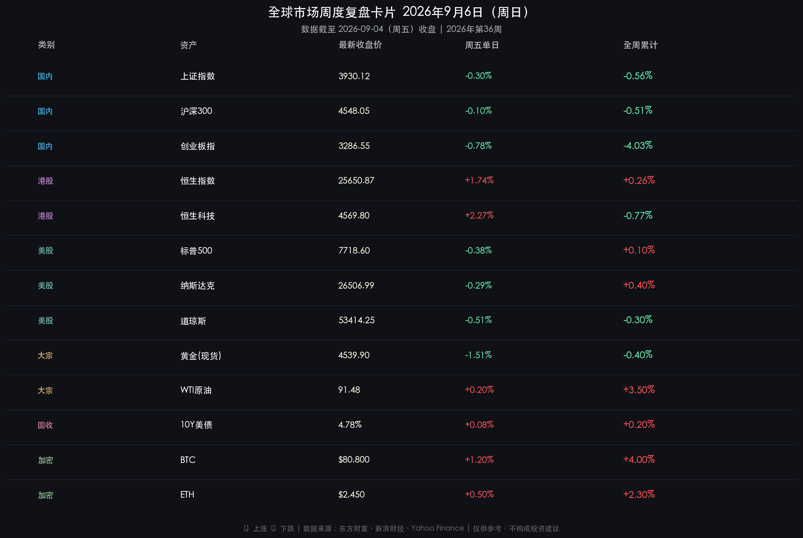

# 全球市场周末复盘·2026年第36周

**日期：2026年09月06日 (星期日)** &nbsp; **时段：周末复盘（模式 B）**

> **核心摘要**：本周（第36周）全球市场经历"就业数据炸弹"的冲击——美国8月非农就业人数超预期新增16.2万，美联储9月加息预期骤升至60%，推动10年期美债收益率攀升至4.78%，黄金周内微跌约0.4%；A股在"高低切换"的资金博弈中，创业板指全周重挫-4.03%而上证仅跌-0.56%，成交量能维持2万亿以上的活跃水平；港股周五强势反弹，恒生指数全周翻红+0.26%，科技板块呈现独立行情；BTC受机构ETF净流入支撑，全周涨幅约+4%。

---

## 核心资产周度/日度表现回顾

### 🇨🇳 A股市场

* **上证指数**：收报 **3,930.12 点**，周五单日 **-0.30%**，**全周累计 -0.56%**
* **沪深300**：收报 **4,548.05 点**，周五单日 **-0.10%**，全周累计 **-0.51%**
* **创业板指**：收报 **3,286.55 点**，周五单日 **-0.78%**，**全周累计 -4.03%**
* **成交量能**：周五两市成交额达 **2.05 万亿元**（较前一日放量约2700亿元），全周日均成交额维持在1.9万亿元以上，显示场内资金换手意愿强烈。

> **核心解读**：A股本周呈现鲜明的"高低切换与筹码换手"特征。8月以来累积丰厚涨幅的科创板与科技成长赛道（半导体芯片、光模块、AI服务器、电子化学品）在周五触发集中获利回吐，创业板指全周重挫-4.03%。与此同时，猪肉养殖、农林牧渔、白酒消费、房地产、高股息银行等低位防御板块承接力极强，有力托举了上证综指，使其全周仅微跌-0.56%。两市量能维持2万亿以上，揭示这并非系统性资金撤退，而是"金九"窗口期内积极的攻防重构：前期主力筹码换手，低位资金接力，市场结构在震荡中悄然重塑。

### 🇭🇰 港股市场

* **恒生指数**：收报 **25,650.87 点**，周五单日 **+1.74%**（+437.56点），**全周累计 +0.26%**
* **恒生科技指数**：收报 **4,569.80 点**，周五单日 **+2.27%**，全周累计 **-0.77%**
* **恒生中国企业指数**：收报 **8,510.20 点**，周五单日 **+2.02%**，全周累计 **+0.23%**
* **成份股调整预告**：恒生指数公司季度检讨将于9月7日（周一）生效，新纳入华虹宏力与潍柴动力；恒生科技指数纳入天数智芯，被动资金配置行为值得关注。

> **核心解读**：港股本周走出"先抑后扬"的独立行情，与A股形成明显的跷跷板效应。周初受美联储加息预期升温及地缘风险冲击，恒指周二下跌0.93%；但随着联储理事沃勒周三释放相对鸽派信号，风险偏好修复，南向资金与海外长线资金大举借道港股低估值优势扫货互联网平台及AI应用龙头（腾讯、阿里巴巴、美团、小米、联想集团均录得周尾强劲反弹）。港股AI商业化落地预期升温，估值性价比优势再次凸显，成为亚太区极具韧性的避风港。

### 🇺🇸 美股市场

* **标普500指数**：收报 **7,718.60 点**，周五单日 **-0.38%**，**全周累计 +0.10%**
* **纳斯达克指数**：收报 **26,506.99 点**，周五单日 **-0.29%**，**全周累计 +0.40%**
* **道琼斯工业指数**：收报 **53,414.25 点**，周五单日 **-0.51%**，**全周累计 -0.30%**
* **市场主题**：能源股（受中东地缘冲突支撑）与AI算力相关名称全周表现相对抗跌。

> **核心解读**：美股全周高位震荡，呈现"宽幅双向波动"特征。周中受联储沃勒鸽派讲话提振，三大指数一度走强；但周五盘前公布的8月非农就业数据"爆表"（新增16.2万人，远超市场预期），彻底打破短暂的降息乐观情绪。数据驱动逻辑清晰：强劲就业（数据）→ 美联储被赋予更大加息空间（事件）→ 利率敏感型资产承压（公用事业、房地产领跌）→ 科技龙头靠基本面韧性相对抗跌（逻辑）。美股历史上9月份的"季节性弱势效应"叠加鹰派预期，市场多空博弈激烈。

### 🏅 大宗商品、固收与外汇

* **黄金（现货）**：收报约 **4,539.90 美元/盎司**，周五单日 **-1.51%**，**全周累计约 -0.40%**
  * 周内走势：受沃勒鸽派信号一度冲高，但非农数据"爆表"后急速回落，全周小幅收跌。
* **WTI原油**：收报 **91.48 美元/桶**，全周累计约 **+3.50%**
  * 驱动因素：美伊地缘紧张（中东局势升级）为核心推手，能源价格持续高位运行。
* **10年期美债收益率**：收报 **4.78%**，全周上行约20个基点，逼近近年高位，市场开始担忧后续是否突破5%关键关口。
* **美元指数**：收报约 **99.85**，全周小幅走强，加息预期为其提供支撑。

### ₿ 加密货币市场

* **比特币 (BTC)**：收报约 **80,800 美元**，全周累计约 **+4.00%**
* **以太坊 (ETH)**：收报约 **2,450 美元**，全周约 **+2.30%**
* **机构动向**：截至9月4日的一周内，美国现货比特币和以太坊ETF累计录得约 **12亿美元**净流入，显示机构买盘持续介入，8月份BTC累计涨幅约+24.95%的强势延续至9月初。

---

## 过去48小时重磅事件深度复盘

### 📊 美国8月非农就业报告（最核心事件）

* **数据**：非农就业新增 **16.2万人**，显著高于市场预期（约12万人）；前月数据同步上修。
* **事件**：美国劳工部9月4日（周五）发布，引发全球资产定价重估。
* **逻辑**：强劲就业数据 → 美联储获得更大"加息空间" → 9月加息25bp概率回升至约60% → 美债收益率飙升至4.78% → 美股利率敏感板块承压、黄金受压回落 → 全球风险资产波动加剧。
* **关键变量**：美联储已于9月5日起进入议息会议静默期，下一个重大信号节点为9月11日（周五）的8月CPI数据。

### 🌐 联储官员周内关键讲话复盘

* **理事沃勒（Christopher Waller）**：9月3日释放相对鸽派信号，表示若通胀数据持续向好，倾向支持维持利率不变，但若8月CPI"火热"，保留支持加息的立场余地。
* **主席沃什（Kevin Warsh）**：此前在杰克逊霍尔会议上发表明确鹰派立场，强调通胀须以"足够快的速度"向2%回落，否则"仍有工作要做"。
* **纽约联储主席威廉姆斯（John Williams）**：态度谨慎，强调需综合所有经济信息评估，未明确表态加息与否。

### 🇨🇳 国内政策脉动

* **结构性货币政策**：本周国内政策端维持"适度宽松"基调，央行通过逆回购及政策配合维护市场流动性，防止因外部冲击引发资金面过度紧张。
* **地产政策**：市场关注9月以来是否有进一步因城施策的房地产支持政策落地，地产股本周在防御板块行情中表现活跃。

---

## 下周全球宏观大事预警

> **下周（2026年9月7日至11日）是"通胀决策周"，美国重磅通胀数据将直接决定美联储9月15-16日是否加息，堪称年内最关键的数据窗口之一。**

| 日期 | 时间（北京） | 事件 | 重要性 |
|------|-------------|------|--------|
| 9月7日（周一） | 全天休市 | 美国劳动节（Labor Day），美股及银行休市 | ⚠️ |
| 9月10日（周四） | 20:30 | 美国8月**PPI（生产者价格指数）** | ⭐⭐⭐⭐ |
| 9月10日（周四） | 当晚 | **欧洲央行（ECB）利率决议**（预期加息25bp） | ⭐⭐⭐⭐ |
| 9月10日（周四） | 深夜 | **苹果秋季发布会**（折叠屏iPhone等新品，AI应用潜力） | ⭐⭐⭐ |
| 9月11日（周五） | 20:30 | 美国8月**CPI（消费者物价指数）**——终极决策变量 | ⭐⭐⭐⭐⭐ |
| 9月11日 前后 | 美股盘后 | **甲骨文（Oracle）、Adobe财报**（AI基础设施景气信号） | ⭐⭐⭐ |

> **核心风险提示**：若8月CPI同比超预期（当前预测约3.2%），美联储9月加息几乎板上钉钉，美债收益率大概率突破5%，届时全球成长股与新兴市场将面临重估压力；若CPI数据温和，降息预期复燃，黄金与科技股或迎来强烈反弹。

---

## 顶级机构周末策略内参摘要

* **高盛（Goldman Sachs）**：维持对中国资产的战略性看好，"做多中国AI价值链"逻辑清晰，但在宏观层面提示美债收益率上升和全球地缘风险对波动性的影响，建议在波动中配置具备基本面支撑的优质资产。

* **摩根士丹利（Morgan Stanley）**：认为外资对中国资产的认知已从"系统性低配"转向"必须配置"，看好中国硬科技赛道的长期价值；强调A股的"低相关性"与"独立周期"特征，使其成为全球资金寻求多元化配置的有效选择。

* **中信证券**：9月科技投资策略建议"坚持再平衡，关注新技术，静待新叙事"。认为科技板块虽面临美债利率走高和估值压制等短期扰动，但整体业绩表现稳健。配置上建议关注半导体设备及国产存储等具备高性价比方向，主题聚焦自动驾驶（物理AI）及企业级AI应用。

* **中金公司（CICC）**：策略倾向认为A股处于"底部震荡与磨底修复"的良性趋势中，建议通过"结构重于仓位"来应对震荡，关注政策推动下的结构性机会，逢低布局优质资产。

---

## 今日市场情绪：政策博弈下的天平失衡

> Prompt: A colossal hourglass suspended in a stormy sky above the New York Stock Exchange, where instead of sand, glowing payroll report numbers and gold coins pour downward. A massive balance scale below holds a golden eagle on one side and a rising bond yield chart graph on the other. In the background, a sea formed entirely of red and green candlestick K-line charts creates turbulent waves crashing against skyscrapers. Dark dramatic atmosphere, stormy clouds, neon financial data streams.

---

*免责声明：内容仅供参考，不构成投资建议。*
