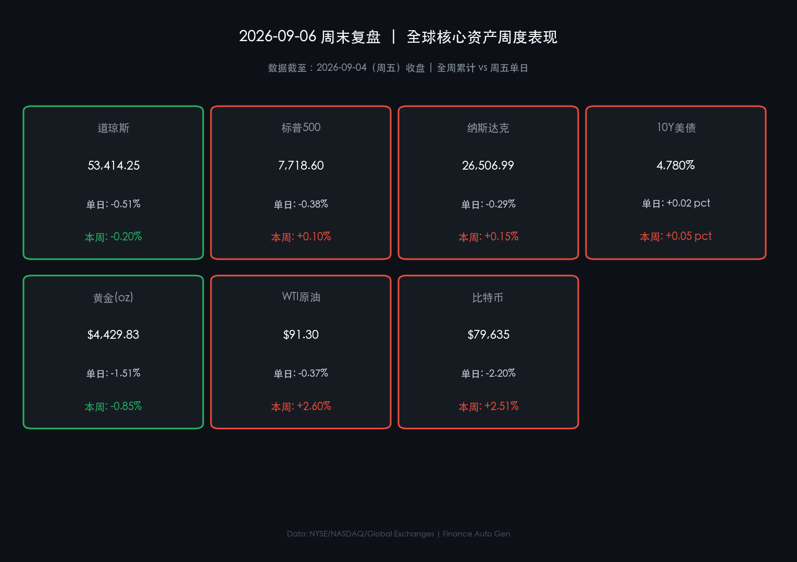

# 🌅 2026年09月06日 全球市场周报与周末复盘

**日期：2026年09月06日 (星期日)** &nbsp; **时段：早报（国际市场·周末复盘）**

> **核心摘要**：本周全球金融市场在美联储官员鸽派表态与超预期非农就业数据的双重冲击下剧烈震荡，三大股指全周涨跌不一（标普500全周微涨 **+0.10%**，纳指全周上涨 **+0.15%**，道指全周小幅收跌 **-0.20%**）。周五公布的8月非农新增就业（+16.2万人）大幅远超预期的 5.5 万人，彻底抹平了此前降息押注，推升 10 年期美债收益率至 **4.780%**。中东地缘局势持续紧张推动 WTI 原油全周大涨 **+2.60%** 收于 $91.30/桶。**⚠️ 关键警示**：下周一（9月7日）美股因美国劳工节休市；下周五（9月11日）公布的 8 月 CPI 数据将是 9 月 15-16 日 FOMC 议息会议前的终极风向标。

---

## 核心资产周度/日度表现回顾

### 🇺🇸 全球主要资产价格表现（截至 2026-09-04 收盘）

* **标普500指数 (S&P 500)**：**7,718.60** 点 &nbsp;🟢 周五单日 **-0.38%** &nbsp;🔴 本周累计 **+0.10%**
* **纳斯达克综合指数 (NASDAQ)**：**26,506.99** 点 &nbsp;🟢 周五单日 **-0.29%** &nbsp;🔴 本周累计 **+0.15%**
* **道琼斯工业平均指数 (DJIA)**：**53,414.25** 点 &nbsp;🟢 周五单日 **-0.51%** &nbsp;🟢 本周累计 **-0.20%**
* **10年期美债收益率 (10Y US Treasury)**：**4.780%** &nbsp;🔴 周五单日 **+0.019 pct** &nbsp;🔴 本周累计 **+0.05 pct**
* **现货黄金 (Gold Spot)**：**$4,429.83/oz** &nbsp;🟢 周五单日 **-1.51%** &nbsp;🟢 本周累计 **-0.85%**
* **WTI 原油 (WTI Crude)**：**$91.30/桶** &nbsp;🟢 周五单日 **-0.37%** &nbsp;🔴 本周累计 **+2.60%**
* **比特币 (Bitcoin BTC)**：**$79,635** &nbsp;🟢 周五单日 **-2.20%** &nbsp;🔴 本周累计 **+2.51%**

> **核心解读**：本周美股走势呈现典型的“拉锯战”。周初至周四，受美联储理事沃勒（Waller）鸽派言论影响，市场降息情绪快速升温，科技股领涨推高大盘；然而周五强劲的 8 月非农数据（+16.2万人 vs 预期 5.5万人）给降息押注浇下一盆冷水，资金迅速重估紧缩风险，掉期市场定价 9 月议息会议加息 25 个基点的概率升至约 60%。

---

### 📈 核心行情数据卡片

---

## 过去 48 小时重磅事件深度复盘

> **1. 8 月非农惊雷：劳动力市场韧性打乱降息节奏**
> 美国劳工部公布的 8 月非农就业新增 16.2 万人，失业率维持在 4.1%。数据公布后，2 年期美债收益率冲高至 4.37%，10 年期美债收益率上行至 4.780%。交易员迅速从“预判 9 月降息”转向“防范 9 月加息”，股票市场高估值科技股与高负债公用事业板块遭遇抛售。

> **2. 地缘局势升温：原油周涨幅创阶段新高**
> 美伊在海湾区域的军事博弈升级，霍尔木兹海峡的航运安全担忧再次笼罩市场。WTI 原油全周累计上涨 **+2.60%**，收于 $91.30/桶。高油价成为推高通胀预期的主要外生冲击因素。

> **3. 加密货币与避险资产分化**
> 比特币在经历了周初的反弹后，于周五跟风风险资产回调至 $79,635，但全周仍录得 **+2.51%** 的涨幅；黄金受强势美元与高美债收益率挤压，全周回撤 **-0.85%** 至 $4,429.83/oz。

---

## 下周全球宏观大事预警

| 日期 (2026年) | 关键宏观事件 / 数据发布 | 市场关注焦点与影响评估 |
| :--- | :--- | :--- |
| **09月07日 (周一)** | 🇺🇸 **美股休市 (Labor Day)** | 全球资金流动性短暂收紧，欧洲及亚洲市场主导定盘 |
| **09月09日 (周三)** | 🇪🇺 **欧央行官员讲话 & 中国 PPI/CPI 数据** | 评估全球通胀压力与中欧经济复苏动能 |
| **09月10日 (周四)** | 🇺🇸 **美国上周初请失业金人数** | 验证非农强劲是否具备可持续性 |
| **09月11日 (周五)** | 🇺🇸 **美国 8 月 CPI 通胀数据 (重磅)** | **决战节点**：FOMC 9月15-16日议息会议前最后一项核心数据 |

---

## 顶级机构周末策略内参摘要

**🏦 高盛 (Goldman Sachs)**
> 高盛研究团队在周末发布的策略报告中指出，8 月非农强于预期证明美国经济基本面仍然扎实，陷入衰退的概率极低。尽管高利率维持更久可能造成短期估值波动，但企业盈利能力与 AI 资本开支周期将为大盘提供坚实底座。建议投资者利用长假后的回调寻找优质龙头资产的低吸机会。

**🏦 摩根大通 (J.P. Morgan)**
> 摩根大通警告“高油价 + 强就业”的组合拳使得二次通胀风险上升。若 9 月 11 日 CPI 数据超预期，美联储在 9 月 15-16 日会议上重启加息的概率将大幅上升。战术上建议维持现金与防守型资产（医疗、必需消费）的防御性配置。

**🏦 摩根士丹利 (Morgan Stanley)**
> 摩根士丹利强调，宏观政策与地缘政治交织将导致资产价格维持高波动。下周一美国休市后，市场的核心焦点将彻底转向 9 月 11 日的 CPI 数据。在缺乏单边趋势的情况下，区间轮动与跨资产对冲是最佳策略。

---

## 今日市场情绪：天秤博弈——劳动力火种与利率重锤的宇宙对峙

> Prompt: A cosmic scale balance scale floating in dark space. On one side sits a glowing orb of strong employment data and roaring green energy, on the other side sits a dark hourglass spilling black oil onto a towering stack of interest rate percentage symbols. On the giant financial ticker screens in the background, candlestick charts flicker under dramatic cinematic lightning.

---

*免责声明：内容仅供参考，不构成投资建议。*
