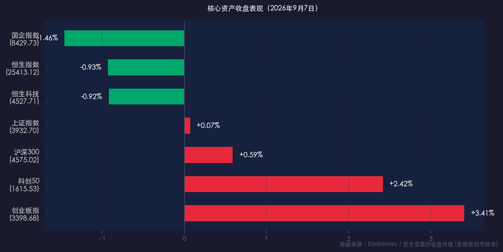

# 金融简报 · 收盘复盘：创业板大涨3.41%领跑成长，科技软硬件爆发

**日期：2026年09月07日 (星期一)** &nbsp; **时段：下午收盘（常规交易日）**

> **核心摘要**：2026年9月7日（周一），A股全线上扬迎“开门红”，创业板指大涨 **+3.41%** 领跑全场，科创50飙升 **+2.42%**，沪深两市成交额重回2万亿元上方（**20,510.49亿元**）。PCB、存储芯片及光通信等科技软硬件板块全面爆发；港股受大金融与房企走弱拖累呈现分化，恒生指数收跌 **-0.93%**。美股今日因劳动节休市，市场目光全数聚焦于本周即将公布的美国8月PPI与CPI关键通胀数据。

---

## 核心行情复盘

### 一、 A股及港股主要指数表现

* **创业板指**：收报 **3,398.68点**，大涨 **+3.41%**（成交额 5,085.13亿元），成长风格强劲领跑
* **科创50指数**：收报 **1,615.53点**，上涨 **+2.42%**（成交额 883.32亿元），半导体与AI链表现优异
* **沪深300指数**：收报 **4,575.02点**，上涨 **+0.59%**（成交额 5,358.12亿元）
* **上证指数**：收报 **3,932.70点**，微涨 **+0.07%**（成交额 8,979.04亿元），窄幅震荡收红
* **恒生指数**：收报 **25,413.12点**，下跌 **-0.93%**（跌237.75点），大金融与地产承压
* **恒生科技指数**：收报 **4,527.71点**，下跌 **-0.92%**（跌42.09点），科网股出现分化
* **国企指数**：收报 **8,429.73点**，下跌 **-1.46%**

### 二、 板块动向与资金热点

* **领涨主线（科技硬件与硬科技）**：
  * **PCB概念**：受益于产业链涨价传导及下游算力服务器强劲需求，广合科技等龙头强势冲高。
  * **存储芯片**：受到行业周期复苏与业绩回暖催化，澜起科技、兆易创新等个股全天大涨。
  * **光通信与AI算力**：中际旭创、剑桥科技等龙头逆势冲高，资金持续涌入硬科技核心标的。
* **分化与走弱板块**：
  * **港股房企与煤炭**：龙湖集团、融信中国及金马能源等板块受资金流出压制普遍走低。
  * **大金融板块**：银行与保险板块今日整体表现平淡，对沪指及港股指数形成一定拖累。
* **港股通新纳入关注**：
  * 9月7日为港股通标的调整正式生效日，中科闻歌、曦智科技、复宏汉霖等新纳入个股吸引了南向资金的高频关注。

---

## 核心解读与市场逻辑

> **核心解读一：2万亿成交量重现，成长风格凝聚多头共识**  
> 今日A股成交额重返 **2.05万亿元**，表明市场交投意愿显著回升。在美联储9月中旬议息会议前的“数据真空期”，内资机构与散户资金呈现向硬科技、高弹性成长板块聚焦的特征。创业板与科创50的暴力反弹，反映出市场对半导体周期回升与AI基础设施建设落地的高度信心。

> **核心解读二：美股休市下的“窗口期”博弈**  
> 9月7日恰逢美国劳动节（Labor Day），NYSE与NASDAQ全天休市。外围无美股收盘数据的直接冲击，使得内资占优的A股市场得以展开独立的结构性行情。然而，本周四（9/10）的美国8月PPI与周五（9/11）的美国8月CPI仍是全球资产定价的核心试金石，若通胀数据超预期，仍可能重塑美债收益率与全球避险情绪。

---

## 政策脉动

* **央行（PBOC）定向宽松定位明确**：人民银行继续保持“适度宽松”且精细化的流动性投放，重点向“新质生产力”（涵盖芯片半导体、高端制造及小微企业）倾斜，为实体经济与资本市场提供稳健的资金面支撑。
* **深化金融体制改革与对外开放**：随着国家金融五年规划（2026-2030）推进，监管部门持续深化人民币国际化与高水平制度型开放，支持优质科技企业通过多层次资本市场融资。

---

## 最新机构观点

**中金公司（CICC）**：
> 观点指出当前市场进入“结构重于整体”的阶段。虽然港股南向资金流入速度相比前期有所放缓，但A股市场内部结构性动能充沛。建议紧扣AI算力、存储芯片与半导体链条等“新质生产力”主线，同时关注高股息资产在震荡中的防守价值。

**华泰证券（HUATAI）**：
> 在秋季投资峰会上表示，当前投资逻辑全面回归基本面验证。建议投资者采取“攻防兼备”策略：以AI产业链及硬件龙头作为高弹性进攻矛，以低估值、高分红稳健现金流标的作为防御盾，通过三季度业绩预期去伪存真。

**摩根大通（JPMorgan）**：
> 对中国基本面修复持稳健预期，特别提到香港银行及优质资产的上半年业绩整体优于预期。尽管短期内需密切观察美联储9月利率决议（9/15-16），但具备核心竞争力的优质科技龙头仍具备长远配置价值。

---

## 今日市场情绪：科技涅槃，长夜蓄势

> Prompt: A magnificent mechanical phoenix forged from glowing green silicon circuits and optical fiber cables rising from a sea of trading data and server arrays. In the background, a massive quiet bronze clock ticks under a starry night sky with a sign for Labor Day holiday. High detail, vibrant cinematic lighting, rich metaphor of growth and technology surge.

---

*免责声明：内容仅供参考，不构成投资建议。*
