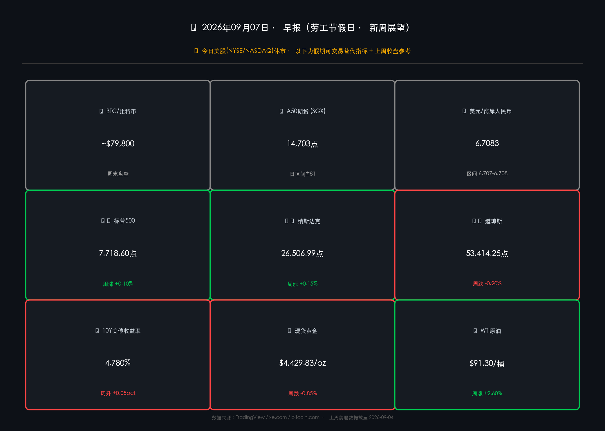

# 🌅 2026年09月07日 全球市场新周展望

**日期：2026年09月07日 (星期一)** &nbsp; **时段：早报（国际市场 · 劳工节假日 · 新周展望）**

> **核心摘要**：今日美国劳工节（Labor Day），NYSE/NASDAQ **全日休市**。替代指标方面，BTC 维持 ~$79,800 窄幅盘整，A50 期货报 14,703 点，离岸人民币 USD/CNH ≈ 6.7083。本周最大风险事件为**9月11日 8 月 CPI 数据**（市场押注 9 月 15-16 日 FOMC 加息概率约 60%），本周一至周四为 FOMC 法定静默期前的最后数据窗口，**本周报告的每一个数字都将直接决定下周加息与否的最终判决。**

---

## 周末财经要闻终极汇总

> **⚠️ 假日背景**：今日（2026-09-07，周一）为美国劳工节，NYSE / NASDAQ 全日休市。常规行情复盘暂缺，以下聚焦周末核心要闻及可实时交易的替代指标。

### 🟡 假期可实时追踪指标

* **比特币 BTC**：~**$79,800** — 周末维持 $79,500–$80,150 区间盘整；本周曾短线触及 $82,000 随即回落，阻力区间 **$80,335–$82,239** 压制明显，多空均无主导力量。
* **A50 期货（SGX）**：**14,703** 点，日内高 14,707 / 低 14,626，波动区间偏窄，暗示中国A股下周开盘变数有限。
* **美元/离岸人民币 (USD/CNH)**：**6.7083**，近日稳守 6.707–6.708 区间，人民币基本稳定，无异常贬值信号。

### 📰 周末重磅要闻（9月5–7日）

* **美联储动态**：Fed 主席 Kevin Warsh 和理事 Christopher Waller 双双在周末再次强调"数据依赖"立场，部分分析师指出，潜在加息更多是维护抗通胀公信力的信号性操作，而非纯粹基于经济基本面的必要之举。
* **8月强非农影响持续**：上周五公布的 8 月非农新增就业 **+16.2 万人**（远超预期 5.5 万），掉期市场现定价 9 月 FOMC 加息 25 基点概率约 **60%**，彻底逆转此前夏季降息预期。
* **Fed 行政会议**：周二 9 月 8 日，美联储董事会将举行一场审查贴现率的例行闭门会议（标准行政程序，非货币政策会议），无实质政策信号。
* **企业财报**：本周财报季继续，市场关注 **Oracle (ORCL)** 和 **Adobe (ADBE)** 的 AI 资本开支及 AI 营收变现情况，或成为科技板块情绪催化剂。

---

## 新一周市场核心博弈逻辑

> 本周核心命题只有一个：**"CPI 将成为 FOMC 的最后一块拼图"**。数据（8月非农超预期）→ 事件（FOMC 9月15-16日议息）→ 逻辑（利率路径重新定价 → 科技股承压 vs 金融/能源受益）。

### 🎯 本周核心博弈框架

* **多头逻辑**：
  - AI 驱动的企业盈利持续高增，Oracle/Adobe 若超预期将提振纳指。
  - 高盛维持美股看多立场，认为"Mag 7"估值有盈利支撑。
  - 若 CPI 超预期下行，降息幻想重燃，风险资产将迎短期修复。

* **空头逻辑**：
  - 强非农锁定加息，10Y 美债收益率 **4.780%** 高位对科技股估值形成持续压制。
  - 9 月在历史上属于股市季节性弱势月份（"September effect"）。
  - 地缘风险（中东局势）推升 WTI 原油至 $91.30，能源通胀"二次上行"风险存在。

* **最大不确定性**：9 月 11 日 CPI 数据——若通胀回落超预期，加息预期降温，科技股急涨；若通胀粘性持续甚至超预期，9 月加息板上钉钉，收益率曲线倒挂加深。

---

## 本周重磅经济数据与会议前瞻

| 日期 | 时间 (ET) | 事件 | 重要程度 |
|------|-----------|------|---------|
| 周二 9/8 | 全日 | **NYSE 恢复交易**（劳工节后开市） | ⭐⭐⭐ |
| 周二 9/8 | 15:00 | 消费信贷（7月） | ⭐⭐ |
| 周三 9/9 | — | FOMC 委员静默期开始（至9/16） | ⭐⭐⭐ |
| 周四 9/10 | 08:30 | 初申失业金人数（当周） | ⭐⭐ |
| 周四 9/10 | 08:30 | **PPI（8月）** | ⭐⭐⭐ |
| 周四 9/10 | 10:00 | 成屋销售（7月） | ⭐⭐ |
| **周五 9/11** | **08:30** | **🔴 CPI（8月）** — 本周终极风向标 | ⭐⭐⭐⭐⭐ |
| 周五 9/11 | 10:00 | 密歇根大学消费者信心指数（初值） | ⭐⭐ |
| **下周 9/15-16** | — | **🔴 FOMC 议息会议 + SEP "点阵图"** | ⭐⭐⭐⭐⭐ |

> **核心解读**：本周实际上是一个"一个数据统治全周"的格局。9月11日 CPI 将在 FOMC 静默期内发布，届时联储官员无法公开解读，市场将独自消化数据冲击。历史规律显示，这类信息真空期往往放大市场波动。

---

## 头部券商/投行开盘策略点睛

* **🏛 高盛（Goldman Sachs）**：维持对美股的积极展望，认为"Mag 7"科技企业盈利高增长为估值提供有力支撑。策略重点：持续监测通胀数据以判断 Fed 路径；当前最大尾风险在于债券市场对长期利率预期的重新定价。
  
* **🏦 摩根士丹利（Morgan Stanley）**：态度"建设性但不自满"。更倾向于偏股类资产而非长期国债，强调 AI 基础设施资本开支是本季最重要的主题之一。关注 Oracle、Adobe 财报对 AI 商业化验证的含义。

* **🏢 摩根大通（JPMorgan）**：总体乐观但具有选择性。中期展望将2026年下半年描述为 "AI 驱动成长与宏观逆风之间的拉锯战"。建议逢低布局金融与能源板块对冲利率和油价上行风险。

> **综合机构信号**：三大行均未看空，但强调"选择性"和"数据依赖"，共识是：**CPI 数据是本周唯一 Alpha 来源。**

---

## 今日市场情绪：CPI决战前夜的寂静等待

> Prompt: A colossal golden hourglass stands at the center of a dark cosmic skyline, its sand replaced by streaming binary data and glowing CPI numbers falling in slow motion. In the background, the skylines of New York, Shanghai, and London are rendered in neon silhouette, all holding their breath. A lone lighthouse beam sweeps across a calm ocean of red and green candlestick waves. Mood: tense pre-storm silence. Cyberpunk style, cinematic composition, ultra-detailed.

---

### 📊 本日可交易替代指标数据卡片

---

> **免责声明**：内容仅供参考，不构成投资建议。市场数据来源：TradingView、xe.com、bitcoin.com、federalreserve.gov、各机构公开报告。美股数据截至 2026-09-04（上周五）收盘。
