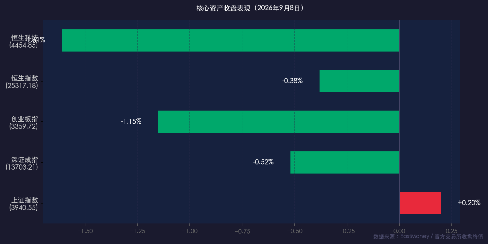

# 周期领涨、科技退潮：A股维持震荡，油铜农化引领资金轮动

**日期：2026年09月08日 (星期二)** &nbsp; **时段：收盘晚报**

> **核心摘要**：今日A股市场呈现明显分化，上证指数微涨0.20%守住3940点，但深证成指、创业板指分别收跌0.52%和1.15%，科技成长板块热度阶段性退潮；地缘政治持续扰动推动布伦特原油逼近98美元/桶，石油石化、有色铜以及农化板块全面领涨；港股两大指数同步下跌，恒生科技跌幅达1.61%；全市场成交达1.96万亿元，热点快速轮动中周期价值重获资金青睐。

---

## 核心行情复盘

### A股指数

* **上证指数**：收报 **3,940.55点**，上涨 **+0.20%**（+7.85点）
* **深证成指**：收报 **13,703.21点**，下跌 **-0.52%**（-71.71点）
* **创业板指**：收报 **3,359.72点**，下跌 **-1.15%**（-38.97点）

### 港股指数

* **恒生指数**：收报 **25,317.18点**，下跌 **-0.38%**（-95.94点）
* **恒生科技指数**：收报 **4,454.85点**，下跌 **-1.61%**（-72.86点）

### 成交与资金

* **沪深京三市成交额**：**1.96万亿元**，较前一交易日小幅放量
* **北向资金**：自2024年8月起沪深港通停止实时披露净买入额；机构监测显示北向资金在核心科技赛道仍有局部加仓，整体维持双向波动

### 关联市场

* **人民币兑美元（中间价）**：**6.7804**，较前日下调9个基点
* **美元指数（DXY）**：日内于 **98.75–98.84** 区间波动，较前日有所回落
* **美债10年期收益率**：上行超2bp，报约 **4.8063%**
* **WTI原油**：强势上涨逾3%，报约 **94.20美元/桶**
* **布伦特原油**：盘中一度涨至 **98.71美元/桶**，创近期新高
* **现货黄金**：日内震荡，早盘触及 **4,420–4,423美元/盎司**，后受美债收益率走高及美元支撑，盘中有所回落

---

## 核心解读与市场逻辑

### 领涨板块

**1. 石油石化（大涨领涨）**

> 受美伊冲突升级、中东地缘政治持续紧张影响，布伦特原油盘中突破98美元/桶，创近期新高。中曼石油、和顺石油等多只个股涨停，石油石化板块成为今日最强主线。**数据→事件→逻辑**：油价飙升（数据）源于霍尔木兹海峡航运受阻担忧（事件），直接抬升石化企业盈利预期（逻辑）。

**2. 农业与农化（持续活跃）**

> 国际糖价上涨、泰国新榨季产量预期下降叠加全球鱼粉供应收紧，化肥、制糖及代糖概念表现亮眼。中粮糖业、亚盛集团、三元生物等个股涨幅居前，农业板块呈现板块性行情。

**3. 有色金属·铜概念（资金显著流入）**

> LME铜期货突破每吨14,530美元，创历史新高，直接带动铜矿及铜冶炼概念集体走强，有色板块吸引大量增量资金。

**4. 传媒板块**

> 延续近期强势格局，部分相关题材股录得连板，成为市场另一热点方向。

### 调整板块

> 电子、半导体、消费电子、液冷服务器等AI及泛科技赛道午后出现跳水，CPO（光通信）概念跌幅较大。机构分析认为，这是市场进入"业绩验证期"后对前期炒作的自然消化；叠加美债10年期收益率上行至4.8%区间，对科技股估值的压制效应有所显现。

**整体逻辑**：今日A股呈现典型"指数震荡、热点轮动"格局——主板靠蓝筹与周期护盘，创业板受成长股拖累下跌；地缘政治是今日最核心的外部催化变量，推动大宗商品（油、铜、农产品）全面上涨，周期价值重新获得资金定价权。

---

## 政策脉动

* **外贸数据强劲**：前8个月我国货物贸易进出口总值达 **34.78万亿元，同比增长17.6%**，出口韧性超预期，人民币汇率中间价在6.78附近维持稳定，体现了较强的外部支撑。
* **工信部"十五五"规划**：明确重点支持算力基建（5G-A基站、6G研发等），构建长期AI产业生态。虽然短期受市场风格切换影响，AI科技方向的政策长逻辑未变。
* **险资配置动向**：最新半年报显示，保险资金持续布局金融股为主，同时广泛增配公用事业、有色金属等板块，为市场底部提供稳定支撑。
* **外部关注**：市场本周高度聚焦美国PPI（生产者价格指数）和CPI数据，及即将召开的FOMC议息会议。若通胀超预期，美联储9月加息概率（目前约60%）将进一步提升，届时对A股估值的外部压力将加大。

---

## 最新机构观点

**中信证券**：科技板块呈现"强现实、弱预期"特征，并不存在系统性算力过剩。建议坚持硬件与软件/云再平衡策略，关注自动驾驶（物理AI）、企业级AI等新叙事。尽管美债利率走高带来估值压制，AI产业趋势仍向上，不宜因短期调整轻言出局。

**华泰证券**：当前市场进入"分化·重估·再平衡"阶段，投资逻辑回归基本面。进攻端关注AI优质标的（通信设备、半导体设备/材料、PCB等）；防御端以高分红稳现金流资产（电力、资源品、农产品）作为"压舱石"。建议耐心等待美国CPI及FOMC落地再做趋势判断。

**国泰君安**：认为"金秋行情"与"慢牛"格局未变，近期调整是上涨后的正常风险释放。秋冬之际建议增配稳定高分红板块，实现均衡化布局；贵金属、基本金属方向可关注地缘政治扰动及全球供需格局变化带来的结构性机会。

---

## 今日市场情绪：周期领涨·科技换挡

> Prompt: A colossal hourglass standing in a cosmic void, through which flows not sand but rivers of black crude oil and gleaming copper nuggets, crushing one side of a golden scale. In the background, clusters of glowing green candle bars of oil and agriculture stocks rise like a forest, while on the opposite side, dim blue holographic screens of tech stocks flicker and fade. A raven perches on top of the hourglass, watching the geopolitical storm swirling beneath.

---

*免责声明：内容仅供参考，不构成投资建议。*
