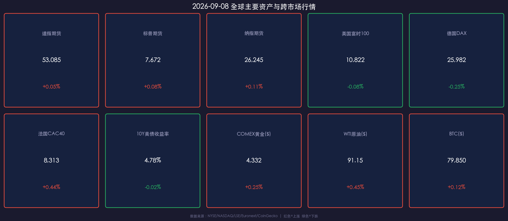

# 🌅 2026年09月08日 国际市场早报：劳工节后华尔街迎战关键通胀周

**日期：2026年09月08日 (星期二)** &nbsp; **时段：早报（国际市场 · 模式A：常规交易日）**

> **核心摘要**：隔夜美股因劳工节假期休市，今日（周二）美股将正式恢复交易。欧洲主要股指涨跌互现（法股CAC40上涨 **+0.44%**，德股DAX微跌 **-0.25%**，英股富时微跌 **-0.08%**）。受地缘局势和供给预期扰动，WTI 原油走强至 **$91.15**，COMEX 黄金坚挺报 **$4,332/oz**，10Y 美债收益率稳定在 **4.78%**。美股三大期指盘前微幅走高，市场全周焦点聚焦周五的 8 月 CPI 数据与即将开启的 FOMC 噤声期，“通胀再粘性 vs 科技股盈利”将构成节后首周的核心博弈主线。

---

## 核心行情复盘

隔夜美股现货市场因劳工节全天休市，欧美衍生品及欧洲现货市场交投平稳。亚盘早段美股三大指数期货呈现微幅温和反弹态势，市场等待节后主流资金入场定调。

### 📊 全球核心资产行情

* **美股股指期货**：
  * **道琼斯期货**：报 **53,085** 点，上涨 **+0.05%**。
  * **标普500期货**：报 **7,672** 点，上涨 **+0.08%**。
  * **纳斯达克100期货**：报 **26,245** 点，上涨 **+0.11%**。
* **欧洲主要指数**：
  * **英国富时100 (FTSE 100)**：收于 **10,822.13** 点，微跌 **-0.08%**（-8.96 点）。
  * **德国DAX 30**：收于 **25,981.79** 点，下跌 **-0.25%**（受制造业数据及能源成本担忧拖累）。
  * **法国CAC 40**：收于 **8,313.32** 点，上涨 **+0.44%**（奢侈品与高端制造板块领涨）。
* **债券与外汇**：
  * **美国10年期国债收益率**：报 **4.780%**，微幅下行 **-0.02%**，仍处于年内高位震荡带。
  * **美元指数 (DXY)**：报 **99.55**（-0.05%），窄幅盘整。
  * **美元/离岸人民币 (USD/CNH)**：报 **6.7082**，汇率平稳无异常波动。
* **大宗商品与加密资产**：
  * **COMEX 黄金**：报 **$4,332.0/盎司**，上涨 **+0.25%**，避险与去美元化需求支撑金价维持在 $4,300 上方。
  * **WTI 原油**：报 **$91.15/桶**，上涨 **+0.45%**；**Brent 原油**报 **$94.20/桶**，中东地缘溢价持续发酵。
  * **比特币 (BTC)**：报 **$79,850**，上涨 **+0.12%**，继续在 $79,500–$80,200 区间巩固。

### 📈 跨市场行情数据卡片

---

## 核心解读与市场逻辑

> **宏观逻辑传导链**：**地缘油价走高（供给端通胀压力） + 8月非农超预期（需求端强劲） → 掉期市场对 9 月加息定价达 60% → 10Y 美债收益率居高不下 (4.78%) → 成长股估值受制约 vs 能源金融板块相对韧性。**

### 1. 劳工节后流动性回流与开市前哨
历年 9 月在美股历史上均存在季节性波动加剧的特征（"September Seasonality"）。随着华尔街交易员在劳工节后全面返场，市场成交量预计自今日起显著放大。市场首要任务是消化上周五强劲的非农就业报告（+16.2 万人 vs 预期 5.5 万人），并在周五 CPI 终极决战前完成仓位再平衡。

### 2. 能源反弹引发的“二次通胀”隐忧
国际油价近期连续走高，WTI 站稳 $91/桶，Brent 逼近 $95/桶。地缘政治溢价与 OPEC+ 紧缩供给对欧美抗通胀进程构成新考验。这也使得即将公布的 8 月 CPI 与 PPI 数据对美联储后续政策路径具有决定性影响。

### 3. AI 盈利成色检验
本周美股科技股迎来关键财报，特别是 **Oracle (ORCL)** 与 **Adobe (ADBE)** 即将公布最新季度业绩。市场将密切审视企业级 AI 软件的商业化变现速度及数据中心资本开支节奏，这不仅关乎单一标的走势，更是支撑纳斯达克高估值的核心支柱。

---

## 政策脉动

* **美联储 (Federal Reserve)**：
  * 美联储理事会今日（9月8日）按例行计划召开审查贴现率的闭门行政会议。
  * 明日（9月9日）起，美联储将正式进入 9 月 15-16 日 FOMC 议息会议前的**法定静默期（Blackout Period）**。在静默期内，官员将不再就经济与货币政策发表公开言论。
* **欧洲央行 (ECB) 与 英国央行 (BoE)**：
  * 欧洲央行多位官员表态关注能源价格对核心通胀的传导效应，对降息步伐保持谨慎。
  * 英国央行内部对通胀回落粘性与高薪资增长保持警惕，维持限制性利率立场。
* **中国央行 (PBOC)**：
  * 持续通过公开市场灵活操作维护银行体系流动性合理充裕，外汇市场上稳汇率政策定力充足，离岸人民币维持在 6.708 附近平稳运行。

---

## 最新机构观点

* **🏛 高盛（Goldman Sachs）**：
  > “尽管 10 年期美债收益率在 4.78% 附近对高估值成长股形成一定的久期压制，但标普 500 指数头部科技巨头（Mag 7）强劲的自由现金流与盈利增速提供了扎实的安全垫。建议投资者在防范 CPI 波动风险的同时，采取‘杠铃策略’：一端配置高确定性的 AI 核心龙头，另一端布局受益于利率维持高位的高股息金融与能源板块。”

* **🏦 摩根士丹利（Morgan Stanley）**：
  > “劳工节后现货市场的回归将迅速考验股市对长端利率的耐受度。我们认为，当前美股风险溢价（ERP）偏紧，周五的 CPI 数据是决定 9 月加息与否的关键分水岭。在数据明朗之前，建议增加资产组合的防御性，重点关注具备强定价权和低负债率的优质现金流标的。”

* **🏢 中金公司（CICC）**：
  > “海外流动性重估仍在进行中，美联储降息周期的推迟虽然对全球流动性产生溢出扰动，但中国资产估值处于历史性低位区间，具备较强的独立性与避险防御属性。关注外需韧性链条以及国内政策发力驱动的高股息红利板块。”

---

## 今日市场情绪：开盘钟声前的战略定力

> Prompt: A grand futuristic glass trading observatory overlooking dawn over Manhattan skyline with an astronomical golden astrolabe rotating in midair displaying glowing financial coordinates and constellation indices. In the background, morning sun rays illuminate towering skyscrapers and sleek trading terminals with gentle red and green laser data beams. Mood: quiet focus and grand anticipation before the opening bell.

---

> **免责声明**：内容仅供参考，不构成投资建议。市场数据来源：NYSE/NASDAQ/LSE/Euronext/CoinGecko、各官方统计局与投行公开研究报告。
