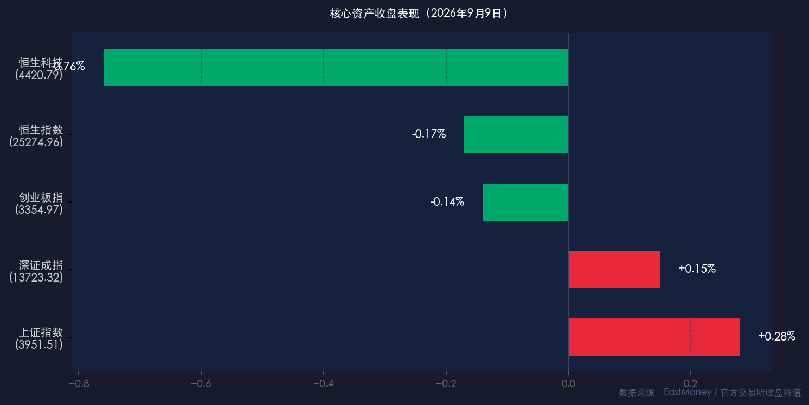

# 煤炭航运领跑、题材降温：A股震荡分化，沪指守住3950点

**日期：2026年09月09日 (星期三)** &nbsp; **时段：收盘晚报**

> **核心摘要**：今日A股三大指数呈现分化震荡格局，沪指在煤炭开采、航运港口等周期板块带动下上涨0.28%报3951.51点，深证成指微涨0.15%，创业板指小幅收跌0.14%；受中东地缘局势升级与大宗商品走高催化，能源开采与航运资产逆势走强，前期活跃的游戏、传媒及地产链则出现明显回调；全市场成交额1.87万亿元，存量资金博弈特征明显，资金进一步向高股息与基本面扎实的确定性品种聚焦。

---

## 核心行情复盘

### A股指数

* **上证指数**：收报 **3,951.51点**，上涨 **+0.28%**（+10.96点）
* **深证成指**：收报 **13,723.32点**，上涨 **+0.15%**（+20.11点）
* **创业板指**：收报 **3,354.97点**，下跌 **-0.14%**（-4.75点）

### 港股指数

* **恒生指数**：收报 **25,274.96点**，下跌 **-0.17%**（-42.22点）
* **恒生科技指数**：收报 **4,420.79点**，下跌 **-0.76%**（-34.06点）

### 成交与资金

* **沪深两市成交额**：**1.87万亿元**（深市约9,818.72亿元），较前一交易日有所缩量
* **主力资金动向**：全市场超过3,600只个股下跌，盘面呈现结构性轮动特征；资金从泛科技题材和消费板块流出，向高股息煤炭、油运港口等避险及周期属性资产转移

### 关联市场

* **人民币兑美元（中间价）**：**6.7769**，较前一交易日上调35个基点
* **美元指数（DXY）**：维持弱势震荡，报约 **98.85**，日内微跌0.07%
* **美债10年期收益率**：在4.8%关口附近震荡，收盘报约 **4.795%**
* **WTI原油**：强势上涨 **+1.65%**，报 **92.26美元/桶**
* **布伦特原油**：连续走高 **+1.97%**，报 **97.68美元/桶**
* **现货黄金**：受美债高利率预期压制，下跌 **-1.15%**，失守关口报 **4,355.55美元/盎司**

---

## 核心解读与市场逻辑

### 领涨板块

**1. 煤炭开采与加工（逆势大涨）**

> 受高温天气带动电力迎峰度夏负荷、动力煤现货价格上扬以及长协资金护航影响，煤炭板块今日全面领涨。**数据→事件→逻辑**：高温用电需求与供给偏紧（事件）推升动力煤价格（数据），强化了煤企高现金流与高分红预期（逻辑）。

**2. 航运港口（持续活跃）**

> 国际集装箱及干散货运价（BDI）近期持续走强，叠加中东红海及霍尔木兹海峡地缘航运风险溢价上升，航运港口板块成为避险资金的重要承接地。

**3. 培育钻石与特种材料**

> 受下游工业制造及高端消费需求景气度提振，培育钻石、元件等细分高端制造方向盘中异动拉升。

### 调整板块

> 文化传媒、游戏、网络短剧、影视及房地产产业链今日领跌，医药生物与白酒等传统消费板块亦表现乏力。机构分析指出，前期题材板块获利盘累积较多，在全市场成交缩量至1.87万亿的存量博弈背景下，资金缺乏全面做多动能，引发了题材板块的阶段性兑现。

**整体逻辑**：今日市场呈现典型的“指数窄幅震荡、结构极度分化”走势。在中东地缘危机不断升温和国际大宗商品价格高企的背景下，资金避险诉求提升，定价权向资源品、能源与高股息资产倾斜，科技与消费成长股进入估值与业绩消化的蓄势期。

---

## 政策脉动

* **通胀数据温和可控**：国家统计局公布数据显示，8月份全国CPI同比上涨 **0.8%**，全国PPI同比上涨 **3.8%**。业内普遍认为物价运行处于温和合理区间，未对国内货币政策构成收紧约束，流动性环境保持充裕。
* **互联互通机制持续深化**：沪深港交易所相关负责人明确表示，未来将进一步优化互联互通机制，丰富标的供给，提升跨境投融资便利度，推动中国核心资产与全球长期资本无缝对接。
* **流动性维持均衡偏松**：央行公开市场连续暂停逆回购操作，市场流动性整体充沛，机构预期9月流动性环境将保持平稳偏松基调。
* **海外变量高度关注**：市场当前高度关注即将公布的美国PPI与CPI通胀数据，以及美联储9月FOMC利率决议，地缘冲突对全球供应链与大宗商品通胀的连锁反应成为外部核心扰动源。

---

## 最新机构观点

**华泰证券**：在秋季投资策略中指出，市场正在经历从题材驱动向基本面验证的回归，建议采取“攻守兼备”策略。进攻端逢低布局具备产业周期支撑的AI与硬科技核心资产；防御端坚定配置电力、能源及资源品等供给约束明确的高分红资产作为压舱石。

**中信证券**：研报指出，锂电及关键金属材料前期受库存数据扰动出现阶段性超跌，行业基本面正在筑底，随着下游排产回暖，看好新能源金属产业链企稳反弹。

**中金公司**：强调资本市场改革与互联互通深化将长期利好头部金融机构，随着权益市场中枢抬升，头部券商商业模式升级与ROE中枢提升将驱动估值持续修复。

---

## 今日市场情绪：周期重估·存量博弈

> Prompt: An ancient heavy steam cargo ship laden with glowing black coal navigating through a turbulent ocean made of black crude oil and gold. In the background, towering red candlestick charts rise into the storm clouds like volcanic pillars, while distant neon cyberpunk digital skyscrapers flicker and cool down in soft blue.

---

*免责声明：内容仅供参考，不构成投资建议。*
