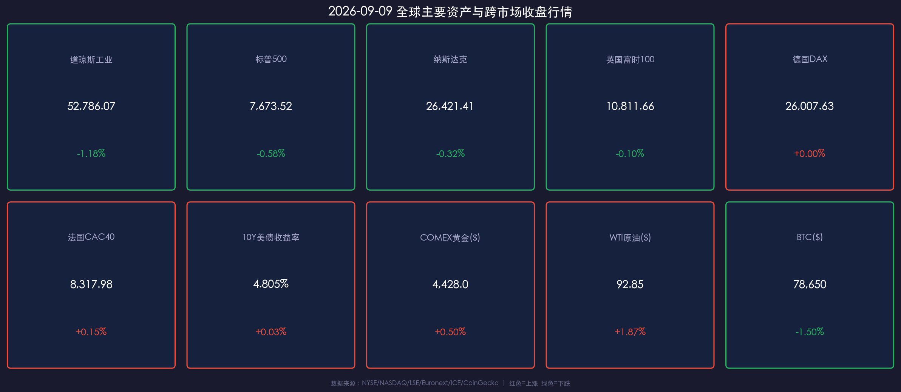

# 🌅 2026年09月09日 国际市场早报：劳工节后华尔街迎油价冲击与利率重估

**日期：2026年09月09日 (星期三)** &nbsp; **时段：早报（国际市场 · 模式A：常规交易日）**

> **核心摘要**：隔夜美股劳工节假期后恢复交易全线收跌，道指重挫 **-1.18%**，标普跌 **-0.58%**，纳指跌 **-0.32%**（半导体板块相对抗跌）。中东地缘局势升级推动 WTI 原油飙升近 2% 突破 **$92.85/桶**，引发通胀再起隐忧，10Y 美债收益率上冲至 **4.805%**（创 52 周新高）。美联储正式进入 FOMC 议息会议前的法定静默期，市场全神贯注等待本周五 8 月 CPI 数据对货币政策路径的最终指引。

---

## 核心行情复盘

周二华尔街自三日小长假返场后，遭遇能源价格骤涨与长端美债收益率走高的双重施压，三大股指全线低开震荡收跌。但结构上分化明显：传统工业与高负债板块领跌（道指跌超 600 点），而以半导体为代表的 AI 硬科技标的展现出一定韧性，限制了纳指的跌幅。

### 📊 全球核心资产收盘行情

* **美股主要指数**：
  * **道琼斯工业指数**：收于 **52,786.07** 点，下跌 **-1.18%**（-631 点），受波音、霍尼韦尔及传统工业股拖累。
  * **标普500指数**：收于 **7,673.52** 点，下跌 **-0.58%**（-44.8 点），能源与公用事业板块表现坚挺，非必需消费与金融走弱。
  * **纳斯达克综合指数**：收于 **26,421.41** 点，下跌 **-0.32%**（-85.2 点），半导体设备与芯片龙头逆势活跃。
* **欧洲主要指数**：
  * **英国富时100 (FTSE 100)**：收于 **10,811.66** 点，微跌 **-0.10%**（-10.47 点），英国央行行长贝利对薪资通胀粘性的表态打压了宽松预期。
  * **德国DAX 30**：收于 **26,007.63** 点，收平（**+0.00%**，+1.10 点），汽车板块承压但能源公用事业股护盘。
  * **法国CAC 40**：收于 **8,317.98** 点，微涨 **+0.15%**（+11.83 点），高端制造及能源巨头提供支撑。
* **债券与外汇**：
  * **美国10年期国债收益率**：报 **4.805%**，上行 **+2.5 bp**，触及 52 周新高，反映利率在更长时间内维持高位（Higher for Longer）的定价。
  * **美元指数 (DXY)**：报 **99.62**（+0.07%），维持在高位震荡。
  * **美元/离岸人民币 (USD/CNH)**：报 **6.7069**，中国央行中间价维稳意图明确，汇率稳健。
* **大宗商品与加密资产**：
  * **COMEX 黄金**：收于 **$4,428.0/盎司**，上涨 **+0.50%**，地缘避险买盘与长端美债收益率形成拉锯，总体维持在 $4,400 上方强势震荡。
  * **WTI 原油**：收于 **$92.85/桶**，大涨 **+1.87%**；**Brent 原油**报 **$97.40/桶**，霍尔木兹海峡及中东关键航道地缘风险推升风险溢价。
  * **比特币 (BTC)**：报 **$78,650**，下跌 **-1.50%**，风险资产偏好收缩，在 $78,000 关口上方寻求技术支撑。

### 📈 跨市场行情数据卡片

---

## 核心解读与市场逻辑

> **宏观逻辑传导链**：**中东地缘摩擦加剧 → 国际油价逼近 $100 关口（供给侧再通胀预期） → 10Y 美债收益率升破 4.80% 关口（创 52 周新高） → 传统价值与高负债板块估值承压（道指大跌） vs 优质半导体与 AI 盈利韧性筑底（纳指跌幅受控）。**

### 1. 原油飙升与二次通胀阴霾
节后首个交易日，油价的大幅拉升成为主导市场情绪的核心催化剂。Brent 原油逼近 $98/桶，WTI 站稳 $92/桶，这直接加剧了市场对下半年欧美整体通胀反弹的担忧。油价对运输、化工及终端消费的成本传导，正在压低掉期市场对年内美联储降息的预期。

### 2. 利率高企下的估值再平衡
10 年期美债收益率攀升至 4.805% 的 52 周高位，再次对全市场资产折现率提出考验。资本流动呈现清晰的“避虚就实”特征：依赖低息融资的周期性工业、房地产及小型股遭遇杀跌，而拥有高现金储备、定价权和技术壁垒的半导体与 AI 龙头则继续享受估值溢价。

### 3. CPI 终极决战前的仓位防守
距离周五 8 月 CPI 数据公布仅剩两个交易日。由于非农就业数据此前超预期强劲，若本周 CPI 再次呈现超预期粘性，9 月 FOMC 会议上的点阵图（Dot Plot）或将进一步上移终点利率预测。机构资金在此节点普遍倾向降低杠杆、增加防御性配置。

---

## 政策脉动

* **美联储 (Federal Reserve)**：
  * 美联储已正式进入 9 月 15-16 日 FOMC 议息会议前的**法定静默期（Blackout Period）**，美联储官员在 9 月 17 日前将不再对经济或利率前景公开发表言论。
  * 市场所有焦点均转向 9 月 11 日（周五）盘前公布的 8 月 CPI 数据，该数据将是美联储制定最新点阵图与经济预测摘要（SEP）的最关键参考。
* **欧洲央行 (ECB) 与 英国央行 (BoE)**：
  * 欧洲央行行长及执委在近期的表态中持续提示能源价格波动带来的通胀上行风险，表明年内不会过早开启连续降息通道。
  * 英国央行内部评估显示高薪资增速仍在支撑服务业通胀，货币政策委员会倾向于保持限制性立场。
* **中国央行 (PBOC)**：
  * 继续保持稳健的货币政策定力，通过公开市场逆回购精准投放流动性；离岸人民币即期汇率维持在 6.70 关口附近平稳运行。

---

## 最新机构观点

* **🏛 高盛（Goldman Sachs）**：
  > “短期内，油价反弹和 10 年期美债收益率冲上 4.80% 会令美股指数层面承受一定波动，但我们认为美国核心通胀中长期降温的大趋势未改。当前的调整更多是仓位和情绪上的防御，而非基本面转折。建议在波动中保持对 AI 基础设施链条以及自由现金流充沛龙头的核心配置。”

* **🏦 摩根士丹利（Morgan Stanley）**：
  > “劳工节后的市场表现印证了我们对‘高利率持续更久’对估值形成挤压的担忧。随着美联储进入静默期，宏观数据真空被地缘风险与能源通胀所填补。在周五 CPI 落地之前，建议投资者采取更为保守的资产配置，适当提高组合中的防御性与短久期现金类资产权重。”

* **🏢 中金公司（CICC）**：
  > “海外流动性重估导致海外市场波动加剧，但中美经济与货币周期分化提供了较好的资产分散效应。当前国内资产估值已反映了充分的悲观预期，外部扰动下的阶段性调整反而为高股息资产与具备出海竞争力的制造业龙头提供了中长期布局良机。”

---

## 今日市场情绪：能源风暴与芯片天平的拉锯

> Prompt: A giant ancient balance scale in a surreal stormy desert, with barrels of dark glowing crude oil on one side tilting the beam, while high-tech glowing semiconductor chips and fiber-optic cables on the other side struggle to hold balance against dark thunderclouds and green electric laser grids. Mood: tense standoff between energy shock and technological resilience.

---

> **免责声明**：内容仅供参考，不构成投资建议。市场数据来源：NYSE/NASDAQ/LSE/Euronext/ICE/CoinGecko、各官方统计局与投行公开研究报告。
