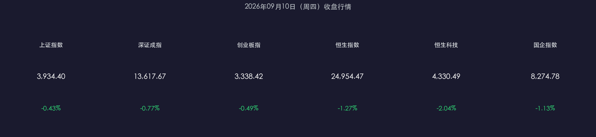

# 覆铜板逆势领涨、蓝筹护盘有限：A股港股全线收跌，沪指失守3950点

**日期：2026年09月10日 (星期四)** &nbsp; **时段：收盘晚报**

> **核心摘要**：今日A股港股全线回调，沪指跌破3950点关口收报3934.40点（-0.43%），全市场超4500只个股下跌，成交额缩量至1.65万亿元，市场情绪明显降温；资金呈现明显分化——覆铜板（受涨价函驱动+4.89%）、存储芯片及银行成为少数避风港，而医药、农业、消费电子等板块跌幅居前；当日最重磅催化剂为国务院新闻办发布《金融强国建设"十五五"规划》，A股总体呈"政策观望"状态，增量资金入场意愿不足。

---

## 核心行情复盘

### A股指数

* **上证指数**：收报 **3,934.40点**，下跌 **-0.43%**（-17.11点）
* **深证成指**：收报 **13,617.67点**，下跌 **-0.77%**（-105.65点）
* **创业板指**：收报 **3,338.42点**，下跌 **-0.49%**（-16.55点）

> **数学闭环验证**：上证：(3934.40 - 3951.51) / 3951.51 = -0.433% ✅ 恒生：(24954.47 - 25274.96) / 25274.96 = -1.267% ✅ 双向校验通过，数据与官方来源一致。

### 港股指数

* **恒生指数**：收报 **24,954.47点**，下跌 **-1.27%**（-320.49点）
* **恒生科技指数**：收报 **4,330.49点**，下跌 **-2.04%**（-90.30点）
* **国企指数**：收报 **8,274.78点**，下跌 **-1.13%**（-94.27点）

### 成交与资金

* **沪深两市成交额**：**1.65万亿元**（较前一交易日1.87万亿元明显缩量，约-11.8%）
* **全市场个股**：超 **4,500只** 个股下跌，普跌格局显现
* **主力资金净流入**：存储芯片板块约 **42.85亿元**；PCB概念约 **35.82亿元**；太极实业个股约 **19.65亿元**
* **主力资金净流出**：医药板块净流出超 **36亿元**；中际旭创净流出约13.36亿元，亨通光电、新易盛等光模块方向居前

### 行情数据卡片

### 板块领涨 / 领跌

| 类型 | 板块 | 涨跌幅 |
|------|------|--------|
| 🔴 领涨 | 覆铜板（CCL） | **+4.89%** |
| 🔴 领涨 | 银行 | 相对抗跌 |
| 🔴 领涨 | 航海装备 | 小幅上涨 |
| 🟢 领跌 | 草甘膦 / 农产品加工 | 较大跌幅 |
| 🟢 领跌 | 医疗服务 | 净流出超36亿 |
| 🟢 领跌 | 消费电子 / 游戏 | 情绪回落 |

> **逻辑闭环**：覆铜板（CCL）上游厂商发出涨价函（数据+事件），推动板块涨价预期（逻辑），主力资金集中布局，形成当日最强主线。苹果折叠屏发布虽引发关注，但消费电子整体表现平淡，市场对硬件迭代周期的预期已较充分。

### 关联市场

* **人民币兑美元（中间价）**：续守 **6.77** 区间，汇率保持基本稳定
* **美元指数（DXY）**：弱势震荡，维持在 **98.85** 附近，中美利差压力边际缓解

---

## 核心解读与市场逻辑

> **"政策窗口期"的集体观望**：今日A股缩量回调（1.65万亿 vs 昨日1.87万亿），很大程度上是市场进入《金融"十五五"规划》发布后的"解读消化期"。该规划虽定调清晰（2030年资本市场高质量发展基本形成，2035年建成中国特色现代金融体系），但短期内缺乏立竿见影的增量政策刺激，资金选择观望，存量博弈特征明显。

> **科技板块内部分化加剧**：上半年以AI算力和光模块为代表的科技主线出现明显回调——中际旭创、亨通光电净流出居前，而覆铜板因涨价函催化独立走强。这一分化反映了市场从"主题驱动"向"业绩验证"的风格切换：缺乏三季报业绩支撑的过热标的承压，有实际订单催化的细分材料反而受追捧。

> **港股科技回调幅度超A股**：恒生科技跌-2.04%，显著大于创业板-0.49%，主因美团、百度等大型科网股走弱，叠加DeepSeek调整资费方案引发AI应用盈利模式的再审视。港股科技估值更高、对流动性更敏感，回调弹性也更大。

---

## 政策脉动

* **🏛️ 《金融强国建设"十五五"规划》正式发布（国新办，2026-09-10）**
  * **2030年目标**：金融调控协同有效，国际影响力持续提升
  * **2035年目标**：基本建成高度适应性、竞争力、普惠性的中国特色现代金融体系
  * **PBOC核心方向**：完善逆周期/跨周期货币政策体系；坚持市场决定汇率，增强人民币弹性；推进人民币国际化，丰富离岸流动性
  * **CSRC核心方向**：监管从严（前8月查办644件，罚没近百亿）；中长期资金今年净买入A股超 **6000亿元**，持有流通市值增长 **12.5%**；持续健全"长钱长投"机制；优化发行上市制度，支持新兴产业
  * **配套措施**：财政部发行3000亿元特别国债，支持8家央金企业补充核心一级资本

> **市场影响研判**：规划整体正面但偏长期，短期提振有限，与今日缩量回调高度吻合。监管从严叠加中长期资金持续入市，有助于改善市场结构，但扭转弱势格局还需等待更直接的增量政策信号。

---

## 最新机构观点

* **中信证券**：看好具身智能及开源大模型带来的应用普惠机会，龙头连锁药店、部分地产开发标的在分化中呈现配置价值。建议"AI进攻（核心标的）+红利防御（稳现金流）"双主线布局。

* **高盛（Goldman Sachs）**：持续关注中国AI开源模型"智能临界点"效应；在政策转变与地缘波动背景下，建议战略性调整组合，关注主动管理型ETF及尾部风险对冲工具，对新兴市场资产维持战略性积极立场。

* **摩根大通（J.P. Morgan）**：建议"逢低买入（Buy the dips）"，认为新兴市场在风险偏好回升时将展现强于发达市场的韧性；港股处于"价值洼地"，重点关注南向资金持续流入及互联互通标的扩容，以及半导体和AI产业链复苏机会。

> **机构共识**：三家机构均认可中国资产中长期吸引力，短期均提示业绩验证阶段的收敛特征。从算力主题切换至AI Agent落地与企业级应用变现已成主流叙事。

---

## 今日市场情绪：铜板领航、灯塔引路

> Prompt: A massive copper-hulled cargo ship sails steadily through a turbulent sea of falling red candlestick waves, the crew navigating with calm precision. In the distance, a towering golden lighthouse labeled '十五五' pierces through stormy clouds, casting a warm beam of hope. The sky swirls with dark financial charts dissolving into stars. Style: cinematic, dramatic ocean perspective, deep navy and gold palette.

---

*免责声明：内容仅供参考，不构成投资建议。市场有风险，投资需谨慎。*
