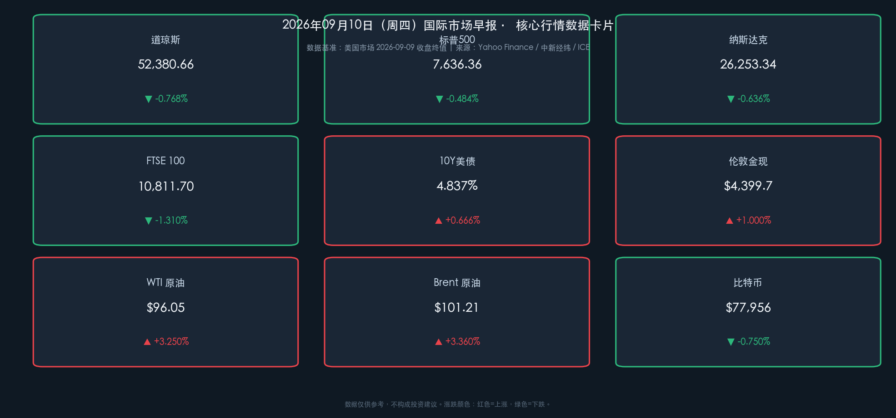

# 🌅 2026年09月10日 国际市场早报：布油破百引爆加息恐慌，财政部回购“底牌”难扶债市

**日期：2026年09月10日 (星期四)** &nbsp; **时段：早报（国际市场 · 模式A：常规交易日）**

> **核心摘要**：隔夜美股三大指数连续第二日收跌，道指跌 **-0.77%**、标普跌 **-0.48%**、纳指跌 **-0.64%**。中东冲突升级推动 Brent 原油大涨 **+3.36%** 重回 **$101.21/桶** 上方，10Y 美债收益率升至 **4.837%**（2023 年 11 月以来新高）。美国财政部宣布至多 **60 亿美元** 长债回购，因规模不及预期反被市场视为“惊吓”，收益率不降反升。交易员目前押注美联储下周会议加息概率达 **60%**，今明两天的 PPI 与 CPI 报告将最终定调。

---

## 核心行情复盘

周三华尔街在“油价破百 + 长端收益率飙升”的双重压力下全线收低，欧洲主要股指同步重挫。市场结构呈现鲜明的“避险 + 局部景气”特征：能源与利率敏感资产主导下跌，而存储、光通信等 AI 硬件细分赛道逆市走强，Meta 凭借消费级 AI 智能体发布大涨超 6%，成为大盘中最亮眼的逆行者。

### 📊 全球核心资产收盘行情

* **美股主要指数**：
  * **道琼斯工业指数**：收于 **52,380.66** 点，下跌 **-0.77%**（约 -407 点），传统工业与高负债板块继续承压。
  * **标普500指数**：收于 **7,636.36** 点，下跌 **-0.48%**（-37.2 点），为连续第二个交易日收跌。
  * **纳斯达克综合指数**：收于 **26,253.34** 点，下跌 **-0.64%**（-168.1 点），存储与光通信板块限制了整体跌幅。
* **美股板块与个股亮点**：
  * **Meta Platforms**：大涨 **+6.55%** 至 **$653.69**，成交额 229.87 亿美元居首。公司正式推出面向消费者的个人 AI 智能体 **Muse**（可替用户购物、预约、填表），华尔街分析师普遍看好。
  * **苹果**：跌 **-0.28%**。秋季发布会推出 iPhone 18 Pro 系列及首款折叠屏手机 **iPhone Duo**（起售价 15,999 元，10 月发售），新任 CEO 约翰·特努斯首秀登场；新品顶住涨价压力，但华尔街普遍担忧利润率前景，股价走出“过山车”行情。
  * **大型科技股多数下跌**：亚马逊跌超 1%，英伟达（-0.91%）、微软、特斯拉、谷歌均收跌。
  * **存储概念股持续拉升**：SK 海力士涨超 **7%** 股价创新高，美光科技涨 **+2.75%**，闪迪（+1.51%）、西部数据涨超 1%；2 倍做多海力士 ETF 单日涨超 14%。
  * **光通信概念股强势**：迈威尔科技涨超 **4%**，Lumentum、康宁涨超 1%。
  * **半导体涨跌互现**：AMD 涨超 3%，英特尔、ARM、高通涨超 1%；阿斯麦跌 2%，博通跌超 1%。
  * **生物医药走弱**：Moderna 跌超 3%，诺和诺德、阿斯利康跌超 1%。
  * **中概股多数下跌**：纳斯达克中国金龙指数跌 **-2.09%**。小马智行、爱奇艺跌超 5%，理想汽车、唯品会跌超 4%，小鹏汽车、世纪互联跌超 3%，阿里巴巴（-2.89%）、京东、贝壳跌超 2%；小牛电动逆市涨超 7%。
* **欧洲主要指数（全线重挫）**：
  * **英国富时100 (FTSE 100)**：收于 **10,811.70** 点，下跌 **-1.31%**。
  * **法国CAC 40**：大跌 **-2.03%**，领跌欧股。
  * **德国DAX 30**：下跌 **-1.74%**。
  * **富时意大利MIB**：下跌 **-0.58%**。
* **债券与外汇**：
  * **美国10年期国债收益率**：报 **4.837%**，上行约 **+3.2 bp**，创 **2023 年 11 月以来新高**。财政部回购公告发布前收益率一度持稳，公告后因规模不及预期反而走高。
  * **美元指数 (DXY)**：报 **98.817**（+0.03%），汇市尾市基本持平。
* **大宗商品与加密资产**：
  * **WTI 原油（10月合约）**：收于 **$96.05/桶**，大涨 **+3.25%**（+$3.02）。
  * **Brent 原油（11月合约）**：收于 **$101.21/桶**，大涨 **+3.36%**（+$3.29），重回每桶 100 美元上方。
  * **伦敦金现**：涨超 **+1%**，报 **$4,399.68/盎司**；隔夜贵金属与加密资产一度同步走强，金价盘中曾冲上 $4,500 上方。
  * **比特币 (BTC)**：报约 **$77,956**，下跌 **-0.75%**，在 $78,000 关口附近震荡。

### 📈 跨市场行情数据卡片

---

## 核心解读与市场逻辑

> **宏观逻辑传导链**：**中东冲突升级 → Brent 油价重返 $100 上方（供给冲击 + 通胀持续性担忧） → 10Y 美债收益率创 2023 年 11 月以来新高（加息预期重定价） → 欧美股市同步下挫、欧洲尤惨（CAC40 -2.03%） vs 存储/光通信等 AI 硬件景气赛道与 Meta 逆市走强（结构性行情）。**

### 1. 油价破百：通胀交易的回归
中东局势再度升级成为本轮油价拉升的核心驱动。Brent 原油重返 100 美元关口上方，直接点燃了市场对“能源成本中枢永久性抬升”的定价：能源价格上涨进一步加剧市场对通胀持续性的担忧，掉期与期货市场对美联储下周会议加息的押注已升至 **60%**。油价—通胀—利率的传导链条，正在取代 AI 叙事成为短期市场定价的第一变量。

### 2. 财政部回购“救市底牌”为何失灵
周三美国财政部宣布将在次日的回购操作中购买**至多 60 亿美元**的长期国债，意在遏制不断攀升的长端收益率。然而这一数字让不少原本期待更大规模干预的市场参与者大失所望——公告发布前债券收益率尚保持稳定，公告发布后不降反升。正如 Janney Montgomery Scott 首席固收策略师 Guy LeBas 所言：“理由很简单，市场干预措施长期以来都未能取得很好的效果。” 60 亿美元相对美债市场的体量无异于杯水车薪，“救市底牌”反而成了一张惊吓市场的“烂牌”。

### 3. 分化中的韧性：AI 硬件景气与消费级 AI 落地
尽管指数层面风声鹤唳，结构性机会依然清晰：存储芯片（SK 海力士创新高、美光、闪迪）与光通信（迈威尔、康宁）逆市大涨，伯恩斯坦认为存储板块盈利预测仍有上调空间；Meta 正式入局个人 AI 代理赛道，Muse 的发布被视为消费级 AI Agent 商业化的标志性事件，单日 +6.55% 的表现说明资金仍在为“AI 落地兑现”支付溢价。瑞银同时警告：若美债收益率上行开始压制股市，发达市场中美股脆弱性最高，**AI 相关股票面临最大风险**——高估值板块对折现率的敏感性不容低估。

### 4. 苹果的“折叠屏时刻”与利润率悬念
苹果发布 iPhone 18 Pro 系列与首款折叠屏 iPhone Duo，这是 iPhone 问世近 20 年来外观形态上最大的迭代，也是新 CEO 特努斯的秋季发布会首秀。分析师对新品总体持乐观态度，但涨价背景下的利润率前景令华尔街担忧，股价全天剧烈波动后小幅收跌——发布会行情“利好兑现”特征明显。

---

## 政策脉动

* **美联储 (Federal Reserve)**：
  * 下周（9 月 15-16 日）FOMC 议息会议临近，尽管当前市场预期倾向于加息，但加息概率仅略高于五成（约 **60%**），届时行动仍存较大变数。
  * **今明两天两份重磅通胀报告（PPI 与 CPI）将最终定调**：路透社指出，从中可以找到美联储利率路径的关键线索。若通胀数据再度超预期，加息将几乎板上钉钉。
* **美国财政部 (US Treasury)**：
  * 宣布回购**至多 60 亿美元**长期国债以遏制收益率攀升，规模不及市场预期，公告后收益率反而上行，凸显财政货币化干预的边际效力递减。
* **美国国会**：
  * 加密货币市场结构法案 **Clarity Act** 下周将迎来关键投票，或成为数字资产监管框架的分水岭事件。
* **欧洲方面**：
  * 能源价格急升再度考验欧洲央行的通胀管控立场，欧股全线重挫（法股跌超 2%、德股跌超 1.7%），市场对欧洲“滞胀”组合的担忧明显升温。

---

## 最新机构观点

* **🏛 瑞银（UBS）**：
  > “若美债收益率上行开始对股市形成压制，在发达市场中，美国股票市场的脆弱性最高，原因是 AI 相关股票在指数中的权重与估值溢价都处于极端水平。在美债危机情景下，AI 相关股票面临最大风险。”

* **🏦 伯恩斯坦（Bernstein）**：
  > “看好存储板块，认为当前盈利预测仍有上调空间。AI 基础设施建设对存储与光通信的拉动仍在加速，SK 海力士、美光等龙头的景气周期尚未走完。”（SK 海力士当日大涨超 7% 创历史新高）

* **🏢 Janney Montgomery Scott（首席固收策略师 Guy LeBas）**：
  > 针对财政部 60 亿美元长债回购：“理由很简单，市场干预措施长期以来都未能取得很好的效果。”

* **📈 华尔街主流策略观点**：
  > “美国股市虽说今年波动剧烈，但整体表现依旧亮眼——标普 500 年内已涨超 11%，年末有望迈上 **8000 大关**；但短期风险正在上升，通胀数据与利率路径将决定四季度的开局方向。”

* **₿ 渣打银行（Standard Chartered）**：
  > 数字资产研究全球主管 Geoffrey Kendrick 维持比特币 **2026 年末 10 万美元** 目标价不变，认为 ETF 时代的资金结构将取代减半周期成为核心驱动，深度回调更应被视为中长期布局机会。

---

## 今日市场情绪：油价海啸下的脆弱灯塔

> Prompt: A gigantic tsunami wave made of dark crude oil towering over the Wall Street skyline under storm clouds, symbolizing an energy price shock; in the foreground, a small glowing blue mechanical phoenix, an AI spirit, rises above the flood carrying a bright lantern; in the background, a lighthouse casts a thin golden beam of light too weak to calm the raging sea. Mood: overwhelming oil shock and interest-rate storm versus fragile tech resilience.

---

> **免责声明**：内容仅供参考，不构成投资建议。市场数据来源：NYSE/NASDAQ/LSE/Euronext/ICE/COMEX/CoinGecko、中新经纬、东方财富、各官方机构与投行公开研究报告。
