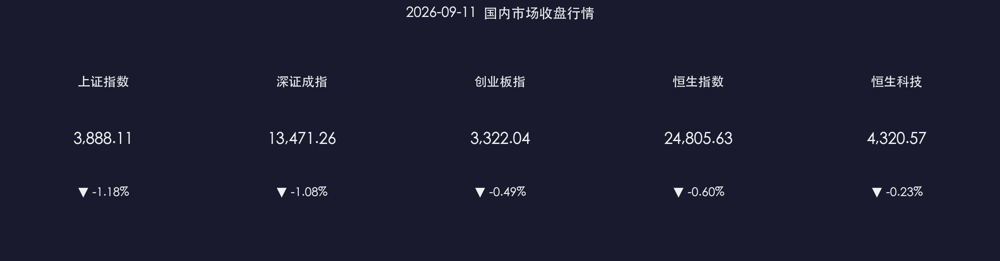

# 📉 金融市场晚报：政策暖风与短期震荡的博弈

**日期：2026年09月11日 (星期五)** &nbsp; **时段：收盘晚报**

> **核心摘要**：A股三大指数今日收跌，沪指跌幅1.18%，但成交额近2万亿元较前日放量逾3200亿，显示市场仍保持充裕流动性；"十五五"金融强国规划昨日正式发布，PBOC + CSRC双向政策驱动中长期资金入市；兵装重组概念逆势走强，机构策略向"科技成长 + 红利防御"双线均衡切换。

---

## 核心行情复盘

### A股三大指数

* **上证指数**：收报 **3,888.11 点**，下跌 **1.18%**
* **深证成指**：收报 **13,471.26 点**，下跌 **1.08%**
* **创业板指**：收报 **3,322.04 点**，下跌 **0.49%**（跌幅相对最小，科创韧性较强）
* **全市场成交额**：**19,870 亿元**，较上一交易日**放量 3,246 亿元**（+19.5%），显示抛压下资金博弈激烈
* **下跌个股**：全市场超 **4,800 只**个股收跌

**领涨板块**：地面兵装 🚀、玻璃玻纤、元件、通信设备  
**领跌板块**：多元金融 📉、工业金属、农化制品、贵金属、能源金属

### 港股市场

* **恒生指数**：收报 **24,805.63 点**，下跌 **0.60%**；本周累计下跌 **3.30%**
* **恒生科技指数**：收报 **4,320.57 点**，下跌 **0.23%**；本周累计下跌 **5.45%**

> 港股受地缘政治局势紧张及原油价格上涨双重压制，有色金属、芯片及部分科技股表现疲软。本周恒生科技累跌5.45%，为近期较大单周跌幅。

### 主力资金动向

* **大盘资金净流出**：午盘数据显示净流出约 **827.66 亿元**，整体资金面承压
* **个股净流入前列**：中际旭创、燧原科技、新易盛（AI算力产业链）；建设工业、长城军工（兵装重组概念）
* **个股净流出前列**：洛阳钼业、东方财富、兆易创新、紫金矿业、长鑫科技

---

## 核心解读与市场逻辑

> **震荡下跌的深层逻辑**：今日A股整体承压，但呈现出"跌幅收窄 + 放量成交"的结构性特征。盘中指数一度跌超2%，午后触底回升，说明存在承接资金。放量近2万亿的成交额意味着多空博弈加剧，而非单边踩踏。
>
> **兵装重组逆势领涨的信号**：地面兵装板块在大盘疲弱时逆势走强，源于近期央企兵工集团整合重组预期持续升温，结合本周军工订单消息催化，主力资金明显关注建设工业、长城军工等标的，体现政策方向引导下的资金分流特征。
>
> **AI算力产业链资金坚守**：中际旭创、燧原科技、新易盛等AI光互联 / 国产GPU概念股持续获主力净流入，与机构9月策略中强调"国产算力下半年放量、AI数据中心加速建设"的逻辑高度吻合，说明板块内资金信仰尚未动摇。

---

## 政策脉动

### 🏛️ 金融"十五五"规划正式发布（重磅）

* **2026年9月10日**，国务院新闻办发布**《金融强国建设"十五五"规划》**：
  * **2030年目标**：形成中国特色现代金融体系总体框架，金融调控协同、监管严密、开放提速
  * **2035年目标**：基本建成高度适应性、竞争力与普惠性的现代金融体系

### 📋 CSRC（证监会）重点信号

* 证监会副主席李超表示，A股将成为**优质国内企业上市首选目的地**
* 今年以来**中长期资金已累计净买入A股超 6,000 亿元**，"长钱长投"机制持续优化
* 持续优化上市标准，有序扩大对**新经济和高质量企业**的覆盖
* 北交所与新三板集成化高质量发展持续推进

### 🏦 PBOC（中国人民银行）政策动向

* 强调进一步优化货币政策框架，**更注重利率调控，淡化数量型目标**
* 落地9份配套行动方案，聚焦金融"五篇大文章"（科技、绿色、普惠、养老、数字金融）
* **9月14日起**：跨国公司本外币跨境资金集中运营新规正式施行，便利资金跨境归集

### 💰 央企增资提振信心

* 工商银行、农业银行等**八大央行国企宣布合计约 3,600 亿元资本补充计划**，强化核心一级资本，提升抗风险与服务实体经济能力

---

## 最新机构观点

> **中信证券**：关注创新药板块的全球价值兑现机遇——头部企业进入盈利拐点，海外授权（License-out）交易进入密集兑现期。同时指出房地产领域现房销售改革有望加快不良资产优化，带来地产链修复机会。

> **高盛（Goldman Sachs）**：维持对中国股市2026年全年看多立场，认为企业盈利改善（AI应用变现、出海业务）正在逐步兑现，可支撑中国资产持续反弹基础；建议投资者在短期波动中保持战略仓位。

> **摩根大通（JPMorgan）**：强调中国市场估值仍处合理区间，国际机构投资者仓位依然较轻，配置吸引力犹存。短期提示关注美联储利率演变及中东地缘局势对能源价格的扰动。

**机构9月策略共识：** 从上半年的"科技独秀"转向**"科技成长（进攻）+ 高股息/红利（防守）"双线均衡**配置，以应对市场区间震荡与风格快速轮动。

---

## 今日市场情绪：政策暖流对冲震荡寒意

> Prompt: A massive cosmic scale balanced in the void of space, on one side rests a glowing golden document (Finance Blueprint) radiating policy light beams, on the other side a swirling red K-line storm pulls the scale downward. In the background, silhouettes of military aircraft emerge from misty clouds, rising against the tide. Cinematic, ultra-detailed, deep blue and gold color palette, macro perspective.

---

*免责声明：内容仅供参考，不构成投资建议。市场有风险，投资需谨慎。*
