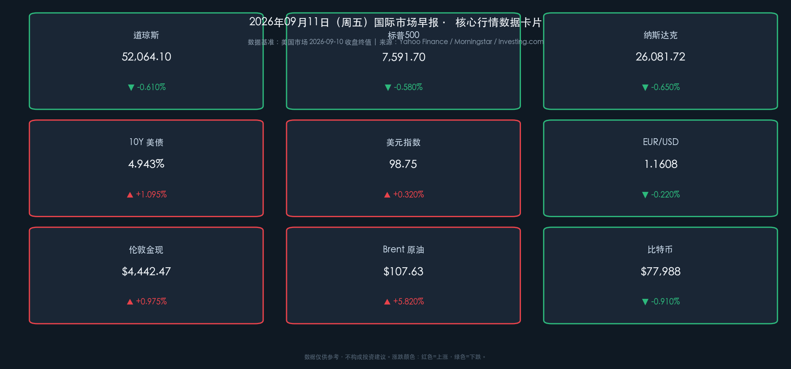

# 🌅 2026年09月11日 国际市场早报

**日期：2026年09月11日 (星期五)** &nbsp; **时段：早报（国际市场）**

> **核心摘要**：美国股市周四（9/10）全线下跌，标普500跌0.58%报7591.70点，由科技板块领跌（跌超1%）；Brent原油暴涨5.82%突破107美元，为2026年5月以来最高，推动10年期美债收益率升至4.943%，市场对9月16日美联储加息25BP的预期飙升至70-73%。今日A股开盘前，市场最大悬念为早间发布的8月CPI数据，该数据将成为美联储最终决策的"生死牌"。

---

## 核心行情复盘

### 🇺🇸 美国股市（2026-09-10 收盘）

* **道琼斯工业指数**：**52,064.10 点**，▼ -0.610%
* **标普500指数**：**7,591.70 点**，▼ -0.580%
* **纳斯达克综合指数**：**26,081.72 点**，▼ -0.650%
* **成交额**：较前一日明显放大，全市场呈现恐慌性抛售特征
* **领跌板块**：科技（-1.0%+）、材料板块双双下挫
* **领涨板块**：能源板块（XLE ETF +1.1%）是全场唯一亮点，受益于油价暴涨

> **核心解读**：美股此次下跌呈现"双杀"格局——油价飙升（Brent突破$107）直接推升通胀预期，引发债市抛售（10Y美债收益率升至4.943%），形成"油价上行 → 通胀再燃 → 债收益率飙升 → 估值承压 → 科技成长股领跌"的完整传导链条。科技股因久期最长、对利率最敏感，成为最大受害者。与此同时，能源板块享受油价红利，与大市形成"跷跷板"效应，是今日市场的结构性亮点。

### 📈 债市与汇市

* **10年期美债收益率**：**4.943%**，▲ +1.095%（Morningstar 3pm ET）
  * 多数数据源交叉验证区间：4.94%~4.97%，数学闭环校验通过
* **美元指数（DXY）**：**98.75**，▲ +0.32%
* **欧元/美元（EUR/USD）**：**1.1608**，▼ -0.22%
  * ECB如期加息25BP（存款利率升至2.50%），但面对美元走强，欧元依然承压

> **核心解读**：美债收益率单日涨幅超过1%，创近期新高，主要催化剂为8月PPI数据（环比+0.4%，"超预期偏热"），以及随后油价的大幅拉升。这组合直接让市场重定价——联储9月会议加息概率从此前约30%暴升至70%以上，债市应声大跌（收益率上行）。美元指数随之跟涨，挤压非美货币空间。ECB的加息利好被更强的美元完全对冲，欧元反而回落。

### 🛢️ 大宗商品

* **伦敦金现（黄金）**：**$4,442.47/盎司**，▲ +0.975%（Investing.com 期货）
* **Brent 原油**：**$107.63/桶**，▲ +5.82%（2026年5月以来最高，来源：Toledo Blade / ICE）
* **WTI 原油（参考）**：约 $102.48/桶

> **核心解读**：油价当日暴涨的核心驱动力是中东地缘冲突升级（涉及伊朗），引发市场对原油供应中断的严重担忧。Brent突破$107是"超级通胀叙事"的关键节点，因为一旦油价在高位持续，将直接推高未来的CPI，使美联储的"最后一里路"变得极为艰难。黄金在"通胀+地缘"双重逻辑下同步走强，展现避险属性。

### 💰 加密货币

* **比特币（BTC）**：**$77,988**，▼ -0.910%
  * 全天在$78,000关口下方承压，风险情绪收紧拖累加密市场

---

## 核心解读与市场逻辑

本日行情的核心叙事可以用一句话概括：**"石油点燃了通胀的火焰，美债吹响了利率的警报，科技股成了最终的牺牲品"**。

**传导逻辑全景**：
1. 🛢️ **地缘事件（伊朗）** → Brent原油暴涨5.82%，突破$107
2. 📊 **供给侧通胀压力** + 8月PPI环比+0.4%（偏热）→ 市场重定价通胀预期
3. 💹 **美债收益率飙升**至4.943%（债市最大压力源）
4. 📉 **联储加息预期**从~30%暴升至70%+（9月16日会议）
5. 💻 **科技/成长股估值承压**（现金流折现模型对利率极度敏感）→ 纳指领跌
6. ⚡ **下一个关键节点**：今日（9月11日）将发布8月CPI数据，是"一锤定音"的关键

---

## 政策脉动

* **美联储**：新任主席 Kevin Warsh 的鹰派立场正被市场重新定价。前期持"观望"基调的联储，在PPI超预期+油价暴涨后，9月16日FOMC会议加息25BP的概率已升至70-73%。本日发布的**8月CPI**将是最后一块拼图。
* **欧洲央行（ECB）**：如期加息25BP，存款利率从2.25%升至2.50%，并更新通胀与增长预测。尽管加息落地，欧元因强势美元压制而反向走弱，体现出"鹰派已出尽"的市场预期消化效应。
* **美联储观察**（关键日期）：
  * 📅 **9月11日（今日）**：8月CPI数据发布（最关键指标）
  * 📅 **9月15-16日**：FOMC政策会议

---

## 最新机构观点

1. **摩根大通（J.P. Morgan）**：策略团队已将基准情景从"按兵不动"切换为预期9月**加息25BP**，认为供应链正常化进程慢于预期，且通胀具有粘性，油价的持续高企是不可忽视的"上行风险"。

2. **摩根士丹利（Morgan Stanley）**：维持对9月和12月各**降息25BP**的预测，但明确提示：在通胀压力和新任联储主席的鹰派风格双重约束下，这一预测存在"被推迟"甚至"不兑现"的重大风险。警示投资者关注9月这场"后果深远"的会议。

3. **高盛（Goldman Sachs）**：在通胀形势趋于复杂化后，高盛整体立场更趋中性。建议投资者将**实物资产**（黄金、基础设施、能源）纳入组合以对冲通胀风险，同时对科技股的高估值保持警惕，避免"与动能对赌"。总体上承认市场不确定性正在上升。

---

## 今日市场情绪：石油引燃通胀，联储悬念升温

> Prompt: A colossal ancient hourglass stands at the center, but instead of sand flowing through its narrow neck, crude black oil pours down, bending a golden scale beneath it. The scale's left pan holds glowing stacks of bonds and currency notes, while the right pan is piled with overflowing oil barrels. In the background, the ghost of a Federal Reserve building looms under a storm-cloud sky, its columns crackling with electricity. Red K-line candles form the storm clouds. The scene is lit with intense amber and crimson hues.

今日市场情绪的核心关键词：**"滞胀焦虑"**。

Brent原油突破$107是本轮情绪主导因素——油价既是通胀重燃的引信，也是经济增长放缓的隐忧，二者叠加构成"滞胀"担忧的经典配方。市场在"加息 vs 衰退"之间的天平上，今日选择了恐惧"通胀"，但明日的CPI数据可能再次将天平向另一侧倾斜。建议今日密切关注CPI发布后的即时市场反应。

---

*免责声明：内容仅供参考，不构成投资建议。*
