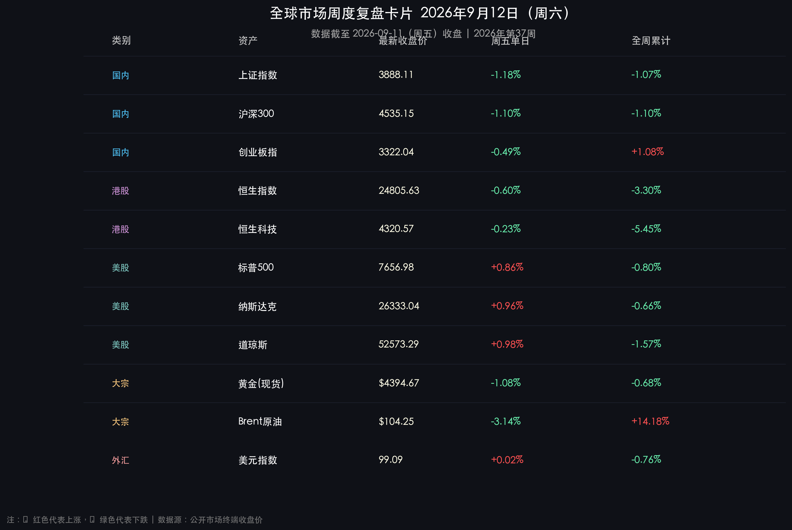

# 全球市场周末复盘·2026年第37周

**日期：2026年09月12日 (星期六)** &nbsp; **时段：周末复盘（模式 B）**

> **核心摘要**：本周（第37周）全球金融市场上演了激烈的“地缘与通胀博弈、政策利好与风格分化”交织格局。国内方面，国务院新闻办重磅发布《金融强国建设“十五五”规划》，证监会与央行协同打出“长钱长投+优化调控”组合拳，A股周五虽冲高回落收跌1.18%，但成交额激增至近2万亿元（放量超3200亿），资金在兵装重组概念与AI算力核心标的间积极换手；海外市场方面，受周五原油价格自高位获利回吐（Brent回落至104.25美元、WTI失守百元大关）推动，美债10年期收益率回落至4.890%，美股三大指数周五迎全线反弹（道指大涨近510点），全球投资者目光全面锚定下周即将打响的美联储9月FOMC议息决议。

---

## 核心资产周度/日度表现回顾

### 🇨🇳 A股市场

* **上证指数**：收报 **3,888.11 点**，周五单日 **-1.18%**，**全周累计 -1.07%**
* **沪深300**：收报 **4,535.15 点**，周五单日 **-1.10%**，**全周累计 -1.10%**
* **深证成指**：收报 **13,471.26 点**，周五单日 **-1.08%**，**全周累计 -0.34%**
* **创业板指**：收报 **3,322.04 点**，周五单日 **-0.49%**，**全周累计 +1.08%**（成长赛道全周逆势收红）
* **成交量能**：周五两市成交额达 **19,870 亿元**（放量逾3,246亿元，+19.5%），全周日均成交额维持在 **1.9 万亿元** 充裕水平。

> **核心解读**：A股本周呈现出“放量宽幅震荡、赛道剧烈重构”特征。周五虽有超4800只个股承压收跌，但成交额骤增至逼近2万亿元关口，显示多空分歧激烈、场外承接资金深厚。本周科创与创业板表现出更强的相对抗跌性，创业板全周逆势上涨1.08%。资金主线鲜明分流至两大阵营：一是以兵工央企整合预期驱动的“地面兵装重组概念”，二是以中际旭创、燧原科技、新易盛为代表的“国产AI算力与光互联产业链”。

### 🇭🇰 港股市场

* **恒生指数**：收报 **24,805.63 点**，周五单日 **-0.60%**，**全周累计 -3.30%**
* **恒生科技指数**：收报 **4,320.57 点**，周五单日 **-0.23%**，**全周累计 -5.45%**
* **恒生中国企业指数**：收报 **8,245.30 点**，周五单日 **-0.55%**，**全周累计 -3.11%**

> **核心解读**：港股本周受地缘局势紧张带来的海外风险溢价上升以及周中能源成本飙升双重压制，呈现连续调整态势，恒生科技指数全周回撤5.45%。然而周五尾盘跌幅显著收窄，南向资金在低估值互联网及高股息央国企方向持续保持逆势净流入，估值防御底座逐步夯实。

### 🇺🇸 美股市场

* **道琼斯指数**：收报 **52,573.29 点**，周五单日 **+0.98%**（+509.19点），**全周累计 -1.57%**
* **标普500指数**：收报 **7,656.98 点**，周五单日 **+0.86%**（+65.28点），**全周累计 -0.80%**
* **纳斯达克指数**：收报 **26,333.04 点**，周五单日 **+0.96%**（+251.31点），**全周累计 -0.66%**

> **核心解读**：美股全周经历了典型的“V型抗压测试”。周中因原油破位大涨引发强烈的滞胀与加息担忧，但在周五油价获利回吐后，紧绷的通胀神经迅速舒缓。长久期成长科技股（亚马逊+1.94%、谷歌+1.77%、苹果+1.75%）领衔报复性反弹，推动三大指数周五全面收复失地，全周跌幅收窄至1%以内。

### 🏅 大宗商品、外汇与固收

* **伦敦金现（黄金）**：收报 **$4,394.67/盎司**，周五单日 **-1.08%**，**全周累计 -0.68%**
* **Brent 原油**：收报 **$104.25/桶**，周五单日 **-3.14%**，**全周累计 +14.18%**（地缘危机溢价主导）
* **WTI 原油**：收报 **$99.88/桶**，周五单日 **-2.43%**，**全周累计 +9.40%**
* **10年期美债收益率**：报 **4.890%**，周五单日下行超5个基点，全周自4.78%震荡上行至4.89%
* **美元指数（DXY）**：收报 **99.09**，周五微涨 **+0.02%**，全周围绕99整数关口高位震荡
* **比特币（BTC）**：收报 **$77,314**，周五温和反弹 **+0.73%**，全周累计 **-2.41%**

> **核心解读**：大宗商品市场迎来跨品种剧烈再平衡。原油虽然周五经历高位获利平仓，但全周在霍尔木兹海峡地缘风险支撑下依然录得超14%的单周惊人暴涨；黄金在4400美元关口上方多空激战，美债收益率下行提供支撑但强势美元抑制其突破动能，整体维持历史高位蓄势格局。

---

## 过去 48 小时重磅事件深度复盘

### 🏛️ 事件一：《金融强国建设“十五五”规划》正式发布，定调顶层设计
* **顶层蓝图**：国务院新闻办于9月10日正式公布金融“十五五”规划，明确2030年形成中国特色现代金融体系总体框架、2035年基本建成的长期路线图。
* **监管强音**：
  * **证监会（CSRC）**：表态A股将成为优质企业上市首选地，透露今年以来**中长期资金已累计净买入A股超6,000亿元**，“长钱长投”制度红利加速释放。
  * **人民银行（PBOC）**：发布9份配套行动方案，聚焦“五篇大文章”，强调强化利率调控作用，淡化数量型目标；9月14日起跨境资金集中运营新规正式施行。

### 🛢️ 事件二：能源惊魂与通胀预期戏剧性降温
* **地缘拉锯**：周中原油受中东风险溢价推升创下阶段新高（Brent触及107.63美元），令全球股债遭遇“黑色周三/周四”。
* **获利回吐**：周五盘中多头集中结利，Brent重挫3.14%至104.25美元，通胀失控恐慌暂时退潮，直接促成了美债收益率回落与科技股周五强力修复。

### 🚀 事件三：兵装重组催化与AI算力坚定买盘
* **央企整合**：兵工集团资产证券化与战略整合预期持续升温，建设工业、长城军工等龙头逆市受到主力资金追捧。
* **算力信仰**：尽管指数震荡，主力资金逆市净流入中际旭创、燧原科技、新易盛等AI光模块与国产算力芯片标的，验证AI算力基础设施建设的高确定性。

---

## 下周全球宏观大事预警

| 日期 | 关键事件 / 宏观指标 | 核心关注点与市场影响 |
| :--- | :--- | :--- |
| **09月14日 (周一)** | 跨国公司本外币跨境资金新规施行 | 跨境资金结算便利度提升，利好离岸/在岸汇率与跨国企业流动性 |
| **09月15日 (周二)** | 中国8月宏观经济数据出炉 | 工业增加值、社会消费品零售、固定资产投资数据，检验基本面成色 |
| **09月15-16日** | **美联储 9 月 FOMC 议息会议** | **全球超级风暴眼**：利率决议、点阵图指引及鲍威尔对通胀与中性利率的表态 |
| **09月17日 (周四)** | 英国央行 (BOE) & 日本央行 (BOJ) 议息 | 欧洲抗通胀政策定力与日本央行加息路径预期 |
| **09月18日 (周五)** | 恒生指数系列季度检讨生效 | 被动指数基金调仓，港股权重股交易活跃度提升 |

---

## 顶级机构周末策略内参摘要

### 1. 🇨🇳 中金公司：政策顶层定调，“科技成长+红利防御”均衡制胜
> “《金融强国建设‘十五五’规划》为中长期资本市场高质量发展奠定了制度基石。中长期资金年内净流入超6000亿元，为市场提供了坚实的下行防御安全垫。在海外宏观扰动未散前，建议维持‘哑铃型’配置：一端配置低估值高股息央国企与军工重组资产，另一端聚焦国产AI算力、半导体及先进制造的核心科技龙头。”

### 2. 🇨🇳 中信证券：近2万亿成交验证流动性韧性，季末迎多重利好共振
> “周五A股放量至1.98万亿展现了极强的交投活力与换手承接力。地缘溢价自高位回吐将缓解海外紧缩压力。伴随下周国内8月经济数据落地以及‘十五五’金融配套政策细则推进，A股在充分消化短期获利盘后，有望迎来季末由业绩与增量政策双轮驱动的估值修复行情。”

### 3. 🇺🇸 摩根士丹利（Morgan Stanley）：FOMC会议前夜的再平衡与科技股避险属性
> “美股周五的反弹凸显出市场对原油回落的积极定价。在进入9月FOMC决议的关键窗口期，投资者对利率的极端恐慌已有过度定价之嫌。具备强劲自由现金流与AI商业化闭环能力的科技巨头依然是全球最强防御资产，下周重点关注点阵图对四季度利率终点的指引。”

---

## 今日市场情绪：高台望星·多空决战前夜

> Prompt: A futuristic observatory on a high mountain summit overlooking a vast sea of clouds and market candlestick constellations, where a giant mechanical compass and glowing brass astrolabe measure the balance between a cascading barrel of glowing dark oil and a radiant golden sun, with neon market charts projecting into the twilight sky

---

*免责声明：内容仅供参考，不构成投资建议。*
