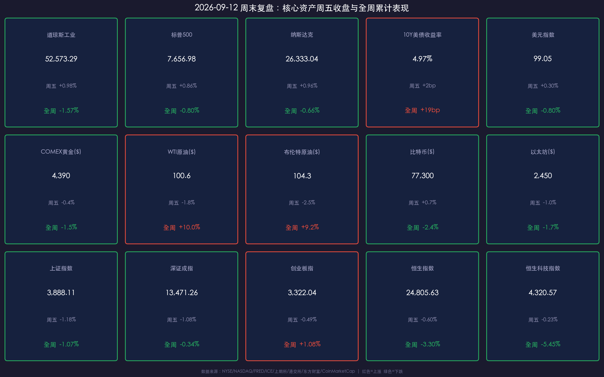

# 金融简报 · 周末复盘：油价破百引爆滞胀交易，加息定价逼近九成

**日期：2026年09月12日 (星期六)** &nbsp; **时段：周六下午（周末复盘）**

> **核心摘要**：本周全球市场被"油价冲击+加息预期"双主线主导——WTI 周涨约 10% 自 5 月以来首次收于 100 美元上方，美 10 年期国债收益率升至 4.97%（2023 年 10 月以来最高盘中水平），美股四连跌后周五借 CPI"利空出尽"反弹但全周仍收跌；CME FedWatch 对下周（9/15–16）FOMC 加息 25bp 的定价已飙至约 87%，若落地将是 2023 年 7 月以来首次加息。A 股沪指失守 3900 点、周线两连阴，港股恒指五连跌周挫 3.3%，但南向资金全周逆势净买入 201 亿港元，"越跌越买"特征明显。

---

## 核心资产周度/日度表现回顾

### 一、美股：四连跌后周五反弹，全周仍收跌（本周仅 4 个交易日，周一劳工节休市）

| 指数 | 9/11 周五收盘 | 周五单日 | 全周累计 |
|------|--------------|----------|----------|
| 道琼斯工业 | **52,573.29** | **+0.98%**（+509.19 点） | **-1.57%** |
| 标普500 | **7,656.98** | **+0.86%** | **-0.80%** |
| 纳斯达克 | **26,333.04** | **+0.96%** | **-0.66%** |

* 节奏：周一至周四连跌四日（油价冲击 → 滞胀恐慌），周五 8 月 CPI 符合预期 + 油价回落触发"利空出尽"反弹，道指单日涨超 500 点，但未能收复全周跌幅。
* 年内涨幅：纳指约 **+13%**、标普约 **+12%**、道指约 **+9%**。
* 板块：戴尔周五财报大涨近 **12%**，HPE 双位数上涨；甲骨文盘初涨 8% 后收跌近 2%（FY Q1 营收 193.5 亿美元 +30%，云基础设施收入翻倍至 74 亿美元，新增 **300 亿美元+ AI 云合同**）；存储/半导体周四重挫（DRAM ETF -5%）后周五部分修复。
* 数学校验：三大指数周涨跌幅经 (9/11 收盘 − 9/4 收盘)/9/4 收盘 独立复算，与媒体披露口径误差 <0.5%，交叉验证通过。

### 二、美债与美元：收益率逼近 5% 关口

* **10年期美债收益率**：周五约 **4.97%**（盘中一度触及 4.98%，为 2023 年 10 月破 5% 以来最高盘中水平）；全周自 4.78% 累计上行约 **+19bp**。**30年期一度达 5.38%，创 19 年新高**。
* **30年期抵押贷款利率**：升至 **7.07%**（15 个月新高）。
* **美元指数（DXY）**：周五约 **99.05–99.11**，全周约 -0.7% 至 -0.8%，基本持稳于 99 关口附近（欧央行加息收窄利差，部分抵消了加息预期对美元的支撑）。

### 三、大宗商品：油价本周最大变量，黄金连跌三周

* **WTI 原油**：周五结算约 **100.6 美元/桶**（当日 -1.8%），周四曾自 5 月以来首次收于 100 美元上方；**全周约 +10%**（周内八连涨后周五获利回吐）。
* **布伦特原油**：周五结算约 **104.3–105 美元/桶**（当日 -2.5%~-3.1%），周内曾创四个月新高（107–110 区间），**全周约 +9%~+10%**。驱动：美伊冲突持续、霍尔木兹海峡与曼德海峡航运风险（胡塞武装推进）、沙特输油管道遭袭。
* **COMEX 黄金（12月期金）**：周五结算约 **4,390 美元/盎司**（当日约 -0.4%~-1.2%）；**全周约 -1%~-1.5%，连续第三周下跌**。金价现低于 200 日均线（约 4,537），较 52 周高点 5,626.80 回撤约 22.6%；但 8 月全球黄金 ETF 净流入 180 亿美元（历史第二高），长期牛市结构未破。

> **核心解读**：热 PPI + 收益率逼近 5% + 加息预期 → 持有成本上升压过避险需求，黄金承压；而油价则是"地缘供给冲击 → 能源通胀 → 紧缩预期"链条的起点，本周全球资产的定价逻辑几乎都由此展开。

### 四、加密货币：高位回落

* **比特币（BTC）**：周五约 **77,300–77,400 美元**（当日约 +0.7%）；对上周五收盘 79,220 美元约 **-2.4%**（CoinMarketCap 滚动 7 日口径 -5.0%，两口径差异源于统计窗口不同），周内一度跌破 77,000 美元。
* **以太坊（ETH）**：周五约 **2,437–2,457 美元**（当日约 -0.7%~-1.2%），7 日口径 **-1.7%**。

### 五、A股：放量下跌，沪指失守 3900 点、周线两连阴

| 指数 | 9/11 周五收盘 | 周五单日 | 全周累计 |
|------|--------------|----------|----------|
| 上证指数 | **3,888.11** | **-1.18%** | **-1.07%** |
| 深证成指 | **13,471.26** | **-1.08%** | **-0.34%** |
| 创业板指 | **3,322.04** | **-0.49%** | **+1.08%** |

* 周五盘面：三大指数低开（沪指 -0.60%），午后跌幅收窄（盘中一度均跌逾 2%），全市场超 **4,800 只个股下跌**；31 个申万一级行业仅 2 个上涨，通信、建筑材料逆势领涨，有色、基础化工、房地产领跌。
* **成交额**：沪深两市周五成交 **1.97 万亿元**，较前一交易日（1.65 万亿元）放量约 **3,200 亿元**，结束连续缩量——"放量下跌"，抛压释放特征明显。
* **主力资金**：周五全天净流出约 **231.4 亿元**。
* 创业板全周 +1.08% 系前周大跌后的低基数相对抗跌；媒体普遍口径为"三大指数本周多数收跌、上证周线两连阴"。
* 宽基 ETF 放量、股票型 ETF 单周净流入超百亿，"越跌越买"。

### 六、港股：五连跌，恒生科技周挫 5.45%

| 指数 | 9/11 周五收盘 | 周五单日 | 全周累计 |
|------|--------------|----------|----------|
| 恒生指数 | **24,805.63** | **-0.60%** | **-3.30%**（5 连跌） |
| 恒生科技指数 | **4,320.57** | **-0.23%** | **-5.45%** |
| 国企指数 | **8,246.33** | **-0.34%** | — |

* 周五港股大市成交 **2,284 亿港元**；铜、黄金等有色股大跌，CPO 概念逆市走强，小米逆市涨 1.7%。
* **南向资金**：周五净买入 **44.31 亿港元**，**全周累计净买入 201.05 亿港元**，连续 5 个交易日逆势买入，大幅加仓小米（+20.93 亿）、百度（+17.35 亿）、中际旭创，减持中芯国际。
* 北向资金自 2024 年 8 月起已取消盘中实时净买卖披露；港交所数据显示 2026 上半年北向日均成交 3,453 亿元人民币，同比翻倍。

### 七、人民币汇率：偏强运行

* 9/11 人民币兑美元**中间价 6.7743**，较前一日升值 23 个基点；离岸/即期 USD/CNH 约 **6.71 一线**，人民币整体处于偏强区间。

---

## 过去 48 小时重磅事件深度复盘

### 一、美国通胀"双子星"落定，加息定价飙至九成

* **8月 PPI（9/10）**：环比 **+0.4%**（符合预期），**同比 +5.4% 超预期**（预期 5.3%，前值 4.7%/4.8%）；核心 PPI 环比 0.2%、同比 4.6%。
* **8月 CPI（9/11）**：同比 **3.4%**（连续第三个月持平，符合预期），环比 **+0.4%**；**核心 CPI 同比 2.4%**（前值 2.5%），但**核心环比 +0.3% 高于预期的 +0.2%**，住房贡献近六成环比涨幅。
* **市场反应**：数据公布后 CME FedWatch 对 9/15–16 FOMC 加息 25bp 的定价自约 69% 飙至 **87%–90%**；但市场演绎"利空出尽"——美股周五收涨近 1%、油价跳水、美元/美债收益率先冲后落。
* 美联储理事沃勒称本周 PPI/CPI 对 9 月决议有"极大影响"；Northlight 资管 CIO Chris Zaccarelli 直言："虽不保证下周加息，但很难看出联储如何能证明按兵不动的合理性。"

> **核心解读**：若下周加息落地，将是 **2023 年 7 月以来首次加息**，联邦基金目标区间升至 3.75%–4.00%。7 月 FOMC 已现 9–3 分歧投票（3 票主张立即加息），叠加主席 Warsh 杰克逊霍尔鹰派定调（"金融条件不具有限制性"），政策重心已明确转向"抗通胀优先"。

### 二、油价冲击全链条：从霍尔木兹到你的房贷利率

> **逻辑链**：美伊战事无解 + 胡塞武装威胁曼德海峡（数据）→ WTI 周四破 100 美元、Brent 创四个月新高（事件）→ 能源通胀担忧 → 10Y 周四跳升至 4.95%、30Y 创 19 年新高（传导）→ 美股周一至周四连跌、全球风险偏好回落（结果）。周五中东释放缓和信号、油价回落超 2%，特朗普称"中选后伊朗战事会立即结束、油价会跌"，市场开始交易该预期。

* **欧央行（9/10）**：加息至 **2.65%**（前值 2.40%），全球紧缩共振加剧。
* 摩根大通预计全球九大央行中**八家将在年底前加息**。

### 三、中国基本面：出口与物价双双超预期

* **8月进出口（9/8 海关总署）**：以人民币计进出口 4.65 万亿元、同比 **+19.8%**（出口 +18.6%、进口 +21.7%）；以美元计出口 **+25.0%**（连续 3 个月 20%+），贸易顺差 **1,190.85 亿美元**创历史同期新高；集成电路出口金额同比 **+129.8%**（价涨量跌）；8 月汽车出口 101 万辆，连续 3 个月破百万。
* **8月物价（9/9 统计局）**：CPI 同比 **+0.8%**（前值 +0.5%，环比转正 +0.4%），核心 CPI 同比约 1.0%；**PPI 同比 +3.8%**（前值 +3.5%），环比由 -0.7% 转为 +0.4%——主因国际油价破百（国内汽油环比 +7.2%）及 AI 热潮推升芯片/电子产品价格。官方解读称物价温和运行为宽松政策留出空间。

> **核心解读**：外需与半导体涨价支撑出口链景气，再通胀延续利好上游资源品盈利；但 PPI 回升也强化了海外"滞胀/加息"交易的映射，A 股泛 AI 科技赛道交易热度本周退潮。

### 四、A股政策与资金：8000 亿政策性金融工具加速落地

* **8000 亿元新型政策性金融工具**正加速落地实施。
* **证监会定调"十五五"资本市场八大方向**（9/9–9/11 密集报道）：以八个"进一步"部署制度建设、内在稳定性、监管执法、上市公司治理、投资者回报等；**力争到 2030 年基本建成与金融强国相匹配的资本市场，将 A 股打造为境内优质企业上市首选地**；推进新一轮上市公司治理专项行动、严查财务造假。
* **央行流动性**：本周公开市场持续"零投放"精细化操作呵护 9 月资金面；9/10 国新办"开局起步'十五五'"发布会上，央行副行长陆磊透露**境外主体持有境内人民币金融资产已超 11 万亿元**。
* 商务部表示中美正就 **300 亿美元对等降税框架**安排进行磋商；同时驳斥美方"AI 蒸馏"指控为"科技霸权、算力垄断"。
* 监管动态：证监会集中处罚 4 名编造传播涉税率调整虚假信息责任人，百万粉丝财经博主陈广华被罚 20 万元，1 人被 5 年市场禁入。

### 五、周末要闻速递（9/11 夜 – 9/12）

* 美股周五收涨，三大指数涨幅均近 1%，戴尔大涨近 12%；加息押注定格在约 87%。
* 油价自高位回落超 2%，中东释放缓和信号，但战事仍是最大尾部风险。
* 国产 AI 芯片**燧原科技**登陆科创板，首日涨 **188%**。
* 3 家 A 股公司（园林股份、有研硅、雪天盐业）披露重组加码半导体/新能源，9/14 复牌。
* 三部门印发《数字乡村高质量发展行动计划（2026–2030）》。
* 美财政部 2026 财年前 11 个月赤字 1.97 万亿美元。

---

## 下周全球宏观大事预警

| 日期 | 事件 | 重要程度 |
|------|------|---------|
| **9/14–15（周一至周二）** | 中国 8 月社融/信贷数据大概率落地（财新调查预测：新增人民币贷款约 3,820 亿元、同比少增约 2,080 亿元；中金预计新增社融约 1.9 万亿元） | ⭐⭐⭐⭐ |
| **9/15（周一）前后** | 中国 8 月经济数据：社零、规上工业增加值、固投 | ⭐⭐⭐⭐ |
| **9/15–16（周二至周三）** | **美联储 FOMC 利率决议**（北京时间 9/17 凌晨 2:00）＋点阵图/经济预测摘要（SEP）＋主席 Warsh 记者会；加息 25bp 至 3.75%–4.00% 的概率约 87% | ⭐⭐⭐⭐⭐ 全周最大事件 |
| **9/17–18（周四至周五）** | **日本央行议息**：市场普遍预期加息 25bp 至 **1.25%**（美银、道明均预计 9 月、12 月各加一次）；警惕日元套息交易平仓引发的全球流动性波动 | ⭐⭐⭐⭐⭐ |
| **全周** | 中东局势与油价：布伦特能否守住 100 美元下方，直接决定全球通胀交易与国内 PPI 叙事 | ⭐⭐⭐⭐ |
| **9/21（下下周一）** | 中国 9 月 LPR 报价：在外部加息 + 内部物价回升背景下，LPR 是否按兵不动是观察点 | ⭐⭐⭐ |

> **核心提示**：下周是罕见的"美日央行同周议息"窗口——若美联储加息、日银加息同向落地，全球流动性将面临双重收紧压力，美元、美债、日元套息盘与新兴市场资金面均可能出现剧烈重定价。国内方面，社融数据与 LPR 预期将决定 A 股能否在"政策底"支撑下止跌企稳。

---

## 顶级机构周末策略内参摘要

**高盛（Goldman Sachs，Jan Hatzius）**：
> 预测 9 月 FOMC **按兵不动**，预计核心通胀环比 0.2%（实际 +0.3%，该预测已落空）。市场利率定价与高盛基准预测的分歧，本身即是下周会议的博弈焦点。

**摩根士丹利（Morgan Stanley，9/4 当周研报）**：
> 预计美联储 9 月会议**按兵不动**于 3.50%–3.75%；认为 Warsh 鹰派表态是保留灵活性而非承诺加息（其 8 月核心 CPI 环比 +0.23% 的预测亦已落空）。

**德意志银行**：
> 预计年内加息 **50bp**，分 9 月和 12 月两次——是目前主流大行中最鹰派的基准情形。

**摩根大通（J.P. Morgan）**：
> 预计全球九大央行中**八家将在年底前加息**；个股层面认为甲骨文强劲云业务表现"有助于化解压制股价的关键担忧"。

**RBC 资本市场（RBC Capital Markets）**：
> 警告"曼德海峡航运因胡塞推进而岌岌可危"，若冲突扩大，**布伦特年内或达 121.99 美元**。

**LPL Financial（首席股票策略师 Jeff Buchbinder）**：
> 复盘 1994 年以来六次加息周期：首次加息后 4 个月标普平均为负收益，但 12 个月平均 +7%、中位数近 +11%。"**加息通常不会终结牛市**——除非恰逢衰退风险上升，而目前衰退风险很低。"

**汇丰与花旗**：
> 先后将标普 500 年末目标看向 **8,100 点**。

**国泰海通（策略首席 方奕，《做多金秋，扩散与下沉》）**：
> 中国股市"金秋行情"仍有望延伸、扩散——在支持性经济政策立场与积极产业进展下，市场将走出修复和回升；配置上不再是"一枝独秀"，而是**扩散与下沉**主导。

**14 家券商秋季策略会（9/7 财联社汇总）**：
> 国泰海通与瑞银看好"金秋行情"与"慢牛"延续；**华泰证券**强调回归基本面再平衡；**天风证券**提醒关注政策底向市场底传导的力度与时滞；整体定调"AI 进攻 + 高分红防御"。

**中金公司（CICC）**：
> 9 月行业首选为**有色、化工、创新药、半导体、互联网**；中报盈利增速保持加速区间，全年有望维持双位数以上正增长。

---

## 今日市场情绪：油压金秤，凤鸣云开

> Prompt: A colossal antique brass hourglass towers over a golden balance scale, dripping thick black crude oil instead of sand and bending one side of the scale under its weight. In the background, a radiant phoenix woven from emerald laser light rises above the Wall Street skyline as dark storm clouds part, with distant mountains shaped like candlestick charts glowing in crimson and green, epic surreal composition, cinematic lighting

---

*免责声明：内容仅供参考，不构成投资建议。*
