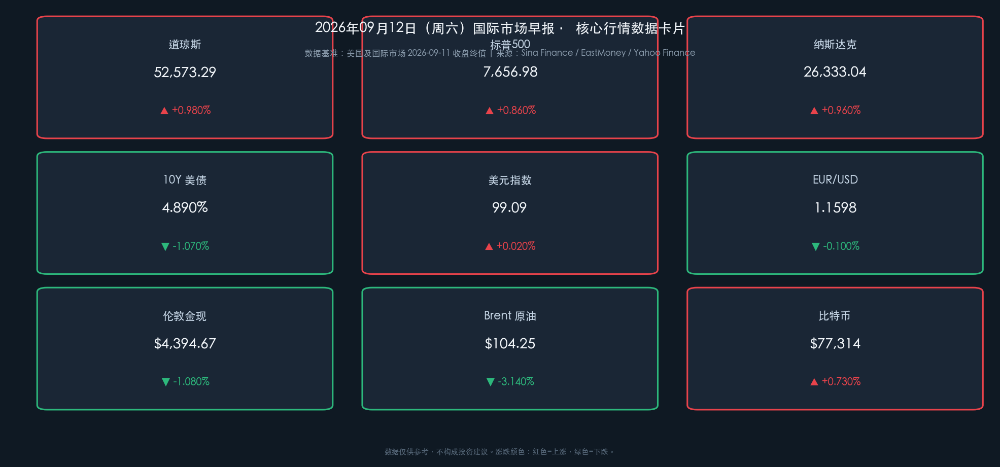

# 🌅 2026年09月12日 国际市场早报

**日期：2026年09月12日 (星期六)** &nbsp; **时段：早报（国际市场）**

> **核心摘要**：周五（9/11）美股三大指数全线反弹，道指大涨近510点（+0.98%）报52,573.29点，标普500上涨0.86%，纳指涨0.96%；原油价格自近期高位获利了结回吐，Brent原油回落至104.25美元/桶，WTI跌破100美元关口，通胀恐慌情绪阶段性降温，推动10年期美债收益率回落至4.890%。大型科技成长股迎来强劲修复，亚马逊、谷歌、苹果涨幅均超1.7%。市场焦点现已全面转向下周即将召开的9月FOMC议息会议。

---

## 核心行情复盘

### 🇺🇸 美国股市（2026-09-11 收盘）

* **道琼斯工业指数**：**52,573.29 点**，▲ +0.980%（+509.19 点）
* **标普500指数**：**7,656.98 点**，▲ +0.860%（+65.28 点）
* **纳斯达克综合指数**：**26,333.04 点**，▲ +0.960%（+251.31 点）
* **成交额**：市场交投平稳放量，科技与可选消费板块买盘踊跃
* **领涨板块**：可选消费（亚马逊 +1.94%）、信息科技（苹果 +1.75%、谷歌 +1.77%、微软 +0.65%）
* **领跌/走弱板块**：能源板块随油价深度回调而承压整理，半导体设备端英伟达微跌 -0.03%

> **核心解读**：周五美股走出强劲修复行情，一举扭转了周中因能源价格飙升引发的通胀与滞胀恐慌。油价（Brent）从前一日的107美元上方大幅回调至104美元附近，WTI更是退守99美元区间，直接给紧绷的通胀预期解压。伴随10年期美债收益率自高位回撤至4.890%，长久期科技与成长资产的贴现率压力显著缓解，多头资金迅速入场抄底大型科技龙头，推动三大指数全线收高。

### 📈 债市与汇市

* **10年期美债收益率**：**4.890%**，▼ -1.070%（自高位 4.943% 明显回落）
  * 市场对极端紧缩情景的押注适度降温，收益率曲线呈现平坦化修复
* **美元指数（DXY）**：**99.09**，▲ +0.020%（维持高位震荡整理）
* **欧元/美元（EUR/USD）**：**1.1598**，▼ -0.100%
* **在岸人民币（USD/CNY）**：**6.7114**，整体汇率保持稳健韧性

> **核心解读**：美债收益率在周五结束连续上行态势，出现技术性回吐与避险平仓，反映出通胀预期在油价回调后未进一步恶化。美元指数围绕99关口窄幅拉锯，尽管欧洲央行前期完成加息，但强势美元与全球流动性定价依然对非美货币形成结构性压制。

### 🛢️ 大宗商品

* **伦敦金现（黄金）**：**$4,394.67/盎司**，▼ -1.080%（结算价报 $4,390.00）
* **Brent 原油**：**$104.25/桶**，▼ -3.140%（自107.63高位获利回吐）
* **WTI 原油**：**$99.88/桶**，▼ -2.430%（收盘报 $99.99，失守百元大关）

> **核心解读**：大宗商品市场迎来显著分化与降温。原油在地缘溢价阶段性消化后遭遇多头获利了结，供应端恐慌情绪暂时缓解，原油重回供需博弈主线；黄金在风险偏好回暖与美元保持坚挺的压制下，从4440美元上方轻度回调至4394美元附近，但整体仍处于历史级高位震荡格局。

### 💰 加密货币

* **比特币（BTC）**：**$77,314**，▲ +0.730%
  * 围绕7.7万美元关口企稳整理，跟随纳指风险偏好回升呈现温和回暖

---

## 核心解读与市场逻辑

周五国际市场的走势生动演绎了**“通胀担忧降温 → 利率拐点预期 → 科技股估值修复”**的经典反弹闭环：

1. 🛢️ **商品降温**：地缘情绪降温促使原油高位获利盘套现，Brent回调超3%，打破了短线通胀加速失控的恐慌预期。
2. 📉 **债市喘息**：10年期美债收益率从逼近5%的关键心理关口回落至4.89%，为风险资产打开喘息窗口。
3. 🚀 **动能切换**：此前受压制最严重的超大盘科技股（Mega-cap Tech）成为反弹先锋，资金自顺周期与能源板块重新回流成长赛道。
4. ⚖️ **决战下周**：市场已将所有注意力锚定在下周（9月15-16日）的美联储FOMC议息会议，进入决议前的平静期博弈。

---

## 政策脉动

* **美联储（Fed）**：当前处于9月FOMC议息会议前的官方静默期。市场对9月16日加息25BP与按兵不动的预期呈现激烈博弈，油价的回调降低了立即激进加息的极端紧迫性，但新任管理层的政策声明与点阵图将成为决定四季度全球资产走势的绝对锚点。
* **全球央行观察**：
  * 📅 **9月15-16日**：美联储FOMC政策会议（最核心焦点）
  * 📅 **9月17日**：英国央行（BOE）及日本央行（BOJ）议息决议

---

## 最新机构观点

1. **高盛（Goldman Sachs）**：全球宏观团队指出，周五美股的反弹证明市场具备极强的抗跌韧性与逢低买入意愿。尽管通胀粘性与高利率环境构筑了估值天花板，但科技巨头稳健的自由现金流依然是穿越周期的首选配置标的。

2. **摩根大通（J.P. Morgan）**：维持防御与成长均衡配置建议。小摩认为，下周FOMC会议将是决定年内资产走向的“分水岭”；若美联储释放偏鹰信号，油价与美债仍有二次上冲动能，投资者应密切关注高利率环境下企业盈利的持续性。

3. **中金公司（CICC）**：海外策略组分析认为，油价回落有助于缓释全球滞胀交易压力，海外流动性紧缩对国内资产的外溢冲击阶段性减弱，为下周国内市场的情绪修复创造了较好的外部环境。

---

## 今日市场情绪：油价降温缓和通胀焦虑，科技股迎报复性反弹

> Prompt: A radiant mechanical phoenix crafted from glowing green circuit lines rises over a sleek futuristic cityscape, dispersing dark crimson storm clouds into crystal mist. In the background, a massive glowing balance scale hovers above the horizon, with one side holding a cooling oil barrel and the other side holding glowing semiconductor wafers.

今日市场情绪的核心关键词：**"释然反弹"**。

原油回吐涨幅如同为紧绷的市场情绪注入一剂清凉剂，打破了此前“油价暴涨-利率飙升-美股下挫”的负反馈循环。投资者在下周美联储大决战前展现出逢低买入的风险偏好，科技股重振雄风。下周开盘，市场将正式进入美联储议息的终极决战时刻。

---

*免责声明：内容仅供参考，不构成投资建议。*
