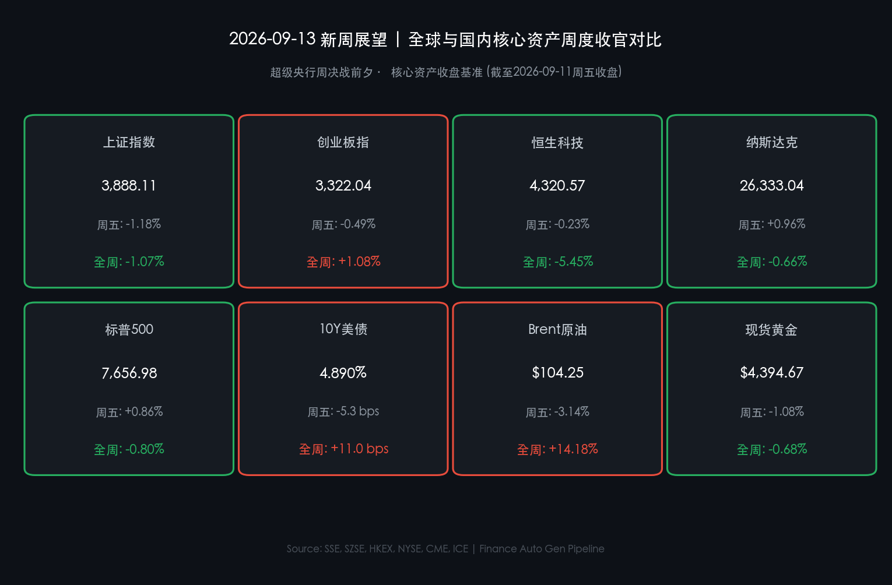

# 🔮 2026年09月13日 金融简报 · 新周展望：决战超级央行周，内需宏观与长钱定力

**日期：2026年09月13日 (星期日)** &nbsp; **时段：周日下午（新周展望）**

> **核心摘要**：全球金融市场即将迎来2026年下半年最具决定性的“超级央行周”。美联储将于9月15-16日召开FOMC议息会议，并公布最新季度经济预测（SEP）与利率点阵图；周四英国央行与日本央行紧随其后，全球流动性定价面临全面重构。国内方面，周一（9月14日）将公布8月宏观经济数据，叠加《金融强国建设“十五五”规划》长钱长投长效机制持续发酵，两市近2万亿充裕成交量为A股构筑坚实基本面与政策托底。海外油价周五大跌回吐滞胀溢价，为新一周开盘营造了宝贵的风险偏好修复窗口。

---

## 周末财经要闻终极汇总

### 一、国内重磅：金融强国细则发酵，8月宏观数据明早出炉

* **“十五五”金融强国长钱长投机制**：证监会与央行围绕《金融强国建设“十五五”规划》加快出台配套细则，重点打通保险资金、社保基金及年金基金等长期资金入市卡点，明确考核周期拉长至三年以上，夯实资本市场中长期稳健运行底座。
* **中国 8 月经济数据（9月14日周一 10:00）**：国家统计局将公布8月规模以上工业增加值、社会消费品零售总额及固定资产投资数据。市场预期工业增加值维持在 5.3% 左右平稳区间，内需消费修复成色将成为检验经济动能的关键指标。
* **产业与赛道催化**：央企兵工集团重组预期催化地面兵装板块持续领跑，同时以中际旭创、燧原科技、新易盛为代表的国产算力核心标的获机构资金持续加仓，高景气成长赛道展现极强韧性。

> **核心解读**：国内政策组合拳正在由“预期引导”转向“机制落地”。上周五两市在回调中激增超3,200亿元至1.98万亿元，表明大盘在3,880点附近具备极强的场外资金承接力，创业板指全周逆势上涨1.08%即是成长动能充沛的明证。

---

### 二、国际博弈：原油多头高位平仓，美债利率退守 4.890%

* **原油惊魂回落**：经历了霍尔木兹海峡地缘危机驱动的连续四日暴涨后，周五原油多头高位集中获利平仓。Brent单日大跌 **-3.14%** 至 $104.25/桶，WTI重挫 **-2.43%** 收于 $99.88/桶，跌破百元大关。
* **美债收益率冲高回落**：10年期美债收益率自盘中 4.94% 高位回落至 **4.890%**（单日回落逾5个基点），避免了直接冲击 5.0% 的极端紧缩情境。
* **美股科技龙头全线报复性反弹**：大型科技股长久期资产贴现压力缓解，亚马逊（+1.94%）、谷歌（+1.77%）、苹果（+1.75%）领涨，推动道指周五大涨近510点（+0.98%），纳指与标普500周跌幅分别收窄至 **-0.66%** 与 **-0.80%**。

> **核心解读**：周五油价获利了结有效打断了“油价脉冲→滞胀交易→美债狂飙→权益杀估值”的负反馈循环。原油暂别百元关口，使得美联储在9月议息会议上拥有了相对温和的决策环境，避险与加息焦虑短线降温。

---

### 三、新周核心资产收盘对比全景

| 核心资产 | 最新/周五收盘 | 单日涨跌幅 | 全周累计表现 | 核心驱动与盘面特征 |
| :--- | :--- | :--- | :--- | :--- |
| **上证指数** | **3,888.11 点** | **-1.18%** | **-1.07%** | 两市成交逼近2万亿，兵装重组与高股息托底 |
| **创业板指** | **3,322.04 点** | **-0.49%** | **+1.08%** | 算力与科技成长赛道全周逆势收红 |
| **恒生科技指数** | **4,320.57 点** | **-0.23%** | **-5.45%** | 估值已进入极度超跌区间，南向资金逆势大额加仓 |
| **纳斯达克指数** | **26,333.04 点** | **+0.96%** | **-0.66%** | 油价退潮带动AI与科技大票V型反弹 |
| **标普500指数** | **7,656.98 点** | **+0.86%** | **-0.80%** | 防御与价值蓝筹齐步回升 |
| **10Y美债收益率** | **4.890%** | **-5.3 bps** | **+11.0 bps** | 守住4.90%关口，静待FOMC点阵图定调 |
| **Brent 原油** | **$104.25/桶** | **-3.14%** | **+14.18%** | 单周仍累涨14%，地缘风险溢价高位博弈 |
| **现货黄金** | **$4,394.67/oz** | **-1.08%** | **-0.68%** | 围绕4,400美元历史高位构筑多空震荡中枢 |

---

## 新一周市场核心博弈逻辑

本周（9月14日-9月18日）进入全球资产定价的“关键交汇周”，市场交易将围绕以下三大主线展开：

### 主线一：美联储9月议息决议——点阵图与鲍威尔发布会

* **核心矛盾**：在通胀黏性与近期原油扰动的背景下，市场聚焦美联储对2026年四季度降息路径的最新点阵图预期（SEP）。
* **情景假设**：
  * **基准情境（概率60%）**：维持利率不变或实施温和防守型指引，点阵图保留年内1-2次政策空间，鲍威尔强调“数据依赖”，美债回落至4.80%下方，全球成长科技股迎来估值重估行情。
  * **鹰派情境（概率30%）**：点阵图大幅削减宽松预期，强调长端利率更高更久（Higher for Longer），美债收益率再度冲向5.0%，权益市场承压。
  * **鸽派情境（概率10%）**：超预期释放宽松信号，美元回落，黄金与非美货币迎报复性大涨。

### 主线二：中国8月宏观经济成色与“宽货币+宽信用”共振

* **内需与政策联动**：周一发布的宏观数据若展现消费与制造业投资企稳韧性，将进一步强化“基本面回升向好”共识。
* **增量资金承接**：在“十五五”规划红利释放背景下，险资、公募及外资被动配置资金有望在调整后加速进场，A股与港股的估值洼地优势显著。

### 主线三：四巫日交割效应与期权衍生品波动率放大

* **交割周波动**：周五（9月18日）为美股季度“四巫日”（Triple Witching），股票及指数期权集中到期，叠加央行周决议落地，市场资金仓位将面临剧烈再平衡，周内波动率指数（VIX）或呈现前抑后扬走势。

---

## 本周重磅经济数据与会议前瞻

| 日期 (2026年) | 关键财经事件 / 数据发布 | 影响市场与重要性评级 | 核心关注要点 |
| :--- | :--- | :--- | :--- |
| **09月14日 (周一)** | 🇨🇳 **中国 8 月规模以上工业增加值、社会消费品零售、固定资产投资** | A股 / 港股 / 大宗商品 &nbsp; ⭐⭐⭐⭐ | 评估三季度经济增长底色与内需修复节奏 |
| **09月15日 (周二)** | 🇺🇸 **美国 8 月零售销售数据 (Retail Sales)** | 全球资产 / 美元指数 &nbsp; ⭐⭐⭐⭐ | “恐怖数据”检验美国消费者支出韧性 |
| **09月15-16日** | 🇺🇸 **美联储 FOMC 利率决议 + 经济预测摘要 (SEP) + 点阵图** | 全球金融市场 &nbsp; ⭐⭐⭐⭐⭐ **(终极决战)** | 北京时间周四凌晨02:00公布决议，02:30鲍威尔发布会 |
| **09月17日 (周四)** | 🇬🇧 🇯🇵 **英国央行 (BOE) / 日本央行 (BOJ) 利率决议** | 外汇 / 欧债 / 日元套息 &nbsp; ⭐⭐⭐⭐ | 关注BOJ是否释放进一步加息信号与日元升值冲击 |
| **09月18日 (周五)** | 🇺🇸 **美股“四巫日”大交割 (Triple Witching)** | 美股 / 全球衍生品 &nbsp; ⭐⭐⭐⭐ | 期指、期权集中交割，防范尾盘剧烈脉冲波动 |

---

## 头部券商/投行开盘策略点睛

**🏦 中信证券 (CITIC Securities)**：
> **策略观点：长钱筑底，科技与红利齐飞。**  
> A股放量震荡是牛市良性换手特征，两市日均近2万亿成交提供了充沛流动性支撑。随着“十五五”金融规划引导社保与险资长钱入市，低估值红利资产提供稳固安全垫；同时在AI硬件升级与自主可控驱动下，算力、半导体及重组预期的军工板块具备持续进攻动能，建议维持“攻守兼备”的高仓位策略。

**🏦 中金公司 (CICC)**：
> **策略观点：关注宏观数据验证，港股超跌反弹空间显现。**  
> 经历上周海外地缘与油价扰动后，国内资产展现出显著抗跌韧性。港股恒生科技指数单周回撤逾5%后，估值已极具吸引力，南向资金逆势大幅买入即是先导信号。下周重点关注国内8月经济数据成色与美联储政策定调，预计A股与港股将迎来企稳反弹的窗口期。

**🏦 高盛 (Goldman Sachs)**：
> **策略观点：油价退潮释放喘息空间，聚焦FOMC点阵图结构。**  
> 周五能源价格回落打破了短线通胀恐慌，美股大型科技公司的资产负债表与盈利质量依旧处于历史巅峰。尽管美债收益率在4.89%高位徘徊，但只要美联储在本次会议上未发出激进紧缩信号，市场将迅速消化利率担忧，建议逢低增配具备高资本回报率的AI基础设施龙头与医疗板块。

**🏦 摩根大通 (J.P. Morgan)**：
> **策略观点：央行超级周需做好仓位对冲，警惕四巫日波动。**  
> 全球长端利率与能源价格仍处于高波动区间，美联储、英国央行与日本央行政策路径分化可能加剧跨市场套息资金调整。建议投资者在FOMC决议前控制杠杆水平，通过配置短债与防御性大盘价值股进行对冲，待央行决议落地后再行顺势加仓。

---

## 今日市场情绪：决战超级央行周，星河棋局谁主沉浮

> Prompt: A cosmic financial chessboard where celestial titans representing central banks face off under starry nebulae. Floating holographic gears, ticking clock dials counting down to FOMC meeting, and glowing green and red constellation lines intertwine across a grand obsidian observatory overlooking a calm digital ocean.

今日市场情绪提炼：**“棋入中盘，静待惊雷”**。

经历了一周惊心动魄的能源风暴与利率冲高测试，全球资本市场在周五晚迎来了多头的强势反攻与喘息。面对即将到来的美联储决战夜、日本英国央行协同考验以及国内重磅宏观数据的接踵而至，市场各路机构与主力资金正于棋局两端屏息以待。博弈的焦点已从短期的恐慌避险全面转向中长期的宏观定力与核心资产价值重估。

---

*免责声明：内容仅供参考，不构成投资建议。*
