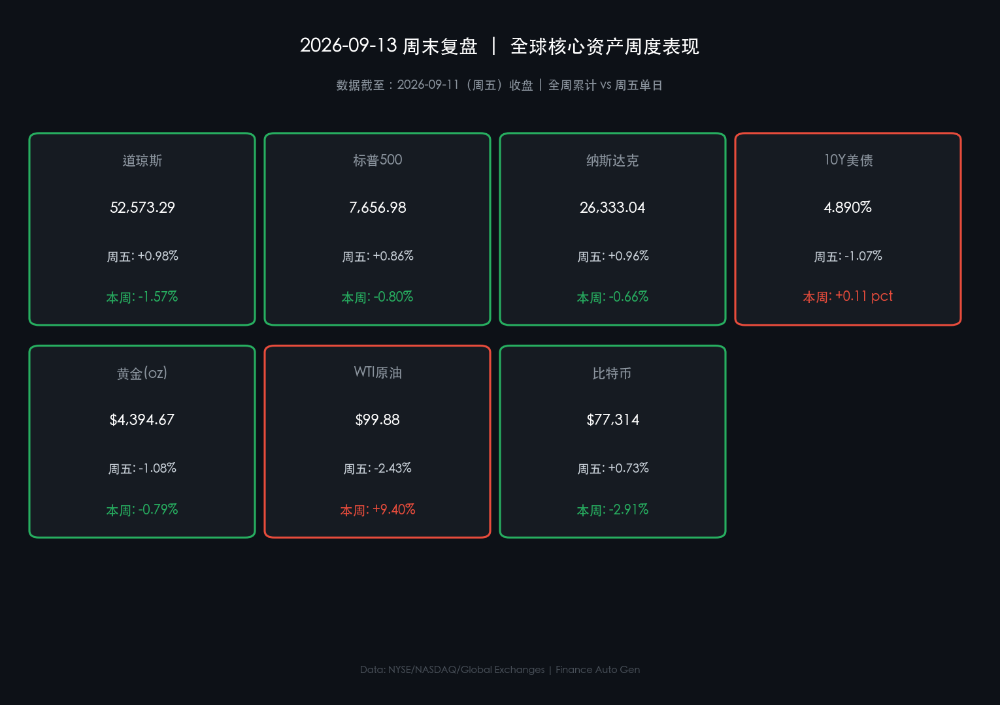

# 🌅 2026年09月13日 全球市场周报与周末复盘

**日期：2026年09月13日 (星期日)** &nbsp; **时段：早报（国际市场·周末复盘）**

> **核心摘要**：本周全球资产在能源价格暴涨与利率飙升的滞胀恐慌中经历剧烈洗牌。受霍尔木兹海峡地缘博弈升级催化，WTI原油全周累计暴涨 **+9.40%** 逼近百元大关（周五收于 $99.88/桶），带动10年期美债收益率单周上行 11 个基点至 **4.890%**。尽管周五美股科技龙头带领大盘强势反弹，但美股三大指数全周仍集体承压收跌（道指周跌 **-1.57%**，标普500周跌 **-0.80%**，纳指周跌 **-0.66%**）。**⚠️ 终极对决警示**：美联储将于9月15-16日召开FOMC议息会议，市场处于超级决战前夕的屏息博弈期。

---

## 核心资产周度/日度表现回顾

### 🇺🇸 全球主要资产价格表现（截至 2026-09-11 周五收盘）

* **标普500指数 (S&P 500)**：**7,656.98** 点 &nbsp;🔴 周五单日 **+0.86%** &nbsp;🟢 本周累计 **-0.80%**
* **纳斯达克综合指数 (NASDAQ)**：**26,333.04** 点 &nbsp;🔴 周五单日 **+0.96%** &nbsp;🟢 本周累计 **-0.66%**
* **道琼斯工业平均指数 (DJIA)**：**52,573.29** 点 &nbsp;🔴 周五单日 **+0.98%** &nbsp;🟢 本周累计 **-1.57%**
* **10年期美债收益率 (10Y US Treasury)**：**4.890%** &nbsp;🟢 周五单日 **-1.07%** &nbsp;🔴 本周累计 **+0.11 pct (+11.0 bps)**
* **现货黄金 (Gold Spot)**：**$4,394.67/oz** &nbsp;🟢 周五单日 **-1.08%** &nbsp;🟢 本周累计 **-0.79%**
* **WTI 原油 (WTI Crude)**：**$99.88/桶** &nbsp;🟢 周五单日 **-2.43%** &nbsp;🔴 本周累计 **+9.40%**
* **比特币 (Bitcoin BTC)**：**$77,314** &nbsp;🔴 周五单日 **+0.73%** &nbsp;🟢 本周累计 **-2.91%**

> **核心解读**：本周全球金融资产呈现出鲜明的“能源驱动型滞胀交易”特征。周中原油价格脉冲式飙升，Brent一度突破107美元，推升全球再通胀预期与央行紧缩风险，使得10年期美债收益率急速逼近5.0%的警戒红线，压制全球风险资产估值。所幸周五原油多头高位获利平仓，油价大幅回吐跌破100美元，美债利率随之退守4.890%，促使逢低买盘在周五大举介入大型科技成长股（亚马逊、苹果、谷歌等涨幅均超1.7%），收窄了美股全周的跌幅。

---

### 📈 核心行情数据卡片

---

## 过去 48 小时重磅事件深度复盘

> **1. 原油高位大获利回吐：通胀警报暂时解除红色预警**
> 在连续四个交易日狂飙突破107美元后，周五原油期货出现大规模获利了结，Brent单日重挫超3%至104.25美元，WTI下探至99.88美元。供应端紧张情绪阶段性缓和，直接打破了短线“油价失控-通胀飙升-央行激进加息”的恶性循环，为权益资产反弹释放了关键流动性空间。

> **2. 利率预期巨震：美债收益率自高位回撤至 4.890%**
> 伴随原油回落，10年期美债收益率在周五结束连续上攻态势，自 4.943% 高位回落至 4.890%，单周净上行幅度收窄至 11 个基点。长端贴现率压力的缓解，直接激活了超大盘科技股与成长板块的抄底资金。

> **3. 汇市与避险分化：美元维持99关口，黄金围绕4400美元拉锯**
> 美元指数全周在99.09高位保持窄幅震荡，非美货币普遍承压。现货黄金周五在风险偏好回升影响下回调至 $4,394.67/oz，全周小幅收跌 **-0.79%**，在地缘不确定性与高息资产竞争之间维持历史级高位拉锯。

---

## 下周全球宏观大事预警

| 日期 (2026年) | 关键宏观事件 / 数据发布 | 市场关注焦点与影响评估 |
| :--- | :--- | :--- |
| **09月14日 (周一)** | 🇨🇳 **中国 8 月社会消费品零售 / 规模以上工业增加值** | 评估国内经济基本面修复动能与内需韧性 |
| **09月15日-16日** | 🇺🇸 **美联储 9 月 FOMC 议息会议 (终极焦点)** | **全周绝对决战点**：利率决议、点阵图指引及鲍威尔新闻发布会定调四季度 |
| **09月17日 (周四)** | 🇬🇧 🇯🇵 **英国央行 (BOE) / 日本央行 (BOJ) 利率决议** | 全球流动性紧缩协同效应与日元套息交易动向 |
| **09月18日 (周五)** | 🇺🇸 **美股“四巫日”(Triple Witching)** | 期指、期权集中交割，市场短线波动率可能显著放大 |

---

## 顶级机构周末策略内参摘要

**🏦 高盛 (Goldman Sachs)**
> 高盛全球宏观与资产配置团队在周末研报中指出，本周美股在油价冲击下的先跌后弹展现了资产负债表的极强韧性。尽管高油价带来的二阶通胀效应不可忽视，但美股头部科技企业的强劲现金流生成能力构筑了厚实的安全垫。高盛认为，9月FOMC会议若如期传递“数据依赖而非恐慌式收紧”，大盘有望迎来跨季度的估值修复行情。

**🏦 摩根大通 (J.P. Morgan)**
> 摩根大通首席策略师维持“防守反击”的均衡配置建议。小摩强调，原油供应博弈仍具有长期不确定性，10年期美债收益率维持在4.8%以上对高杠杆小盘股仍是沉重负担。建议投资者在FOMC决议出炉前保持稳健仓位，聚焦于高股息防御板块与具备定价权的AI基础设施龙头。

**🏦 中金公司 (CICC)**
> 中金海外策略团队分析认为，随着周五海外油价回落与美股反弹，外部紧缩溢出效应最剧烈的阶段或已过去。下周海外关注美联储政策定调，国内关注8月经济运行数据出炉。在政策托底预期与估值洼地支撑下，A股与港股具备较强的独立抗波动韧性。

---

## 今日市场情绪：能源巨震后通胀预期暂歇，全市场屏息静待美联储决战

> Prompt: A monumental glowing hourglass standing in a futuristic financial forum, with black crude oil dripping from the upper bulb onto a shining gold balance scale, surrounded by hovering holographic stock charts and central bank clock dials counting down to FOMC meeting

今日市场情绪的核心关键词：**"屏息蓄势"**。

经历了一整周原油暴涨与滞胀焦虑的惊心动魄洗礼后，周五油价回落与科技股反弹为多头赢得了宝贵的喘息之机。然而，真正的终极大考即将在下周三的美联储FOMC决议揭晓。全市场交易员正处于暴风雨暂歇的备战状态，静候超级央行周的信号枪响。

---

*免责声明：内容仅供参考，不构成投资建议。*
