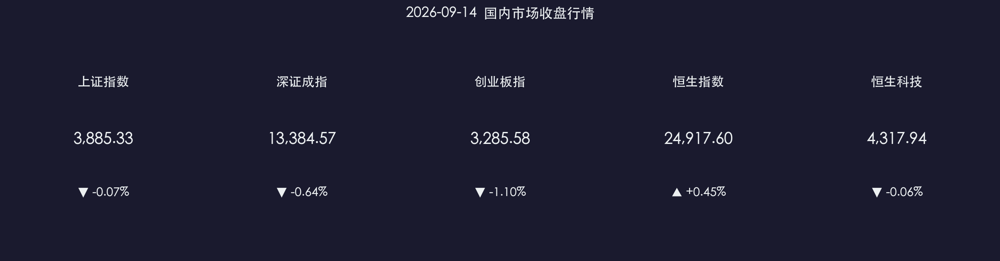

# 📉 金融市场晚报：缩量整理释压力，结构热点显韧性

**日期：2026年09月14日 (星期一)** &nbsp; **时段：收盘晚报**

> **核心摘要**：A股三大指数今日窄幅震荡整理，沪指微跌0.07%收于3885.33点，全市场超3100只个股收涨，中小盘与成长股表现出较强韧性；两市成交1.63万亿元，较上一交易日缩量约3500亿元，反映出美联储议息会议前夕市场偏防守观望心态；五部委联合重拳治理中小企业账款拖欠，本外币跨境资金池新规落地，政策护航稳健运行。

---

## 核心行情复盘

### A股三大指数

* **上证指数**：收报 **3,885.33 点**，微跌 **0.07%**（-2.78 点）
* **深证成指**：收报 **13,384.57 点**，下跌 **0.64%**（-86.69 点）
* **创业板指**：收报 **3,285.58 点**，下跌 **1.10%**（-36.46 点）
* **全市场成交额**：**16,292 亿元**，较上一交易日**缩量 3,578 亿元**（-18.0%），资金观望情绪升温
* **涨跌家数**：全市场超 **3,100 只**个股收涨，结构性赚钱效应依然活跃

**领涨板块**：培育钻石 💎、网络安全、MLCC、PCB概念、创新药/CRO 🧪、汽车零部件 🚗  
**领跌板块**：农业 🌾、地面兵装/军工 📉（获利了结）、煤炭、教育概念、AI硬件高位股

### 港股市场

* **恒生指数**：收报 **24,917.60 点**，上涨 **0.45%**（+111.97 点）
* **恒生科技指数**：收报 **4,317.94 点**，微跌 **0.06%**
* **恒生中国企业指数**：收报 **8,284.58 点**，上涨 **0.46%**

> 港股汽车与生物医药板块涨幅居前，有效支撑恒指反弹；海外科技波动导致港股AI与光通信板块小幅整理。此外，广汽集团A股因“重要事项未公告”全天临时停牌。

### 主力资金与流动性动向

* **大盘资金流向**：主力资金全天呈净流出态势，主要集中在前期涨幅较大的高位科技与军工板块
* **个股净流入前列**：药明康德、恒瑞医药、赛力斯、立讯精密、三安光电
* **中长期资金支撑**：今年以来社保、企业年金等中长期资金累计净买入A股已超 **6,000 亿元**，长钱压舱石效应显著

---

## 核心解读与市场逻辑

> **缩量分化的核心逻辑**：指数虽然小幅收跌，但全市场上涨家数明显多于下跌家数。一方面，海外市场等待本周美联储最新议息决议，避险观望情绪导致大盘权重与机构重仓标的交投清淡、量能收缩；另一方面，中小市值品种在经历前期连续调整后估值性价凸显，获游资与活跃资金回流承接。
>
> **医药与先进硬件轮动承接**：创新药及CRO板块在海外授权（License-out）和医保政策常态化预期催化下逆势走强；同时，消费电子PCB、MLCC及汽车零部件产业链受到“金九银十”排产回暖预期提振，成为承接军工与AI硬件高位获利资金的主要方向。
>
> **军工与高位算力健康回踩**：上周五大幅领涨的地面兵装及部分AI光模块标的今日出现正常技术性回吐，但板块基本面与订单景气度预期未变，属于典型的短期获利盘消化。

---

## 政策脉动

### 🏛️ 五部委重拳治理中小企业“回款难”

* **9月14日**，国务院新闻办公室举行政策例行吹风会，工信部、中国人民银行、中国证监会等五部门协同出台硬核举措：
  * **证监会**：上市公司监管司司长郭瑞明表示，将细化信披要求，督促引导上市公司压缩账期，及时支付中小企业款项，加大对逾期支付上市公司的监管约束。
  * **人民银行**：金融市场司司长曹媛媛指出，强化发债企业应付账款信披，对账款压降成效显著的企业给予债券融资绿色通道和便利支持。

### 🌐 跨国公司本外币跨境资金集中运营新规今日生效

* **2026年9月14日起**，PBOC与外汇局联合发布的跨国公司本外币跨境资金集中运营管理新规正式实施，进一步便利跨国企业全球资金调配与跨境资金结算，提升人民币跨境使用效能。

### 🏦 “十五五”金融强国规划落地深化

* 监管层持续落实长钱长投机制，有序扩大上市标准对新经济和高质量硬科技企业的包容度，构建“安全、规范、透明、开放、有活力、有韧性”的资本市场体系。

---

## 最新机构观点

> **中信证券**：建议投资者“静待外部议息落地”。美联储利率扰动已被市场充分定价，外部压力释放应被视作优质资产的逢低买点而非卖点，四季度操作空间将全面打开。配置策略上继续坚守“AI科技制造 + 高股息能化红利”的杠铃配置组合。

> **中金公司**：外部地缘与海外政策对A股的影响偏短期与阶段性，A股长期向好与稳健推进的内生逻辑未变。建议重点把握中国企业全球化（出海）、AI应用纵深落地以及创新药产业链的结构性alpha机会。

> **申万宏源**：当前市场呈现典型的“指数控盘 + 缩量磨底”格局，缩量回调有助于筹码沉淀。在震荡区间内建议保持合理仓位（5成左右），以低估值红利资产做底仓防御，逢低吸纳业绩兑现度高的细分硬科技标的。

---

## 今日市场情绪：缓流润物与等待破晓

> Prompt: A giant crystal hourglass suspended above a calm neon cityscape at dusk, glowing liquid emerald streams flowing through the glass while soft golden gears gently turn inside, representing policy-driven liquidity easing payments for small enterprises. In the background, holographic data streams and medical molecule spirals glow brightly against the evening sky.

---

*免责声明：内容仅供参考，不构成投资建议。市场有风险，投资需谨慎。*
