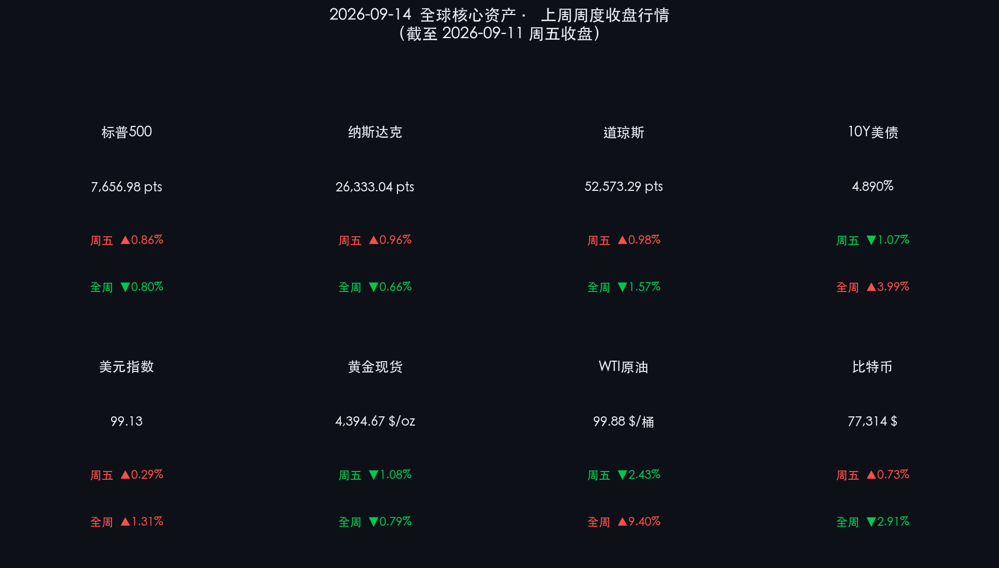

# 🌅 2026年09月14日 全球市场新周展望：决战超级央行周与宏观大考

**日期：2026年09月14日 (星期一)** &nbsp; **时段：早报（国际市场 · 模式C：新周展望）**

> **核心摘要**：新交易周拉开帷幕，全球金融市场进入年内最关键的“超级宏观周”。经历上周原油狂飙逼近百元（WTI全周涨 **+9.40%** 至 $99.88/桶）与美债收益率巨震（10Y美债收益率报 **4.890%**）的滞胀洗礼后，本周美联储（9月15-16日）、英国央行与日本央行将接踵公布最新利率决议，周五还将迎来美股“四巫日”交割。大宗商品、汇市与权益资产迎来年内最具决定性的定价窗口。

---

## 周末财经要闻终极汇总

* **1. 原油高位拉锯与供给博弈**：WTI 原油与 Brent 原油在上周触及近半年高位后出现获利盘回吐，但地缘溢价与供给紧缩预期仍将油价锚定在 $100 警戒线附近，构成全球再通胀预期的核心变量。
* **2. 美联储进入议息会议绝对静默期**：9月15-16日 FOMC 决议前夕，利率互换市场对本次会议“按兵不动或象征性加息”的预期展开激烈交锋，市场关注中点阵图对四季度及2027年的降息路径指引。
* **3. 汇市与避险格局分化**：美元指数（DXY）维持在 **99.13** 高位震荡，现货黄金报 **$4,394.67/oz**，在避险需求与美债高利率压制之间呈现历史高位震荡整理。
* **4. 比特币等加密资产窄幅蓄势**：比特币报 **$77,314**，在关键支撑位 $76,500–$78,000 区间维持换手，等待全球宏观流动性定调。

---

## 核心资产行情与数据卡片

### 📊 全球主要资产收盘与跨市场指标（截至 2026-09-11 周五收盘）

* **标普500指数 (S&P 500)**：**7,656.98** 点 &nbsp;🔴 周五单日 **+0.86%** &nbsp;🟢 全周累计 **-0.80%**
* **纳斯达克综合指数 (NASDAQ)**：**26,333.04** 点 &nbsp;🔴 周五单日 **+0.96%** &nbsp;🟢 全周累计 **-0.66%**
* **道琼斯工业平均指数 (DJIA)**：**52,573.29** 点 &nbsp;🔴 周五单日 **+0.98%** &nbsp;🟢 全周累计 **-1.57%**
* **10年期美债收益率 (10Y US Treasury)**：**4.890%** &nbsp;🟢 周五单日 **-1.07%** &nbsp;🔴 全周累计 **+0.11 pct (+11.0 bps)**
* **美元指数 (DXY)**：**99.13** &nbsp;🔴 周五单日 **+0.29%** &nbsp;🔴 全周累计 **+1.31%**
* **现货黄金 (Gold Spot)**：**$4,394.67/oz** &nbsp;🟢 周五单日 **-1.08%** &nbsp;🟢 全周累计 **-0.79%**
* **WTI 原油 (WTI Crude)**：**$99.88/桶** &nbsp;🟢 周五单日 **-2.43%** &nbsp;🔴 全周累计 **+9.40%**
* **比特币 (Bitcoin BTC)**：**$77,314** &nbsp;🔴 周五单日 **+0.73%** &nbsp;🟢 全周累计 **-2.91%**

### 📈 新周开盘核心资产行情卡片

---

## 新一周市场核心博弈逻辑

> **宏观传导逻辑**：**原油高位震荡（能源供给通胀） + 美债利率逼近5%红线（估值折现压制） → 聚焦 FOMC 决议与鲍威尔表态 → 资产分化：现金流充沛的科技龙头与高股息防御资产胜出 vs 高杠杆成长板块承压。**

### 1. 超级央行周的流动性定价
本周美联储、英国央行（BOE）、日本央行（BOJ）三大央行集中议息。在通胀粘性与经济增长动能分化背景下，全球货币政策的协同与分歧将对跨国套息交易和外汇市场产生剧烈扰动。

### 2. 利率高位运行对企业估值的再平衡
10年期美债收益率在 4.89% 附近高位盘整，实际利率维持在历史高位，使得权益市场的风险溢价（ERP）处于极度收紧状态。美股大盘对盈利兑现度的敏感性显著上升。

### 3. “四巫日”交割的波动率放大效应
周五（9月18日）为美股季度性“四巫日”（Triple/Quadruple Witching），指数与个股衍生品集中到期交割，叠加央行决议后各机构仓位重置，下半周市场双向波动率可能显著上升。

---

## 本周重磅经济数据与会议前瞻

| 日期 (2026年) | 关键宏观事件 / 数据发布 | 市场关注焦点与影响评估 |
| :--- | :--- | :--- |
| **09月14日 (周一)** | 🇨🇳 **中国 8 月社会消费品零售 / 规模以上工业增加值** | 评估国内经济基本面修复动能与内需韧性 |
| **09月15日-16日** | 🇺🇸 **美联储 9 月 FOMC 议息会议 (终极焦点)** | **全周绝对决战点**：利率决议、点阵图指引及鲍威尔新闻发布会定调四季度 |
| **09月17日 (周四)** | 🇬🇧 🇯🇵 **英国央行 (BOE) / 日本央行 (BOJ) 利率决议** | 全球流动性紧缩协同效应与日元套息交易动向 |
| **09月18日 (周五)** | 🇺🇸 **美股“四巫日”(Triple Witching)** | 期指、期权集中交割，市场短线波动率可能显著放大 |

---

## 头部券商/投行开盘策略点睛

**🏦 高盛 (Goldman Sachs)**
> 高盛全球宏观团队认为，经历上周油价脉冲后的资产重估，美股大盘科技龙头展现了强韧的资产负债表防御力。在9月FOMC决议出炉前，建议采取“核心+卫星”配置：以高现金流的头部AI与云服务巨头为底仓，同时通过能源和短久期债券对冲通胀与利率尾部风险。

**🏦 摩根大通 (J.P. Morgan)**
> 摩根大通首席策略师指出，本周三大央行会议与四巫日交割重叠，市场流动性面临阶段性考验。建议投资者在决议落地前保持相对中性的风险敞口，重点关注估值合理、自由现金流收益率高的高股息蓝筹标的。

**🏦 中金公司 (CICC)**
> 中金海外策略团队分析指出，海外高利率与高油价的溢出冲击已在市场预期中充分计提。随着中国宏观稳增长政策持续发力，A股与港股具备较低的估值分位数与独立的流动性周期，在外部波动加剧期具备显著的避险与配置价值。

---

## 今日市场情绪：大潮涌动蓄势待发，灯塔引航迎战超级央行周

> Prompt: A monumental glowing golden lighthouse standing tall amidst swirling emerald waves of data and digital code, casting a brilliant beam across a calm ocean of candlesticks towards the sunrise of a new trading week, cinematic atmosphere

今日市场情绪的核心关键词：**"蓄势待发"**。

新周伊始，在经历上一周大宗商品与长端利率的暴风雨后，全球市场在周一早盘呈现出高度专注与审慎克制的蓄力状态。超级央行周的决战号角即将吹响，投资者正在静待政策迷雾散去后的明朗指引。

---

*免责声明：内容仅供参考，不构成投资建议。*
