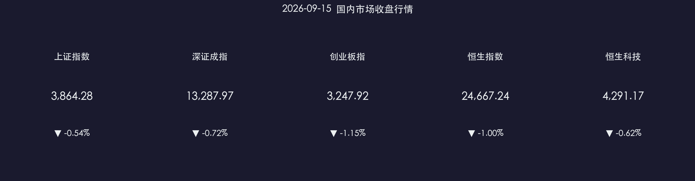

# 📉 金融市场晚报：缩量震荡蓄势，硬科技与重组逻辑领衔

**日期：2026年09月15日 (星期二)** &nbsp; **时段：收盘晚报**

> **核心摘要**：A股三大指数今日缩量震荡调整，沪指跌0.54%报3864.28点，创业板指跌1.15%；全市场成交额1.62万亿元，资金观望氛围浓厚；盘面呈现“科技硬件活跃、大消费低迷”的结构特征，风电、存储芯片及半导体设备逆势走强；证券行业重磅并购启动，中金公司换股合并东兴证券、信达证券停牌推进，电子信息制造业“十五五”规划出台护航硬科技创新。

---

## 核心行情复盘

### A股三大指数

* **上证指数**：收报 **3,864.28 点**，下跌 **0.54%**（-21.05 点）
* **深证成指**：收报 **13,287.97 点**，下跌 **0.72%**（-96.60 点）
* **创业板指**：收报 **3,247.92 点**，下跌 **1.15%**（-37.66 点）
* **全市场成交额**：**16,253 亿元**，较上一交易日**微幅缩量 39 亿元**（-0.24%），交投维持防守谨慎节奏
* **盘面特征**：指数虽调整，但硬科技细分赛道韧性凸显，涨跌分化明显

**领涨板块**：风电设备 💨、半导体/存储芯片 💾、半导体设备 🔬、网络安全 🛡️、PCB概念 🔌  
**领跌板块**：旅游酒店 🏨、零售商业 🛍️、种植业与林业 🌾、煤炭开采 ⛏️、高位消费股

### 港股市场

* **恒生指数**：收报 **24,667.24 点**，下跌 **1.00%**（-250.36 点）
* **恒生科技指数**：收报 **4,291.17 点**，下跌 **0.62%**（-26.77 点）

> 港股受外围加息预期与风险偏好扰动震荡回落，汽车及黄金板块表现承压；但硬科技细分领域相对抗跌，广汽集团H股在重组消息催化下盘中一度大幅冲高逾15%。

### 主力资金与流动性动向

* **板块资金轮动**：资金从高估值消费与顺周期传统资源品撤出，流向具备订单兑现度的芯片设备、存储链及新能源装备。
* **个股活跃前列**：北方华创、中微公司、兆易创新、金风科技、沪电股份等硬科技龙头获活跃资金净买入。

---

## 核心解读与市场逻辑

> **缩量分化的核心逻辑**：市场在美联储议息会议临近前维持弱平衡震荡格局。一方面，海外宏观利率路径存在不确定性，大盘蓝筹与白马权重资金偏防守观望；另一方面，国内产业基本面预期明确的细分硬科技方向得到增量筹码持续深耕。
>
> **存储芯片与半导体设备共振崛起**：全球存储芯片价格周期上涨信号确立，产业链盈利拐点清晰；叠加国内半导体设备厂商自主化进程加速与扩产招标推进，芯片设计与设备板块走出“量价齐升”的独立进攻行情。
>
> **券商巨头重组释放供给侧优化信号**：头部券商三合一重组落地，推动行业资源集约化与资本实力提升，为资本市场中长期平稳健康发展奠定制度与机构基础。

---

## 政策脉动

### 🏛️ 头部券商“三合一”吸收合并重组停牌落地

* **9月15日起**，中金公司换股吸收合并东兴证券、信达证券正式进入停牌程序，东兴证券与信达证券将终止上市。这是国内证券业近年来最大规模的整合之一，旨在打造具备国际竞争力的航母级券商，提升金融服务实体经济能力。

### 💻 两部门印发《电子信息制造业发展“十五五”规划》

* **工业和信息化部、国家发展改革委**联合印发《电子信息制造业发展“十五五”规划》，明确提出：
  * 加快提升新型电池（固态电池、钠离子电池等）全产业链创新能力；
  * 加大对人工智能芯片设计、先进存储架构及关键制造装备的攻关支持，构建自主可控的现代电子产业生态。

### 🛋️ 八部门联手出台《促进智能家居消费行动方案》

* **商务部等八部门**联合发布促进智能家居消费新举措，通过标准化建设、数字家庭联动与消费补贴，激活万亿级智能消费市场潜力。

---

## 最新机构观点

> **中金公司**：短期外部利率与地缘扰动放大了全球风险资产的阶段性波动，海外不确定性仍待消化。但对A股市场中期走势不必过度悲观，国内政策托底有力、高质量发展主线清晰，前期长期稳进趋势有望延续。
>
> **中信证券**：8月金融数据中信贷融资结构的积极转换淡化了总量的信号意义，后续货币政策将更多依托价格型调控与结构性精准支持。在产业配置上，坚定看好半导体核心设备放量、光通信高景气度延续以及有色金属细分赛道的估值修复机会。
>
> **国金证券**：国内芯片设计与半导体设备行业正迈入“订单景气+自主可控”的双轮驱动周期，产业链业绩兑现确定性高，逢低布局具备技术壁垒与份额扩张能力的头部企业。

---

## 今日市场情绪：科技筑基与聚变新生

> Prompt: A colossal glowing crystal prism standing tall amid rotating wind turbine silhouettes and floating luminous semiconductor circuit boards, golden light beams converging into the core crystal against a twilight cityscape

---

*免责声明：内容仅供参考，不构成投资建议。市场有风险，投资需谨慎。*
