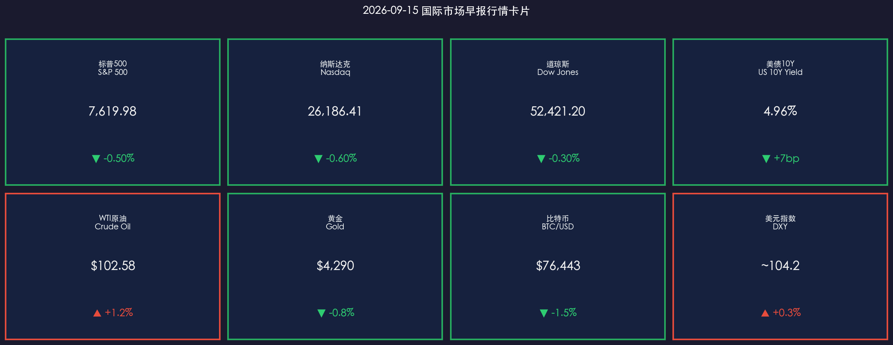

# 🌐 2026年9月15日 国际市场早报

**日期：2026年09月15日 (星期二)** &nbsp; **时段：早报（国际市场）**

> **核心摘要**：美国8月核心CPI超预期（环比+0.3%），叠加原油突破100美元/桶，市场抢在本周FOMC会议（9/15-16）前大幅调仓——美股三大指数全线下跌，10年期美债收益率盘中触及5%关键位，比特币同步走软。高盛、摩根士丹利、摩根大通一致预期本次加息25bp，全球风险资产进入"避险模式"。

---

## 核心行情复盘

### 🇺🇸 美国股市（9月14日收盘）

* **S&P 500**：**7,619.98**，**▼ -0.50%**
* **纳斯达克综合指数**：**26,186.41**，**▼ -0.60%**（科技股跌幅最深）
* **道琼斯工业平均指数**：**52,421.20**，**▼ -0.30%**

> **核心解读**：科技股领跌反映了高利率环境对高估值成长股的持续压制。当天成交量较前日明显放大，市场呈现出明确的"抢在FOMC前降低风险敞口"特征。能源股因油价上涨逆势上扬，成为当日唯一绿色板块。

**领涨/领跌板块分析：**
* **领涨**：能源板块（受WTI突破$100支撑）、部分防御类消费股
* **领跌**：科技板块（Nasdaq权重股普跌）、房地产（高利率冲击）、公用事业

---

### 📈 美国国债市场

* **10年期美债收益率**：收盘 **4.96%**，盘中最高触及 **5.00%**（**▼ 债价下跌 / ▲ 收益率+7bp**）

> **核心解读**：10年期美债收益率冲击5%是本日最重要的技术信号。5%的整数关口不仅是心理阻力位，更是"高利率时代常态化"叙事的关键验证点。这一利率水平将直接压低股票风险溢价，意味着无风险收益率已足以与股市竞争。驱动因素：8月核心CPI环比+0.3%超预期（事件）→ 市场重新定价加息预期（逻辑）→ 债券遭抛售，收益率飙升（数据）。

---

### 🛢️ 大宗商品

* **WTI原油**：**$102.58/桶**，**▲ +1.2%**
* **黄金**：**$4,290/盎司**，**▼ -0.8%**

> **核心解读**：原油突破$100是本轮"再通胀"叙事最具形象的体现，其背后是中东地缘局势紧张带来的供应担忧与OPEC减产协议的双重支撑。黄金承压下跌则体现了美元走强（DXY ~104.2）和实际利率上升的双重打压——当名义利率高达5%时，黄金的"零收益"属性相对吸引力下降。

---

### 💰 外汇与加密货币

* **美元指数（DXY）**：约 **104.2**，**▲ +0.3%**
* **比特币（BTC/USD）**：**$76,443**，**▼ -1.5%**

> **核心解读**：美元走强符合"加息预期→资金回流美元资产"的经典逻辑。比特币与美股同步走软，显示出加密市场与宏观流动性的高度相关性在本轮周期中依然显著——这与2022年的模式如出一辙。

---

## 核心解读与市场逻辑

**主逻辑链：通胀韧性 → 加息预期升温 → 利率上行 → 风险资产承压**

1. **通胀数据点火**：8月CPI数据（headline 3.4% YoY，core环比+0.3%超预期）是本轮市场调整的触发器。核心通胀超预期意味着此前市场押注的"顺利通缩"叙事出现裂缝。

2. **能源通胀卷土重来**：WTI突破$100，使PPI承压，同时压缩企业利润率。中东地缘风险的能源溢价已从"尾部风险"演变为"基准情景"。

3. **利率与估值的再定价**：10Y美债收益率触及5%意味着股票风险溢价（ERP）被进一步压缩。当前S&P 500隐含收益率（E/P）约 **1.31%**，相比美债无风险收益率5%，股票相对价值显著弱化。

4. **FOMC前瞻（9/15-16）**：本周会议将是今年最具分水岭意义的政策节点——是加25bp（主流预期）还是按兵不动？"点阵图"和主席沃什的措辞将主导未来一个月的市场方向。

---

## 政策脉动

| 机构 | 最新动向 |
|------|---------|
| **美联储（Fed）** | FOMC 9/15-16召开，市场定价**加息25bp概率>80%**（当前利率3.5-3.75% → 3.75-4.0%）；"点阵图"和SEP是最大变量 |
| **美国财政部** | 近期国债供给放量加剧债市抛压，期限溢价扩大 |
| **OPEC+** | 维持减产协议，沙特与俄罗斯坚持挺价策略，原油供应偏紧格局短期难逆转 |

> **政策核心矛盾**：Fed面临"通胀未死、经济韧性"的两难困境——若现在停止加息，通胀可能反弹；若继续加息，叠加高油价的双重冲击，经济硬着陆风险上升。本周点阵图是否显示"更高更久（higher for longer）"将是本次会议最大看点。

---

## 最新机构观点

**1. 高盛（Goldman Sachs）**
> "我们维持9月加息25bp的预测。尽管我们仍预计2027年将开始降息，但时间将晚于此前模型预测。油价突破$100所带来的通胀二阶效应，以及劳动力市场的持续韧性，为委员会提供了进一步收紧的空间。AI基础设施投资依然是我们长期看好权益市场的核心锚点。"

**2. 摩根士丹利（Morgan Stanley）**
> 策略师Mike Wilson警告称：**"我们预期未来30天内市场面临修正风险。"** 若油价持续高企，将抽干系统流动性，即便三季度企业盈利表现稳健，也难以阻止市场在FOMC前后的波动率放大。摩根士丹利同时预期9月和12月各加息一次。

**3. 摩根大通（J.P. Morgan）**
> 将长期中性利率估计上调至3.25%，认为"持续通缩的假设已经动摇"。在权益层面，JPM依然建议战略性持有，注重选股质量和盈利确定性。提醒投资者关注"利率锁定效应"对消费和房地产的滞后冲击。

---

## 今日市场情绪：恐惧与博弈

> Prompt: A colossal golden hourglass stands at the center of Wall Street, but instead of sand, viscous black crude oil pours through, each drop morphing into rising red treasury yield numbers. Below, a lone human trader (real person) in a suit struggles to hold up the tipping scales of justice. In the background, the Federal Reserve building glows ominously with a digital display reading '5.00%', while storm clouds of red candlestick bars gather overhead.

---

> 免责声明：内容仅供参考，不构成投资建议。市场有风险，投资需谨慎。
