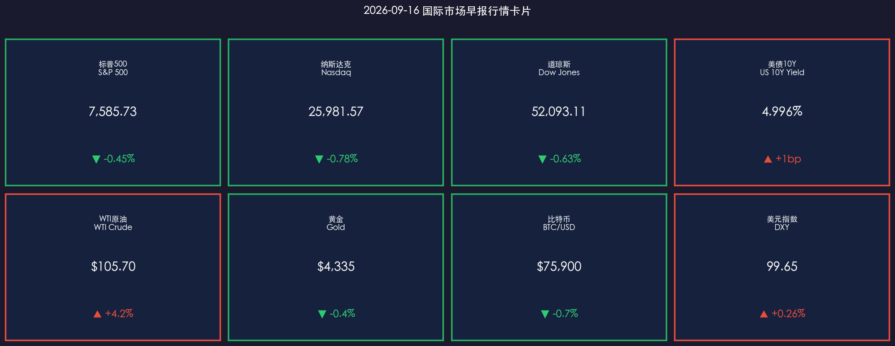
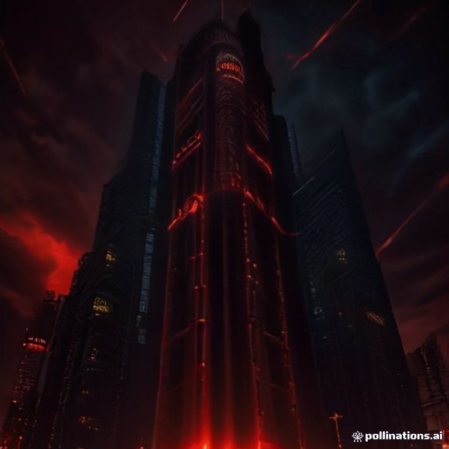

# 🌐 2026年9月16日 国际市场早报

**日期：2026年09月16日 (星期三)** &nbsp; **时段：早报（国际市场）**

> **核心摘要**：FOMC 9月15-16日会议首日，市场进入"决战议息夜"前的避险模式——美股三大指数七个交易日内第六次收跌，10年期美债收益率盘中触及5.04%（2007年以来最高），WTI原油因沙特东西输油管道关闭及胡塞武装新一轮袭击大涨4.2%至$105.70。CME FedWatch显示周三加息25bp概率高达95%，高盛、摩根大通、摩根士丹利一致转向预期加息，这将是美联储主席沃什上任后的首次加息。

---

## 核心行情复盘

### 🇺🇸 美国股市（9月15日收盘）

* **S&P 500**：**7,585.73**，**▼ -0.45%**（-34.25点，连续第二日收跌）
* **纳斯达克综合指数**：**25,981.57**，**▼ -0.78%**（科技股领跌）
* **道琼斯工业平均指数**：**52,093.11**，**▼ -0.63%**（-328.09点）
* **罗素2000**：**2,870.29**，**▼ -0.76%**；**VIX恐慌指数**：**17.20**，**▲ +0.58%**

> **核心解读**：三大指数录得七个交易日内的第六次下跌，呈现典型的"决议前避险调仓"特征。S&P 500全天走势疲软：开盘于7,601附近，盘初冲高至7,612后一路走低，午后最低触及7,576，尾盘小幅修复。盘面上，Magnificent Seven ETF（MAGS）下跌0.7%；半导体板块（SOXX）在前一日因AI安全警告暴跌5.5%后小幅企稳反弹。加密概念股遭重创——Robinhood、Strategy、Coinbase、Circle跌幅在3.5%至11%之间，因参议院对《Clarity Act》加密法案的程序性投票未能过关。

**领涨/领跌板块分析：**
* **领涨**：能源板块（XLE **▲ +2.17%**，唯一明确收涨的板块，EOG、康菲石油领涨）、原材料（XLB +0.48%）
* **领跌**：非必需消费品（XLY **▼ -1.75%**）、公用事业（XLU -1.20%）、通信服务（XLC -0.90%）；科技（XLK -0.29%）相对抗跌，医疗保健（XLV -0.05%）基本持平

**个股焦点：**
* **Skyworks Solutions（SWKS）▲ +13.55%** 至$90.00：CEO在投资者会议上确认与Qorvo的220亿美元合并已进入最终阶段，仅剩两个监管辖区待批；**Qorvo（QRVO）▲ +9.34%**
* **Enova International（ENVA）▼ -23.43%**：宣布撤回收购Grasshopper Bancorp的监管申请，称监管标准不清晰
* **Dave & Buster's（PLAY）▼ -19%**：二季度意外录得调整后亏损27美分（预期盈利22美分），营收$544.1M不及预期
* **Axon Enterprise（AXON）▼ -8%**：宣布发行10亿美元零息可转债，领跌S&P 500与纳指100
* **Revvity（RVTY）▲ +8%**：高管在Baird医疗会议上透露订单积压为数年来最强

---

### 📈 美国国债市场

* **10年期美债收益率**：收盘 **4.996%**（**▲ 收益率约+1bp**），盘中最高触及 **5.04%**，为**2007年以来最高水平**

> **核心解读**：10年期收益率盘中历史性站上5%大关后小幅回落收于4.996%，"高利率时代常态化"叙事得到关键验证。驱动链条：8月核心CPI环比+0.3%超预期（事件）→ 加息预期重新定价（逻辑）→ 债市遭抛售、收益率飙升（数据）。5%的无风险收益率已足以与股市竞争——当前S&P 500隐含盈利收益率（E/P）远低于此水平，股票风险溢价被严重压缩。长端抛压还叠加了财政部发债供给放量带来的期限溢价走阔。

---

### 🛢️ 大宗商品

* **WTI原油**：**$105.70/桶**，**▲ +4.2%**
* **布伦特原油**：**$108.55/桶**，**▲ +2.7%**
* **黄金期货**：**$4,335/盎司**，**▼ -0.4%**

> **核心解读**：油价大涨的直接导火索是中东局势骤然升级——据报道，伊朗支持的也门胡塞武装对沙特阿拉伯发动新一轮袭击，而沙特此前已因无人机袭击威胁关闭了绕过霍尔木兹海峡的东西输油管道（East-West Pipeline）。供应端的实质受损使能源溢价从"尾部风险"演变为"基准情景"。黄金则在美元走强与实际利率攀升的双重压制下小幅回落——当名义收益率高达5%时，黄金的"零收益"属性相对吸引力下降，但地缘避险需求限制了其跌幅。

---

### 💰 外汇与加密货币

* **美元指数（DXY）**：**99.65**，**▲ +0.26%**
* **比特币（BTC/USD）**：跌破 **$75,900**，**▼ 约-0.7%**（盘中最低触及$75,000，隔夜高点曾超$79,500）

> **核心解读**：美元走强符合"加息预期→资金回流美元资产"的经典逻辑。比特币当日的下跌有双重驱动：宏观层面跟随风险资产在决议前避险；事件层面则是参议院对《数字资产市场清晰法案》（Clarity Act）的终止辩论动议（cloture）投票未能获得所需的60票，法案未能推进至全院表决——尽管"重新审议动议"获得通过，为法案保留了生机，但市场担忧其可能被搁置至2026年之后。币价在投票结果公布后一度急挫至$75,000，随后收复部分失地。加密概念股同步重挫，Circle（CRCL）大跌11.41%至$86.30，有消息称ARK Invest在投票前减持。

---

## 核心解读与市场逻辑

**主逻辑链：中东供应冲击 → 油价飙升加剧通胀粘性 → 加息预期锁定 → 收益率破5%压制风险资产**

1. **地缘供给冲击实体化**：沙特东西输油管道关闭+胡塞武装新袭击，使本轮油价上涨从"风险溢价"升级为"实质供应受损"。WTI单日+4.2%的涨幅是市场对供应中断风险的直接定价，能源板块（XLE +2.17%）成为全场唯一绿意。

2. **通胀韧性锁死政策空间**：8月核心CPI环比+0.3%超预期，叠加油价重返$105上方，"顺利通缩"叙事彻底破裂。值得注意的是，实际薪资自2月以来已累计下降0.7%，通胀正在跑赢工资增长——消费引擎（占GDP约68%）面临侵蚀，这正是"滞胀"风险的雏形。

3. **AI板块的情绪裂缝**：Anthropic CEO Dario Amodei发表的AI安全文章在业内广泛传播，叠加前一日多家AI巨头安全警告引发的半导体抛售（SOXX -5.5%、DRAM -7%），市场对AI叙事的态度从"单边狂热"转向"审慎定价"，尽管板块当日小幅企稳。

4. **议息夜博弈焦点转移**：市场已基本消化"周三加息25bp"（概率95%），真正的变量在于**点阵图**——这是"一次性加息（one-and-done）"还是"加息周期的重启"？若点阵图暗示12月再加一次（大摩已如此预期），收益率与波动率将进一步上行。美联储主席沃什的发布会措辞将主导未来一个月的资产定价。

---

## 政策脉动

| 机构 | 最新动向 |
|------|---------|
| **美联储（Fed）** | FOMC决议将于美东时间周三14:00公布，市场定价**加息25bp概率95%**（3.50-3.75% → 3.75-4.00%），这将是**2023年以来首次加息**、沃什就任主席后的首次加息；同步发布最新SEP与点阵图。路透调查101位经济学家中85%预期加息 |
| **美国财政部** | 国债供给维持高位放量，期限溢价持续走阔，加剧长端收益率上行压力 |
| **美国参议院** | 《Clarity Act》加密监管法案终止辩论投票未达60票门槛，未能推进全院表决；但重新审议动议通过，法案仍保留谈判窗口 |
| **中东 / OPEC+** | 沙特东西输油管道因无人机袭击威胁关闭；胡塞武装对沙特发动新一轮打击，供应偏紧格局短期难逆转 |

> **政策核心矛盾**：沃什领导下的美联储面临"通胀未死、供给冲击外生"的两难——加息无法打通输油管道，也无法消除关税影响，但不加息则通胀预期可能彻底失锚。有分析人士质疑货币政策对供给型通胀的有效性，但债券市场已用收益率投票：联储必须行动。周三的点阵图是否显示"更高更久"，将是本次决议最大的市场分水岭。

---

## 最新机构观点

**1. 高盛（Goldman Sachs）**
> 在8月核心CPI超预期后转向鹰派，预期本次会议加息25bp。高盛认为油价突破$100带来的通胀二阶效应与劳动力市场韧性，为委员会提供了进一步收紧的空间；同时维持AI基础设施投资是长期看好权益市场核心锚点的判断。（据路透社9月13日报道）

**2. 摩根士丹利（Morgan Stanley）**
> 全球宏观策略主管Matt Hornbach明确预期9月FOMC加息25bp，并进一步预计**12月将再加息25bp**——是主流投行中最鹰派的路径预测。此前策略师Mike Wilson已警告未来30天市场面临修正风险，高油价将抽干系统流动性。（据路透社9月15日报道）

**3. 摩根大通（J.P. Morgan）**
> 与高盛同日转向预期9月加息25bp，旗下Morgan Wealth Management指出"对通胀信心的门槛已显著提高"。JPM此前已将长期中性利率估计上调至3.25%，认为"持续通缩的假设已经动摇"，权益层面建议战略性持有、注重选股质量与盈利确定性。

---

## 今日市场情绪：决战议息夜

> Prompt: A colossal mechanical clock tower towering over Wall Street with glowing red gears, where thick crude oil flows through intricate copper pipes instead of lubricants, as the dial ticks relentlessly toward the Federal Reserve rate decision. In the background, dark stormy skies flash with crimson lightning shaped like candlestick charts, and digital displays flicker with 5.02 percent yields across towering skyscrapers.

---

> 免责声明：内容仅供参考，不构成投资建议。市场有风险，投资需谨慎。
