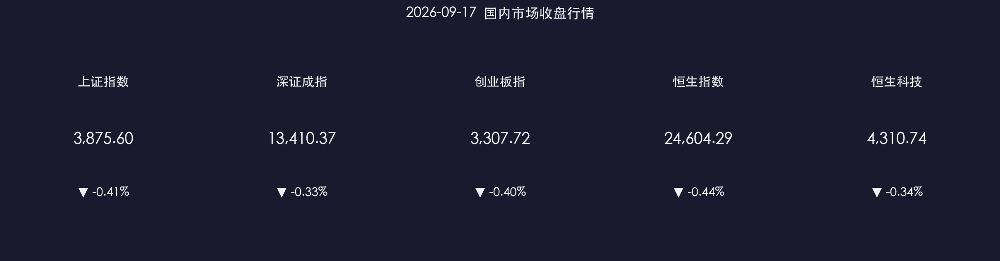

# 📉 金融市场晚报：靴子落地缩量蓄势，农业与先进制造逆势闪耀

**日期：2026年09月17日 (星期四)** &nbsp; **时段：收盘晚报**

> **核心摘要**：北京时间今日凌晨美联储加息25个基点“靴子落地”，A股三大指数全天缩量窄幅震荡整理，沪指跌0.41%报3875.60点，创业板指跌0.40%；全市场成交额1.84万亿元，缩量160亿元，呈现良性防御蓄势特征；受极端气候与《全国种植业发展“十五五”规划》出台双重提振，农业种业股掀涨停潮，全国先进制造业大会召开助推AI+制造与汽车整车板块走强；黄金与有色等周期板块承压回调。

---

## 核心行情复盘

### A股三大指数

* **上证指数**：收报 **3,875.60 点**，下跌 **0.41%**（-15.97 点）
* **深证成指**：收报 **13,410.37 点**，下跌 **0.33%**（-44.40 点）
* **创业板指**：收报 **3,307.72 点**，下跌 **0.40%**（-13.28 点）
* **科创50指数**：收报 **1,024.15 点**，下跌 **0.61%**
* **全市场成交额**：**18,365 亿元**，较上一交易日**缩量 160 亿元**（-0.86%），资金整体以观望消化外围加息信号为主
* **市场涨跌分布**：全市场上涨个股约 **2,500 余只**，下跌个股约 **2,700 余只**，指数虽绿但个股未现恐慌抛盘，结构性赚钱效应仍在

**领涨板块**：粮食概念/种业 🌾、农林牧渔 🚜、汽车整车 🚗、CRO/创新药 💊、教育及互联网电商 📱  
**领跌板块**：贵金属/黄金 📉、有色金属 ⛏️、稀土永磁 🧲、元件 🔌、油气开采与服务 🛢️

### 港股市场

* **恒生指数**：收报 **24,604.29 点**，下跌 **0.44%**（-109.49 点）
* **恒生科技指数**：收报 **4,310.74 点**，下跌 **0.34%**（-14.71 点）

> 港股受外围加息落地与美元流动性微调影响震荡回撤，资源品及贵金属权重走弱拖累大盘；但科技板块与内需消费具备一定抗跌韧性，跌幅显著收窄。

### 主力资金与流动性动向

* **板块资金轮动**：资金从前期获利丰厚的黄金、有色及周期开采板块大幅撤出，部分回流低估值防御属性的农业种业、医药CRO以及汽车制造细分龙头。
* **个股活跃前列**：敦煌种业、万向德农、金健米业触及涨停，比亚迪、药明康德、中际旭创等蓝筹成长股获主力资金净申购维稳。

---

## 核心解读与市场逻辑

> **美联储加息“靴子落地”，外围扰动脱钩进行时**：北京时间9月17日凌晨，美联储宣布上调联邦基金利率目标区间25个基点至3.75%—4.00%。由于市场对本次加息已有充分定价，且普遍定性为一次性或预防式调整，全球权益资产并未出现流动性挤兑。A股在短线承压后迅速企稳，显示出国内流动性独立性与基本面韧性正推动A股与海外利率周期逐步“脱钩”。
>
> **农业安全政策与气候共振，种业爆发**：极端气候催化农产品涨价预期，叠加农业农村部《全国种植业发展“十五五”规划》落地，强化“粮食安全+种业振兴”战略支撑，资金快速集聚农业板块掀起涨停潮。
>
> **先进制造与AI+成为产业主引擎**：全国先进制造业大会部署“人工智能+制造”纵深行动，汽车智能化与高端工业母机迎政策红利，为实体经济与资本市场提供坚实底座。

---

## 政策脉动

### 🌾 农业农村部印发《全国种植业发展“十五五”规划》

* 明确提出要全方位夯实粮食安全根基，提升粮食和重要农产品综合生产能力，加大生物育种、现代农机装备自主研发力度，构建“安全+成长”双轮驱动的现代种植产业体系。

### 🏭 全国先进制造业大会在京召开

* 会议强调深入实施智能制造工程，纵深开展“人工智能+制造”行动，推动先进制造业与现代服务业深度融合，打造若干具有国际竞争力的世界级先进制造业集群。

### 🌐 美联储公布最新利率决议

* 美联储宣布将联邦基金利率目标区间上调25个基点至3.75%—4.00%，鲍威尔表示政策利率处于中性区间上方，后续将依据通胀与就业数据审慎决策，市场普遍预期年内激进加息概率极低。

---

## 最新机构观点

> **中金公司**：美联储本次预防式加息基本符合市场前期预期，海外利率对A股估值的边际压制已处于尾声。随着国内稳增长政策持续加码、产业升级红利释放，中国资产具备独特的安全边际与基本面支撑，建议沿高景气科技与政策驱动的内需主线逢低布局。
>
> **中信建投**：外部流动性扰动告一段落，市场正在经历从“预期博弈”到“三季报业绩验证”的切换期。近期指数回调提供较好配置窗口，看好智能制造、创新药以及农业安全等具备业绩确定性的细分方向。
>
> **华泰证券**：短期周期资源品迎来健康洗盘，中长期资本开支逻辑未变；同时，“人工智能+”在制造业端的落地场景正在快速铺开，硬科技与高端装备依然是贯穿全年的核心阿尔法来源。

---

## 今日市场情绪：风浪静伫与生机破晓

> Prompt: A resilient golden grain stalk and glowing green seedlings standing firm on an ancient stone terrace overlooking stormy oceanic waves and misty mountains, morning sunlight breaking through dark clouds

---

*免责声明：内容仅供参考，不构成投资建议。市场有风险，投资需谨慎。*
