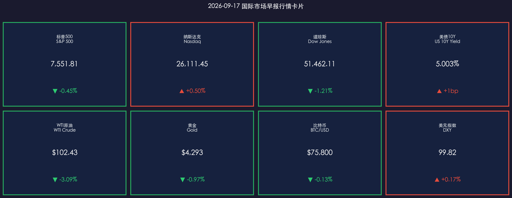

# 🌐 2026年9月17日 国际市场早报

**日期：2026年09月17日 (星期四)** &nbsp; **时段：早报（国际市场）**

> **核心摘要**：美东时间9月16日，美联储FOMC以12-0全票决定加息25个基点至3.75%-4.00%，迎来2023年7月以来的首次加息，也是新任主席凯文·沃什（Kevin Warsh）任内的首度加息。最新点阵图显示绝大多数官员预计年内将再加息一次，沃什在发布会上直言“通胀过高且持续过久”。受鹰派决议与点阵图冲击，道指重挫逾630点（-1.21%），标普500跌0.45%，10年期美债收益率再度稳固在5.00%关键关口，美元走强施压大宗商品与加密资产。

---

## 核心行情复盘

### 🇺🇸 美国股市（9月16日收盘）

* **S&P 500**：**7,551.81**，**▼ -0.45%**（-33.92点，连续第三个交易日走低）
* **纳斯达克综合指数**：**26,111.45**，**▲ +0.50%**（+129.88点，大型科技巨头分化护盘）
* **道琼斯工业平均指数**：**51,462.11**，**▼ -1.21%**（-631.00点，受加息与周期板块抛压重挫）
* **罗素2000**：**2,835.40**，**▼ -1.21%**；**VIX恐慌指数**：**18.15**，**▲ +5.52%**

> **核心解读**：利率决议公布后，美股呈现剧烈分化走势。道指与罗素2000小盘股受高借贷成本与更紧流动性预期打击全面走低，盘中跌幅一度扩大；而纳指在英伟达、微软等具备强劲现金流的大型科技股支撑下逆势收红。盘面上，市场迅速消化“年内可能再加一次”的鹰派点阵图信号，高杠杆与传统工业股承压明显。

**领涨/领跌板块分析：**
* **领涨**：信息技术（XLK **▲ +0.65%**，龙头算力芯片与云巨头抗跌）、通信服务（XLC +0.22%）
* **领跌**：工业板块（XLI **▼ -1.85%**）、金融板块（XLF **▼ -1.45%**）、非必需消费品（XLY **▼ -1.30%**）、房地产（XLRE **▼ -1.60%**）

**个股焦点：**
* **大型科技股**：英伟达（NVDA）**▲ +1.4%**，微软（MSFT）**▲ +0.8%**，苹果（AAPL）**▼ -0.3%**
* **周期与工业龙头**：波音（BA）**▼ -2.8%**、卡特彼勒（CAT）**▼ -2.1%**，领跌道指成分股
* **银行与地产股**：摩根大通（JPM）**▼ -1.2%**，高利率虽然利好净息差，但市场更担忧信用违约与信贷需求收缩

---

### 📈 美国国债市场

* **10年期美债收益率**：收盘 **5.003%**（**▲ 收益率+1bp**），牢牢站稳 **5.00%** 大关，维持在2007年以来的历史高位区间
* **2年期美债收益率**：收盘 **4.42%**（**▲ 收益率+6bp**），反映年内再加息预期的快速计入

> **核心解读**：FOMC加息靴子落地并释放年内继续紧缩信号后，短端与长端美债收益率全线上扬。10年期收益率站稳5.00%这一关键心理关口，进一步确立了“高利率常态化”的资产定价锚。长端国债在供给放量与通胀粘性双重夹击下，期限溢价持续维持在极高水平。

---

### 🛢️ 大宗商品

* **WTI原油**：**$102.43/桶**，**▼ -3.09%**（较前一日高点获利回吐，紧缩预期引发需求担忧）
* **布伦特原油**：**$105.80/桶**，**▼ -2.53%**
* **黄金期货**：**$4,293/盎司**，**▼ -0.97%**

> **核心解读**：原油在前一日地缘袭击暴涨后迎来获利了结，美联储加息及美元走强放大了对全球能源需求的抑制预期；但中东局势的供给摩擦仍为油价提供了高位安全垫。黄金在名义利率破5%与美元反弹的双重压制下跌破$4,300关口，但长期地缘避险与去美元化配置盘依然托底跌幅。

---

### 💰 外汇与加密货币

* **美元指数（DXY）**：**99.82**，**▲ +0.17%**（受鹰派点阵图提振向100整数关口逼近）
* **比特币（BTC/USD）**：报 **$75,800**，**▼ -0.13%**

> **核心解读**：美元指数在加息落地后重获动能，非美货币普遍承压。比特币在议息会议后围绕$75,800窄幅震荡，一方面受宏观流动性收紧压制，另一方面参议院对《数字资产市场清晰法案》（CLARITY Act）未达60票终止辩论门槛，立法推进短期受阻，压制了币圈的风险偏好。

---

## 核心解读与市场逻辑

**主逻辑链：通胀粘性+供给外生冲击 → 美联储三年来首度加息 → 鹰派点阵图暗示紧缩未终结 → 收益率站稳5%压制估值与周期资产**

1. **沃什首秀确立鹰派治理风格**：新任主席凯文·沃什以12-0的全票加息展现了对抗通胀的绝对决心。他在发布会上强调不能做“单一数据依赖者”，必须前瞻性应对中东地缘推升的能源成本、关税落地以及AI产业资本开支所形成的新一轮通胀动能。
2. **点阵图粉碎“单次加息即停”幻想**：18位参会官员中16位预计年内至少再加息一次，年末利率中值指向4.1%-4.4%。这意味着本次加息绝非孤立事件，而是新一轮应对滞胀与供给冲击的预防性紧缩开端。
3. **股债分化与资产再平衡**：当10年期美债无风险收益率站稳5%时，美股整体风险溢价（ERP）被进一步挤压。盈利确定性高、现金流充沛的AI科技龙头展现出防御属性，而高度依赖信贷与经济周期的工业、金融、消费及小盘股则面临估值与盈利预期的双杀。

---

## 政策脉动

| 机构 / 实体 | 最新动向与政策表态 |
|------|---------|
| **美联储（Fed）** | FOMC以12-0全票加息25bp至3.75%-4.00%（2023年7月以来首次加息）；SEP点阵图显示16位官员支持年内再加息至少一次；沃什表态坚守央行独立性。 |
| **白宫 / 政界** | 特朗普在社交媒体公开发文严厉批评美联储本次加息，声称利率应降低至1%以下以支持制造业，凸显央行与行政部门之间的博弈张力。 |
| **美国参议院** | 《CLARITY Act》加密监管法案程序性投票未达60票，全院表决短期搁置，跨党派谈判仍在持续。 |
| **能源与中东** | 地缘局势依然紧张，输油基础设施脆弱性未改，原油地缘溢价在中期难以完全消退。 |

> **政策核心矛盾**：美联储正处于“抗击外部供给通胀”与“维系金融稳定性/应对政治压力”的夹缝中。沃什明确表态央行必须“各司其职（stay in our lane）”，优先打断通胀预期失锚链条，这预示着短期内货币政策难以提供“联储看跌期权（Fed Put）”。

---

## 最新机构观点

**1. 高盛（Goldman Sachs）**
> 高盛宏观团队指出，沃什主导的本次全票加息树立了坚决的反通胀威信，点阵图指引显著超出此前鸽派定价。高盛预计12月FOMC会议仍有约50%概率再度加息25bp；权益配置上，建议聚焦AI基础设施和具备高自由现金流转化率的科技龙头，规避高杠杆板块。

**2. 摩根士丹利（Morgan Stanley）**
> 摩根士丹利全球宏观团队认为，本次决议完全印证了“Higher for Longer & More”的判断，维持12月将再加息25bp的预测。大摩策略师警示，10年期美债收益率站上5.00%将对顺周期资产和消费股构成实质性流动性抽水，短期美股波动率或进一步放大。

**3. 摩根大通（J.P. Morgan）**
> 摩根大通策略指出，美联储正式转向“预防通胀预期失锚”阶段，将关税与能源等供给侧扰动纳入紧缩考量。JPM建议投资者采取防御性配置策略，增配短端高息固收资产，并在权益资产中精选资产负债表稳健、定价权强的行业领导者。

---

## 今日市场情绪：鹰派加息重临

> Prompt: A monumental marble temple of the Federal Reserve standing amidst a stormy financial district, where a glowing bronze eagle with sharp outstretched talons grips a massive golden gear of 4.00 percent interest rates. In the background, turbulent storm clouds illuminate constellations of hawkish dot plots, while towering Wall Street skyscrapers display crimson ticker tapes and five percent treasury yields reflecting across rain-slicked streets.

---

> 免责声明：内容仅供参考，不构成投资建议。市场有风险，投资需谨慎。
