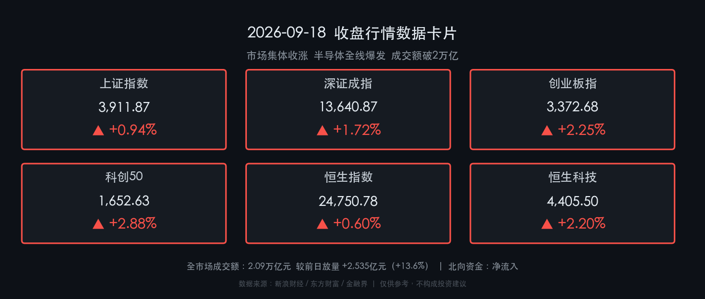

# 🚀 金融市场晚报：AI算力超节点引爆半导体全线，A股放量反攻破2万亿

**日期：2026年09月18日 (星期五)** &nbsp; **时段：收盘晚报**

> **核心摘要**：美联储加息25BP"靴子落地"后利空出清，A股三大指数集体放量反攻，创业板指涨2.25%领跑，科创50大涨2.88%；全市场成交额达2.09万亿元较前日放量逾2500亿元；华为昇腾960超节点发布+黄仁勋算力需求预期翻番+光刻胶涨价预期三重催化下，半导体产业链主力净流入超360亿元全线爆发；北向资金回流，市场情绪由防御转为进攻。

---

## 核心行情复盘

### A股三大指数

* **上证指数**：收报 **3,911.87 点**，上涨 **+0.94%**（+36.27 点）
* **深证成指**：收报 **13,640.87 点**，上涨 **+1.72%**（+230.50 点）
* **创业板指**：收报 **3,372.68 点**，上涨 **+2.25%**（+64.96 点）
* **科创50指数**：收报 **1,652.63 点**，上涨 **+2.88%**，成交额 **1,176.53 亿元**
* **全市场成交额**：**2.09 万亿元**，较上一交易日**放量 +2,535 亿元（+13.6%）**，交投情绪全面升温
* **市场涨跌分布**：全市场超 **4,200 只**个股上涨，上涨占比约 **76%**，权重与小票共振，整体普涨格局

**领涨板块**：半导体产业链 🔵、先进封装/光刻胶 🧪、存储芯片/算力 💾、AI概念/新股次新 📈、部分消费医药 💊  
**领跌板块**：汽车整车 🚗、煤炭 ⛏️、银行 🏦、石油油服 🛢️、贵金属/黄金 📉

### 港股市场

* **恒生指数**：收报 **24,750.78 点**，上涨 **+0.60%**（+146.49 点）
* **恒生科技指数**：收报 **4,405.50 点**，上涨 **+2.20%**（+94.76 点）
* **国企指数**：收报 **8,225.40 点**，上涨 **+0.61%**
* **红筹指数**：收报 **4,051.74 点**，上涨 **+0.27%**

> 港股半导体及AI概念股成为当日领涨主引擎，联想集团、MINIMAX等个股涨幅显著，内房股午后拉升；科网股涨跌互现，而煤炭、石油及内银股表现相对弱势。整体与A股科技反攻形成共振。

---

## 核心解读与市场逻辑

> **主逻辑：美联储加息"靴子落地"→ 利空出清 → 风险偏好修复 → 资金从防御切换至进攻科技。**
>
> 周三（北京时间凌晨）美联储宣布加息25个基点，属于市场预期内操作。随着这一外部扰动被充分定价，A股与港股均选择以"进攻"姿态回应——全市场超过4200只个股上涨，成交额重回2万亿以上，是近期最强共振上攻信号。
>
> **半导体产业链成为本轮上攻最核心的矛头**，多重利好密集叠加：
> 1. **华为昇腾960超节点**：华为发布业界首个采用近封装光学（NPO）技术的超大规模集群互联设备，直接点燃先进封装、光互联细分赛道；
> 2. **黄仁勋算力需求预期**：英伟达CEO公开表示，AI在医疗、制造、金融等行业的渗透将使2027年芯片销量达今年两倍，为全球芯片需求提供远期信心；
> 3. **光刻胶涨价预期**：全球核心供应商拟集体提价的消息刺激供给侧想象；
> 4. **美光存储紧缺预期**：美光科技关于存储芯片供应紧张的预警进一步强化了存储涨价逻辑。
>
> 主力资金以行动表态：**半导体板块当日主力净流入超 180 亿元，芯片概念净流入超 360 亿元，存储芯片净流入超 180 亿元**，北向资金同步回流，呈现外资内资共振买入的强信号。代表个股华天科技、托伦斯涨停，燧原科技续创历史新高。

---

## 政策脉动

* **央行流动性操作**：中国人民银行今日开展 **4,633 亿元 7 天期逆回购 + 1,000 亿元 14 天期逆回购**，全额满足一级交易商需求，呵护季末流动性平稳。
* **LPR维稳**：1年期LPR **3.00%**、5年期LPR **3.50%**，已连续16个月保持不变，货币政策"适度宽松"基调延续，为实体经济提供稳定融资环境。
* **《金融强国建设"十五五"规划》落地**：明确2030年形成中国特色现代金融体系总体框架，监管重点聚焦"防风险、强监管、促高质量发展"，科技金融、绿色金融、数字金融为"五篇大文章"核心。
* **《金融产品网络营销管理办法》**：将于2026年9月30日起正式实施，当前各机构正进行合规自查，行业整体规范化提速。

---

## 最新机构观点

* **中信证券**：指出美联储加息风险释放应视作**"买点而非卖点"**，这是调整临近尾声的信号。维持**"AI + 能化"杠铃结构**，重申看好北美AI链及具备业绩支撑的标的；强调北向资金回流背景下非机构重仓个股弹性更大。
* **中金公司**：认为外部扰动（地缘、美联储政策公信力）对A股影响阶段性，长期稳进趋势不变。建议**攻防兼备**：外部风险缓释后积极关注**景气成长 + 周期改善**双方向，半导体、AI应用为核心配置方向。
* **高盛**：关注中国AI模型在智能表现上的临界点，指出中国AI开源模型采用率显著提升。维持**超配A股**判断，认为中国股市估值相对全球同行具有显著折价，长期看好AI应用、出海逻辑及"反内卷"政策驱动下的利润改善空间。

---

## 今日市场情绪：芯片超节点引爆，资本涌入新质生产力

> Prompt: A giant humanoid robot forged from circuit boards and silicon wafers stands triumphant at the center of a vast server hall. Its chest glows with a pulsating blue core labeled AI. In the background, cascading lines of green rising candlestick charts fill the walls like ancient hieroglyphs. From its outstretched hands, streams of golden light particles representing capital flows surge upward into a cosmic sky filled with semiconductor chip constellations. The atmosphere is electric, triumphant, and futuristic.

---

*免责声明：内容仅供参考，不构成投资建议。市场有风险，投资需谨慎。*
