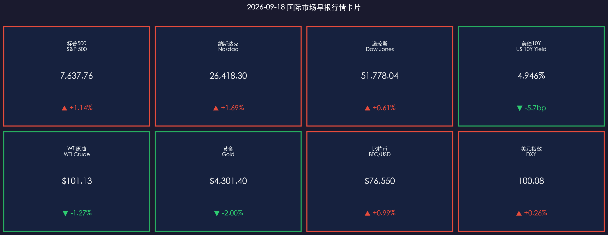

# 🌐 2026年9月18日 国际市场早报

**日期：2026年09月18日 (星期五)** &nbsp; **时段：早报（国际市场）**

> **核心摘要**：美东时间9月17日，美股市场在经历前一日美联储加息冲击后迎来全面强劲反弹。得益于国际原油价格高位回落（WTI原油回落至$101.13/桶）以及美债收益率压力放缓（10年期美债收益率回落至4.946%重回5%下方），投资者逢低买盘涌入，科技与成长股领衔反攻。标普500大涨1.14%，纳斯达克指数劲升1.69%，道琼斯指数收涨逾310点（+0.61%）。尽管高盛将下次加息预期提前至10月，但市场展现出对宏观紧缩的极强盈利承载韧性。

---

## 核心行情复盘

### 🇺🇸 美国股市（9月17日收盘）

* **S&P 500**：**7,637.76**，**▲ +1.14%**（+85.95点，全盘修复前日失地）
* **纳斯达克综合指数**：**26,418.30**，**▲ +1.69%**（+439.87点，大型科技与半导体领跑）
* **道琼斯工业平均指数**：**51,778.04**，**▲ +0.61%**（+315.93点，工业与蓝筹股企稳反弹）
* **罗素2000**：**2,872.10**，**▲ +1.29%**；**VIX恐慌指数**：**16.92**，**▼ -6.78%**

> **核心解读**：在FOMC靴子落地后，市场迅速从“加息恐慌”切换至“盈利韧性与情绪修复”逻辑。长端国债收益率自5.00%高位回落5.7个基点，直接缓解了高估值资产的贴现率压力。纳指与标普500放量反弹，资金持续向具有强劲资产负债表与确定性自由现金流的科技龙头集中，同时小盘股与周期股也出现技术性补涨。

**领涨/领跌板块分析：**
* **领涨**：信息技术（XLK **▲ +1.85%**，算力硬件、芯片设计与云计算全线飘红）、非必需消费品（XLY **▲ +1.40%**，电商与消费龙头反弹）、通信服务（XLC **▲ +1.25%**）
* **领跌**：能源板块（XLE **▼ -1.15%**，受油价回落拖累）、公用事业（XLU **▼ -0.30%**，防守型资金流向风险资产）

**个股焦点：**
* **大型科技巨头**：英伟达（NVDA）**▲ +2.8%**，微软（MSFT）**▲ +1.9%**，苹果（AAPL）**▲ +1.4%**，特斯拉（TSLA）**▲ +2.3%**
* **芯片与硬件**：台积电ADR（TSM）**▲ +2.1%**，博通（AVGO）**▲ +2.5%**，受AI算力资本开支预期支撑
* **金融与工业**：高盛（GS）**▲ +1.1%**，卡特彼勒（CAT）**▲ +0.8%**，摩根大通（JPM）**▲ +0.6%**

---

### 📈 美国国债市场

* **10年期美债收益率**：收盘 **4.946%**（**▼ 收益率-5.7bp**），回落至 **5.00%** 关键红线下方，终结了连续两日的飙升势头
* **2年期美债收益率**：收盘 **4.38%**（**▼ 收益率-4.0bp**），加息计入基本充分，短端抛压缓解

> **核心解读**：经历议息会议当天的剧烈上冲后，国债市场迎来技术性买盘介入。10年期美债收益率再度跌破5.00%，显示固定收益投资者在高位具备较强配置意愿。短期收益率的企稳为权益市场提供了极其宝贵的情绪缓冲窗口。

---

### 🛢️ 大宗商品

* **WTI原油**：**$101.13/桶**，**▼ -1.27%**（地缘紧张情绪边际缓和，获利盘持续退出）
* **布伦特原油**：**$104.30/桶**，**▼ -1.42%**
* **黄金期货（12月合约）**：**$4,301.40/盎司**，**▼ -2.00%**（受美元高位震荡与风险偏好回暖压制，围绕$4,300震荡筑底）

> **核心解读**：原油连续两个交易日回调，主要受到全球紧缩环境下需求预期修正的影响，油价回落反过来减轻了整体通胀预期，形成正向反馈。黄金在名义收益率维持高位与美元指数站上100大关的背景下遭遇一定获利回吐，但地缘基本面与央行购金逻辑仍构成长期底部支撑。

---

### 💰 外汇与加密货币

* **美元指数（DXY）**：**100.08**，**▲ +0.26%**（维持在100整数关口上方强劲运行）
* **比特币（BTC/USD）**：报 **$76,550**，**▲ +0.99%**（随美股风险偏好反弹企稳）

> **核心解读**：美元指数在美联储鹰派加息和点阵图支撑下维持坚挺，牢牢守住100大关。加密货币市场跟随美股科技板块同步企稳回升，比特币在$76,000一线获得强力支撑，链上资金逢低承接意愿较强。

---

## 核心解读与市场逻辑

**主逻辑链：加息利空出尽+长端利率脱离高位峰值 → 油价回落边际缓和滞胀担忧 → 逢低买盘大举回流核心科技资产 → 美股全面反弹**

1. **“加息利空出尽”与估值修复**：加息首日的暴跌主要反映了对年内继续紧缩点阵图的突发性恐慌。随着市场逐步厘清美联储主席沃什的政策路径，投资者认识到加息是基于经济韧性而非恶性失控，市场风险偏好迅速修复。
2. **5%美债关口反复博弈**：10年期国债收益率在冲破5.00%后迅速引来抄底买盘，表明5%附近具备极强的长期资产配置吸引力。只要长端利率不出现失控性向上突破，美股核心龙头的盈利增长足以消化当前的估值折价。
3. **华尔街聚焦加息时点博弈（10月 vs 12月）**：目前机构共识已从“是否加息”转向“何时再加”。大行分歧显现：高盛激进预测10月将再度行动，而大摩与小摩则坚守12月窗口。

---

## 政策脉动

| 机构 / 实体 | 最新动向与政策表态 |
|------|---------|
| **美联储（Fed）** | 官员进入决议后的沟通期，市场正密切消化沃什关于“前瞻性控制供给通胀预期”的鹰派框架；联邦基金利率目标区间维持在3.75%-4.00%。 |
| **美国财政部** | 密切监测长端国债拍卖与流动性状况，四季度再融资发债计划依然受到市场高度关注。 |
| **大行投行预测调整** | 高盛正式取消“仅加息一次”的基准假设，将下一次加息预测提前至2026年10月；摩根士丹利与摩根大通则维持12月加息判断。 |
| **地缘与能源** | 原油供给端短期风险溢价边际收窄，但关键运输通道与产能瓶颈仍是潜在波动源。 |

> **政策核心矛盾**：尽管美联储展示了强硬的紧缩姿态，但美国宏观经济与科技企业盈利依然强劲。政策制定者面临着在“遏制通胀粘性”与“避免推升政府巨额债务付息成本”之间的动态平衡。

---

## 最新机构观点

**1. 高盛（Goldman Sachs）**
> 高盛宏观策略团队在最新研报中全面调整了加息路径预测，正式撤回此前“加一次即终结”的判断，明确预测美联储将在 **2026年10月** 再次加息25个基点。高盛指出，鹰派点阵图（16位官员支持年内再加）以及沃什对更高自然利率（R*）的认可，意味着紧缩节奏将比预期更紧凑。但高盛强调，强劲的企业利润使优质股票仍具结构性上涨空间。

**2. 摩根士丹利（Morgan Stanley）**
> 摩根士丹利分析认为，美联储年内虽有极大概率再度加息，但更倾向于选择在 **12月** 落地，以便观察四季度通胀回落情况并避开中期选举前后的敏感政治周期。大摩建议投资者利用短期反弹优化持仓结构，逢高增配现金流稳固的高质量防守型标的。

**3. 摩根大通（J.P. Morgan）**
> 摩根大通全球资产配置团队表示，10年期美债收益率回落至5%以下为风险资产提供了宝贵喘息机会。虽然下半年流动性环境依然趋紧，但AI基础设施资本开支和数字化转型为大型科技公司提供了穿越周期的业绩护城河，维持对核心半导体与软件巨头的“增持”评级。

---

## 今日市场情绪：曙光初现与紧缩韧性

> Prompt: A majestic mechanical golden bull standing atop a high-tech trading platform overlooking a futuristic Wall Street city at dawn. In the background, dark storm clouds part to reveal warm golden sunbeams, glowing green holographic stock charts rise into the sky, and calming green light illuminates crystalline skyscrapers.

---

> 免责声明：内容仅供参考，不构成投资建议。市场有风险，投资需谨慎。
