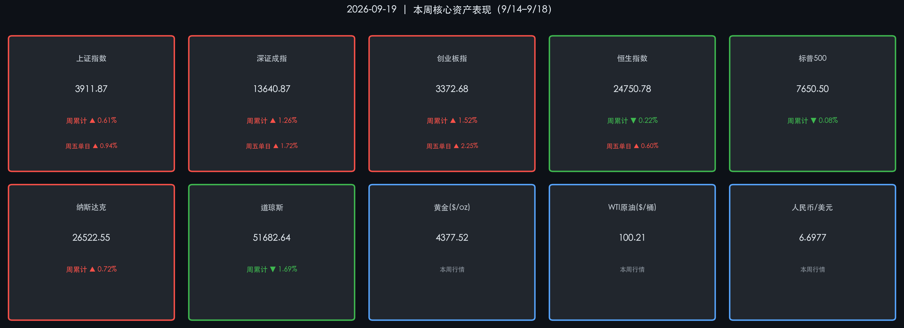

# 全球市场周末复盘 · 加息冲击下的分化博弈

**日期：2026年09月19日 (星期六)** &nbsp; **时段：周末复盘**

> **核心摘要**：美联储三年来首次重启加息（+25bp 至 3.75%-4.00%），引发全球流动性收紧共鸣——道指创3月来最差单周表现、港股跌破25000关口；但A股科技链逆势强劲，创业板周涨1.52%领跑，人民币兑美元更突破6.70创2023年以来新高，内外分化格局鲜明。

---

## 核心资产周度/日度表现回顾

### A 股（9月14日–18日）

| 指数 | 周五收盘 | **周五单日** | **本周累计** |
|------|----------|-------------|-------------|
| 上证指数 | 3911.87 | **▲ +0.94%** | **▲ +0.61%** |
| 深证成指 | 13640.87 | **▲ +1.72%** | **▲ +1.26%** |
| 创业板指 | 3372.68 | **▲ +2.25%** | **▲ +1.52%** |

> 周五（9/18）A股全线高开高走，**全市场超4200只个股上涨**，两市合计成交额高达 **2.08万亿元**，为近两月新高。科技行情主导本周走势：**半导体芯片、算力硬件、机器人**板块表现强劲，领涨全市；汽车整车、煤炭、银行板块相对落后，分化格局延续。

### 港股（9月14日–18日）

| 指数 | 周五收盘 | **周五单日** | **本周累计** |
|------|----------|-------------|-------------|
| 恒生指数 | 24750.78 | **▲ +0.60%** | **▼ -0.22%**（约54点） |

> 港股本周整体承压，连续第二周录得周度跌幅，**全周未能守稳25000点关口**。美联储加息预期持续压制港股估值，但周五在美债收益率回落及美股反弹的带动下止跌反弹，AI及硬件相关股（联想集团、MiniMax等）表现突出。

### 美股（9月14日–18日）

| 指数 | 周五收盘 | **本周累计** |
|------|----------|-------------|
| 标普500 | 7650.50 | **▼ -0.08%** |
| 纳斯达克 | 26522.55 | **▲ +0.72%** |
| 道琼斯 | 51682.64 | **▼ -1.69%**（3月来最差单周） |

> 美股本周明显分化：道指连续三周下跌，传统行业个股遭受加息重压；纳指在半导体与AI硬件板块的带动下逆市收涨，科技龙头展现韧性。市场情绪核心变量为 **9/16 FOMC加息落定后的政策路径预期**。

### 大宗商品与外汇

* **黄金（现货）**：收报 **$4377.52/盎司**，四周来首次录得**周度上涨**；尽管加息通常压制金价，但市场对美债信用风险的担忧、全球央行购金需求及中东地缘政治不确定性共同提供了强力支撑。
* **WTI 原油**：收报 **$100.21/桶**；布伦特 **$103.17/桶**，周内因沙特供应风险一度冲高，后随供应担忧缓解连续三日回落，录得三周来首次**周度下跌**。
* **在岸人民币（CNY/USD）**：收报 **6.6977**，双双突破 6.70 关口，创**2023年1月以来新高**；人民银行连续八个交易日调强中间价，贸易顺差与宏观叙事改善形成合力。

---

## 过去48小时重磅事件深度复盘

### 🔴 核心事件一：美联储三年来首次重启加息

* **决议结果**：9月16日 FOMC 全票（12:0）通过，将联邦基金利率目标区间上调 **25个基点** 至 **3.75%—4.00%**。
* **声明措辞**：删除"供应冲击推动能源价格上涨"的具体描述，改用更泛化的"地缘政治局势发展"，透露出政策转向已被内化为中性底色。
* **点阵图信号**：18位参与者中 **16位预计年内还有至少一次加息**，鹰派预期明确。
* **主席表态**：主席凯文·沃什（Kevin Warsh）强调"通胀率仍过高且持续时间过长，当前下降速度未达预期"，重申控制价格稳定的坚定立场。

> **逻辑链**：通胀超预期（数据）→ Fed重启加息周期（事件）→ 美债收益率上行 → 道指/价值股承压、传统行业估值收缩（逻辑）；同时美元走强 → 但人民币逆势升值，显示中国基本面改善叙事已形成独立定价动能。

### 🔵 核心事件二：PBOC 推进货币政策框架转型

* **署名文章**：9/16 人民银行行长潘功胜在《求是》发表文章，正式提出**淡化数量目标、强化价格型调控**，健全市场化利率传导机制。
* **操作层面**：9/15 开展 **5000亿元买断式逆回购**（6个月期），保持流动性合理充裕。
* **制度协同**：人民银行与外汇局联合施行跨国公司本外币跨境资金集中运营新规，提升跨境资金调配效率。

> 国内政策基调与美联储方向形成鲜明对照：外部收紧 vs. 内部保持充裕，是人民币逆势升值和A股科技链相对强势的深层政策逻辑。

### 🟡 核心事件三：中美高层经贸磋商启动

* 中国副总理 9月19日-23日赴美进行经贸磋商。
* 市场关注：美方可能推迟发布新增关税措施，待 **9月24日元首会晤** 后再做决定。
* 影响研判：若磋商进展积极，将为 A 股四季度提供超预期的外部政策催化剂。

---

## 下周全球宏观大事预警

| 日期 | 事件 | 重要度 |
|------|------|--------|
| 9/21（周一） | 芝加哥联储主席古尔斯比讲话 | ⭐⭐⭐ |
| 9/21–25 | **联合国大会高层会议**（纽约） | ⭐⭐⭐⭐ |
| 9/22（周二） | 纽约联储主席威廉姆斯 + 副主席杰斐逊发言（美债市场会议） | ⭐⭐⭐⭐ |
| 9/22（周二） | ADP就业数据（非农先行指标） | ⭐⭐⭐ |
| 9/23（周三） | **9月标普全球制造业/服务业PMI初值** | ⭐⭐⭐⭐⭐ |
| 9/23（周三） | API/EIA 原油库存数据 | ⭐⭐⭐ |
| 9/24（周四） | 纽约联储威廉姆斯伦敦论坛炉边谈话；**中美元首会晤（预期）** | ⭐⭐⭐⭐⭐ |
| 9/24（周四） | 美国二季度贸易数据 + 初请失业金 | ⭐⭐⭐ |
| 9/25（周五） | 美国8月耐用品订单 | ⭐⭐⭐ |

> ⚠️ **最高风险事件**：9/23 PMI初值（验证美国经济是否能承受加息周期）+ 9/24 中美元首会晤（关税走向的决定性节点）。A股投资者应重点关注这两个时间窗口的消息面风险。

---

## 顶级机构周末策略内参摘要

**高盛（Goldman Sachs）**
> 认为美联储加息落定后，全球风险资产将进入"鹰派消化期"，外资对 A 股操作趋于谨慎；但对中国科技链维持结构性乐观，建议关注具备业绩支撑的半导体硬件品种，"重量的确定性、审慎价的爆发性"。

**摩根大通（JPMorgan）**
> 指出道指本周表现是传统行业对加息预期重新定价的信号，建议客户适当降低利率敏感资产配置。对 A 股，认为当前处于"存量博弈、缩量磨底"阶段，系统性反弹或需等待国庆后宏观数据验证。

**中金公司（CICC）**
> 发布四季度配置策略："科技成长 + 红利防御"双主线高度共识。强调科技板块内部应从纯题材炒作向核心资产调仓（半导体设备、材料等），同时适当增配防御性红利资产以降低组合波动。

---

## 今日市场情绪：惊涛中的破浪者

> Prompt: A lone sailing ship forged from glowing green circuit boards, surging forward through a stormy ocean made of red and green candlestick charts. Above the mast flies a golden dragon banner symbolizing the yuan's rise. On the horizon, the shadow of a giant eagle (representing the Fed) looms, gripping a lightning bolt. The sky is split — half storm-dark with dollar signs, half dawn-lit with rising semiconductor chip towers. Cinematic, epic, hyper-detailed.

---

*免责声明：内容仅供参考，不构成投资建议。*
