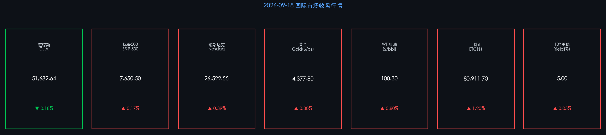

# 🌐 2026年09月19日 国际市场早报

**日期：2026年09月19日 (星期六)** &nbsp; **时段：早报（国际市场）**

> **核心摘要**：美联储本周宣布三年来首次加息 25 基点至 3.75%–4.00%，推动 10 年期美债收益率触及 5%，道指承压微跌 0.18%；但半导体板块强劲拉升，纳斯达克逆势收涨 0.39%，为市场提供多空博弈中的核心支撑。三大指数于"四巫日"（Triple Witching）高波动中分化收盘，黄金突破 4,377 美元续创历史高位，原油 WTI 重回 100 美元整数关口。

---

## 核心行情复盘

### 美股三大指数（2026-09-18 收盘）

* **道琼斯工业平均指数（DJIA）**：收报 **51,682.64 点**，下跌 **95.4 点（-0.18%）**
* **标普 500 指数（S&P 500）**：收报 **7,650.50 点**，上涨 **12.74 点（+0.17%）**
* **纳斯达克综合指数（Nasdaq）**：收报 **26,522.55 点**，上涨 **104.25 点（+0.39%）**

> 三大指数呈现典型的"四巫日（Triple Witching）"分化格局：指数期权、期货季度到期带来的高换手量下，防御类蓝筹拖累道指，而以 NVIDIA、AMD 为首的半导体链为纳指和标普提供了超额弹性。

### 固定收益市场

* **10 年期美债收益率**：收于 **5.00%**，上行约 **5 个基点**

> 美债收益率 5% 已成为近期最关键的阻力/支撑位。市场对新任美联储主席反应函数的不确定性（高盛指出）正在放大近期利率波动，叠加通胀 + 关税双重压力，实际利率仍处高位。

### 大宗商品与加密货币

* **现货黄金**：收于 **$4,377.80 / 盎司**（+约 0.30%），续创历史新高
* **WTI 原油**：结算于 **$100.30 / 桶**（+约 0.80%）
* **布伦特原油**：结算于 **$103.87 / 桶**
* **比特币（BTC）**：约 **$80,911.70**（+约 1.20%）

> 黄金持续走强与美债高收益并行，体现市场对"滞胀"风险的对冲需求——通胀超预期而增长前景存疑，令贵金属作为实物资产的吸引力大幅提升。原油重返三位数，地缘溢价叠加 OPEC+ 减产预期形成支撑。

---

## 核心解读与市场逻辑

> 本周最核心的宏观事件是美联储 9 月 15–16 日 FOMC 会议以 **12:0 全票一致** 宣布加息 25bp，联邦基金利率目标区间升至 **3.75%–4.00%**，为 **三年来首次加息**。官方声明将此归因于"通胀持续高于目标"与"经济活动具有韧性"。  
>  
> 这一决定直接触发收益率曲线重定价：10 年期美债破 5%，市场开始计入更长时间"高利率"的可能性。科技股对利率敏感度最高，但半导体因 AI 资本开支强劲（AWS、Microsoft、Google 三季度 AI 服务器采购量同比翻倍）形成结构性支撑，使纳指逆势上行，体现了**利率压力（数据）← 通胀超预期（事件）→ 科技整体承压，但 AI 算力需求隔离了部分杀伤（逻辑）**的市场内在逻辑。

---

## 政策脉动

* **美联储（Fed）**：9 月 FOMC 加息 25bp（3.75%–4.00%），为三年来首次。声明措辞偏鹰，未释放明确暂停信号，市场预期 11 月 FOMC 仍有 60% 概率再度加息。
* **欧洲央行（ECB）& 日本银行（BoJ）**：高盛预期两者均将在 9 月完成本轮加息，全球主要央行同步收紧流动性的局面仍在延续。
* **财政部**：本周美国国债拍卖需求温和，认购倍数低于预期，叠加 FOMC 加息，共同推高长端收益率。

---

## 最新机构观点

**🏦 高盛资产管理（Goldman Sachs AM，9 月展望）**

> 高盛维持全球经济"软着陆"基准预期，预计 GDP 增长将于 2027 年再度加速，美国私人部门投资拉动增速约 2.1%。但明确提示：新任美联储主席的反应函数尚不透明，可能导致近期利率波动超预期扩大。建议投资者关注通胀实质性回落（核心 PCE 趋近 2%）前，维持对利率风险资产的审慎敞口。

**🏦 摩根士丹利（Morgan Stanley，财富管理，9 月）**

> 摩根士丹利指出，在股债相关性由负转正（双双受高利率压制）的环境下，传统 60/40 组合的分散效应大幅减弱。建议将对冲基金、大宗商品、黄金、基础设施纳入核心配置替代。其年内 S&P 500 目标维持 **8,000 点**，强调 AI 基础设施投资持续赋能风险资产，但地缘政治尾部风险仍是压制估值的主要变量。

**🏦 摩根大通（J.P. Morgan，FOMC 后点评）**

> 摩根大通策略师认为，此轮加息开启了新的货币政策周期，10 年期美债 5% 将成为未来 6–12 个月的"重力中心"，权益市场整体估值面临重估压力，但盈利端 AI 驱动的结构性增长可部分对冲压力。建议超配能源、黄金、AI 算力三条线。

---

## 今日市场情绪：鹰翼下的韧性

> Prompt: A human trader stands at the edge of a towering cliff made of stacked Federal Reserve rate hike documents, looking down at a turbulent ocean formed by rising 10-year Treasury yield curves reaching 5%, while in the distant sky a semiconductor phoenix rises in green laser light above the Nasdaq skyline, symbolizing resilience amid hawkish monetary tides

---

*免责声明：内容仅供参考，不构成投资建议。*
