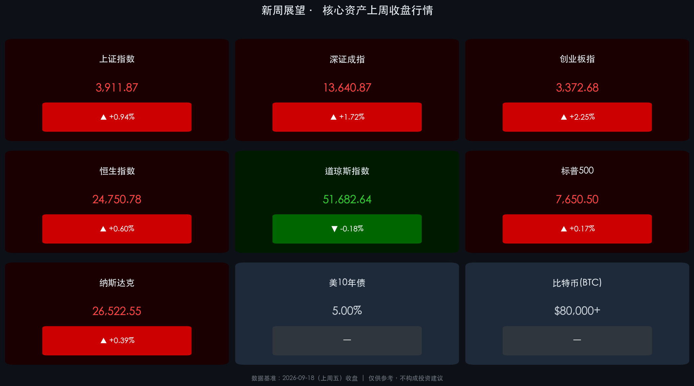

# 全球市场新周展望 · 三大央行同步鸣钟，紧缩时代正式开启

**日期：2026年09月20日 (星期日)** &nbsp; **时段：新周展望**

> **核心摘要**：美联储三年来首次重启加息（+25bp 至 3.75%-4.00%），叠加欧洲央行（9月10日）和日本央行（9月18日，升至1.25%创31年高位）相继收紧，全球三大央行同步转鹰，标志着后疫情时代货币宽松周期的彻底终结。中国 A 股科技链逆势强劲，人民币汇率突破 6.70 表现坚挺；下周中美经贸磋商（何立峰率团赴美）及"9·24行情两周年"等重磅节点将主导市场博弈方向。

---

## 周末财经要闻终极汇总

### 🔔 一、美联储重启加息：三年沉寂后的政策转向

* **决议**：北京时间9月17日凌晨，FOMC全票（**12:0**）通过，联邦基金利率目标区间上调 **+25bp → 3.75%-4.00%**，为自2023年7月以来首次加息。
* **政策信号**：点阵图显示 **19名官员中有16名**预计年内还将至少再加息一次。
* **主席表态**：沃什强调通胀下降速度仍未达预期，政策将"更关注中长期趋势而非短期数据"，态度明确偏鹰。

> **核心解读**：此次美联储重启加息并非市场意外，更多被机构解读为"预防性加息"——在中东能源供应中断推高通胀、美债收益率重返5%的背景下，美联储选择主动出击稳锚预期。历史上，首次加息后市场往往经历"靴子落地式"的震荡与再定价，短期冲击已消化，后续关键在于加息节奏与美国经济软着陆的可信度。

---

### 🌍 二、全球央行同步紧缩：货币宽松时代正式终结

| 央行 | 利率决议 | 最新利率 | 关键信号 |
|------|---------|---------|---------|
| **美联储 (Fed)** | **↑ +25bp** | **3.75%-4.00%** | 年内或再加息一次 |
| **欧洲央行 (ECB)** | ↑ +25bp (9月10日) | — | 跟随全球紧缩步伐 |
| **日本央行 (BoJ)** | **↑ +25bp** (9月18日) | **1.25%** | **创1995年以来最高** |

> **核心解读**：美、欧、日三大央行在同一周期内同步收紧，这一历史性共振彻底宣告了后疫情时代宽松货币的终结。值得注意的是，日央行加息后，日元反而走弱（美元兑日元突破157），折射出市场对日本后续紧缩节奏的不确定性预期。全球流动性整体收缩的压力将在未来数季度持续向高估值资产和新兴市场传导。

---

### ⚡ 三、地缘风险与能源冲击：通胀压力源头

* **中东局势**：沙特阿美宣布通知部分**欧洲炼油商停止供应**，霍尔木兹海峡形势仍紧张，推高全球能源价格，成为引发通胀担忧和市场避险情绪的关键变量。
* **美债收益率**：10年期美债收益率因美联储鹰派加息**重返5%水平**，对全球风险资产形成压制。
* **比特币**：BTC 曾突破 **$80,000** 关口，加密市场情绪相对独立运行。

---

### 🇨🇳 四、人民币资产逆势坚挺

* 人民币兑美元汇率突破 **6.70**，创2023年以来新高，显示中国货币政策"以我为主"的独立性。
* A股上周科技链强势：上证 **+0.61%（周累计）**、创业板 **+1.52%（周累计）**，成交额回升至约2万亿元。
* 多位经济学家指出美债"安全资产"共识正在动摇，全球货币体系重构为人民币国际化打开窗口期。

---

## 新一周市场核心博弈逻辑

### 🎯 博弈主线一：中美经贸磋商（9月21日-23日）

> **高权重事件**：中国国务院副总理**何立峰**率团赴美，举行中美经贸高层磋商（9月19日-23日）。市场将密切关注以下议题的进展与信号：
> - **AI及科技出口管制**：半导体芯片、先进算力出口限制是否松动
> - **稀土与关税**：双边关税结构调整的可能性
> - **金融市场开放**：QFII/RQFII 等互联互通机制扩容预期
> 任何积极表态都可能直接催化A股科技链与港股的节点性行情。

### 🎯 博弈主线二："9·24行情"两周年效应（9月24日）

* 下周四（9月24日）为"9·24行情"两周年节点，市场情绪可能受到政策预期和节点氛围的双重带动。
* **"十五五"开局系列发布会**：下周将召开"开局起步'十五五'"主题发布会，政策稳增长导向是市场信心的关键锚点。

### 🎯 博弈主线三：中国LPR决议（9月21日周一）

* 市场将于**周一开盘前**获知最新LPR报价，若出现超预期降息，将直接提振地产链、银行板块及宽信用预期。

### 🎯 博弈主线四：欧美PMI初值（9月23日周三）

* 欧美主要经济体公布**9月制造业与服务业PMI初值**，是评估加息后经济景气度的重要量规。若数据显著走弱，将加大全球衰退担忧，利空风险资产；若超预期，则支持"软着陆"叙事。

---

## 本周重磅经济数据与会议前瞻

| 时间 | 地区/机构 | 事件 | 市场关注度 |
|------|---------|------|---------|
| **周一 (9/21)** | 🇨🇳 中国 | **LPR利率报价** | ⭐⭐⭐⭐⭐ |
| **周二 (9/22)** | 🌐 全球 | 中美经贸磋商持续 | ⭐⭐⭐⭐⭐ |
| **周三 (9/23)** | 🇺🇸🇪🇺 美欧 | **9月制造业&服务业PMI初值** | ⭐⭐⭐⭐ |
| **周四 (9/24)** | 🇺🇸 美国 | 8月新屋销售、耐用品订单 | ⭐⭐⭐ |
| **周四 (9/24)** | 🇨🇳 A股 | **"9·24行情"两周年节点** | ⭐⭐⭐⭐ |
| **周四 (9/24)** | 🇨🇭 瑞士 | 瑞士央行利率决议 | ⭐⭐ |
| **周五 (9/25)** | 🇨🇳 中国 | **中秋假期起（25日起A股休市）** | ⭐⭐⭐⭐ |

> **节假日预警**：A股将于**9月25日起**进入中秋假期休市，节前流动性与避险情绪需重点留意。预计资金将在周四之前完成节前仓位调整。

---

## 核心资产上周收盘行情

### A 股（截至9月18日周五收盘）

| 指数 | 周五收盘 | 周五单日 | 本周累计 |
|------|---------|---------|---------|
| 上证指数 | **3,911.87** | ▲ **+0.94%** | ▲ **+0.61%** |
| 深证成指 | **13,640.87** | ▲ **+1.72%** | ▲ **+1.26%** |
| 创业板指 | **3,372.68** | ▲ **+2.25%** | ▲ **+1.52%** |

> 科技行情主导本周走势，**半导体芯片、算力硬件、机器人**板块强势领涨；汽车整车、煤炭、银行板块相对落后，内部分化格局延续。

### 港股 & 美股（截至9月18日周五收盘）

| 指数 | 周五收盘 | 周五单日 | 本周累计 |
|------|---------|---------|---------|
| 恒生指数 | **24,750.78** | ▲ **+0.60%** | ▼ **-0.22%** |
| 道琼斯指数 | **51,682.64** | ▼ **-0.18%** | — |
| 标普500 | **7,650.50** | ▲ **+0.17%** | — |
| 纳斯达克 | **26,522.55** | ▲ **+0.39%** | — |

> 港股全周承压于美联储加息压力，连续第二周录得周跌幅。美股三大指数分化：科技权重的纳斯达克小幅收涨，对利率敏感的道指微跌，整体呈"加息靴子落地后的震荡再平衡"特征。

---

## 头部券商/投行开盘策略点睛

**📌 中信证券**：
> 明确指出加息风险释放应视为**"买点"而非"卖点"**。配置上维持**"AI + 能化"杠铃结构**，科技方向机会集中于制造复杂度增加的细分领域（光通信、PCB、先进封装），具备量增逻辑的方向值得重点布局。

**📌 中金公司**：
> 认为外部扰动属阶段性因素，长期稳进趋势有望延续。建议投资者不必过度悲观，配置层面主攻**"景气成长"与"周期改善"**两大主线，外部风险缓释后更看重业绩确定性。

**📌 摩根士丹利（Morgan Stanley）**：
> 战略上提升对**中国A股的配置建议**，认为相对于前期重仓港股，当前阶段A股提供了更好的边际配置窗口。随着中美高层互动重启，中国资产的风险溢价有望阶段性收窄。

**📌 券商秋季策略共识**：
> 市场正从上半年"科技独大"的单一主题炒作，转向**"科技成长 + 红利防御"双主线均衡配置**的再平衡阶段。大消费、地产链、高分红资产及具备全球竞争力的出海链获得明显更多关注。利用底部震荡窗口进行择时布局，重点甄别拥挤度风险。

---

## 今日市场情绪：三钟共鸣，新周蓄势

*（由于技术原因，今日情绪插图暂缺）*

> Prompt: An ancient bell-caster god simultaneously strikes three massive golden bells inscribed with Fed, ECB, and BoJ, the resonating shockwaves morph into rising interest rate curves that arc across a night sky made of yield curves and bond charts, in the distant horizon green lanterns glow representing renminbi assets standing resilient amidst the monetary tightening storm, dramatic mythological composition

---

*免责声明：内容仅供参考，不构成投资建议。市场有风险，投资需谨慎。*
