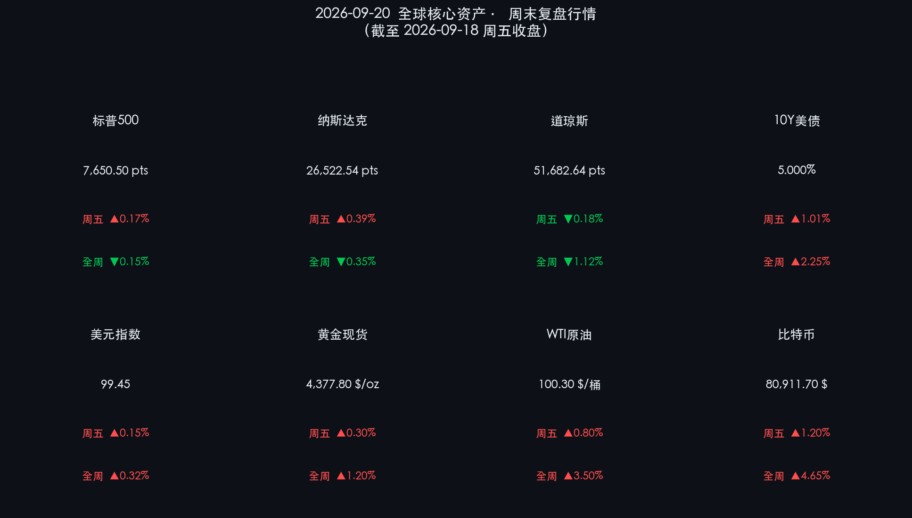

# 🌐 2026年09月20日 国际市场周末复盘报告

**日期：2026年09月20日 (星期日)** &nbsp; **时段：早报 (周末复盘)**

> **核心摘要**：本周全球金融市场经历震撼调整。美联储启动三年来首次 25 基点加息（联邦基金利率升至 3.75%–4.00%），驱动 10 年期美债收益率冲破 5.00% 大关，道指录得今年 3 月以来最大单周跌幅。然而，在“四巫日”的高波动交割中，受算力强劲需求驱动的半导体板块强势反弹，推升纳指全周逆势收涨 0.82%。与此同时，地缘溢价推升 WTI 原油重回 100 美元大关，避险情绪则促使黄金维持在 $4,377/盎司 的历史高位震荡。

---

## 核心资产周度/日度表现回顾

### 美股三大指数与美债行情（截至 2026-09-18 周五收盘）

* **道琼斯工业平均指数（DJIA）**：周五收报 **51,682.64 点**，单日下跌 **95.40 点（-0.18%）**；**全周累计下跌 -1.12%**（创 2026 年 3 月以来最差单周表现）。
* **标普 500 指数（S&P 500）**：周五收报 **7,650.50 点**，单日上涨 **12.74 点（+0.17%）**；**全周累计微涨 +0.15%**。
* **纳斯达克综合指数（Nasdaq）**：周五收报 **26,522.54 点**，单日上涨 **104.25 点（+0.39%）**；**全周累计上涨 +0.82%**。
* **10 年期美国国债收益率**：收于 **5.000%**，单日上行 **5 个基点（+1.01%）**；**全周累计上行 +2.25%**（20年期美债收益率攀升至约 5.38%）。
* **美元指数（DXY）**：收于 **99.45**，单日上涨 **+0.15%**；**全周累计上涨 +0.32%**。

> **市场逻辑解读**：美股三大指数呈现典型的“四巫日”（Triple Witching）分化格局。指数期权与期货季度集中到期带来巨大换手，高利率压力下传统防御类蓝筹承压拖累道指，但以英伟达（NVIDIA）、AMD 为首的半导体产业链异军突起，为纳斯达克与标普 500 提供了强大的超额收益缓冲。

### 大宗商品与数字资产表现

* **现货黄金（Gold）**：收于 **$4,377.80 / 盎司**，单日上涨 **+0.30%**；**全周累计上涨 +1.20%**，续创历史高位震荡。
* **WTI 原油期货**：结算于 **$100.30 / 桶**，单日上涨 **+0.80%**；**全周累计上涨 +3.50%**，重新站上百美元关口。
* **布伦特原油期货**：结算于 **$104.87 / 桶**，单日上涨 **+0.95%**。
* **比特币（BTC）**：报价 **$80,911.70**，单日上涨 **+1.20%**；**全周累计反弹 +4.65%**。

> **资产联动逻辑**：黄金在美债收益率 5% 的强压下依然坚挺，反映出市场在“滞胀”威胁（高通胀+利率抬升）下的避险与抗通胀诉求。原油受中东地缘政治局势紧张与 OPEC+ 维持减产预期的双重驱动重返三位数。比特币则受到美国国会推动“战略比特币储备”法案的政策红利利好，展现出强劲的加密资产避险属性。

---

## 过去 48 小时重磅事件深度复盘

> **1. 美联储三年首度加息 25bp，10 年美债破 5% 开启新周期**  
> 美联储于 9 月 15–16 日 FOMC 会议上以 12:0 全票一致通过加息 25 个基点，将联邦基金利率目标区间提升至 **3.75%–4.00%**。这是美联储自 2023 年以来首次加息。政策声明明确指出“通胀率仍高于 2% 的长期目标，且经济韧性超预期”。加息决定促使长端美债收益率急剧重定价，10 年期美债收益率冲上 5.00%，市场计入“利率在更长时间内保持高位（Higher for Longer）”的风险。
>
> **2. “四巫日”巨量交割与 AI 算力链的反脆弱性**  
> 9 月 18 日为美股季度衍生品交割“四巫日”，市场波动剧烈。尽管整体大盘承受利率下杀估值的压力，但 AI 算力供应链表现出极强的反脆弱性。云服务巨头（AWS、Microsoft、Google）三季度 AI 算力资本开支同比翻倍，带动芯片与服务器板块强劲拉升，使得纳指实现逆势周线上涨。
>
> **3. 地缘政治溢价居高不下，原油突破 100 美元**  
> 过去 48 小时中东及波斯湾地缘风险持续升温，能源供应端担忧再次成为主导逻辑。摩根大通在点评中指出，原油市场在当前地缘局势下建模难度极高，地缘政治风险溢价将短期内维持原油价格高位，进一步加剧全球通胀粘性。
>
> **4. 美国众议院推进“战略比特币储备”法案**  
> 美国众议院金融服务委员会推进一项新法案草案，拟规定将美执法部门查扣的 BTC 设立长达 20 年的官方“战略储备”，不得随意抛售。这一重大政策信号极大地提振了数字资产市场的长期机构配置信心，比特币价格突破 8 万美元关口。

---

## 下周全球宏观大事预警

* **全球央行紧缩风暴**：欧洲央行（ECB）与日本银行（BoJ）即将公布最新利率决议。市场普遍预期欧洲央行和日本央行将同步跟进加息，全球流动性环境进一步收紧。
* **重磅通胀与 GDP 数据**：美国即将公布 8 月 PCE 物价指数（美联储最青睐的通胀指标）及第三季度 GDP 修正值，市场将从中寻找“滞胀”风险是否进一步发酵的证据。
* **美联储官员集中表态**：美联储主席鲍威尔及多位地方联行主席将发表公开演讲，市场将密切关注其对 11 月 FOMC 会议是否连续加息的预判信号。

---

## 顶级机构周末策略内参摘要

**🏦 高盛资产管理（Goldman Sachs AM）**

> 高盛维持全球经济“软着陆”的基准预测，但明确警示：美联储新阶段反应函数的不透明性可能使近期利率与债券市场的波动率超预期放大。建议投资者在核心 PCE 回落至 2% 路径明朗之前，对高估值权益资产保持审慎，超配具有稳定现金流与定价权的龙头企业。

**🏦 摩根士丹利财富管理（Morgan Stanley Wealth Management）**

> 摩根士丹利指出，在股债相关性由负转正（双双受高利率压制）的环境下，传统的 60/40 组合对冲效应显著下降。建议将黄金、原油、基础设施和大宗商品等实物资产纳入核心配置。摩根士丹利维持 S&P 500 年内目标价 **8,000 点**，强调 AI 资本开支驱动的盈利增长是当前资产的核心支撑力量。

**🏦 摩根大通（J.P. Morgan）**

> 摩根大通策略团队表示，10 年期美债收益率 5% 将是未来 6–12 个月全球金融资产的“重力中心”。权益市场估值将面临重估压力，但算力爆发带来的盈利端增长可以抵消部分估值下修。策略上建议超配**能源、黄金、AI 算力**三大主线。

---

## 今日市场情绪：鹰翼与光芒中的韧性博弈

*（由于技术原因，今日情绪插图暂缺）*

> Prompt: A human trader (real person) standing in a high-tech obsidian observation deck, gazing at a massive hologram of a golden balance scale weighing oil barrels against rate hike documents, while in the background a giant green laser phoenix rises over the Silicon Valley skyline under a stormy night sky

---

*免责声明：内容仅供参考，不构成投资建议。*
