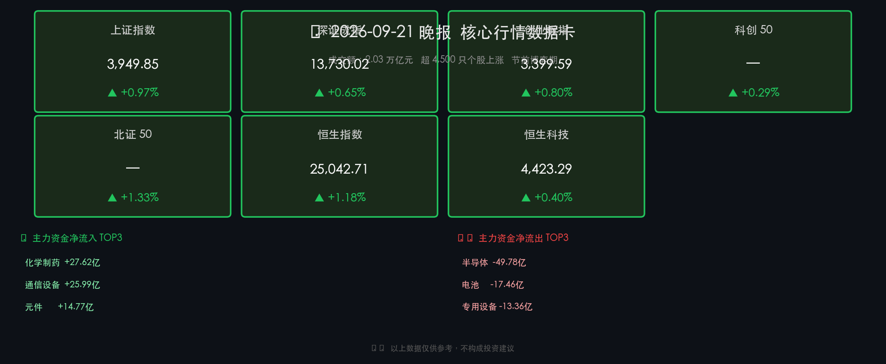

# 2026年A股晚报：双政策催化，医药地产携手领涨

**日期：2026年09月21日 (星期一)** &nbsp; **时段：收盘晚报**

> **核心摘要**：A股三大指数全线收涨，沪指接近4000点整数关口，成交额连续逾2万亿元显示市场情绪高度活跃；工信部《医药工业"十五五"规划》与住建部"存量时代"制度改革双政策落地，医药生物与房地产板块携手领涨，成为本轮行情最强主线；央行节前释放1650亿逆回购流动性，跨节资金无忧。

---

## 核心行情复盘

### 指数收盘数据

* **上证指数**：**3,949.85 点**，涨 **+0.97%**，逼近 4,000 点整数关口
* **深证成指**：**13,730.02 点**，涨 **+0.65%**
* **创业板指**：**3,399.59 点**，涨 **+0.80%**
* **科创 50**：涨 **+0.29%**
* **北证 50**：涨 **+1.33%**（表现最强）
* **恒生指数**：**25,042.71 点**，涨 **+1.18%**（+291.93 点）
* **港股恒生科技**：**4,423.29 点**，涨 **+0.40%**

> **市场概貌**：沪深全市场成交额约 **2.03 万亿元**（前一交易日约 2.05 万亿，略有缩量），连续保持高位。全市场超 **4,500 只**个股上涨，市场广度极佳，呈现典型普涨格局。

### 领涨/领跌板块

**领涨板块**

* 🔴 **医药生物**（化学制药、医疗服务、CRO）：多股涨停，南华生物、百花医药、新华制药、哈药股份等封板
* 🔴 **房地产**：午后快速拉升，万科A、世联行、我爱我家、金融街、华发股份等涨停
* 🔴 **养老概念**：受医养政策协同预期驱动，跟涨明显
* 🔴 **通信设备**：主力净流入 +25.99 亿，中际旭创、新易盛等强势

**领跌板块**

* 🟢 **贵金属**：山金国际、赤峰黄金走低，前期涨幅较大，获利盘回吐压力较重
* 🟢 **半导体**：主力净流出 **-49.78 亿**（全市场流出最大），电池 -17.46 亿，专用设备 -13.36 亿

### 主力资金动向

| 净流入前三 | 金额 | 净流出前三 | 金额 |
|:-----------|-----:|:-----------|-----:|
| 化学制药 | +27.62亿 | 半导体 | -49.78亿 |
| 通信设备 | +25.99亿 | 电池 | -17.46亿 |
| 元件 | +14.77亿 | 专用设备 | -13.36亿 |

> **逻辑解读**：主力资金从前期高涨的半导体、电池等科技硬件方向获利撤退，转而追逐政策直接利好的医药和地产，反映节前"确定性收益"偏好上升。通信设备方向的净流入则延续了 AI 算力链的中期配置逻辑。

---

## 核心解读与市场逻辑

> **医药爆发：政策"十五五"规划给预期，AI 赋能给想象**
> 
> 工信部等十部门于 9 月 18 日联合印发的《医药工业发展"十五五"规划》是本日医药板块强势启动的根本催化剂。规划提出至 2030 年医药工业营收突破 **3.5 万亿元**，创新药年均增速达 **20% 以上**，并将人工智能赋能药物研发列为前沿重点任务。这意味着未来 5 年政策资源将持续向创新药、CRO（合同研究组织）、AI 制药等赛道倾斜，为相关公司打开长达数年的估值重塑窗口。多只个股涨停，板块出现明显"事件驱动 + 景气预期"共振特征。

> **地产午后异动：存量时代"三制度改革"重构行业逻辑**
> 
> 住建部于近期明确提出房地产市场正式进入"存量时代"（2026年前8个月二手房占比已破 52%），并提出以**项目公司制、主办银行制、现房销售制**为核心的基础性制度改革。这是对过去"预售制 + 资金混同"旧模式的系统性纠偏，从根本上降低交付风险、重建购房者信心，同时也为优质房企创造长期竞争护城河。地产股午后涨停潮，是市场对这一制度性信号的集中定价。

> **节前效应 + 成交量轻微缩量**：当日成交额 2.03 万亿，较前一日 2.05 万亿略有收窄，反映部分资金进入"节前观望"状态，但整体情绪依然偏多。中秋、国庆长假前，博弈节后开门红预期是当前市场最主要的情绪主线。

---

## 政策脉动

### 货币政策：流动性充裕，节前护航

* **LPR 维持不变**（9月20日公布）：1年期 **3.0%**，5年期以上 **3.5%**，连续 16 个月持平。当前政策利率（7天逆回购）维持 1.4%，银行息差回升但仍低，报价行无下调动力。
* **央行节前逆回购**：9月21日开展 **1650 亿元**7天期逆回购；9月18日重启 **1000 亿元** 14天期逆回购，合计资金投放充裕，节假日流动性压力得到有效对冲。
* **5000 亿买断式逆回购**（9月15日）：6个月期等量续作，中期流动性支撑稳固。
* **政策基调**：继续实施"适度宽松"货币政策，配合政府债发行。若四季度经济动能走弱，不排除降准或降息的可能。

### 产业政策：双箭齐发

* **《医药工业"十五五"规划》**（工信部等十部门，2026-09-18）：医药工业上升为"国家新兴支柱产业"，设置 2030 年目标包括 FIC 全球占比 ≥ 25%、千亿级园区 20 个。
* **住建部"存量时代"宣示**（2026年9月）："1234"新发展模式，推行现房销售制度，推动房地产从增量扩张转向存量提质。

---

## 最新机构观点

> **中信证券**：将美联储"预防性加息"视为风险释放信号，判断当前 A 股量价情绪指标已至低位，7 月以来调整接近尾声。维持"AI+能化"杠铃结构，同时看好业绩支撑品种的估值修复机会。

> **中金公司**：秋季策略强调"向新致远"，美联储加息对 A 股持续性影响有限。三条主线：①AI 应用及创新药景气成长；②家电机械等外需出海；③化工养殖等周期反转。市场风格由纯成长独涨转向均衡。

> **高盛**：关注中国 AI 模型全球普及的"智能临界点"，认为 AI 资本开支周期是推动中国资产增值的核心动力。中国 AI 产业链硬件竞争力持续提升，建议战略性配置 AI 科技与能源转型方向。

---

## 今日市场情绪：双政策加持，节前普涨暖风

> Prompt: A giant luminous DNA helix rises from the ruins of a construction site, intertwining with a phoenix made of green candlestick charts soaring into a dawn sky above a modern Chinese cityscape. In the background, two massive stone tablets inscribed with medical and real estate symbols glow with golden light, symbolizing dual policy blessings. The mood is triumphant and hopeful.

---

*免责声明：内容仅供参考，不构成投资建议。*
