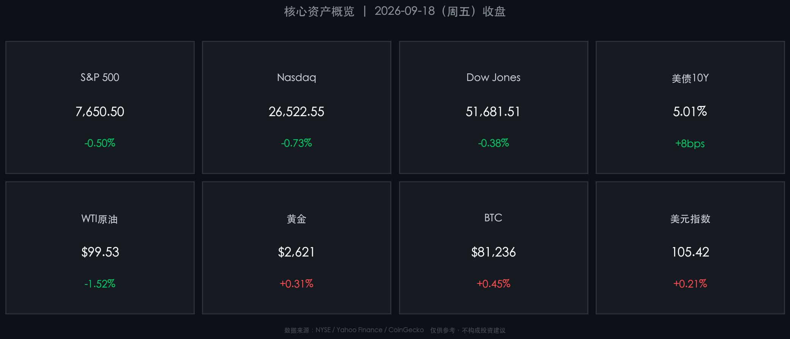

# 🌏 全球金融早报 · 新周展望

**日期：2026年09月21日 (星期一)** &nbsp; **时段：早报**

> **核心摘要**：美联储9月16日宣布加息25bp至3.75-4.00%区间，叠加美债10年期收益率突破5%关口，上周美股承压收跌约0.5%；中东地缘风险持续推升油价至$99-103/桶；本周市场博弈焦点在于多位美联储官员表态与欧美PMI初值，新一轮"更高利率维持更久"与"经济软着陆"之间的拉锯战将主导全周走势。

---

## 📊 核心资产上周五收盘一览

*注：美股于周六/周日休市，数据为2026年9月18日（周五）收盘终值。*

| 资产 | 收盘价 | 周涨跌 |
|------|--------|--------|
| **S&P 500** | **7,650.50** | **-0.50%** |
| **Nasdaq** | **26,522.55** | **-0.73%** |
| **Dow Jones** | **51,681.51** | **-0.38%** |
| 美债10Y收益率 | **5.01%** | +8 bps |
| WTI原油 | **$99.53/桶** | -1.52% |
| 布伦特原油 | **$103.19/桶** | -1.44% |
| 黄金 | **~$2,621/盎司** | +0.31% |
| 比特币 | **$81,236** | +0.45% |
| 美元指数 | **105.42** | +0.21% |

---

## 📰 周末财经要闻终极汇总

### 🇺🇸 美联储鹰派信号

> 美联储于9月16日（FOMC会议）**全票通过加息25bp**，将联邦基金利率目标区间上调至 **3.75%-4.00%**，为2023年7月以来首次加息。最新"点阵图"显示，2026年底前仍有**至少一次**25bp加息预期。官员警告通胀"粘性"显著，8月CPI年率 **3.4%**，核心服务通胀持续走高。美联储理事卡什卡利周末明确表示"通胀压力已蔓延至服务业"，市场对"更高利率维持更久"的定价进一步强化。

### 🇨🇳 中美经贸磋商重启

> 国务院副总理何立峰率团于9月19日至23日赴美参加经贸磋商，纽约当地时间9月20日上午双方正式开始新一轮谈判，重点落实两国元首共识。此次磋商结果将深刻影响亚洲资产和人民币汇率的短期走向。

### 🛢️ 中东地缘风险升级

> 胡塞武装于9月19日对利雅得发动导弹和无人机袭击，一度推升布伦特原油接近 **$105/桶**。此后伊朗通过卡塔尔向美方提出停战条件，情势趋于复杂。油价的持续高位运行（全周均在 $99-104 区间）是美联储最担忧的"第二波通胀"来源。

### 🤖 科技 / AI 监管压力

> 四家AI巨头（Anthropic、OpenAI、Google、SpaceXAI）同期遭遇美国监管部门**反垄断诉讼**，甲骨文AI融资贷款出现折价，AI板块资本链压力显现。特朗普同日宣布将组建"人工智能部队"并设AI事务"总管"，政策面的多空拉锯令科技股估值承压。

### 🇯🇵 日元干预信号

> 日本财务省于9月18日晚对外汇市场进行"汇率询价"操作（Rate Check），被市场解读为外汇干预前兆。CFTC数据显示杠杆交易商已平仓日元空头并建立看涨仓位，若本周日元大幅波动，将对跨资产相关性产生扰动。

---

## 🗓️ 新一周市场核心博弈逻辑

> 本周（9月22-26日）全球市场将围绕三条核心主线展开博弈：**①** 美联储官员接连发言能否形成统一鹰派或边际转鸽的信号？**②** 欧美PMI初值能否验证"经济韧性"或触发"衰退交易"？**③** 中美经贸磋商能否释放积极信号，为中国资产估值修复提供催化剂？

### 主线一：美联储官员表态（周二密集）

- **周二9月22日**：Fed 威廉姆斯（Williams）、杰斐逊（Jefferson）、巴尔金（Barkin）三位官员先后发言，为本周最关键事件。若表态一致偏鹰，美债收益率将进一步上冲，压制科技股估值；若有人暗示暂停加息，黄金与风险资产料将反弹。
- 当前美债10Y收益率 **5.01%** 已处近年高位，市场对 Fed 措辞的敏感性极高。

### 主线二：欧美 PMI 初值（本周某日公布）

- 欧元区、英国、美国 9 月制造业/服务业 PMI 初值相继公布，将验证"经济软着陆"叙事是否完好。
- **若美国服务业 PMI 再超预期**：通胀担忧加剧 → 加息预期走强 → 债市承压；
- **若 PMI 不及预期**：衰退信号出现 → 降息预期升温 → 美元走弱、新兴市场受益。

### 主线三：中美磋商与中国资产

- 何立峰团队与美方谈判将于本周中段进入实质阶段。
- **积极信号**（关税豁免、科技管制松动）将利好港股、A50期货及人民币；
- **无实质进展**：A50期货（当前在加息+磋商不确定性压力下已有所回落）或延续震荡。

### 附加风险：

- **联合国大会**（9月22日开幕）：伊朗领导人出席，中东谈判进程存变数；
- **港股通本周五（9月25日）**因中秋节放假**暂停交易**，北水流入将在周四之前集中；
- **OECD 中期经济展望**（周三9月23日发布）：若下调增长、上调通胀预测，将对全球风险偏好构成压制。

---

## 🏦 头部券商 / 投行开盘策略点睛

### 高盛（Goldman Sachs）

> "在美联储鹰派信号明确、能源价格持续偏高的背景下，建议短期内**超配防御性板块**（医疗、公用事业），并对科技股的高估值保持警惕。联邦基金利率再上25bp的概率约55%，依赖联储政策拐点的交易需推迟布局。"

### 摩根大通（J.P. Morgan）

> "维持美股年底6个月看法中性。尽管宏观环境复杂，但AI驱动的资本开支与强劲企业盈利构成对冲。重点关注能源股（作为通胀对冲）和优质成长股（2027年降息预期仍将兑现）。中美磋商若取得实质突破，可增配中国科技龙头。"

### 摩根士丹利（Morgan Stanley）

> "坚持'建设性但不自满'策略。短期波动主要来自油价与利率，但中期结构性增长逻辑（AI、绿色能源转型）未受损。建议以'哑铃策略'应对本周：在防御端持有黄金与投资级信用债，在进攻端集中持有AI基础设施主题股。"

---

## 📅 本周重磅经济数据与会议前瞻

| 日期 | 事件 | 重要程度 |
|------|------|----------|
| 周二 9/22 | 美联储官员三连讲（Williams / Jefferson / Barkin） | ⭐⭐⭐⭐⭐ |
| 周二 9/22 | 里士满联储制造业指数（9月） | ⭐⭐⭐ |
| 周三 9/23 | OECD 中期经济展望发布 | ⭐⭐⭐⭐ |
| 周三 9/23 | 欧美制造业/服务业 PMI 初值（9月） | ⭐⭐⭐⭐⭐ |
| 周四 9/24 | 美国新屋销售（8月） | ⭐⭐⭐ |
| 周四 9/24 | 美国经常账户（Q2） | ⭐⭐⭐ |
| 周五 9/25 | 美国耐用品订单初值（8月） | ⭐⭐⭐⭐ |
| 周五 9/25 | 密歇根大学消费者信心终值（9月） | ⭐⭐⭐⭐ |
| 周五 9/25 | 港股通暂停交易（中秋节） | ℹ️ |

---

## 🎨 今日市场情绪：鹰鸣新周，静待博弈

> Prompt: A lone hawk soaring above a stormy ocean of red K-line candles, while far on the horizon a faint green dawn breaks through dark Fed rate clouds — symbolizing the tense vigil before a new trading week opens

---

*免责声明：内容仅供参考，不构成投资建议。市场有风险，投资需谨慎。*
