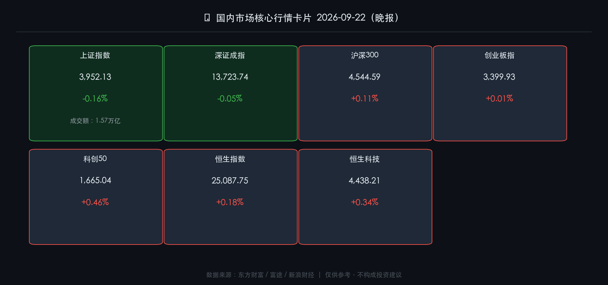

# 🏮 2026年09月22日（周二）国内市场晚报

**日期：2026年09月22日 (星期二)** &nbsp; **时段：晚报（国内市场）**

> **核心摘要**：A股高开低走、主力净流出约61亿，上证指数微跌0.16%收3952点；科创50与沪深300小幅飘红，科技线展现结构性韧性；习主席9月23日访美引发市场对中美关系改善的高度期待，恒生指数随之小涨0.18%；央行维持适度宽松货币政策，中秋节（9月25日）前市场情绪趋于审慎。

---

## 核心行情复盘

### 🇨🇳 A股三大指数（9月22日收盘）

* **上证指数**：收 **3,952.13**，跌 **-0.16%**，成交额约 **1.57万亿元**（较前日放量 +7.01%）
* **深证成指**：收 **13,723.74**，跌 **-0.05%**
* **沪深300**：收 **4,544.59**，涨 **+0.11%**（逆势小幅走强，体现蓝筹韧性）

### 📊 科技成长指数

* **创业板指**：收 **3,399.93**，涨 **+0.01%**（几乎平收，震荡整理）
* **科创50**：收 **1,665.04**，涨 **+0.46%**（全日表现最强，受半导体/AI支撑）

### 🇭🇰 港股

* **恒生指数**：收 **25,087.75**，涨 **+0.18%**（+45.04点）
* **恒生科技指数**：收 **4,438.21**，涨 **+0.34%**

### 💰 主力资金与北向资金

* **主力资金**：全日净流出约 **60.68亿元**，资金整体偏谨慎，节前防御情绪明显
* **北向资金**：随机制调整改为季度披露，当日无实时数据

### 🏭 行业板块表现

* **领涨方向**：创新药、半导体（科创50带动）、人工智能算力、光模块等科技基础设施板块维持结构性热度
* **领跌/承压方向**：高位题材股出现获利回吐；防御性板块（银行、公用事业）在指数下行中相对坚挺但绝对收益不高

---

## 核心解读与市场逻辑

> **高开低走的三重原因**：①中秋节假（9月25日休市）临近，市场交投情绪主动收缩，节前不愿持仓带来被动资金流出；②美联储9月中旬加息25bp（至3.75%–4.00%）的效应仍在全球扩散，外围流动性收紧对A股风险偏好形成压制；③主力资金整体流出60亿，叠加北向数据缺失，短期信号模糊，市场选择以"缩量震荡"的方式等待明确催化。

> **科技线的相对韧性**：科创50涨0.46%，是今日市场最亮的一条线。逻辑在于——《金融强国建设"十五五"规划》明确支持硬科技企业上市，政策背书持续；同时，AI算力基础设施（液冷、光模块、HBM）需求预期并未因短期担忧而消退，资金在弱市中向有业绩支撑的科技方向集中。

> **中美关系预期差是港股上涨的核心推手**：恒生指数涨0.18%、恒生科技涨0.34%，均跑赢A股。消息面上，国家主席习近平将于9月23至25日对美进行国事访问，市场提前定价中美关系阶段性缓和预期，港股作为对外资更敏感的窗口市场，这一情绪溢出效应更为明显。

---

## 政策脉动

* 🏦 **央行货币政策**：中国人民银行行长潘功胜9月21日主持召开外资金融机构座谈会，明确"**实施好适度宽松的货币政策**"，为经济增长和金融市场平稳运行营造良好货币金融环境；同日央行开展 **350亿元7天期逆回购操作**，操作利率维持 **1.40%**，维护流动性平稳。

* 🔐 **证监会监管强化**：ST椰岛因涉嫌信息披露违法违规被证监会立案，上交所对沈鼓集团等新上市股票异常交易行为持续采取自律监管措施，市场制度建设信号持续释放。

* 🗺️ **"十五五"金融强国规划落地**：《金融强国建设"十五五"规划》正式出台，明确"两步走"战略：2030年前初步形成中国特色现代金融体系框架，2035年基本建成高度竞争力与普惠性的现代金融体系。资本市场定位为"支持硬科技首选阵地"，半导体、AI大模型、商业航天上市供给将显著扩大。

* 📅 **中秋节休市提醒**：9月25日（周五）至9月27日（周日）为中秋节假期，**9月28日（周一）照常开市**。

---

## 最新机构观点

* 🏦 **中信证券**：坚持"AI+能化"杠铃式配置结构，认为当前市场处于快速轮动阶段，AI领域二季报已有所体现，建议布局有业绩支撑品种的估值修复窗口。能化方向有望在下半年逐步升温，关注四季度供需边际变化。

* 💼 **中金公司**：聚焦"AI科技创新"与"国际秩序重构"两条中长期主线，认为随着"投融资平衡"新生态形成（分红提升、长钱入市机制完善），A股慢牛格局基础延续，建议从确定性趋势出发寻找资产，优先关注硬科技并购生态中受益标的。

* 🌐 **市场多数机构**：当前宏观处于"政策红利与全球紧缩预期"交织期，建议"稳进"姿态——用AI/硬科技布局新质生产力增长逻辑，同时以高分红、强自由现金流资产对冲全球波动风险。节前采取防御立场，节后关注中美访问成果的实质落地情况。

---

## 今日市场情绪：震荡审慎，静候访美东风

> Prompt: A lone Chinese dragon made of green candlestick charts glides through a misty autumn market, half its body ascending through golden policy documents, while shadowy institutional funds swirl below like ocean currents. In the background, a grand hall with lanterns symbolizing the Mid-Autumn Festival, and two distant flags — China and US — reflected in the still water below

---

*免责声明：内容仅供参考，不构成投资建议。*
