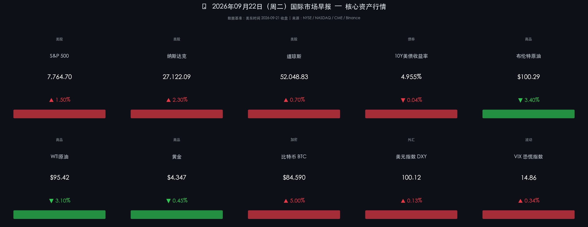

# 🌐 2026年09月22日（周二）国际市场早报

**日期：2026年09月22日 (星期二)** &nbsp; **时段：早报（国际市场）**

> **核心摘要**：美联储于9月16日再度加息25bp至3.75%–4.00%，美伊外交回暖信号触发油价单日暴跌逾3%；受此提振，美债收益率从高位回落至4.955%，科技与AI板块强势领涨，纳斯达克大涨2.3%，AMD突破万亿市值；比特币借势狂飙5%，全球风险情绪显著回温。

---

## 核心行情复盘

### 🇺🇸 美股三大指数（9月21日收盘）

* **S&P 500**：收 **7,764.70**，涨 **+1.50%**
* **纳斯达克综合**：收 **27,122.09**，涨 **+2.30%**（领涨三大指数）
* **道琼斯工业**：收 **52,048.83**，涨 **+0.70%**（+366点）

### 🔑 核心品种

* **10年期美债收益率**：**4.955%**，较上周五高位下行约4.1bp（债券价格上涨）
* **布伦特原油**：收 **$100.29/桶**，暴跌 **-3.40%**
* **WTI原油**：收 **$95.42/桶**，跌 **-3.10%**
* **现货黄金**：收 **$4,347/盎司**，跌 **-0.45%**（强美元施压）
* **比特币（BTC）**：收 **$84,590**，飙涨 **+5.00%**，重收50周均线之上
* **美元指数（DXY）**：收 **100.12**，涨 **+0.13%**
* **VIX 恐慌指数**：收 **14.86**，微涨 **+0.34%**（整体处于低波动区间）

### 领涨个股（科技 & AI）

* **ARM** +15.88% | **Fastly** +15.59% | **DigitalOcean** +13.59%
* **Meta Platforms** +11.00% | **Akamai** +10.28% | **AMD** +9.47%（市值突破$1万亿）

### 领跌板块

* 能源板块整体承压，随油价大幅下跌而走弱，相对大盘显著跑输。

---

## 核心解读与市场逻辑

> **油价崩跌 → 收益率回落 → 科技股狂欢**：本周一市场最核心的交易链条清晰而流畅。布伦特原油从9月初高点113美元/桶大幅下行，跌破100美元关口，核心驱动来自两大因素：①特朗普总统释放信号，可能在本周联合国大会期间与伊朗总统会面，市场迅速为美伊外交接触定价；②沙特9月原油出口量显著回升至400万桶/日（较8月低点240万桶/日大幅改善），霍尔木兹海峡通行量亦升至近六个月最高。油价回落压低通胀预期，10年期美债收益率随之从高位松动至4.955%，为估值压力最重的成长/科技板块提供喘息空间，叠加AI基本面催化（AMD突破万亿市值），纳指顺势爆发。

> **美联储：加息25bp，但收益率"反向"下行**：9月16日FOMC全票决议加息25bp至3.75%–4.00%，新主席Kevin Warsh延续鹰派立场，SEP显示年内仍有至少一次加息预期。然而，昨日市场走势体现了市场的另一层逻辑——油价的下跌意味着输入性通胀压力缓和，若通胀按预期向2%靠拢，则终端利率的想象空间被压缩，债券与成长股同步受益。

---

## 政策脉动

* **美联储（Fed）**：9月16日加息25bp，基准利率区间升至 **3.75%–4.00%**。准备金利率同步升至3.90%。SEP显示委员会整体倾向年内再加息一次。主席Warsh在发布会上强调"通胀仍然高企，需要更快回归2%目标"。
* **美伊外交**：特朗普表示可能在联合国大会期间（本周纽约）与伊朗代表接触，卡塔尔、巴基斯坦参与调解。消息尚未确认，但市场已抢先定价风险溢价下降。
* **IEA预警**：国际能源署9月11日报告曾警告，若冲突持续，全球石油缺口或进一步扩大；近期供应端修复速度超预期，油价短期下行空间尚存，但也门胡塞武装等不稳定因素仍制约下行深度。

---

## 最新机构观点

> **高盛（Goldman Sachs）**：维持对全球经济的乐观判断，预计美国GDP增速2027年料加速至2.1%，AI基础设施投资为核心驱动。然而提示两大尾部风险：新任Fed主席Warsh的政策反应函数存在不确定性，可能带来利率短期波动；当前高油价（即便短期回落）叠加金融条件收紧，仍是股权资产的逆风。历史上，加息周期启动一年后权益通常仍有正收益，但当下需保持战略耐心。

> **摩根士丹利（Morgan Stanley）**：CIO Michael Wilson维持"建设性但不自满"定调。认为2027年盈利预期上修将支撑美股，但警告：若金融条件进一步收紧或油价再度飙升，S&P 500可能在年内触及7,100点低点后再启年终反弹。建议投资组合纳入私募、房地产、大宗商品等另类资产以对冲高利率环境。

> **摩根大通（JPMorgan）**：关注美债长端利率的"终点定价"。认为市场仍低估了Fed可能超预期的紧缩路径，建议阶段性减少利率敏感型资产（长久期债券、高估值成长股）的敞口，同时看好防御型板块和能源（长期供应结构仍偏紧）。

---

## 今日市场情绪：科技凤凰涅槃，油价松绑

> Prompt: A colossal silicon phoenix with wings made of luminous green circuit boards rises from the Manhattan skyline, trailing streams of glowing blue AI data. In the background, a cracked oil barrel sinks into dark waters while a tiny diplomatic olive branch floats above. The phoenix's talons clutch a golden microchip, symbolizing the triumph of tech over energy fears.

---

> **免责声明**：内容仅供参考，不构成投资建议。市场有风险，投资需谨慎。
