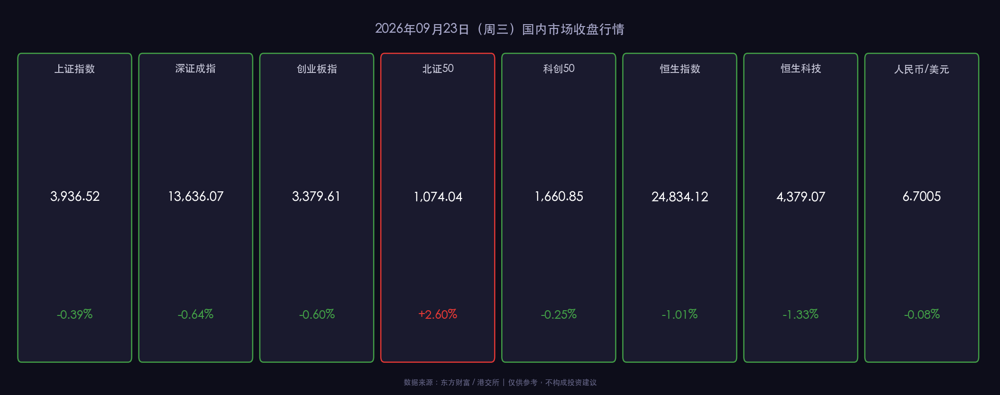

# 🏮 2026年09月23日（周三）国内市场晚报

**日期：2026年09月23日 (星期三)** &nbsp; **时段：晚报（国内市场）**

> **核心摘要**：A股三大指数周三震荡收跌，沪指失守3940点，节前"十一"效应令资金观望情绪主导全场，成交额萎缩至1.76万亿元；港股受海外AI大模型降价潮冲击，恒指跌逾1%、恒生科技跌1.33%；央行全日仅逆回购80亿元呵护流动性，人民币汇率中间价下调9基点但整体维稳；多机构维持"慢牛"研判，建议节前聚焦AI算力硬件+高股息防御性"哑铃策略"。

---

## 核心行情复盘

### A股三大指数

* **上证指数**：收报 **3,936.52** 点，下跌 **0.39%**
* **深证成指**：收报 **13,636.07** 点，下跌 **0.64%**
* **创业板指**：收报 **3,379.61** 点，下跌 **0.60%**
* **北证50**：收报 **1,074.04** 点，上涨 **+2.60%**（逆势领涨，专精特新个股活跃）
* **科创50**：收报 **1,660.85** 点，下跌 **0.25%**

**量能概况：**
* 沪深两市合计成交额约 **1.76万亿元**，较前日（2.1万亿+）明显 **缩量约16%**，印证"节前效应"下资金主动撤退。
* 全市场超过 **3,500只** 个股收跌，市场呈普跌格局。
* **主力资金净流出 114.14亿元**，北向资金全日总成交 **2,911.50亿元**，占两市总成交额13.63%。

**板块亮点：**
* 🔴 **涨势板块**：PCB产业链（印制电路板）、医药CRO概念、医疗美容、通用设备——受益于"十五五"规划中高端制造及医疗健康政策催化。
* 🟢 **跌幅居前**：传媒/影视院线（AI降价冲击内容变现逻辑）、广告营销、航海装备、煤炭（资源品节前获利了结）。
* 地产股盘中冲高回落，**ST美芝重组** 进展（具身智能公司深朴智能拟认购8.10亿元股份）获市场关注，但未能带动地产板块整体走强。

---

### 港股市场

* **恒生指数**：收报 **24,834.12** 点，下跌 **253.63点 (-1.01%)**
* **恒生科技指数**：收报 **4,379.07** 点，下跌 **1.33%**
* **国企指数**：收报 **8,273.81** 点，下跌 **1.06%**

> **核心解读**：港股三大指数全线走弱，主因是**海外大模型降价潮**（9月以来Meta、OpenAI等相继下调API定价）冲击市场对科技互联网公司盈利增速的预期，阿里巴巴、小米集团、智谱AI港股概念均出现明显回调。另一面，**房地产股**在潘功胜重申"适度宽松货币政策"后出现阶段性反弹，融信中国等内房股逆势涨幅居前，医药板块亦有政策利好预期支撑。这种结构分化体现了市场的"政策底"预期依然存在。

---

### 外汇市场

* **人民币/美元中间价**：**6.7468**，较前日下调 **9个基点**（幅度微小，央行维稳意图明显）
* **在岸人民币（16:30收盘）**：**6.7019**，**03:00 NDF**：6.7005
* 人民币汇率整体处于温和贬值通道，与美元指数相对强势对应，但央行通过中间价管理限制了大幅波动。

---

## 核心解读与市场逻辑

> **事件 → 数据 → 逻辑链**：
>
> 1. **AI降价潮冲击**（事件）：海外大模型API价格持续下滑，OpenAI、Meta等相继大幅降价，市场担忧算力变现收入受压（事件），港股科技互联网板块以恒生科技-1.33%呼应（数据），短期内AI应用层的盈利确定性被重新定价，资金从应用层流向硬件/算力基础设施（逻辑）。
>
> 2. **节前资金收缩**（事件）：距"十一"长假仅剩5个交易日，资金天然回避节前持仓风险（事件），导致成交额从2.1万亿骤降至1.76万亿，主力净流出114亿（数据），散户跟随机构减仓，市场呈现"量价齐跌"特征（逻辑）。
>
> 3. **北证50逆势反弹**：专精特新+中小创新企业受"十五五"规划催化（国家数据局攻坚行动 + 粤芯IPO落地），吸引部分增量资金，北证50大涨2.60%（数据），表明政策利好能局部对冲市场悲观情绪（逻辑）。

---

## 政策脉动

* **央行公开市场操作**：9月23日逆回购操作量仅 **80亿元**，操作利率维持 **1.40%** 不变。操作量显著偏低，意在精准呵护流动性而非大水漫灌，避免催生节前资金空转套利。
* **离岸央票发行**：央行通过港金管局CMU结算系统招标发行 **600亿元（6个月期）** 央票，中标利率 **1.37%**，通过离岸发债稳定人民币汇率预期，彰显维稳汇率决心。
* **潘功胜货币政策表态**：央行行长重申实施 **适度宽松的货币政策**，继续推动金融高水平对外开放。市场解读为短期内降准降息概率维持，"宽松偏松"基调不变。
* **"十五五"规划落地加速**：国家数据局将在工业制造、医疗健康、**金融服务**等十大行业开展数据资源开发利用攻坚行动，利好数据要素、云计算及金融科技板块。
* **《轻工纺织产业发展"十五五"规划》印发**：部署14项重点任务，纺织出口龙头有望受益。
* **中金公司复牌**：公告拟换股吸收合并东兴证券、信达证券，监管支持"大型券商做优做强"信号明确，券商板块整合主线延续。

---

## 最新机构观点

**1. 中信证券——"哑铃策略"：科技成长 + 高股息防御**
> 中信证券维持A股"慢牛"研判，建议四季度采用**哑铃策略**：攻守两端并重。进攻端聚焦AI算力基础设施（交换芯片、交换机、光模块）及国产大模型应用生态；防守端增配高股息资产对冲节前不确定性。特别关注Kimi等模型厂商在金融行业解决方案的商业化进展。

**2. 中金公司——国产算力扩容，关注行业整合红利**
> 中金公司认为，**国产算力芯片**有望支撑国产大模型向**10T-20T参数量平台**持续扩张，估值提升逻辑清晰。同时中金公司自身复牌后，市场认为"三合一"合并（东兴证券+信达证券+中金）将加速头部券商竞争力提升，该合并体现监管"做优做强"方向，建议关注中长期整合红利。

**3. 高盛（Goldman Sachs）——结构性转型受益标的优先**
> 高盛9月中旬小幅下调中国2026年GDP增长预期至 **4.5%**，理由是内需恢复慢于预期。但其资产配置策略仍建议超配A股和H股中"能从结构性转型中受益"的领域，重点指向AI、半导体、机器人及反内卷（curbing excessive competition）政策受益的先进制造业龙头。

---

## 今日市场情绪：节前观望 · 国产算力破局

> Prompt: A colossus made of crumbling circuit boards and shattered server racks stands at the center, representing the global AI price war. Around its feet, small but fierce red phoenixes (representing Chinese domestic AI chips) are rising from the rubble, their feathers etched with glowing circuit patterns. The sky above is a deep indigo, filled with cascading green digits that slowly dissolve into smoke. In the far background, a crescent moon made of a golden semiconductor wafer hangs over a silhouetted skyline of Shanghai and Shenzhen.

---

> **免责声明**：本报告内容仅供参考，不构成任何投资建议。市场有风险，投资需谨慎。
