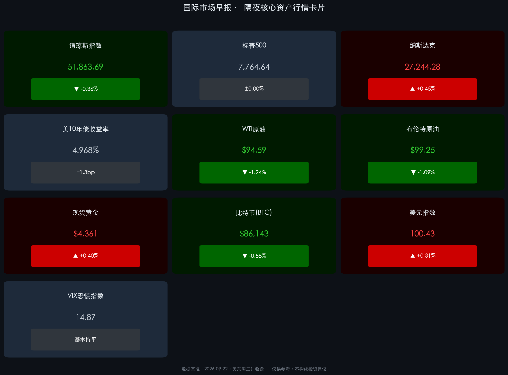

# 🌐 2026年09月23日（周三）国际市场早报

**日期：2026年09月23日 (星期三)** &nbsp; **时段：早报（国际市场）**

> **核心摘要**：美伊官员周二在纽约举行3小时会谈，特朗普称"非常顺利""富有成效"并计划很快再谈，国际油价应声五连跌、双双跌至9月以来最低（WTI失守95美元、布伦特跌破100美元）；油价回落为科技成长松绑，存储芯片股集体爆发，纳指逆势收涨0.45%创历史新高，而金融板块拖累道指收跌0.36%，市场结构分化显著；美联储内部"鹰声"四起，10年期美债收益率微升至4.968%，12月加息概率高达88%。

---

## 核心行情复盘

### 🇺🇸 美股三大指数（9月22日收盘）

* **S&P 500**：收 **7,764.64**，微跌 **0.06 点**（基本平收）
* **纳斯达克综合**：收 **27,244.28**，涨 **+0.45%**（+122.18点，**创收盘历史新高**）
* **道琼斯工业**：收 **51,863.69**，跌 **-0.36%**（-185.14点）
* **纳斯达克100**：涨 **+0.82%**，收 **30,732.4**，创三个多月来首次历史新高
* **费城半导体指数**：涨超 **+2%**，创7月中旬以来收盘新高，芯片股**连续第六个交易日上涨**

### 🔑 核心品种

* **10年期美债收益率**：**4.968%**，上行 **+1.3bp**；2年期持平于 **4.756%**
* **WTI原油（10月）**：收 **$94.59/桶**，跌 **-1.24%**（-1.19美元），**五连跌**至9月以来最低
* **布伦特原油（11月）**：收 **$99.25/桶**，跌 **-1.09%**（-1.09美元），跌破100美元关口，同创9月以来最低
* **现货黄金**：收 **$4,361/盎司**，涨 **+0.40%**
* **比特币（BTC）**：收约 **$86,143**，跌 **-0.55%**，守住8.6万美元上方
* **美元指数（DXY）**：纽约尾市收 **100.43**，涨约 **+0.31%**，延续加息后强势
* **VIX 恐慌指数**：收 **14.87**，基本持平（低波动区间）

### 领涨个股与板块（存储 & 半导体）

* **存储概念集体爆发**：闪迪 **+6%+** | 美光科技 **+5%** | 希捷科技 **+4%+** | 西部数据、SK海力士 **+3%+** | 迈威尔科技 **约+2%**
* **大型科技股分化**：特斯拉 **+0.96%** | 英伟达 **+0.66%** | 苹果 **+0.23%**；Meta **-0.63%** | 微软 **-0.72%** | 谷歌 **-1.07%** | 亚马逊 **-1.34%**
* **Shopify +7.12%**：公司宣布与 Meta 合作接入 Muse 智能体，"Muse 概念股"继续走强
* **中概股**：纳斯达克中国金龙指数收涨 **+0.32%**，报 **5,846.90**（蔚来+1.36%、拼多多+1.33%、理想+1.22%）

### 领跌板块

* **金融板块**成为当日市场最大拖累，压制道指表现；能源板块随油价五连跌继续走弱。

---

## 核心解读与市场逻辑

> **美伊3小时会谈 → 油价五连跌 → 科技成长松绑**：周二市场最核心的驱动力来自外交面。特朗普证实，美伊官员当天在纽约进行了**长达3小时的会谈**，总统特使威特科夫与库什纳亲自参加，威特科夫会后表示"感觉很好"。特朗普在联大期间更表态"不排除美伊在11月国会中期选举后达成结束冲突协议的可能性"。叠加海湾供应增加的预期（沙特运输部分恢复），WTI与布伦特双双跌至9月以来最低，五连跌累计释放大量地缘风险溢价。油价回落直接压低输入性通胀预期，为估值压力最重的成长/科技板块再度松绑。

> **指数平盘下的剧烈分化：AI"看回款"阶段的资金选择**：表面看标普仅微跌0.06点、几乎平收，但市场内部暗流涌动——资金正加速向"基本面可验证"的AI细分环节集中：存储芯片（美光+5%、闪迪+6%）受益于数据中心资本开支的确定性订单，推动费半创7月中旬以来新高、纳指逆势刷新收盘纪录；而缺乏即时业绩催化的平台型科技巨头（亚马逊、谷歌、微软）与利率敏感的金融板块同步承压，道指因此收跌0.36%。这正是"AI叙事还在、利率逆风来了"格局下的典型结构市。

> **黄金的"反常"强势**：值得注意的背离信号是，美国10年期**实际收益率已升至2.63%的20多年高位**（年初以来+76bp），按传统定价框架黄金应深度承压，但现货黄金反而收涨0.4%至4,361美元。背后是黄金ETF总持仓在上半年回落后的**持续修复**，以及美伊谈判"未落地前"的对冲需求——市场对"谈崩"尾部风险的定价仍未消除。

---

## 政策脉动

* **美伊外交（核心事件）**：9月22日美伊官员在纽约会谈3小时，特朗普称"非常顺利""富有成效"，计划不久后再举行一次；伊朗总统佩泽希齐扬本周赴纽约出席第81届联合国大会一般性辩论（22日开幕），伊朗外长阿拉格齐同步展开接触。半岛电视台此前报道，伊朗已向调解方转达重启谈判的条件。
* **美联储"鹰声"四起**：里士满联储主席巴尔金警告，供应冲击"不再是一次性的或暂时的"，通胀压力存在长期居高不下的风险，可能影响未来通胀路径；波士顿联储主席柯林斯发文支持上周加息决定，称略微收紧将有助于确保通胀回归目标。芝商所 FedWatch 显示，交易员预计**12月再加息的概率高达88%**。
* **美国财政与债市**：美国财政部数据显示，2026年7月海外投资者整体**减持美债504亿美元**；目前美国财政支出中接近**20%用于偿还债务利息**；财长贝森特近期拉长国债发行期限，并计划翻倍回购30年期长债以稳定长端市场。

---

## 最新机构观点

> **高盛（Goldman Sachs）**：准确预判9月加息25bp后，高盛判断联储**不会释放连续加息信号**；维持2027年两次降息的预测（时点较此前推后）。商品团队维持**2026年底金价4,900美元**的预测，并强调"上行风险偏大"。

> **摩根大通（JPMorgan）**：预计美联储9月、12月将**各加息一次**；债市团队提示，在海外需求疲弱的背景下，10年期美债拍卖或需作出**价格让步**（更高收益率折价）才能顺利消化供给。

> **摩根士丹利（Morgan Stanley）**：首席策略师 Michael Wilson 领衔的华尔街多头阵营认为，经济增长走强叠加企业盈利稳健、定价能力提升，美股**能够承受利率上升的压力**，利率前景的不确定性只是"暂时阻力"。财联社9月中旬汇总显示，大摩、小摩、高盛等顶级策略师已集体转向看多美股。

> **盛宝银行（Saxo Bank）**：Ole Hansen 指出"反常信号"——10年期实际收益率创20多年新高之际，黄金支持型ETF持仓却在持续修复，实物与配置需求正在重构黄金定价逻辑。

> **鹏华基金（闫冬）**：美联储后续加息的幅度与次数有限，**权益资产风险可控**；全球范围内具备增持美债能力的经济体有限，中国央行持续增持黄金，美债长端供需矛盾仍是中期核心变量。

---

## 今日市场情绪：巨人握手，芯鹰破晓

> Prompt: Two colossal stone giants representing Washington and Tehran shaking hands across the East River, their clasped hands sprouting green olive branches above the United Nations headquarters, while black oil barrels sink gently into calm waters below; in the background, a radiant falcon made of glowing memory chips and luminous circuit boards soars over the Manhattan skyline at dawn, symbolizing the Nasdaq's record high on cooling oil prices

---

> **免责声明**：内容仅供参考，不构成投资建议。市场有风险，投资需谨慎。
