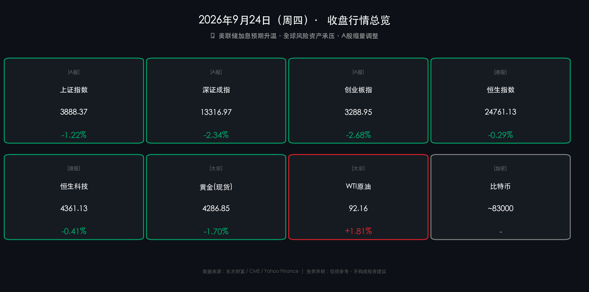

# 📉 A股收盘简报：美债恐慌蔓延，三大指数全线告跌

**日期：2026年09月24日 (星期四)** &nbsp; **时段：晚报（收盘复盘）**

> **核心摘要**：10年期美债收益率突破5.1%创近20年新高，美联储10月加息概率飙至70%，全球"股债双杀"格局向A股传导——三大指数全线收跌，成交额缩量至1.67万亿，中小盘成长股承压最重；原油因地缘风险大涨逾3%，通胀忧虑再起，市场避险情绪明显升温。

---

## 核心行情复盘

### A股三大指数（2026-09-24 收盘）

| 指数 | 收盘点位 | 涨跌幅 |
|------|---------|-------|
| 上证指数 | **3888.37** | 🟢 **-1.22%** |
| 深证成指 | **13316.97** | 🟢 **-2.34%** |
| 创业板指 | **3288.95** | 🟢 **-2.68%** |

* **成交额**：两市合计 **1.67 万亿元**，较前一交易日明显**缩量**，市场观望情绪浓厚。
* **个股分布**：全市场上涨 **1120** 只，下跌超 **4300** 只，跌多涨少格局显著。
* **板块亮点（领涨）**：风电设备、中船系、纺织制造表现相对活跃。
* **板块重灾（领跌）**：贵金属、元件、PCB概念跌幅居前（与美债利率走高直接相关）。

### 港股市场

* **恒生指数**：收报 **24,761.13 点**，跌 **0.29%**（-72.99点）。
* **恒生科技**：收报 **4,361.13 点**，跌 **0.41%**（-17.94点）。
* 港股相对抗跌，内房股表现活跃，但光通信、芯片等概念随美科技股走弱。

---

## 核心解读与市场逻辑

> **主线逻辑："更高更久"的美债收益率 → 全球估值重定价**
>
> 昨夜（9月23日），美国9月综合PMI飙升至58.4（近五年新高），通胀压力重燃，直接引爆了对美联储鹰派操作的新一轮押注。CME数据显示，10月加息25BP的概率从55%骤升至**近70%**，10年期美债收益率随之拉升至**5.116%**，创2007年7月以来最高。
>
> 美债收益率是全球资产定价的锚。当无风险利率高企，高估值科技股、成长股的折现率上升，内在价值被压缩——这一逻辑从美股（纳斯达克跌1.13%）直接传导至A股创业板（跌2.68%），形成国际联动。与此同时，原油因中东地缘风险反弹逾3%（布伦特原油103美元），进一步强化了"滞胀"担忧，令市场在"加息+能源通胀"双重压力下选择减仓避险。
>
> **A股的缩量特征值得关注**：今日1.67万亿成交额低于近期均值，叠加国庆前通常的"节前效应"（机构减仓落袋），当前回调更多是情绪宣泄而非趋势逆转，需警惕节前最后两个交易日的流动性边际收窄风险。

### 跨市场关键数据

| 资产 | 最新价 | 涨跌 |
|------|--------|------|
| 标普500（昨收） | 7,706.03 | 🟢 -0.75% |
| 纳斯达克（昨收） | 26,936.04 | 🟢 -1.13% |
| 10Y美债收益率 | **5.116%** | ↑ 历史新高 |
| 现货黄金 | 4,286.85 美元/盎司 | 🟢 -1.70% |
| WTI原油 | **92.16 美元/桶** | 🔴 +1.81% |
| 布伦特原油 | **103.08 美元/桶** | 🔴 +3.86% |
| 比特币 | ~83,000 美元 | 🟢 -约4% |
| 美元/人民币（中间价） | **6.7489** | ↓ 贬值21BP |

---

## 政策脉动

* 🇺🇸 **美联储**：鹰派信号持续释放，10月议息会议加息25BP概率升至约70%。强劲的PMI数据巩固了"higher for longer"（更高更久）的政策预期，市场已将"年内降息"预期完全出清。
* 🇨🇳 **中美高层互动**：9月24日前后，中美两国高层经贸磋商消息受到市场关注，预期外部环境阶段性稳定，为A股提供了一定的政策信心底色，但尚未能对冲美债流动性的外部冲击。
* 🇨🇳 **人民币汇率**：美元/人民币中间价报6.7489，较前日下调21BP，人民币短期承压但仍在6.70关口附近双向震荡，出口强劲形成支撑。

---

## 最新机构观点

> **中信证券**：当前是"年内最后的进攻窗口"。认为AI叙事及偏紧的全球流动性制约了机构重仓股的高度，但随三季报催化临近，市场将从"价的爆发"向核心资产"量的确定性"切换。维持"AI+能化"杠铃结构，关注燃气轮机、晶圆制造平台、半导体设备及出海头部企业。

> **摩根大通**：维持股市看涨，建议"逢回调买入"。看好新兴市场（含A股）相对发达市场的超额收益，偏好矿业、资本品与半导体板块；认为强劲的企业盈利和健康的资产负债表是对冲利率压力的核心缓冲垫。

> **高盛**：全球视角下，新兴市场盈利韧性突出。紧盯美联储加息节奏，认为若年底前油价回落，将打开"全资产上涨"窗口。建议关注中国经济基本面的韧性，并在全球资产组合中保留适当的新兴市场配置比例。

---

## 今日市场情绪：债市恐慌蔓延，避险风云骤起

> Prompt: A massive hourglass stands at the center, but instead of sand, black crude oil flows down, crushing a golden balance scale beneath it. In the background, towering red candlestick bars form a stormy sky, while a lone figure in a dark suit stares upward, holding a crumbling US Treasury bond. The atmosphere is tense, cinematic, and apocalyptic.

---

> 免责声明：内容仅供参考，不构成投资建议。市场有风险，投资需谨慎。
