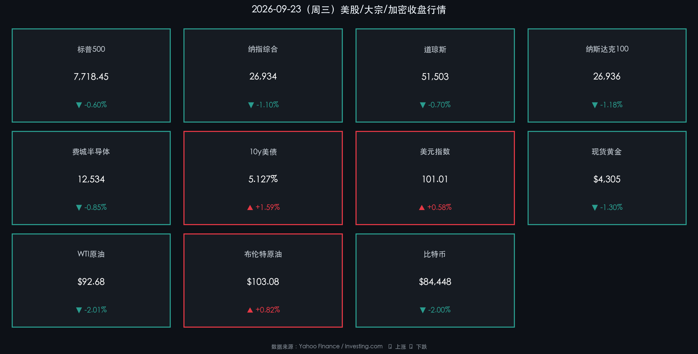

# 🌐 2026年09月24日（周四）国际市场早报

**日期：2026年09月24日 (星期四)** &nbsp; **时段：早报（国际市场）**

> **核心摘要**：S&P Global 9月美国综合PMI闪值飙升至58.4（逾五年最高），强劲经济数据叠加美联储鹰派表态，10年期美债收益率升破5.127%——刷新2007年金融危机前后的16年新高；美元指数随之走强至101附近；风险资产全线承压，美股三大指数周三集体收跌，WTI原油大幅回落逾2%，比特币跌破85,000美元关口，黄金亦受高利率压制显著下行。

---

## 核心行情复盘

### 🇺🇸 美股三大指数（9月23日收盘）

* **S&P 500**：收 **7,718.45**，跌 **-0.60%**（-46.19 点）
* **纳斯达克综合**：收 **~26,934**，跌 **-1.10%**——PMI超预期引发加息恐慌，成长股遭集中抛售
* **道琼斯工业**：收 **51,503**，跌 **-0.70%**（约-360 点）
* **纳斯达克100（NDX）**：收 **26,936.04**，跌约 **-1.18%**
* **费城半导体指数（SOX）**：收 **12,534.27**，跌约 **-0.85%**，芯片股连涨六日后首度回调

### 🔑 核心品种

* **10年期美债收益率**：**5.127%**，大幅上行 **+15.9bp**——创2007年以来**16年新高**，突破5%关键心理关口
* **2年期美债收益率**：约 **4.80%**，随整体曲线上移
* **美元指数（DXY）**：收 **101.01**，涨 **+0.58%**，延续强势至两个月高点
* **现货黄金**：收约 **$4,305/盎司**，跌 **-1.30%**，受高利率与强美元双重压制
* **WTI原油（10月）**：收 **$92.68/桶**，跌 **-2.01%**，地缘溢价有所收窄
* **布伦特原油（11月）**：收 **$103.08/桶**，涨 **+0.82%**（两基准分化，市场对供应端预期存在分歧）
* **比特币（BTC）**：收约 **$84,448**，跌 **-2.00%**，未能守住$85,000，10年美债破5%令风险偏好骤降
* **VIX 恐慌指数**：收 **14.73**，略有回升但仍处低波动区间

---

## 核心解读与市场逻辑

> **数据触发"加息再定价"**：9月23日 S&P Global 公布美国制造业PMI 57.0（52个月峰值）、服务业PMI 58.7（59个月峰值），综合PMI跳升至58.4——大幅超越预期。强劲数据叠加燃料与运输成本攀升，"通胀粘性顽固"预期卷土重来。10年期美债收益率随即破5%，引发股、金、加密的系统性定价重算。

> **股市结构**：利率敏感型成长股（科技/半导体）首当其冲，连续六日上涨的半导体股出现技术性止盈回调；防御板块（公用事业、必需消费）相对抗跌，道指跌幅窄于纳指，与前日结构逆转形成鲜明对比。

> **大宗商品分化**：WTI跌超2%，部分源于美伊外交接触延续（美伊纽约会谈后续传出进展），地缘风险溢价边际回落；但布伦特小幅上涨，两基准价差收窄，供应端预期仍存分歧。

> **比特币"美债破5%"压力测试**：BTC日内一度冲高$87,000，触及年初开盘价$87,498附近，随后随美债收益率飙升骤降，收于$84,448。机构持仓数据（Bitwise研究）显示中长期配置意愿仍强，但短期"高利率环境"对无息资产构成压制。

---

## 政策脉动

* **美联储（Fed）**：9月15-16日 FOMC 已加息25bp，联邦基金利率区间升至 **3.75%–4.00%**。9月23日，理事 Michael Barr 公开表态"基准情形下有必要进一步调整政策"，叠加18位委员中16位预期年内至少再加息一次，**10月会议加息概率升至68%–73%**（CME FedWatch）。
* **PMI数据背后**：AI相关基础设施投资与国防开支是本轮制造业扩张的双引擎，但同时也在推升工业品需求与运价——与美联储压通胀目标形成新的结构性矛盾。
* **美伊谈判**：美伊官员继周二会谈后持续进行磋商，油市情绪因此出现阶段性缓和，但中东整体地缘局势未根本性改变。

---

## 最新机构观点

* **高盛（Goldman Sachs）**：维持股票超配，但提示 AI 主题存在"过高预期"风险。建议以 TIPS 对冲尾部通胀风险；鉴于股债相关性提升，推荐通过私募基础设施、对冲基金等另类资产增强分散化。

* **摩根士丹利（Morgan Stanley）**：看好 AI 主题从"概念配置"向"基本面驱动"演进，但对小盘股估值保持审慎。长端政府债作为"压舱石"的功能弱化，建议采用多元化策略替代传统60/40组合，私募信用与私募股权可提供流动性溢价。

* **中金公司（CICC）内部观点**：美债利率的快速上行正重塑全球资本流向，新兴市场面临"双杀"压力（汇率贬值+资本外流），短期内 A50 期货与离岸人民币走势值得重点关注，以判断国内市场的传导强度。

---

## 今日市场情绪：利率骷髅登场，风险资产颤抖

> Prompt: A colossal skeletal figure clutching a glowing rate meter rises behind the Federal Reserve building, its ribcage filled with molten yield curves surging past 5%. Wall Street skyscrapers tremble in crimson dusk light, stock tickers cascade downward like falling red rain. In the background, a PMI gauge explodes with golden sparks. Hyper-detailed, ominous macro-economic horror.

---

*免责声明：内容仅供参考，不构成投资建议。*
