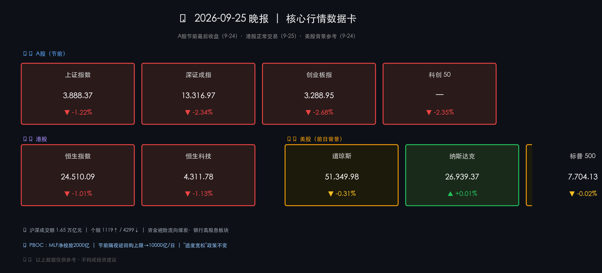

# 🏮 2026年09月25日（周五）A股节前收盘·港股正常交易晚报

**日期：2026年09月25日 (星期五)** &nbsp; **时段：收盘晚报**

> **核心摘要**：A股节前最后交易日（9月24日）三大指数全线回调，创业板指跌幅达 -2.68%，节前避险情绪主导成交缩至 1.65 万亿元；港股 9月25日因港股通暂停、南向资金缺席，恒生指数跌破 25,000 点整数关口至 24,510 点。PBOC 8,000亿MLF净投放2,000亿、节前流动性护航信号清晰，政策底依然夯实；机构共识向三季报业绩验证与核心科技硬件布局切换。

---

## 核心行情复盘

### 📊 行情数据卡片

---

## A股三大指数（节前最后交易日 2026-09-24 收盘）

* **上证指数**：收盘 **3,888.37** 点，涨跌幅 **-1.22%**（全线回调）
* **深证成指**：收盘 **13,316.97** 点，涨跌幅 **-2.34%**（成长赛道压力）
* **创业板指**：收盘 **3,288.95** 点，涨跌幅 **-2.68%**（跌幅最大）
* **科创 50**：涨跌幅 **-2.35%**，同步走弱

> **市场特征解读**：节前缩量回调，沪深两市合计成交额约 **1.65 万亿元**（较前一日有所回落），个股呈现普跌格局——上涨约 **1,119 家**，下跌约 **4,299 家**。资金流向明显分化，**煤炭、银行等高股息防御板块**获得主力净流入，成为节前避险资金的主要承接方向；高弹性成长赛道（半导体、新能源、科网）遭集中减仓。

---

## 港股恒生指数（2026-09-25 当日收盘）

* **恒生指数**：收盘 **24,510.09** 点，涨跌幅 **-1.01%**（↓251.04点）——**跌破 25,000 点关口**
* **恒生科技指数**：收盘 **4,311.78** 点，涨跌幅 **-1.13%**
* **恒生国企指数**：收盘 **8,165.78** 点，涨跌幅 **-1.21%**

> **结构性分析**：港股今日成交额约 **1,022 亿港元**，成交清淡。核心原因在于 A 股中秋节假期导致港股通同步暂停，**南向资金（北水）今日完全缺席**。此前（9月22日前后）南向资金已连续 **12 日净买入**，近期整体偏积极，主要配置方向为高股息防御板块及部分 AI 相关科技股。北水缺席叠加外资观望情绪，放大了港股跌幅——恒生指数跌破 25,000 整数关口更多是流动性真空的技术性回调，**并不完全代表基本面转向**。

### 港股领涨 / 领跌板块（2026-09-25）

**领涨板块（逆市上涨）：**

* 🟢 **医药生物 / CRO 板块**（节前逆市领涨）
  * 金斯瑞生物科技（01548.HK）**+8.0%**
  * 凯莱英（06821.HK）**+3.9%**
  * 药明康德（02359.HK）**+2.0%**，药明生物（02269.HK）**+2.0%**
  * 联想集团（00992.HK）**+3.0%**（蓝筹逆市领涨）

**领跌板块：**

* 🔴 **新能源汽车**：赛力斯 **-5.0%**，理想汽车 **-3.2%**，比亚迪、零跑汽车等跟跌
* 🔴 **石油与能源**：中石油、中海油、山东墨龙均走软
* 🔴 **电力设备**：上海电气 **-3.5%**，金风科技、中广核矿业下跌
* 🔴 **科网股**：商汤、网易-S、小米-W、京东均承压
* 🔴 **内房股**：融创、万科、碧桂园继续走低

---

## 美股背景参考（2026-09-24 纽约时间收盘）

* **道琼斯工业指数**：收盘 **51,349.98** 点，涨跌幅 **-0.31%**
* **纳斯达克综合**：收盘 **26,939.37** 点，涨跌幅 **+0.01%**（几近持平）
* **标普 500**：收盘 **7,704.13** 点，涨跌幅 **-0.02%**

> **美股研判**：隔夜美股三大指数近乎持平，整体稳健，未对亚太市场形成明显负向外溢，为本周港股及 A 股节后开盘提供了相对友好的外部背景。

---

## 人民币汇率

* 在岸人民币（CNY）收盘：**6.7125**
* 市场参考中间价：约 **6.7129～6.7133**
* 中国银行现汇卖出价：**6.7319**

> **汇率政策背景**：PBOC 明确防范"羊群效应"，通过中间价管理与窗口指导机制，维护人民币汇率在**合理均衡水平**的基本稳定。当前汇率区间整体可控，不构成系统性扰动因子。

---

## 核心解读与市场逻辑

> **一、A股节前缩量回调：避险而非趋势逆转**
> 
> 中秋节前最后交易日（9月24日），市场呈现**典型节前避险行为**：成长赛道回调幅度明显大于价值板块；沪深成交额 1.65 万亿元显示资金主动收缩，并非恐慌性抛售。节前减仓具有季节性规律性，不应过度解读为趋势性看空信号。

> **二、港股"北水缺席"放大跌幅：结构性解释**
> 
> 9月25日港股通暂停，使得南向资金无法参与，成交额仅 **1,022 亿港元**。在缺乏流动性支撑下，恒生指数跌破 **25,000 点**整数关口，形成技术位破位。值得注意的是，此前南向资金已**连续12日净买入**，港股中长期配置逻辑并未改变，北水节后回归有望提供修复动力。

> **三、美股稳定提供外部支撑**
> 
> 隔夜美股三大指数整体近乎持平（纳指微涨 +0.01%），表明全球流动性压力阶段性缓和，未对亚太市场形成新的负向冲击，为 A股节后开盘及港股持续性回稳提供了相对友好的外部环境。

> **四、政策底清晰，节后流动性护航**
> 
> PBOC 9月24日大规模 MLF 操作（8,000 亿元，净投放 2,000 亿元），并将 9月28日至 10月8日隔夜逆回购单日上限提升至 **10,000 亿元**，释放清晰的节前流动性呵护信号。"适度宽松"货币政策基调不变，加大逆周期调节力度，有助于节后市场信心恢复。

> **五、节后关注焦点**
> 
> ① **三季报业绩验证**（10月披露季）将是重要换仓窗口，业绩为王逻辑主导；② **美联储政策路径**动态（通胀与就业数据）；③ **中美关系**最新进展；④ **《金融产品网络营销管理办法》** 于 2026年9月30日正式实施对理财市场的影响。

---

## 政策脉动

### 中国人民银行（PBOC）

* 📌 **货币政策例会（9月24日）**：继续实施"**适度宽松**"货币政策，加大逆周期调节力度，强调"六张网"建设首次列为货币政策重点支持领域。
* 📌 **MLF 操作**：9月24日开展 **8,000亿元** MLF 操作，实现**净投放 2,000 亿元**，主动补充银行体系流动性。
* 📌 **节前流动性保障**：9月28日至10月8日，每日隔夜逆回购上限上调至 **10,000 亿元**，确保中秋假期期间流动性平稳。
* 📌 **汇率管理**：明确防范"羊群效应"，维护人民币汇率在合理均衡水平的基本稳定。

### 中国证监会（CSRC）

* 📌 持续推动"**长牙带刺**"式监管，加大对**财务造假、内幕交易**的查处力度。
* 📌 落实《综合整治非法跨境证券期货基金经营活动实施方案》，强化跨境合规监管。
* 📌 持续推动**中长期资金入市**政策落地，引导险资、社保等耐心资本扩大权益配置。

### 即将生效

* ⚠️ **《金融产品网络营销管理办法》** 将于 **2026年9月30日**正式实施，规范互联网平台金融产品推介行为，影响基金、理财、保险等多类产品的线上营销模式。

---

## 最新机构观点

### 🏦 高盛（Goldman Sachs）

> 持续建议**超配中国股票**，强调盈利增长（2026-2027年预计强劲）与估值修复的双重逻辑。A股在 **AI 硬件等硬科技领域**配置价值优于 H 股；持续关注中国 AI 模型产业普及与企业"出海"趋势。认为近期市场波动属于**阶段性调整**，未改变中长期看多逻辑。

### 🏦 摩根大通（J.P. Morgan）

> 维持看涨观点，认为近期因油价与利率冲击引发的回调是 **"阶段性停顿，非反转"**。行业配置倾向：**矿业、资本品、半导体**；密切关注全球 AI 基础设施资本支出持续增长。中国资产目标：**沪深300 年初预测目标约 5,200 点**（基于企业盈利改善逻辑）。

### 🏦 中金公司（CICC）—— 秋季策略"聚力·笃行"

> AI 革命影响进入**深水区**，建议关注"**算力供给→生产率提升**"逻辑转化。配置主线：**景气成长**（AI 应用、创新药）+ **外需出海**（家电、机械）+ **周期反转**（化工、养殖）。强调"审慎择优"，注重基本面与估值修复平衡，关注**现金流确定性**。

### 🏦 中信证券（CITIC Securities）

> 明确提出把握 **"年内最后的进攻窗口"**（9月下旬）。产业动向：AI 算力正式进入**"全液冷"时代**，液冷从可选配置升格为**刚性基建**。港股策略：维持**红利策略**推荐，关注南向资金参与度高、外资定价权低的细分领域。

### 机构共识

1. **业绩为王**：10月三季报披露将是重要换仓窗口，业绩验证替代主题炒作。
2. **风格切换**：从题材驱动转向**基本面扎实 + 高股东回报**标的。
3. **防御与进攻并重**：利用节前回调寻找**核心科技硬件**与**顺周期龙头**布局机会。

---

## 今日市场情绪：节前退潮，静待归航

> *Prompt: A vast ocean harbor at dusk, traditional red lanterns hanging on the docks as fishing boats carefully anchor before a holiday storm. The sea churns with dark green waves while distant lighthouse beams cut through amber clouds. A lone captain studies charts on the deck, remaining calm amid the turbulence, knowing the harbor will be vibrant again after the festival. Cinematic, oil painting style with rich texture.*

---

## 风险提示与免责声明

本报告由 AI 自动生成，所有内容**仅供参考，不构成任何投资建议**。金融市场存在较大风险，投资者应结合自身风险承受能力独立决策。市场数据以各交易所官方公告为准，本报告中出现的数据若与官方数据存在偏差，以官方为准。

---

*报告生成时间：2026-09-25 | 数据来源：沪深交易所、港交所、Bloomberg、各机构公开研报*
