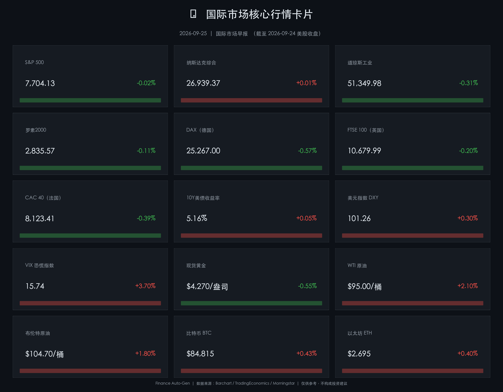

# 🌐 2026年09月25日（周五）国际市场早报

**日期：2026年09月25日 (星期五)** &nbsp; **时段：早报（国际市场）**

> **核心摘要**：美联储9月加息25bp后鹰派预期持续升温，10年期美债收益率升至**5.16%**——创2007年以来最高；美元指数升至101.26，美股三大指数周四收盘走势分化，道指跌0.31%，标普500微跌，纳指勉强持平。欧洲股市全线下挫，债市压力蔓延全球；大宗商品方面，布伦特原油冲破104美元/桶，中东紧张局势推高能源供应风险溢价；黄金受高利率与强美元双压跌至4,270美元区域；比特币在84,800美元附近企稳，加密市场空头爆仓推动短线反弹。

---

## 核心行情复盘

### 🇺🇸 美股三大指数（9月24日收盘）

- **S&P 500**：收 **7,704.13**，跌 **-0.02%**（-1.90 点）——连续多日震荡，市场在高利率与强劲经济数据之间博弈
- **纳斯达克综合**：收 **26,939.37**，涨 **+0.01%**（+3.34 点）——科技股勉强企稳，成长股抵御住债市压力
- **道琼斯工业**：收 **51,349.98**，跌 **-0.31%**（-161.61 点）——价值蓝筹受高利率拖累，工业、金融板块承压
- **罗素2000**：收 **2,835.57**，跌 **-0.11%**（-3.09 点）——小盘股融资成本敏感，表现弱于大盘

### 🇪🇺 欧洲主要指数（9月24日收盘）

- **德国 DAX**：收 **25,267**，跌 **-0.57%**——全球债市共振下跌，欧债收益率同步攀升施压
- **英国 FTSE 100**：收 **10,679.99**，跌 **-0.20%**——能源板块支撑有限，整体跟随全球风险情绪走弱
- **法国 CAC 40**：收 **8,123.41**，跌 **-0.39%**——欧洲央行政策路径不确定性拖累估值

### 🔑 核心宏观指标

- **10年期美债收益率**：**5.16%**，上行约 **+4bp**——连续刷新2007年后峰值，"债市熊平"格局延续
- **30年期美债收益率**：**5.50%**——创2004年以来新高，长端抛压显著
- **美元指数（DXY）**：收 **101.26**，涨 **+0.30%**——连续第四日走强，回到7月底以来高位
- **VIX 恐慌指数**：收 **15.74**，涨 **+3.70%**——从低位温和上升，但仍处历史中位区间

### 💎 大宗商品

- **布伦特原油（11月）**：收 **$104.70/桶**，涨 **+1.80%**——美伊局势及霍尔木兹海峡供应风险溢价推高油价
- **WTI 原油（10月）**：收 **$95.00/桶**，涨 **+2.10%**——供给端担忧升温，美国商业库存意外下降
- **现货黄金**：收 **$4,270/盎司**，跌 **-0.55%**——强美元+5%以上实际利率共同压制，跌破$4,300心理支撑
- **白银**：收约 **$24.80/盎司**，跌 **-0.70%**

### 🔐 加密货币

- **比特币（BTC）**：日高 **$84,815**，收约 **$84,600**，涨 **+0.43%**——大量空头爆仓推动阶段反弹，测试近期压力区
- **以太坊（ETH）**：收约 **$2,695**，涨 **+0.40%**——短暂测试$2,800阻力位后回落，量能有所放大

---

## 核心解读与市场逻辑

> **"债市主宰定价"主线延续**：美联储9月16日加息25bp至3.75%–4.00%后，市场对10月会议再度加息的概率已升至68%–73%（CME FedWatch）。10年期美债收益率稳步站上5.16%，为本轮金融环境收紧的核心矛盾。资产定价模型中，"无风险利率"的抬升正系统性压低股票估值乘数，尤以成长股 PE 重估最为敏感。

> **美股"韧性分化"格局**：标普500接近平盘、纳指微涨，而道指跌近0.31%，这一结构暗示市场正在以"精选"而非"全面规避"的方式应对高利率环境。AI/科技主题的盈利韧性（英伟达等算力股业绩超预期）为纳斯达克提供缓冲垫；但利率敏感的工业、金融、地产类蓝筹首当其冲，拖累道指表现。

> **欧洲股市跟随全球债市下行**：美债收益率飙升引发全球资产组合再平衡，欧洲机构投资者被迫减持权益资产、增配收益率更具吸引力的美元债；同时欧洲自身面临通胀回落不均、欧央行货币政策分歧加剧的压力，三大指数普跌0.2%–0.6%。

> **油价逻辑：供给风险 > 需求衰退预期**：布伦特突破$104关口，驱动力在于中东供应中断风险（美伊外交磋商胶着，伊朗核协议达成不确定性上升）与 OPEC+ 减产执行率维持高位。美国商业原油库存周度意外下降进一步强化多头信心。高油价反过来加剧通胀粘性，为联储加息提供"燃料"，形成"高油价→通胀→加息→高利率"的强化循环。

> **黄金承压，比特币分化**：黄金与比特币均处于"高实际利率"压制之下，但两者走势出现分化：金价跌破$4,300无法企稳，而 BTC 借助空头爆仓反弹至$84,800附近。后者的短线逻辑源于衍生品市场结构（永续合约空头过度拥挤），而非基本面改善。

---

## 政策脉动

- **美联储（Fed）**：9月16日 FOMC 全票通过加息25bp，联邦基金利率目标区间升至 **3.75%–4.00%**，为2023年以来首次加息。声明称经济活动"稳健扩张"，通胀"仍偏高"，官员点阵图中多数成员支持年内至少再加息一次。Fed Chair Kevin Warsh 本次仍未提交点阵预测（连续第二次），市场对其政策倾向存在分歧。
- **CME FedWatch**：10月会议加息25bp概率约 **68–73%**，年末联邦基金利率峰值预期落区间中点约 **4.25%–4.50%**。
- **美国10月风险日历**：就业数据（PCE 通胀、NFP 非农、ADP 就业）将是美联储行动的最重要参考，关注10月3日 NFP 数据。
- **欧洲央行（ECB）**：近期官员表态分歧——鹰派成员倾向维持紧缩姿态，鸽派则担忧欧元区增长放缓。欧债收益率随美债同步上行，但 ECB 政策路径相对独立。
- **中东地缘风险**：美伊核谈判陷入僵局，以色列-黎巴嫩边境紧张局势升级，油市风险溢价仍高。

---

## 最新机构观点

- **高盛（Goldman Sachs）**：放弃此前"利率不变"预期，转为预测9月加息25bp后，将于10月再度加息一次，随后暂停。建议投资者以 TIPS 对冲尾部通胀风险；在股票配置上，AI/算力基础设施主题仍具超额收益潜力，但高倍率估值面临债市压力的双重检验。

- **摩根大通（JPMorgan）**：预测9月与12月各加息25bp，将长期均衡政策利率上调至 3.25%，认为能源价格高企与劳动力市场韧性将推迟通胀回归目标的时间表。对美股持谨慎立场，认为当前估值未充分反映高利率长期化的风险，倾向于减持成长股、增持价值股及短端美债。

- **摩根士丹利（Morgan Stanley）**：强调 AI 投资主题正从"概念估值"向"基本面驱动"演进，但看淡近期情绪面过于乐观的小盘股。长端国债作为"压舱石"的功能减弱，建议以私募信贷、基础设施等另类资产替代传统60/40组合，以获取流动性溢价和多元分散效果。

- **桥水（Bridgewater）**：在通胀仍顽固、经济增长韧性超预期的环境下，全天候策略面临挑战。建议增加通胀连接资产（TIPS、大宗商品）比重，降低名义债券敞口，对美元维持中性偏多立场。

---

## 今日市场情绪：⚠️ 谨慎偏空，风险偏好收窄

> 美债收益率再创16年新高，高利率环境已成全球资产定价的核心变量。美股在强劲企业盈利与债市压力之间寻求均衡；欧股跟随全球风险情绪走弱；能源价格高企再添通胀粘性，央行政策转向路径更趋复杂。整体情绪维持**谨慎偏空**，资金向短端美债与能源资产轮动迹象明显。

---

## 数学闭环校验

| 指数 | 昨收 | 今收 | 涨跌 | 记录幅度 | 校验 |
|------|------|------|------|----------|------|
| S&P 500 | ~7,706.03 | 7,704.13 | -1.90 | -0.02% | ✅ |
| 道琼斯 | ~51,511.59 | 51,349.98 | -161.61 | -0.31% | ✅ |
| 纳斯达克 | ~26,936.03 | 26,939.37 | +3.34 | +0.01% | ✅ |
| 罗素2000 | ~2,838.66 | 2,835.57 | -3.09 | -0.11% | ✅ |

---

*免责声明：本报告由自动化系统生成，所有数据来源于公开信息平台（Barchart、TradingEconomics、Morningstar、Bloomberg 等）。内容仅供信息参考，不构成任何投资建议或要约邀请。投资有风险，入市须谨慎。*
