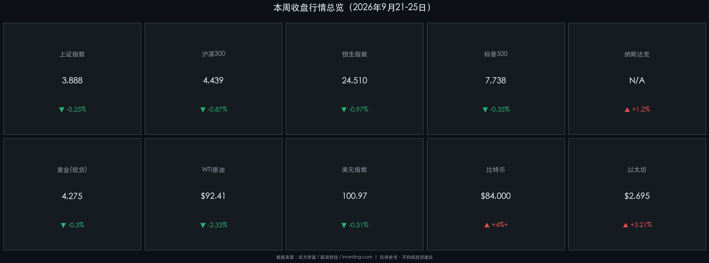

# 2026年9月26日（周六）· 金融简报

**日期：2026年09月26日 (星期六)** &nbsp; **时段：下午 · 周末复盘**

> **核心摘要**：本周全球市场整体承压——美联储三年来首次重启加息（+25bp 至 3.75-4.00%）引发全球流动性再定价，美股标普500周跌0.35%，港股恒生跌0.97%；A股在政策面支撑下结构分化，沪深300震荡收跌；加密货币逆势领涨，BTC本周大涨逾4%，创八个月新高；下周美国非农与PCE数据将是决定市场方向的关键博弈锚点。

---

## 核心资产周度/日度表现回顾

### 🇨🇳 中国权益市场

**本周行情卡片：**

* **上证指数**：周五收盘 **3,888.37点** | 周五单日 **-1.22%** | 全周累计约 **-0.25%**
  * 周初（9月21日）情绪回暖，指数上涨0.97%；周三起受"9·24"两周年存量资金博弈影响，多空拉锯加剧，周尾回落。
* **沪深300**：周五收盘 **4,439.14点** | 周五单日 **-1.73%** | 全周累计约 **-0.87%**
  * 大盘蓝筹承受较大抛压，机构资金从"总量配置"向"结构精选"迁移迹象明显。
* **成交额**：周后半段缩量，存量博弈特征突出，市场待新催化剂驱动。
* **主力资金**：AI算力、先进制造板块获得小幅净流入；消费、地产板块吸引边际增量资金关注。

> **核心解读**：A股本周呈典型的"节前观望+存量博弈"形态。10月1日国庆长假临近，部分资金选择提前锁定利润，对指数形成拖累。但下跌并非基本面恶化信号——政策面仍持续释放正能量：央行"六张网"结构性工具、医药"十五五"规划密集落地，产业逻辑对结构性行情的支撑依然坚实。

### 🇭🇰 港股

* **恒生指数**：周五收盘 **24,510.09点** | 周五单日 **-1.01%（-251.04点）** | 全周累计 **-0.97%**
* 港股本周"冲高回落"：9月21日一度站上25,042点，随后三连阴失守25,000点关口。
* 美联储加息预期升温、美债收益率上行是核心压制因素；获利盘回吐亦加重了回调幅度。

> **核心解读**：港股估值洼地属性依然存在，但在外部利率环境趋紧背景下，资金对港股的高弹性预期有所降温。25,000点是下阶段强阻力与强支撑的双向博弈区域。

---

## 全球市场周度表现

### 🇺🇸 美股

| 指数 | 周五收盘 | 周五涨跌 | 全周累计 |
|------|---------|---------|---------|
| 标普500 | 7,737.72 | +0.44% | **-0.35%** |
| 纳斯达克 | — | 领涨 | **+1.2%（估）** |
| 道琼斯 | — | 震荡 | 小幅偏弱 |

* 本周走势：周一科技/芯片股带动指数跳涨（S&P +1.49%），随后消化美联储加息落地冲击，周三至周四连续回调，周五小幅反弹收红。
* 核心驱动：AI+芯片板块韧性突出，大型科技股提供指数支撑；非AI传统行业受高利率压制明显。

> **核心解读**：美联储9月16日重启加息（至3.75-4.00%），是2023年7月以来首次。市场已提前定价，加息"落地"后美债收益率反而小幅回落——但这一逻辑能否持续，完全取决于下周PCE与非农数据的冷热程度。若非农强劲，11月再次加息预期将迅速升温。

### 🌍 商品与外汇

* **黄金（现货）**：周五约 **4,275.25 美元/盎司**（另一数据源报4,284.76），全周震荡偏软。
  * 受加息环境压制，但地缘风险（中东局势）提供底部支撑，未见大幅破位。
* **WTI原油**：周五收 **92.41 美元/桶**，单日 **-2.33%**；布伦特 **104.32 美元/桶**，单日 **-2.14%**。
  * 美伊外交谈判缓和预期 + 美国原油库存意外增加，双重利空压油价。
* **美元指数**：周五收 **100.97**，单日 **-0.31%**，跌回101下方。
  * 美元小幅走软为黄金与新兴市场资产提供了短暂喘息空间。

### 🪙 加密货币（本周最亮眼赛道）

* **比特币（BTC）**：约 **84,000 美元** | 全周 **+4%+** | 本周高点触及 **87,363 美元**（近八个月新高）
  * 现货ETF资金大规模回流为核心驱动；季度期权到期（9月25日）未引发抛售，多头韧性显著。
* **以太坊（ETH）**：约 **2,680-2,710 美元** | 全周 **+3.21%**
  * 现货ETF活跃交易支撑，技术面动能维持买入信号区间。

> **核心解读**：在传统股市震荡、利率压力犹存的背景下，加密资产本周强势独立行情值得关注。BTC创下近八个月新高，机构ETF持续净买入是最有力的上涨背书。但需警惕：美联储若继续收紧，高风险资产（包括BTC）的流动性溢价随时可能收窄。

---

## 过去48小时重磅事件深度复盘

1. **美联储重启加息（9月16日落地，本周持续消化）**
   * 联邦基金利率目标区间上调25bp至 **3.75%-4.00%**，由新任主席凯文·沃什（Kevin Warsh）领导委员会一致通过。逻辑：通胀仍高于2%目标 + 经济韧性充足，具备加息空间。市场反应整体平稳，属"预期内落地"。

2. **中国央行三季度例会：坚持"以我为主"适度宽松**
   * LPR（9月20日）维持不变：1年期 **3.0%**、5年期 **3.5%**，连续16个月持稳。
   * 首次将**"六张网"**（水网、新型电网、算力网、新一代通信网、城市地下管网、物流网）列为结构性货币政策工具重点支持方向，意在定向激活实体经济需求。
   * 汇率政策：防范"羊群效应"，维护人民币在合理均衡水平的基本稳定。

3. **产业政策密集发布——医药"十五五"规划等**
   * 9月中下旬，《医药工业发展"十五五"规划》等产业政策密集落地，直接催化医药生物板块走强。

4. **比特币现货ETF创阶段性新高**
   * 本周机构资金通过美国现货BTC-ETF大规模净买入，BTC突破87,363美元，创近八个月高点。季度期权顺利到期，多头未遭打压。

---

## 下周全球宏观大事预警

| 时间 | 事件 | 重要性 |
|------|------|--------|
| 9月29日（周二） | 美国JOLTS职位空缺（8月） | ⭐⭐⭐ |
| 9月30日（周三） | **美国PCE物价指数**（Fed最爱通胀指标）| ⭐⭐⭐⭐⭐ |
| 9月30日（周三） | 美国GDP季度终值 | ⭐⭐⭐⭐ |
| 10月1日（周四） | 中国国庆假期开始（A股/港股休市）| — |
| 10月2日（周五） | **美国9月非农就业报告**（北京时间20:30）| ⭐⭐⭐⭐⭐ |
| 10月2日（周五） | 全球PMI最终读数（中/欧/日/美）| ⭐⭐⭐ |

> ⚠️ **风险警示**：下周双压轴——**PCE（通胀）+ 非农（就业）**。若数据强于预期，美联储11月再度加息概率将大幅提升，届时美债收益率上行+美元走强，将对黄金、新兴市场及高估值成长股形成联动压制。A股因国庆休市可规避冲击，但节后首日（10月8日）的补涨/补跌将是关键观察窗口。

---

## 顶级机构周末策略内参摘要

**🏦 中信证券**（本周最新）
> "当前市场已进入年内最后的进攻窗口之一。我们提出'AI+能化'杠铃结构——AI算力板块不存在系统性过剩，坚持再平衡；能化板块受益于油价高位与政策定向支持。同时需关注盈利增速顶点信号与宏观流动性变化。"

**🏦 华泰证券**（策略团队）
> "市场正处于'宏观波动与科技跃迁同频共振'阶段。建议通过拥挤度甄别实现配置再平衡——AI相关赛道适度获利了结，转而布局业绩验证确定性更高的细分领域。"

**🏦 国泰海通**（策略团队）
> "行情扩散与均衡是Q4主基调，不再是'一枝独秀'。看好本土创新科技、先进材料、精密制造、医药生物，以及大金融与高分红板块的轮动机会。"

**🌐 国际机构观点（综合）**
> 高盛、摩根士丹利等国际机构当前核心关注：全球流动性环境下中国资产的估值吸引力。尽管Fed加息构成外部压力，但中国市场相对全球的估值折扣仍具吸引力；经济结构转型背景下的盈利增长潜力是维持中性偏多立场的主要依据。

---

## 今日市场情绪：惊涛博弈，静待号角

> Prompt: A lone sailing ship navigates a stormy sea made entirely of red and green candlestick charts, its mast bearing a banner with a golden balance scale. In the background, a giant digital clock counts down to next week's Non-Farm Payrolls release, casting an eerie red glow over the crashing waves. Cinematic, epic scale.

本周全球资金在"美联储重启加息"的惊涛中艰难航行。帆船（市场）未沉，但已失守部分关键位。下周非农与PCE这两声"发令枪"，将决定第四季度风浪的走向——是重回晴空，还是二次入港规避风险？

---

*免责声明：内容仅供参考，不构成投资建议。市场有风险，投资需谨慎。*
