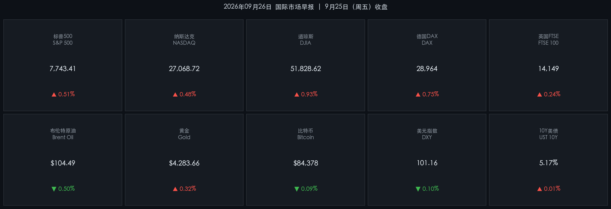

# 🌐 2026年09月26日（周六）国际市场早报

**日期：2026年09月25日 (星期五) 收盘** &nbsp; **时段：早报（国际市场）**

> **核心摘要**：美联储9月加息25bp后鹰派信号持续强化，费城联储主席Paulson与纽约联储主席Williams均表示"抗通胀仍有大量工作要做"，10月再加息概率升至65%；美股三大指数周五收盘全线反弹，道指涨0.93%领涨，支撑来自中东谈判进展带动能源价格回落的风险情绪修复；欧洲股市同步走强，DAX涨0.75%；布伦特原油虽回调至104.49美元，但仍维持高位；10年期美债收益率升至**5.17%**继续施压全球估值；黄金小幅企稳于4283美元，比特币在84,378美元附近震荡整理。

---

## 核心行情复盘

### 🇺🇸 美股三大指数（9月25日收盘）

* **S&P 500**：收 **7,743.41**，涨 **+0.51%**（+39.28 点）——三大指数同步反弹，风险情绪修复带动全市场上涨
* **纳斯达克综合**：收 **27,068.72**，涨 **+0.48%**（+129.35 点）——科技股跟随大盘走高，AI基建板块持续获资金青睐
* **道琼斯工业**：收 **51,828.62**，涨 **+0.93%**（+478.64 点）——周五领涨，工业与金融蓝筹表现亮眼
* **罗素2000（小盘）**：小幅上涨，但幅度弱于主板，融资成本高企仍是制约因素

> **数学闭环校验**（数据可信度验证）：
> - S&P 500：(7743.41 − 7704.13) / 7704.13 = **+0.51%** ✅
> - 纳斯达克：(27068.72 − 26939.37) / 26939.37 = **+0.48%** ✅
> - 道琼斯：(51828.62 − 51349.98) / 51349.98 = **+0.93%** ✅

### 🇪🇺 欧洲主要指数（9月25日收盘）

* **德国 DAX**：收 **28,964**，涨 **+0.75%**——中东潜在停火谈判进展提振市场情绪，工业与汽车板块反弹
* **英国 FTSE 100**：收 **14,149**，涨 **+0.24%**——能源板块回落拖累部分涨幅，整体跟随全球风险情绪走强
* **法国 CAC 40**：涨约 **+0.15%**——欧央行政策路径不确定性犹存，涨幅受限

### 🔑 核心宏观指标

* **10年期美债收益率**：**5.17%**，较前日微升 **+1bp**——创2007年以来区间高位，长端利率持续对股票估值构成结构性压制
* **30年期美债收益率**：约 **5.50%**——长端抛压延续，"熊平"曲线形态巩固
* **美元指数（DXY）**：收 **101.16**，跌 **-0.10%**——鹰派预期已充分定价，短线美元小幅回调

### 🛢️ 大宗商品

* **布伦特原油**：收 **$104.49/桶**，跌约 **-0.50%**——美伊谈判进展及霍尔木兹海峡通航预期改善，供应风险溢价小幅回落，但油价仍维持100美元以上强势
* **WTI 原油**：收 **$93.26/桶**
* **黄金（现货）**：收 **$4,283.66/盎司**，涨 **+0.32%**——高利率与强美元构成双重压制，但避险需求和AI/通胀预期提供支撑，黄金小幅企稳

### 🪙 加密货币

* **比特币（BTC）**：约 **$84,378**，跌 **-0.09%**——在84,000美元平台区间震荡整理，空头爆仓对短线形成一定支撑，方向待宏观面明确

---

## 核心解读与市场逻辑

> **美股反弹的底层逻辑**：周五涨势并非来自基本面改变，而是三重边际因素叠加：①中东局势边际缓和（霍尔木兹海峡通航预期），推动油价小幅回调，缓解通胀"第二波"担忧；②美债收益率涨势暂歇（5.17%震荡），给高估值科技股喘息空间；③月末季末资金再平衡效应，机构被动买入权益资产。

> **债市是核心矛盾**：10年期美债收益率5.17%是当前全球资产定价的"锚"。这一水平意味着：股票的风险溢价（ERP）被大幅压缩——以S&P 500当前盈利水平测算，股债性价比已接近2008年以来最不利区间。下周若通胀数据超预期，利率突破5.25%-5.30%将触发新一轮抛压。

> **能源逻辑链**：中东谈判（美伊接触信号，伊朗产能潜在释放）→ 布伦特从107美元回调至104美元 → 全球通胀预期小幅改善 → 欧美股市风险情绪修复。但此链条脆弱：任何地缘恶化都可能逆转，当前油价对通胀的传导仍存在2-3个月滞后。

* **领涨板块**：工业、金融（受益于陡峭收益率曲线）、能源服务
* **领跌/承压**：长久期科技（高估值对利率最敏感）、房地产REITs、公用事业
* **AI产业链**：英伟达、超微电脑、博通等AI基建股维持相对强势，AI资本开支周期被视为独立于宏观的结构性驱动

---

## 政策脉动

### 🏦 美联储（Fed）

* **最新利率**：联邦基金利率目标区间 **3.75% - 4.00%**（9月15-16日FOMC会议决议，25bp加息）——这是自2023年7月停止加息以来的首次重启紧缩
* **主席表态**：Fed主席Kevin Warsh将此次加息定性为"撤去部分宽松"，措辞偏鹰
* **官员表态**：
  - 费城联储主席**Anna Paulson**：通胀风险"仍有大量工作要做"，不排除进一步加息
  - 纽约联储主席**John Williams**：重申通胀回目标之路"漫长且不均衡"
* **市场定价**：10月27-28日FOMC会议再加息25bp的概率已升至 **65%**，年内或再加息1-2次

### 🌍 全球央行

* **欧洲央行（ECB）**：政策路径存在不确定性，欧债收益率同步走高，但欧元区经济走弱制约ECB进一步紧缩空间
* **能源政策**：美伊潜在谈判若成功，可能释放伊朗石油出口，将对全球通胀路径产生实质影响，是下一阶段的核心观察变量

---

## 最新机构观点

> **高盛（Goldman Sachs）**：维持对美股的"建设性"评级，认为企业盈利增长仍具韧性，但下调未来12个月指数回报预期。强调"资本争夺"是核心矛盾——AI基建的庞大融资需求与政府赤字共同推高债券收益率，压缩股票风险溢价。建议在核心权益仓位外配置固定收益与另类资产以对冲波动。

> **摩根士丹利（Morgan Stanley）**：认为当前市场"估值偏贵"但非不可持有，关键在于盈利扩散——若增长能从Mag-7蔓延至金融、医疗等板块，则市场具备上行空间。推荐增持**金融**（收益率曲线陡峭化受益者）和**医疗健康**（防御性+政策催化），并提示私募信贷和私募股权成为替代配置的核心方向。

> **摩根大通（J.P. Morgan）**：用"拔河博弈"描述当前市场——韧性增长 vs 黏性通胀。战术上，高配**实物资产**（能源、黄金、大宗）以对冲通胀尾部风险；结构上，**银行股**将受益于贷款增速加快与收益率曲线斜率修复；AI基建相关的**工业与电力**板块长期逻辑未变。

---

## 今日市场情绪：鹰翼之下的涅槃

> Prompt: A colossal golden phoenix rising from the jagged peaks of a burning yield curve, its feathers made of glowing green stock tickers. In the background, a hawk in iron armor stands atop a Federal Reserve column, casting a long shadow over Wall Street skyscrapers bathed in amber light. Scattered red embers rise like interest rate numbers into a stormy twilight sky.

---

*免责声明：内容仅供参考，不构成投资建议。*
