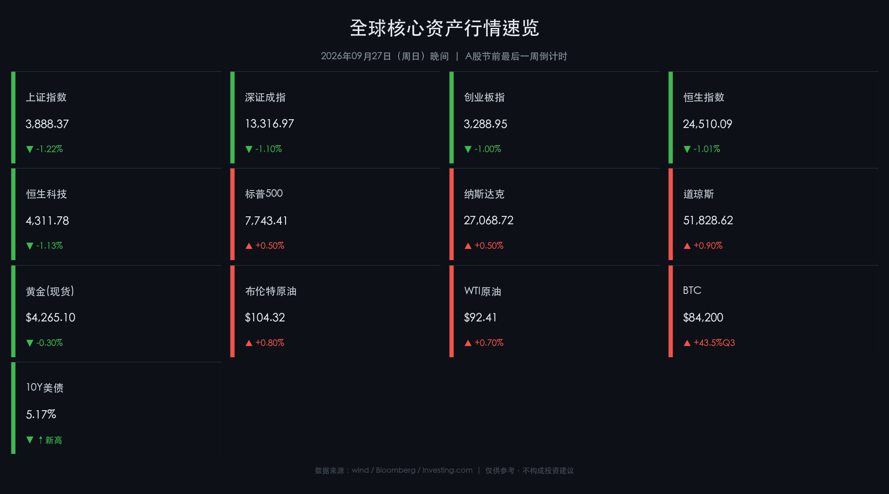

# 全球市场周日晚间简报：国庆前最后一周开战倒计时

**日期：2026年09月27日 (周日)** &nbsp; **时段：晚间展望**

> **核心摘要**：A股本周进入国庆假期前最后3个交易日（9/28-9/30），节前资金避险情绪主导，上证3888点技术支撑面临考验；美债10年期收益率创2007年以来新高（5.17%），全球估值重压不减；9/30 PCE 通胀数据+10/2 非农报告构成本周最高风险双雷，将在国庆长假期间持续冲击离岸人民币与港股。

---

## 周末财经要闻终极汇总

### 📊 核心资产周末收盘速览

**A股（9月24日，节前最后数据）**

*   **上证指数** 收 **3,888.37**，单日 **-1.22%**；沪深两市成交 **1.67万亿元**（较前日萎缩）
*   **深证成指** 收 **13,316.97**，约 **-1.10%**
*   **创业板指** 收 **3,288.95**，约 **-1.00%**

> 节前资金全面进入避险模式，成交量明显萎缩。市场情绪以防守为主，机构持仓结构性调整迹象明显，北向资金净流出加剧了指数压力。

**港股（9月25日，周五）**

*   **恒生指数** 收 **24,510.09**，单日 **-1.01%**（-251.05点），成交 **1,022亿港元**（成交持续缩量）
*   **恒生科技指数** 收 **4,311.78**，单日 **-1.13%**

> 港股通关闭日南向资金缺席，科技板块（互联网龙头、新能源车）成为主要拖累。创新药板块逆势走强，金斯瑞生物等个股表现亮眼，成为市场少数亮点。

**美股（9月25日，周五）**

*   **标普500** 收 **7,743.41**，**+0.50%**
*   **纳斯达克综合指数** 收 **27,068.72**，**+0.50%**
*   **道琼斯工业指数** 收 **51,828.62**，**+0.90%**

> 美股周五小幅收涨，核心驱动来自油价短暂降温，市场对通胀持续压力的即时担忧有所缓解。道指强于科技股，显示资金在科技权重与传统蓝筹之间的轮动已有苗头。

**大宗商品与加密**

*   **黄金（现货）**：约 **$4,265.10/盎司**（承压整理，关键下支在 **$4,150**）
*   **布伦特原油**：约 **$104.32/桶**（高位维持，霍尔木兹持续封闭是核心变量）
*   **WTI原油**：约 **$92.41/桶**
*   **比特币（BTC）**：区间 **$84,000–$84,400**，**Q3累计涨幅+43.5%**，ETF资金持续流入提供底部支撑

**美债市场**

*   **10年期美债收益率**：**5.17%–5.18%**，创 **2007年以来新高** ⚠️
*   **美国国债总规模**：已突破 **40万亿美元**，财政部债券回购效果有限

> 美债收益率突破关键心理阻位，触发全球资产定价重新校准。高利率环境对成长型股票估值压制显著，同时推高美元，对新兴市场构成持续压力。

---

### 🌐 周末重磅要闻深度梳理

**美联储货币政策**

*   9月16日FOMC会议决议：**加息25BP**，联邦基金利率升至 **3.75%–4.00%**（主席Kevin Warsh主持）
*   市场当前定价：10月下旬FOMC会议前**无新加息**预期
*   周内焦点完全转移至 **ADP就业、PCE通胀、NFP非农** 三大数据

**中国宏观政策**

*   央行（PBOC）**适度宽松**基调已通过9月19日三季度货币政策委员会正式确认
*   节前上调逆回购操作上限，主动维护假期前后流动性稳定
*   《**金融强国建设"十五五"规划**》进入具体落地执行阶段，相关政策红利有望逐步释放

**地缘政治与全球秩序**

*   **霍尔木兹海峡**：自2月底封闭至今，布伦特原油维持 **$104+** 高位。中国已将此定性为"**经济紧急状态**"，全球能源供应链压力未解
*   **联合国大会（UNGA 81）**：9月8日至28日，全球多国围绕全球治理秩序重构展开密集外交博弈
*   **中美关系**：特朗普-习近平于9月下旬举行会晤，达成"**冲突管理性会谈**"共识，签署临时经济休战意向，但**无重大贸易突破**，贸易壁垒依存
*   **美债危机隐忧**：美国国债突破40万亿美元大关，财政压力持续积聚，债券市场波动风险上升

---

## 新一周市场核心博弈逻辑

### ⚔️ 多空力量全景对峙

**多头主要论据**

1.  **PBOC 适度宽松**：央行持续释放流动性信号，节前资金面紧张程度有限，为股市提供底部护航
2.  **中美临时经济休战**：短期内贸易摩擦风险边际降低，外资情绪有所修复
3.  **国庆消费强预期**：黄金周历史上消费数据屡超市场预期，消费板块、旅游、餐饮、免税等有望受益
4.  **上证3888技术支撑**：该点位对应多条重要均线（250日均线、120日均线），技术面多空分水岭

**空头主要论据**

1.  **美债收益率5.17%创周期新高**：全球无风险利率上行倒逼股权风险溢价压缩，估值重估压力显著
2.  **能源通胀"无解变量"**：霍尔木兹封闭局面短期无解，布伦特 $104+ 持续压制Fed转鸽空间
3.  **A股仅3个交易日**：极短窗口期内机构倾向节前减仓锁定浮盈，成交量放大难度大
4.  **9/30 PCE + 10/2 NFP 超预期风险**：若数据超预期强劲，加息预期重燃将在长假期间冲击离岸人民币（CNH）和港股

### 📈 成交量是核心观察变量

> **综合判断**：A股下周以震荡为主，成交量是判断市场趋势的核心先行指标：
> - 若成交维持 **1.5–2万亿元**：市场呈震荡整固态势，多空平衡
> - 若成交 **< 1.3万亿元**：节前减仓压力加大，指数下行风险显著上升
> - **9/30（周三）** 为最关键交易节点：PCE数据将于当晚公布，长假期间引发CNH和港股连锁波动的概率极高，投资者需在节前锁定风险敞口

---

## 本周重磅经济数据与会议前瞻

| 日期 | 市场状态 | 重磅事件 | 风险等级 |
|------|---------|---------|---------|
| **周一 9/28** | A股/港股/美股全面开盘（中秋后首日） | 市场情绪开盘验证，北向资金动向 | ⭐⭐⭐ |
| **周二 9/29** | 美股正常 | 美国JOLTS职位空缺报告、CB消费者信心指数 | ⭐⭐ |
| **周三 9/30** | **A股节前最后交易日** ‼️ | **ADP就业+核心PCE通胀+GDP终值**（三大数据同日！） | ⭐⭐⭐⭐⭐ |
| **周四 10/1** | 🎉 A股休市（国庆节） | 美国ISM制造业PMI、初请失业金人数 | ⭐⭐⭐ |
| **周五 10/2** | A股休市，美股港股正常 | **非农就业报告（NFP）、失业率** | ⭐⭐⭐⭐⭐ |

> **核心博弈焦点**：**9/30 PCE + 10/2 NFP** 双重数据组合将共同定价"美联储是否在10月FOMC会议上暂停加息"这一核心命题。两组数据全部落在A股国庆长假期间，届时A股投资者无法交易，但离岸人民币（CNH）、港股和美股将实时反应——长假归来后的跳空开盘风险需纳入节前仓位管理考量。

---

## 头部券商/投行开盘策略点睛

### 🏦 摩根士丹利（Morgan Stanley）

*   **战略性增持A股，减配港股**
*   重点方向：A股**硬科技**（半导体、电子元器件），与全球AI资本开支周期高度相关
*   逻辑支撑："国家队"资金托底效应持续，人民币流动性改善预期
*   核心结论：**看好沪深300相对港股的超额收益**

> 摩根士丹利认为，A股当前估值对应AI硬件周期的Beta属性，在国家战略资金与流动性双重支撑下，有望跑赢港股。

### 🏦 高盛（Goldman Sachs）

*   **长期看多中国资产，短期下调GDP预测至4.5%**
*   判断中国经济呈现"**K型复苏**"：出口链韧性强，内需（消费+地产）持续承压
*   操作建议：**"逢低买入"**策略，等待Q3财报季（10月）确认盈利后择机增配

> 高盛指出，地产链拖累与消费不振是当前内需乏力的主因，但出口数据持续超预期，为整体GDP提供支撑。建议等待Q3财报披露后评估基本面能否驱动指数突破。

### 🏦 中信证券

*   判断当前为年内**"最后进攻窗口"**
*   **重点配置**：半导体设备、国产存储芯片、先进代工龙头；物理AI（自动驾驶、人形机器人）产业链
*   风险提示：机构重仓个股受高利率+盈利顶点预期制约，调整压力不可忽视

> 中信证券强调，AI硬件国产替代逻辑在高利率环境下依然成立，但需警惕机构仓位集中导致的踩踏风险。建议优选估值尚未过度拉伸的二线龙头。

### 🏦 中金公司（CICC）

*   策略基调：**审慎择优**，双主线为 **AI产业链 + 全球秩序重构受益方向**
*   AI侧：关注**算力与电力供给瓶颈**，中期布局应用端而非单纯算力
*   防守底仓：**高股息红利资产**（通信、公用事业）作为抵御市场波动的压舱石

> 中金公司提示，在美债利率高企、全球流动性收紧背景下，高股息策略的相对吸引力显著上升。建议将红利类资产作为底仓，同时用少量仓位参与AI应用端的弹性机会。

---

## 今日市场情绪：审慎等待，假期前夕备战

> Prompt: A colossal hourglass stands at a crossroads where East and West meet; instead of sand, black crude oil and golden coins pour down, bending a giant balance scale. In the background, a digital countdown clock shows three trading days. A lone lantern glows warmly against a stormy sky filled with towering red and green candlestick charts, symbolizing the last stand before a long holiday.

当前市场整体处于 **谨慎博弈、静待数据** 的关键窗口期。多空力量相对均衡，但 **假期风险溢价** 明显抬升——投资者在国庆7天长假前需格外注意仓位管理，避免在无法交易的窗口期被海外数据超预期所冲击。

**情绪关键词**：🟡 审慎 | 🔴 假期溢价 | ⚠️ 数据炸弹待引爆

---

## 免责声明

> 本报告内容仅供参考，不构成任何投资建议。市场有风险，投资须谨慎。所有数据均来源于公开信息，不保证其实时性与完整性。请投资者根据自身风险承受能力做出独立决策。
