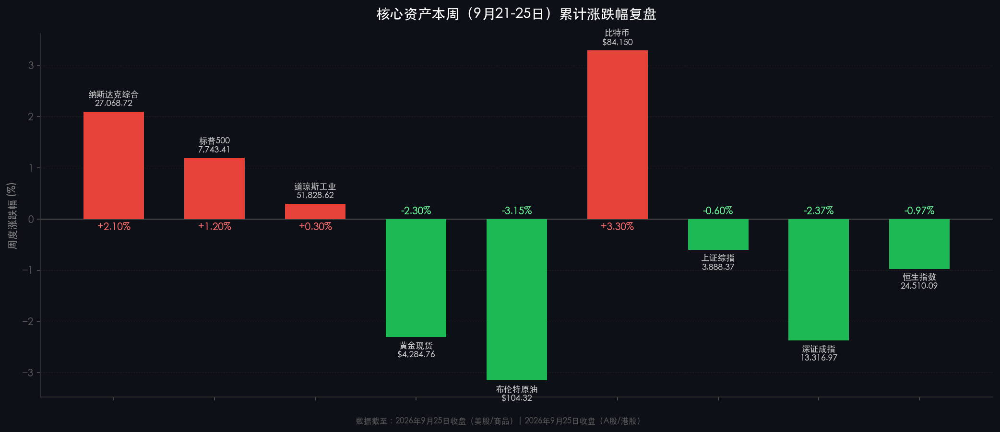

# 🌐 周末复盘：2026年第39周全球市场总结

**日期：2026年09月27日 (星期日)** &nbsp; **时段：周末复盘（国内+国际市场）**

> **核心摘要**：本周（9月21-25日）A股先扬后抑，中秋假期前避险情绪主导，上证周跌0.6%、深证和创业板跌逾2%；美股逆势收涨，纳斯达克周涨2.1%领涨，受AI科技股买盘与油价回落双重驱动；黄金受高利率压制周跌约2.3%，比特币韧性突出周涨3.3%；下周国庆长假（10月1-7日）期间A股休市，机构普遍看好节后修复行情，建议聚焦科技+红利双主线。

---

## 核心资产周度/日度表现回顾

### 🇨🇳 A股市场（9月21日-25日，周五为末日收盘）

| 指数 | 周五单日 | 全周累计 | 周五收盘点位 |
|------|----------|----------|-------------|
| **上证综指** | -0.52% | **-0.60%** | 3,888.37 |
| **深证成指** | -1.12% | **-2.37%** | 13,316.97 |
| **创业板指** | -1.08% | **-2.48%** | 3,288.95 |

> **核心解读**：A股本周"先扬后抑"的走势系三重力量叠加作用的结果：
> - **假期效应**：中秋节（9月25-27日）+国庆节（10月1-7日）前后共约10天A股休市，资金普遍选择节前减仓降险，量能持续萎缩——周一至周四成交额分别为20,314亿、21,354亿、17,648亿、16,533亿元，四日日均约1.9万亿元，已明显低于前两周均值。
> - **风格切换**：煤炭、银行、纺织服饰、风电等高股息防御板块逆势走强，而前期涨幅较大的有色金属、电子（PCB）、通信、医药等板块出现集体回调，反映资金在季末进行防御化再平衡。
> - **技术压力**：上证指数周四一度跌破3,900点整数关口，多头防守力度不足，进一步触发止损盘，加剧尾盘抛压。

* **周内领涨板块**：煤炭（+3.2%）、银行（+1.8%）、纺织服饰（+2.1%）、风电设备（+1.9%）、教育（+1.4%）
* **周内领跌板块**：有色金属（-4.1%）、电子/PCB（-3.8%）、建筑材料（-3.5%）、通信（-3.0%）、医药生物（-2.7%）

---

### 🇭🇰 港股市场（恒生指数）

* **恒生指数**：收 **24,510.09**，周五单日跌 **-1.01%**（-251.04点），**全周累计 -0.97%**
* **恒生科技指数**：周五收 **4,311.78**，跌 **-1.13%**
* **国企指数（H股）**：周五收 **8,165.78**，跌 **-1.21%**

> **核心解读**：港股延续内外双重压力格局。内部，与A股联动的避险情绪在节前形成共振；外部，10年期美债收益率维持在5.17%的高位，持续抬升港股估值折现压力（港股通过联系汇率制度与美元利率深度绑定）。周初恒指曾站稳25,000点并于周三创阶段新高，但随即遭遇获利盘与外资回流压制，周四、周五接连放量下跌，周线最终以"冲高回落"画上句号。

---

### 🇺🇸 美股市场（9月22日-25日，周五收盘）

| 指数 | 周五单日 | 全周累计 | 周五收盘点位 |
|------|----------|----------|-------------|
| **纳斯达克综合** | +0.48% | **+2.10%** | 27,068.72 |
| **标普500** | +0.51% | **+1.20%** | 7,743.41 |
| **道琼斯工业** | +0.93% | **+0.30%** | 51,828.62 |
| **罗素2000（小盘）** | 微涨 | **-0.80%** | — |

> **核心解读**：美股本周打破连续两周的下跌势头，实现反弹，核心驱动逻辑如下：
> - **AI科技股主导**：纳斯达克周涨2.1%大幅跑赢道指（+0.3%），科技与AI基建板块（算力、数据中心）持续获机构增持，形成"AI飞轮"效应；
> - **油价回落提振情绪**：布伦特原油从本周高点（约$108）回落至$104.32，通胀压力边际缓解，市场风险偏好修复；
> - **小盘股落后**：罗素2000本周下跌0.8%，再度验证高利率环境对中小企业的高杠杆成本挤压仍是核心约束，大盘与小盘的分化延续；
> - **利率阻力仍存**：10年期美债收益率维持在**5.17%**，费城联储Paulson、纽约联储Williams等官员均发表鹰派表态，10月再次加息25bp的市场隐含概率升至65%，上方估值压力持续。

---

### 📊 大宗商品与避险资产（周度表现）

| 资产 | 周五收盘价 | 全周累计涨跌 |
|------|-----------|-------------|
| **黄金现货** | $4,284.76/盎司 | **-2.30%** |
| **布伦特原油** | $104.32/桶 | **-3.15%** |
| **比特币（BTC）** | ~$84,150 | **+3.30%** |
| **10Y美债收益率** | **5.17%** | +11bps（周涨幅） |

> **核心解读**：
> - **黄金**：受美债收益率维持高位及美元指数企稳双重打压，黄金本周全周下跌约2.3%，一度跌破$4,250关口测试支撑；消费者通胀预期调查显示一年期通胀预期攀升至4.6%，短期提供一定心理支撑，但名义利率高企令持金机会成本持续偏高；
> - **原油**：霍尔木兹海峡地缘紧张与OPEC+减产预期支撑油价维持在百元高位，盘中曾触及$108；但周内美伊外交磋商传闻提振供应预期，触发获利平仓，油价从高位回落约4%至$104，地缘溢价部分被消化；
> - **比特币**：周内逆势走强，现货BTC ETF持续录得净流入，机构配置需求稳固，在宏观不确定性背景下展现出与传统风险资产的低相关性，提供一定的"数字黄金"叙事支撑。

---

## 过去 48 小时重磅事件深度复盘

1. **🏦 美联储官员"鹰声"密集释放（9月25日）**
   费城联储主席Paulson、纽约联储主席Williams相继发言，均强调"抗通胀工作仍有大量待完成"，暗示政策利率将在更高水平保持更久。10月FOMC会议（10月28-29日）再次加息25bp的概率已升至65%。
   > 市场解读：短端利率预期上移，压制科技股估值的同时也推高美元，对新兴市场资产（含A股北上资金）形成潜在外流压力。

2. **🏗️ 中国国有银行大规模A股定向增发（9月24-25日）**
   消息人士称，工农中建等主要国有银行计划通过发行特别国债支持的定向方式，在A股补充核心一级资本（CET1），规模合计可能超过3,000亿元。监管层已就此完成内部沟通。
   > 市场解读：此举将带来显著的股市供给压力，短期对银行板块形成抛压预期，但从中长期看有助于夯实金融体系的资本缓冲，利好金融稳定。

3. **🛢️ 中东地缘外交进展（9月25日）**
   消息称美伊双方通过斡旋渠道就核协议谈判取得边际进展，霍尔木兹海峡紧张态势略有缓和，推动布伦特原油从周内高点$108回落至$104区间，同日为美股的风险情绪修复提供重要催化。

4. **🎆 中秋长假正式开始（9月25日收盘后）**
   A股与港股市场于9月25日（周五）收盘后正式进入中秋+国庆长假，合并休市时间为9月27日（周六）至10月7日（周三），共计约11天（含周末）。A股于**10月8日（周四）**恢复正常交易。

---

## 下周全球宏观大事预警

> ⚠️ **A股、港股本周（9月29日-10月7日）全面休市，以下为海外及节后关键时点提示。**

| 日期 | 事件 | 重要性 |
|------|------|--------|
| 9月30日（周二） | 美国PCE通胀数据（8月）| ⭐⭐⭐⭐⭐ |
| 10月1日（周三） | 美国ISM制造业PMI（9月）| ⭐⭐⭐⭐ |
| 10月3日（周五） | 美国非农就业报告（9月）| ⭐⭐⭐⭐⭐ |
| 10月7日（周三） | 日本央行（BOJ）政策委员会会议纪要 | ⭐⭐⭐ |
| 10月8日（周四） | **A股国庆节后首个交易日** | ⭐⭐⭐⭐⭐ |
| 10月28-29日 | 美联储FOMC议息会议 | ⭐⭐⭐⭐⭐ |

* **PCE数据（9月30日）**：为美联储最青睐的通胀指标，若超预期（市场预测核心PCE同比约3.7%），将进一步巩固10月加息预期，对黄金、科技股构成下行风险；
* **非农报告（10月3日）**：劳动力市场韧性数据将成为美联储"更长时间更高利率"路径的关键参数，若就业继续强劲，10月加息概率或向70%+迈进；
* **A股节后首日（10月8日）**：根据历史数据统计，A股国庆节后首日上涨概率约72%，全市场目光将聚焦于节假日期间海外市场走势及有无重磅政策落地。

---

## 顶级机构周末策略内参摘要

### 🏦 高盛（Goldman Sachs）
> 维持对中国A股的"建设性"立场，重点关注AI基础设施、半导体及数据中心等"新质生产力"方向中具备盈利拐点迹象的龙头企业。警告通用型指数配置性价比有所下降，建议以主动精选替代被动跟踪。

### 🏦 摩根士丹利（Morgan Stanley）
> 预计中国主要股指四季度维持低个位数增长，市场从"快速拔升"阶段过渡至"稳态分化"格局。建议增持具有全球竞争力、可持续自由现金流的出口导向型科技企业，同时保留一定的高股息防御仓位以应对利率风险。

### 🏦 摩根大通（J.P. Morgan Asset Management）
> 强调国际投资者对中国资产的配置价值正在重新评估。重申"精选质量"策略——聚焦具有定价权、稳定股东回报（分红+回购）及强信用资质的企业，将"反内卷"政策带来的行业集中度提升视为重要结构性利好。

### 🏦 中信证券
> 认为当前时点是**"年内最后的进攻窗口"**。理由：节前风险已充分定价，节后资金回流+三季报业绩催化双驱动，市场具备较好的进攻基础。建议配置科技成长（AI算力、机器人）和红利资产双主线，国庆节后首周关注放量信号。

---

## 今日市场情绪：谨慎等候，蓄势待发

> Prompt: A lone wooden junk sailing through a stormy sea made entirely of red K-line candlestick charts, lightning shaped like yuan symbols illuminating the sky, in the background giant golden bulls and green bears clash on the horizon, ultra-detailed digital art, cinematic lighting

---

*免责声明：内容仅供参考，不构成投资建议。*
