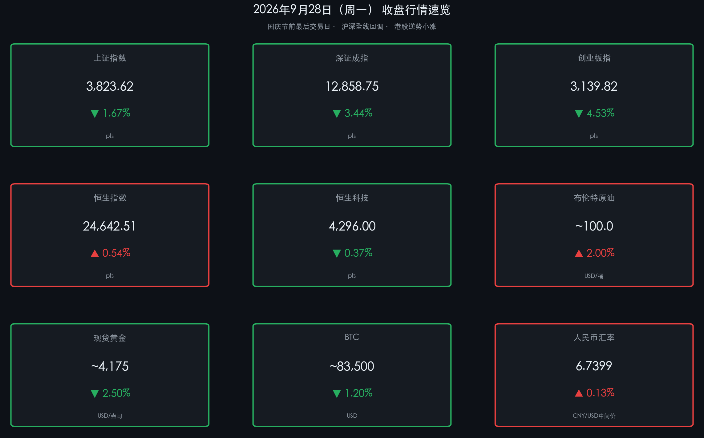

# 📉 科技股节前大撤退，防御资金转移 | 2026年9月28日晚报

**日期：2026年09月28日 (星期一)** &nbsp; **时段：收盘晚报**

> **核心摘要**：国庆长假前最后一个交易日，A股三大指数集体深跌，创业板指重挫逾4.5%，科技成长赛道遭遇大规模获利兑现；主力资金从电子、通信板块净流出超360亿元，向汽车整车、公用事业等防御性板块转移；外部承压来自美债收益率高企（5.21%创十年新高）及美联储10月再加息预期升温（概率约64.8%）。港股恒生指数逆势微涨0.54%，形成罕见的"A跌港涨"分化格局。

---

## 核心行情复盘

### 🇨🇳 A 股市场

* **上证指数**：收报 **3,823.62 点**，跌幅 **-1.67%**（较昨日 3,888.37 点下跌 64.75 点）
* **深证成指**：收报 **12,858.75 点**，跌幅 **-3.44%**
* **创业板指**：收报 **3,139.82 点**，跌幅 **-4.53%**（今日跌幅最深）
* **成交量**：沪深京三市全天成交 **1.72 万亿元**，较前一交易日**放量**，显示恐慌性出逃资金规模较大
* **个股全面分化**：全市场超 **4,500 只个股**下跌，上涨个股不足 **900 只**，下跌比例逾 83%

**主力资金净流向：**

* **净流出（溃退）**：
  * **电子板块** — 净流出 **超 222 亿元**（规模最大）
  * **通信/CPO/光模块** — 净流出 **超 140 亿元**，盘中跌幅一度超 7%，大量个股跌停
  * **机械设备、计算机、有色金属** — 各净流出超 **20 亿元**
* **净流入（避险）**：
  * **汽车整车** — 净流入 **超 24 亿元**，江淮汽车等多股逆势涨停
  * **电力/公用事业** — 净流入 **超 10 亿元**，浙江新能等涨停

> **核心解读**：今日市场的领跌主角是前期涨幅最大的 CPO（光模块）、半导体和通信设备板块。这场"高位回吐"具有明显的结构性特征——不是系统性崩盘，而是科技筹码的集中减仓。资金并未彻底离场，而是向"防御-红利"方向进行了再平衡。汽车整车板块的主力净流入与油价走高之间形成了奇特的联动：国内新能源车作为"能源替代"逻辑的底层资产，在油价冲破100美元/桶时反而成为吸金磁石。

**板块涨跌速览：**

| 类别 | 领涨板块 | 领跌板块 |
|------|---------|---------|
| 🟢 抗跌 | 汽车整车、电力/公用事业、石油石化、农林牧渔（养殖） | — |
| 🔴 重挫 | — | CPO/通信设备（-7%+）、电子/消费电子、贵金属、半导体、建筑材料 |

---

### 🇭🇰 港股市场

* **恒生指数**：收报 **24,642.51 点**，上涨 **132.42 点**（**+0.54%**），逆势收红
* **恒生科技指数**：收报 **4,296.00 点**，小幅下跌 **-0.37%**
* **国企指数（H 股）**：收报 **8,216.84 点**，上涨 **+0.63%**
* **红筹指数**：收报 **4,039.85 点**，上涨 **+1.31%**（涨幅最高）

> **核心解读**：港股与A股今日罕见分化。港股主板整体承接了来自国企和红筹标的的结构性需求，红筹指数领涨1.31%折射出市场对"中国核心资产"海外定价的相对信心。恒生科技小幅走弱(-0.37%)显示科技股压力全球同步，但港股科技的跌幅远低于A股创业板的4.53%，反映出海外资金对港股估值的定价支撑仍在。

---

## 全球宏观与大类资产

### 🌐 美联储与美债

* **10年期美债收益率**：**5.21%**，刷新 **2007 年以来最高位**
* **美联储10月加息预期**：CME "美联储观察" 显示，10月28日议息会议再加息 25 基点概率约 **64.8%**（维持不变概率 35.2%）
* **政策背景**：9月美联储实施三年来首次加息（25bp，利率升至 3.75%-4.00%），多位官员随后发表鹰派声明，强调通胀"顽固"且经济韧性超预期

> **核心解读**：美债收益率突破5.2%是今日全球资产波动最核心的驱动力。高利率直接压缩成长股的估值折现，是A股创业板和科技板块估值承压的主要"外源性因子"。值得注意的是，美债收益率高企来自双重驱动——持续通胀粘性与AI基础设施建设带来的政府及企业大规模举债需求，这意味着高息环境可能会延续更长时间。

### 🛢️ 能源与商品

* **布伦特原油**：盘中突破 **100 美元/桶**关口，日内涨幅超 **+2.0%**
* **WTI 原油**：报 **93-94 美元/桶**，日内涨幅约 **+1.5%**
* **驱动因素**：中东供应不确定性（霍尔木兹海峡局势）+美伊谈判变数加大，供应端风险溢价持续攀升

### 🥇 贵金属

* **现货黄金**：盘中出现跳水，从日内高点 **4,285 美元/盎司**回落至 **约4,150-4,200 美元/盎司**区间，日内跌幅约 **-2.5%**
* **国内金价**：参考销售价约 **912.22 元/克**

> **核心解读**：黄金"跳水"与美债收益率飙升高度同步。当实际利率上升（名义利率上行速度>通胀预期），黄金持有成本提高，导致资金兑现。但从中长期来看，地缘政治风险溢价仍将为黄金提供底部支撑。

### 🔐 加密货币

* **比特币（BTC）**：约 **83,500 美元**，近一周表现相对疲软，日内跌约 **-1.2%**
* **市场逻辑**：高息环境 + 季度期权到期后流动性重置，BTC 短期上涨动能减弱，机构普遍预计第四季度"震荡偏强"

### 💱 人民币汇率

* **人民币对美元中间价**：**6.7399**，较前一交易日**上调 90 基点（人民币升值）**
* **汇率稳定逻辑**：央行通过中间价引导，叠加节前流动性呵护操作，有效防范了节前汇率异动

---

## 政策脉动

### 🏦 央行：节前流动性呵护升级

* **人民银行货币政策委员会 2026 年第三季度例会（9月19日）**明确：维持**适度宽松**货币政策基调，**加大逆周期调节力度**
* **节前流动性操作**：自9月28日起连续4个工作日开展隔夜逆回购，日操作上限从 **6,000亿元** 提升至 **1万亿元**，充分释放节前资金需求，有效防范资金面骤然收紧
* **政策框架改革**：例会新增"推动货币政策操作框架改革完善"，推动货币政策调控逻辑从**数量型**向**价格型**转变

> **政策信号解读**：央行此次将逆回购上限翻升67%，是 2026 年单次流动性支持规模最大的操作之一。这一举措直接向市场传递"节前不缺钱"的信号，稳定了节前最后一个交易日的资金面，避免了债市和货市同步波动。节后资金回流 + 政策窗口叠加，机构普遍预期 10月将是重要政策发力窗口。

---

## 最新机构观点

### 📊 中信证券
> 维持年内 A 股震荡市判断，**"三季报前后是年内最后的进攻窗口"**。认为指数大幅下调可能性较小，建议配置以"**科技龙头、资源能化、金融权重**"为主轴，以均衡结构应对节前扰动。

### 🔬 中金公司
> 延续年度策略，强调**"国际秩序重构"与"中国产业创新"双驱动逻辑**。指出四季度需关注三季报业绩验证，市场风格有望趋向均衡；重点关注 **AI 应用端**、科技主线及内需修复板块，同时提醒警惕局部高估值板块的波动风险（特别是 CPO 相关标的）。

### 📈 广发证券
> **"不宜过度减仓，持股过节"**。策略上建议优先关注三季报高景气的 AI 产业链（算力/光模块在调整后具备布局价值），以及非 AI 领域的细分赛道（如医药、出口链、高端制造）。历史数据显示，国庆节后首个交易日 A 股上涨概率约 **70%**。

### 🌍 高盛/摩根大通（国际投行视角）
> 国际投行维持对中国"**硬科技"硬件产业链**的结构性关注，以及具备**高股东回报率（TSY）**资产的配置价值。但在美债5%+的环境下，整体对新兴市场权益资产持**谨慎中性**立场，提示利率风险向全球传导。

---

## 今日市场情绪：节前兵临城下

> Prompt: A lone medieval siege tower made of glowing circuit boards and fiber optic cables is retreating across a battlefield of red K-line candles. In the foreground, coins and microchips scatter across the ground. In the background, a massive golden fortress labeled 'National Holiday' stands firm on the horizon, with green banners of defensive sectors like utilities and autos waving from its walls. The sky is dominated by a giant glowing number '5.21%' like a blood moon, casting crimson light over the entire scene.

今日市场情绪可以概括为：**"兵临城下，先锋撤退，守城固本"**。

科技成长板块（CPO、电子、半导体）是最激烈的"撤退先锋"，大规模的获利兑现让其遭遇了年内最惨烈的单日跌幅之一。这种撤退不是崩溃，而是"高仓转移"——资金并未离开市场，而是从高估值城堡转移进了防御性山寨（汽车、公用事业）。美债5.21%这枚"血月"高悬，是所有高成长赛道今日最大的隐性杀手。节后3个交易日将决定这场"转移"是否会演变为"反攻"。

---

## 免责声明

内容仅供参考，不构成投资建议。股市有风险，投资需谨慎。
