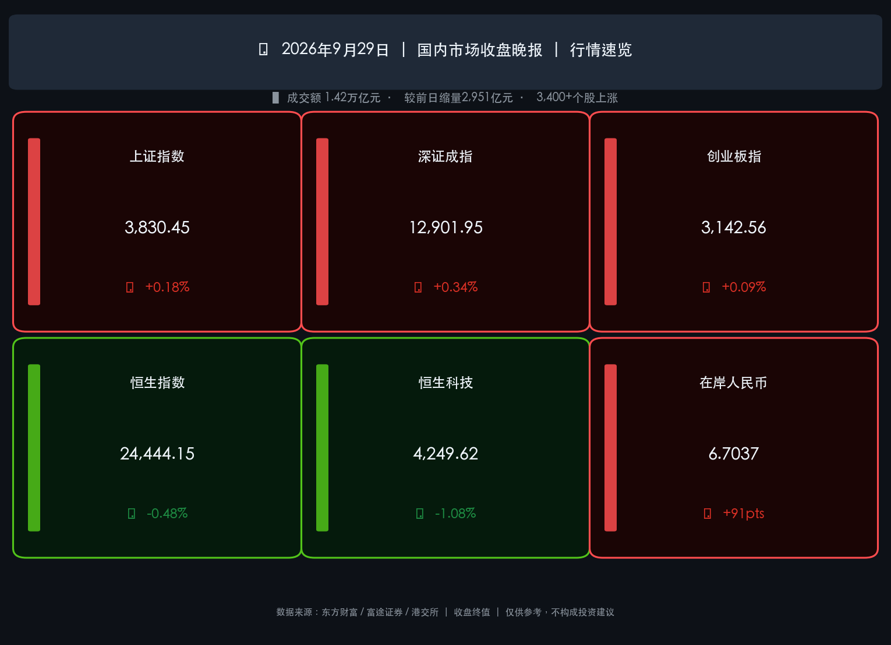

# 🟢 节前缩量普涨，政策双轮驱动反弹 | 2026年9月29日晚报

**日期：2026年09月29日 (星期二)** &nbsp; **时段：收盘晚报**

> **核心摘要**：国庆长假前倒数第二个交易日，A股三大指数集体小幅收涨，全市场逾3,400只个股上涨，成交额大幅萎缩至1.42万亿元（较昨日缩量近3,000亿）；房地产板块受国常会增量政策驱动领涨全市场，固态电池概念在《新型电池产业发展"十五五"规划》催化下涨停潮频现；电子、半导体主力资金持续净流入逾130亿，昨日跌幅最深的科技赛道今日率先修复；港股则受情绪分歧拖累，恒生指数与恒生科技指数双双收跌。

---

## 核心行情复盘

### 🇨🇳 A 股市场

* **上证指数**：收报 **3,830.45 点**，涨幅 **+0.18%**（较昨日 3,823.62 点上涨 6.83 点）
* **深证成指**：收报 **12,901.95 点**，涨幅 **+0.34%**（上涨 43.20 点）
* **创业板指**：收报 **3,142.56 点**，涨幅 **+0.09%**（上涨 2.74 点）
* **成交额**：沪深京三市全天成交 **1.42 万亿元**，较前一交易日**大幅缩量约 2,951 亿元**，节前观望情绪明显
* **个股普涨**：全市场超 **3,400 只个股**上涨，市场情绪由昨日的恐慌分化转为温和修复

**主力资金净流向：**

* **净流入（修复）**：
  * **电子板块** — 净流入 **逾 89 亿元**（昨日大幅净流出后今日显著修复）
  * **电力设备** — 净流入 **逾 49 亿元**
  * **计算机、有色金属、房地产** — 各净流入 **逾 30 亿元**
  * **电路板概念** — 净流入 **逾 67 亿元**；**华为概念、消费电子** — 各净流入 **超 40 亿元**
* **净流出（防御退潮）**：
  * **农林牧渔、石油石化、基础化工** — 合计净流出规模较小，约七个行业小幅净流出

> **核心解读**：今日市场的核心逻辑是昨日"节前恐慌性减仓"后的技术性修复，叠加两条强政策主线——房地产增量政策与固态电池国家规划——带来的板块轮动。值得注意的是，昨日净流出超360亿的电子/通信板块，今日主力资金净回流近130亿，说明机构并非彻底撤出科技赛道，而是在高位进行了一次"换手式再平衡"。缩量收涨的市场形态，与历史上国庆前最后交易日的"温和持股"规律高度一致。

**板块涨跌速览：**

| 类别 | 领涨板块 | 领跌板块 |
|------|---------|---------|
| 🔴 领涨 | **房地产**（万科A、首开、华发等多股涨停）、传媒/互联网、固态电池、半导体、钢铁、贵金属、港口、环保 | — |
| 🟢 抗跌/领跌 | — | 石油化工、海运、化纤、**煤炭**、石油天然气、农业、酒类 |

---

## 🇭🇰 港股市场

* **恒生指数**：收报 **24,444.15 点**，跌幅 **-0.48%**（下跌 118.94 点）
* **恒生科技指数**：收报 **4,249.62 点**，跌幅 **-1.08%**（下跌 46.38 点）
* **南下资金**：前一交易日（9月28日）呈现净卖出状态，今日数据待 T+2 结算后确认

> **核心解读**：港股与A股今日罕见地呈现"沪深涨、港跌"分化格局。恒生科技指数承压明显（-1.08%），与美股隔夜纳斯达克走弱以及全球对美联储10月再加息预期升温密切相关（美债10年期收益率仍维持在5%以上高位区间）。国际资金对中国资产的态度依然分裂：一方面布局A股政策驱动板块，另一方面对港股离岸定价施压。

---

## 💱 汇率动态

* **人民币中间价**：**6.7411**（较上一交易日下调 12 个基点）
* **在岸人民币 (CNY)**：收报 **6.7037**，较上一交易日**升值 91 点**
* **离岸人民币 (CNH)**：在 **6.70–6.71** 区间窄幅震荡，收盘附近报约 **6.7078**

> **核心解读**：人民币在岸汇率逆势走强（6.7037），与中间价下调方向相反，反映出节前企业结汇需求较旺盛。外贸企业赶在国庆假期前将外币换回人民币，形成短期支撑。长假期间若美国就业数据再超预期，需警惕节后开盘汇率的补跌风险。

---

## 核心解读与市场逻辑

### 📌 逻辑一：房地产政策"增量信号"驱动板块估值修复

国务院常务会议（9月28日）明确将"研究出台稳定房地产市场政策"列为增量政策核心内容，北京、上海同步落实预售制度改革（主体结构封顶方可申请预售）及资金专户闭环管理。今日万科A、首开股份、华发股份等多股封板，是市场对"政策底已至"的定价响应。

### 📌 逻辑二：固态电池"十五五"规划激活新能源赛道

工信部等七部门联合印发《新型电池产业发展"十五五"规划》，目标2030年初步实现全固态电池规模化应用，循环寿命达1.5万次。这是中国电池领域**首个国家级专项规划**，直接拉动今日固态电池、锂电产业链多股涨停。

### 📌 逻辑三：节前"缩量修复"是标准的假期前行为模式

成交额从昨日的1.72万亿骤降至1.42万亿（-17.2%），但指数小幅收涨——这是典型的"无量上涨"，反映机构获利盘暂停出逃、节前持股情绪转稳。历史数据显示，国庆后首个交易日A股上涨概率约为60%（东吴/财通数据），支撑"持股过节"策略。

---

## 政策脉动

| 政策方向 | 核心内容 | 来源 |
|---------|---------|------|
| **宏观逆周期** | 国务院常务会议部署增量政策：用好地方政府债务结存限额，增加科技创新再贷款额度 | 国务院 2026-09-28 |
| **货币政策** | 央行货币政策委员会Q3例会：继续适度宽松，保持流动性充裕，降低社会综合融资成本 | PBOC 2026-09-28 |
| **房地产** | 研究出台稳定房市增量政策；北上推进预售制改革（结构封顶方可预售）+ 资金专户 | 国常会/地方政府 |
| **新能源电池** | 《新型电池产业发展"十五五"规划》发布：2030年全固态电池规模化 | 工信部等七部门 |

---

## 最新机构观点

> **中信证券**（2026-09-29）：维持A股年内震荡市判断，明确指出"三季报前后是年内最后一波进攻窗口"。建议配置以**"AI+能化"为主的杠铃结构**，兼顾AI算力（液冷、国产存储、半导体设备）与能化周期的基本面与流动性双重逻辑。

> **中金公司**（2026-09-29）：AI革命进入应用关键期，市场风格趋于均衡。近期策略聚焦"自下而上"，关注**算力、电力供给瓶颈**，及能实现提效增利的AI应用型企业；提醒关注三季报业绩优于中报的公司。

> **摩根士丹利**（2026年9月）：战略性转向A股，认为A股具有更强的"国家队"支撑、更高的AI硬科技曝光度（CSI 300成分中半导体、电子权重更大）。将沪深300目标价下调至4,880点，但坚持超配A股对港股的相对收益判断。

> **高盛**（2026年9月）：将中国2026年GDP增速预测小幅下调至4.5%，但维持对AI板块及"走出去"战略的长期看好。认为A股已从"估值驱动的希望阶段"进入"盈利实现驱动阶段"，节后三季报数据是检验基本面的关键窗口。

---

## 今日市场情绪：节前凤凰展翅，政策曙光破雾

> Prompt: A luminous phoenix woven from green circuit lines and golden battery cells soars above a misty mountain skyline. The phoenix clutches a glowing scroll labeled 15th Five-Year PLAN in one talon and a tiny rising real estate tower in the other. In the background, a vast red-walled city slowly lifts from fog into clear blue sky, symbolizing cautious optimism before a long holiday. Style: dramatic cinematic concept art with teal and gold gradients.

---

> **免责声明**：内容仅供参考，不构成投资建议。市场有风险，入市须谨慎。
