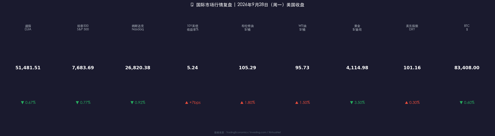

# 🌐 高债息+油价双压 | 美股全线承压，国际市场风险偏好骤降

**日期：2026年09月29日 (星期二)** &nbsp; **时段：早报（模式A：常规交易日）**

> **核心摘要**：美国10年期国债收益率9月28日盘中触及5.27%（2007年以来最高），收盘报5.24%，加之WTI原油升破95美元、布伦特突破105美元（特朗普拒绝伊朗霍尔木兹海峡重开提案），双重通胀压力令美股全线下跌——道指跌347点（-0.67%），标普500跌-0.77%，纳指跌-0.92%；黄金单日重挫逾3.5%，风险资产情绪急速降温；美联储9月已加息至3.75%-4.00%，市场高度关注10月FOMC动向，高利率"更久"叙事再度主导定价。

---

## 核心行情复盘

### 📊 美国三大股指（9月28日收盘）

* **道琼斯工业平均指数**：**51,481.51** 点 &nbsp; ▼ **-347.11点（-0.67%）**
* **标普500指数**：**7,683.69** 点 &nbsp; ▼ **-59.72点（-0.77%）**
* **纳斯达克综合指数**：**26,820.38** 点 &nbsp; ▼ **-248.34点（-0.92%）**

> 三大指数同步走低，反映市场情绪整体转向防御。能源成本与融资成本"双升"的压力下，科技成长类估值首当其冲，纳斯达克跌幅最大；老牌工业权重的道指表现相对抗跌，但仍录得近0.7%跌幅。个股亮点：**Meta 与 AMD** 逆势上涨（受AI算力需求预期支撑），航空股则因燃油成本上行受压。

**数学闭环校验**：标普 7683.69 ÷ (1-0.0077) ≈ 7743.41，差值 59.72点，-0.77% ✅

### 📈 数据卡片

---

### 🛢️ 大宗商品

* **布伦特原油**：**$105.29/桶** &nbsp; ▲ 约+1.8%（中东局势升温）
* **WTI 原油**：**$95.73/桶** &nbsp; ▲ 约+1.5%
* **COMEX 黄金**：**$4,114.98/盎司** &nbsp; ▼ **-3.5%**（实际利率上升抑压）

> 核心解读：黄金单日跌逾3.5%，在表面上与"避险"叙事相悖，实质逻辑在于：债券实际收益率飙升（10年期名义5.24%，通胀预期约2.6%，实际利率≈2.64%创年内新高），使得不生息的黄金持仓成本急剧上升，触发机构大规模减持与止损。原油与黄金"背离"走势，是当前"高利率+地缘风险"复杂格局的典型映射。

---

### 💹 固定收益 & 外汇

* **10年期美国国债收益率**：**5.24%**（盘中触及5.27%，2007年以来新高）▲ +7bps
* **30年期美国国债收益率**：**5.55%**
* **美元指数（DXY）**：**101.16**（维持两个月高位附近）▲ 约+0.3%

> **债市解读**：10年期美债收益率连续突破关键整数关口，令市场产生"债券熊市"共鸣。高收益率与高油价叠加，令经济"滞胀"风险的预期概率上升，对长久期资产（科技股/成长股/黄金）形成系统性估值压力。美元因"高利率吸引力"维持强势，对新兴市场构成外部压力。

---

### 🪙 加密货币

* **比特币（BTC）**：约 **$83,408** &nbsp; ▼ 约-0.6%（随风险偏好小幅回落）

---

## 核心解读与市场逻辑

### 🌏 地缘事件：霍尔木兹困局——特朗普拒绝伊朗重开提案

* **背景**：自2026年2月28日起，伊朗与美以冲突导致霍尔木兹海峡已封锁约7个月，全球能源最关键航道持续受阻。
* **最新进展（9月28日）**：伊朗提出"七日重开计划"，条件包括：美方解除石油制裁、停火及解冻资产。特朗普公开拒绝，称伊朗"过度试探底线"，卡塔尔等调解方仍在斡旋。
* **市场反应**：拒绝消息公开后，布伦特油价冲至盘中$107/桶，带动通胀预期上行；航空、化工、制造业类股承压；能源板块则维持强势。

> **核心逻辑**：**地缘风险（霍尔木兹） → 油价上行 → 通胀预期升温 → 10年美债收益率持续攀高 → 实际利率飙升 → 成长股/黄金估值受压 → 股市下行**。这条"传导链"当前是市场最核心的定价逻辑，任何缓和/破局信号将是最强风险偏好修复催化剂。

---

### 🏦 美联储政策：高利率"更久"叙事强化

* **9月16日决议**：FOMC全票通过，联邦基金利率上调25bps → 目标区间 **3.75%–4.00%**
* **Fed主席 Kevin Warsh**：首要任务"价格稳定"，强调数据依赖，淡化前瞻指引
* **8月美国CPI同比**：**3.4%**（住房、食品有所回落，但能源分项受油价拉动再反弹）
* **10月FOMC**：定于 **10月27-28日**，点阵图显示年内还有 **至少一次25bps加息** 可能
* **CME FedWatch（截至9月28日）**：市场定价10月加息概率约42%，较前一周大幅上升

> **政策信号**：Warsh"极简沟通"风格意味着"不排除加息"就等于"维持加息可能"，市场对此保持高度敏感。只要通胀未回到2%附近且就业仍强劲，美联储就有持续收紧的理由。

---

## 政策脉动

* **美国财政部**：30年美债收益率5.55%，国债发行成本创历史新高；部分经济学家担忧利息支出对财政赤字的复合压力正在积累。
* **OPEC+**：霍尔木兹封锁持续期间，中东多国产油国产量受波及，OPEC+正研究是否启动战略储备补充机制（SPR协调），下次会议定于10月下旬。
* **中美关系**：上周中美元首会谈所达成的300亿美元降税框架为市场提供局部缓冲，但能源局势的独立演进令降税红利短期兑现存在不确定性。

---

## 最新机构观点

**1. 高盛（Goldman Sachs）——"建设性，不悲观"**
> 维持S&P 500 未来12个月目标价 **8,700点**（当前涨幅空间约13.7%）。预期10年期美债收益率将在通胀压力逐步缓解后回落至 **4.5%** 水平。强调当前"收益增长是股市最核心驱动力"，建议聚焦**高质量、正现金流企业**，规避杠杆与利率敏感型资产。高盛认为，收益率上升对股市的抑压作用被强劲盈利所部分抵消，但若10年期突破5.5%则需重新评估。

**2. 摩根士丹利（Morgan Stanley）——"建设性但非自满"**
> 策略师认为当前收益率-股市负相关关系已被"创纪录的利润增长"打破，传统规律失效。指出**能源价格与财政赤字压力**是美联储转向宽松的最大障碍。继续看好AI数据中心相关板块，建议投资者通过**多元化配置（私募市场、商品、黄金）**对冲利率风险，分散单一权益敞口。

**3. 瑞银（UBS）**
> 发布报告指出，10年期美债收益率攀升至5%+ 已进入"历史高位区间"，若能源价格维持100美元以上，通胀将粘性化，届时美联储可能"被迫"在年底前再加50bps，届时权益资产面临更大调整压力。建议短期增配防御型板块（医疗、公用事业）和短久期高评级债券。

---

## 今日市场情绪：烈火炼真金，但天平仍在倾斜

> Prompt: A colossal golden balance scale floats above Wall Street at dusk. On one pan, a blazing oil barrel and a steep Treasury yield curve burn bright red; on the other pan, a crumbling stack of stock certificates labeled S&P 500 sinks downward. In the background, the Strait of Hormuz is blocked by warships, and a giant clock approaches midnight. The scene is rendered in dramatic chiaroscuro, conveying the weight of inflation and geopolitical risk crushing equity markets.

---

> 免责声明：内容仅供参考，不构成投资建议。
