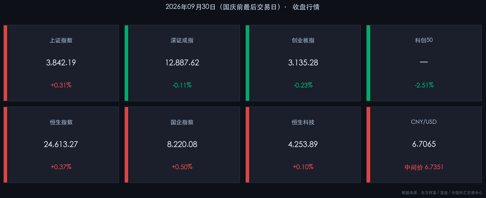

# 🎑 国庆前最后收盘：沪指微涨收官，创药白酒接力，科创深度调整 | 2026年9月30日晚报

**日期：2026年09月30日 (星期三)** &nbsp; **时段：收盘晚报**

> **核心摘要**：国庆长假前最后一个交易日，A股三大指数窄幅分化收盘，沪指微涨0.31%守住3842关口，深证成指与创业板指小幅收跌；医药（CRO/创新药）、白酒、房地产为节前三大亮点，科创50大跌2.51%成最显著拖累；全市场主力资金净流出136亿，小单资金逆势流入148亿，呈现"散户托底、机构减仓"的节前典型分化；港股逆势收涨，人民币中间价升至6.7351，节前政策暖风频吹（PSL降息、购房贷款贴息正式落地），为国庆后市埋下积极伏笔。

---

## 核心行情复盘

### 🇨🇳 A 股市场

* **上证指数**：收报 **3,842.19 点**，涨幅 **+0.31%**（较昨日 3,830.45 点上涨 11.74 点）
* **深证成指**：收报 **12,887.62 点**，跌幅 **-0.11%**（较昨日 12,901.95 点下跌 14.33 点）
* **创业板指**：收报 **3,135.28 点**，跌幅 **-0.23%**（较昨日 3,142.56 点下跌 7.29 点）
* **科创50**：跌幅 **-2.51%**，领跌全场，存储芯片、MLCC等硬科技板块承压明显
* **成交额**：沪深京三市全天合计约 **1.44 万亿元**，较前一交易日（1.42 万亿）**小幅放量 288 亿元**
* **个股涨跌**：全市场超 **2,500 只个股**上涨，市场呈现结构分化格局

**主力资金净流向（全市场）：**

* **总体净流出约 136.28 亿元**（占比 0.95%）
* 大单资金净流出约 **75.54 亿元**（占比 0.53%）
* 小单（散户）资金净流入约 **148.50 亿元**（占比 1.03%），逆势流入是显著特征

> **核心解读**：节前最后交易日的资金面，精准呈现"散户乐观持股、机构谨慎减仓"的经典分化形态。主力合计净流出136亿，而小单却净流入149亿，说明机构在主动锁定利润、控制长假风险敞口，而个人投资者在机构看好节后反弹的研报引导下选择了"持股过节"。这种分化并不是悲观信号，历史上国庆节后首周A股反弹胜率超80%（广发证券数据）。

**板块涨跌速览：**

| 类别 | 代表板块 | 代表个股 |
|------|---------|---------|
| 🔴 领涨 | **创新药/CRO**、白酒、**房地产**、农业/乳业 | 康希诺(+20CM涨停)、昭衍新药、金徽酒涨停、古井贡酒、泸州老窖、深物业A涨停、阳光乳业涨停 |
| 🟢 领跌 | **科创50**、半导体存储芯片、MLCC/PCB、CPO | 澳弘电子跌停、协和电子跌停、科创50 ETF集体下跌 |

---

### 🇭🇰 港股市场

* **恒生指数**：收报 **24,613.27 点**，涨幅 **+0.37%**（上涨 89.7 点）
* **国企指数（HSCEI）**：收报 **8,220.08 点**，涨幅 **+0.50%**（上涨 41.27 点）
* **恒生科技指数**：收报 **4,253.89 点**，涨幅 **+0.10%**（上涨 4.27 点）
* **港股假期安排**：港股 **10月1日（周四）休市一天**，**10月2日（周五）起恢复正常交易**；港股通（南向资金）则与A股同步，**10月8日（周四）方能恢复**

> **核心解读**：港股今日收复了昨日失地，实现"沪港齐涨"的节前暖收。恒生指数（+0.37%）与国企指数（+0.50%）走势优于A股主板，体现出外资对中国政策的正向反应——本日公布的PSL降息与购房贷款贴息政策对港股房地产板块形成直接催化。恒生科技仅微涨0.10%，受全球高利率环境压制。

---

## 💱 汇率动态

* **人民币中间价（CFETS）**：**6.7351**，较昨日（6.7411）**上调 60 个基点**，人民币对美元**明显升值**
* **在岸人民币（CNY）**：收盘报 **6.7065**，节前结汇需求持续旺盛
* **离岸人民币（CNH）**：报约 **6.7080**，与在岸价差收窄至 15 个基点，汇率预期稳定

> **核心解读**：人民币中间价连续两日调升（昨日上调60基点、今日继续上调），与节前企业集中结汇形成共振，汇率韧性良好。但长假期间需关注美国非农就业数据（10月2日）与PCE通胀数据的潜在冲击，若数据再度超预期，节后人民币面临一定补跌压力，建议持有外汇资产者做好对冲。

---

## 核心解读与市场逻辑

**今日市场的核心叙事主线是"三驾并行"：**

**① 医药/CRO 逻辑**：近期国内生物医药审批提速叠加出海订单（MNC外资药企向国内CRO转单趋势延续），CRO板块获得基本面支撑，康希诺20CM涨停是生物制品板块情绪的集中释放。

**② 白酒/消费 逻辑**：国庆消费旺季临近，叠加购房贷款贴息政策（自10月1日起实施）带动的地产后周期消费预期，酒类消费逻辑得到资金共鸣，金徽酒涨停为代表，茅台系、汾酒系跟涨。

**③ 房地产 逻辑**：财政部/央行/金监总局三部门联合印发《居民购房贷款贴息政策通知》，自10月1日起执行，首套房贴息1个百分点，上限100万元、5年。这是史上力度较大的一次现金流减负政策，市场给出"地天板"式反应（深物业A涨停）。

**④ 科创/半导体的"相对孤立"**：科创50单日大跌2.51%，与前两日的AI热潮形成鲜明对比。根本原因是美债10年期收益率仍高位（约5%），高估值成长股估值折现率上升，叠加部分存储芯片企业季报指引不及预期。这不是趋势反转，而是短期估值修正。

---

## 政策脉动

### 📌 重磅政策一：居民购房贷款贴息正式落地
**主体**：财政部 + 中国人民银行 + 金融监管总局  
**文件**：《关于实施居民购房贷款贴息政策的通知》  
**生效**：2026年10月1日起，暂定执行1年  
**核心条款**：
* 适用范围：购买**首套住房**（面积≤120㎡，总价≤150万元）
* 贴息幅度：年化 **1个百分点**
* 贷款贴息上限：**100万元本金**，期限不超过5年

> **影响分析**：政策落地"靴子"效应显著。对存量房贷优惠群体而言，年化省息约5,000-10,000元，释放可支配收入，对汽车、家装、白酒等消费有连带提振。对新房市场而言，直接降低购房成本，有望在四季度形成"以价换量"的阶段性修复。

### 📌 重磅政策二：央行下调PSL利率 + 扩围支持范围
**主体**：中国人民银行  
**内容**：将抵押补充贷款（PSL）利率下调 **0.25 个百分点**，并将支持领域扩展至"六张网"：水网、新型电网、算力网、新一代通信网、城市地下管网、物流网。  
**附加**：增加科技创新和技术改造再贷款额度 **2,000 亿元**；增加支农支小再贷款额度 **5,000 亿元**。

> **影响分析**：PSL降息是货币政策宽松的结构性信号，特别是扩围至算力网和通信网，意味着AI基础设施建设将获得低成本资金支持，这对光通信、数据中心等板块是中期利多，但市场今日尚未充分定价（科创板因整体氛围调整而被带累）。

### 📌 政策三：《金融产品网络营销管理办法》9月30日起实施
八部门联合规范互联网金融营销，整治"秒到账""低门槛"等误导性宣传，属于金融监管常态化推进，对资本市场影响中性。

---

## 最新机构观点

### 🏦 广发证券：节前减仓必要性不强，节后首周反弹胜率超80%
> 广发策略团队指出，复盘2011-2025年数据，A股国庆节后首周正收益概率超过80%。当前节前缩量调整是季节性"日历效应"而非基本面恶化。建议以"结构优化"思路持股过节，重点保留医药创新（CRO/创新药）、AI产业链（算力/光通信）及政策驱动消费板块，压缩科创高估值弹性仓位。节前成长风格调整反而是四季度低吸机会。

### 🏦 中信证券：维持震荡市判断，三季报窗口是年内最后进攻期
> 中信研究认为，在盈利趋势向上的背景下，指数大幅调整概率极低。四季度将进入三季报业绩验证周期，景气定价逻辑回归（AI算力、出口链细分龙头、新能源设备）将成为主线。同时建议以"AI+能源化工"组合平衡科技与周期的相关性，降低单一赛道集中风险。操作上，三季报密集披露期（10月中下旬）前是关键入场窗口。

### 🏦 中金公司：长期看好中国资产重估，短期聚焦算力与电力供给瓶颈
> 中金策略团队建议资产配置上"审慎择优"。短期（1-3个月）：重点关注算力基础设施（算力网PSL扩围政策催化）、电力（"缺电"背景下的新型电网投资）等存在供给瓶颈的方向；中期（6-12个月）：布局受益于AI与再工业化提升生产率的制造业龙头企业，以及港股低估值优质国企（享有南下资金增量预期）。对高股息/红利板块，认为其阶段性回报空间较年中已有所压缩，建议降低占比、向成长偏移。

---

## 🎑 国庆假期风险提示（重要）

**A 股休市安排**：2026年10月1日（周四）至10月7日（周三），共7天，**10月8日（周四）恢复交易**。

**港股休市安排**：10月1日（周四）单日休市，**10月2日（周五）起恢复正常交易**；港股通暂停至10月8日。

**假期期间需密切关注的外部事件：**

| 时间 | 事件 | 潜在影响 |
|------|------|---------|
| 10月2日 | 🇺🇸 美国9月非农就业数据 | 超预期→美债收益率上行→A股节后科技股承压；不及预期→降息预期回归→港股受益 |
| 10月3日起 | 🇭🇰 港股恢复交易 | 港股将成为假期内"探路者"，港股表现是节后A股走向的重要参考指标 |
| 假期全程 | 🌐 中东局势与油价 | 霍尔木兹海峡风险维持，油价高位震荡；若地缘进一步激化，有影响化工/航空开盘的风险 |
| 假期全程 | 💰 美联储官员讲话 | 多位FOMC成员将于假期内发言，关注是否再度强化"长期高利率"预期 |
| 10月初 | 📊 金价走势 | 当前金价约4,100-4,200美元区间；地缘或降息预期变化均可能带动波动，关注持有黄金ETF者的节后收益 |

**核心风险提示：**
> ⚠️ **长假"黑天鹅"风险**：假期内A股无法交易，任何外部冲击（美股大跌、地缘突发事件、数据超预期）都将积压至10月8日节后开盘集中释放，可能出现跳空缺口。建议投资者：**① 适当降低高仓位杠杆；② 可使用国债逆回购（1天/2天/7天）打理节前闲置资金获取无风险收益；③ 保持充足现金比例（20%-30%），预留节后加仓子弹。**

---

## 今日市场情绪：苦尽甘来的期待

> Prompt: A lone golden phoenix made of green laser light rises from the horizon of a Shanghai skyscraper skyline, its wings spanning across K-line candles glowing red and green. In the background, a giant digital clock shows the last tick of the pre-holiday session. On the ground, rows of miniature investors in suits bow their heads, releasing colorful paper lanterns into the night sky — each lantern carries a different ticker symbol. The mood is bittersweet anticipation: the market closes, but hope rises.

---

## 四季度展望与操作建议

* **核心主线**：AI算力基础设施（PSL政策催化，算力网获定向资金支持）、创新药/CRO（审批加速+出海逻辑）、地产后周期消费（贷款贴息政策刺激购房→装修→白酒/家电）
* **防御配置**：国债逆回购（节假日专属收益）、高股息红利ETF（银行/煤炭）作为压舱石
* **风险排序**（高→低）：美债利率风险 > 地缘政治突发风险 > 国内经济数据不及预期
* **9月全月复盘**：沪指9月累计下跌3.62%，深证成指与创业板跌幅均超8%，科技成长赛道经历了明显的估值压缩。长假期间若外部环境未出现超预期恶化，四季度价值修复概率较高。

---

*免责声明：内容仅供参考，不构成投资建议。*
