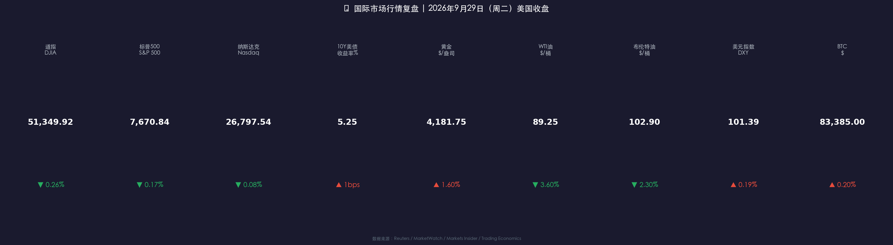

# 🦅 长债收益率创19年新高 | 美股连跌两日，加息阴影笼罩节前市场

**日期：2026年09月30日 (星期三)** &nbsp; **时段：早报（模式A：常规交易日）**

> **核心摘要**：美国10年期国债收益率9月29日盘中触及**5.293%**（2007年以来新高）、30年期盘中达**5.62%**（2002年以来新高），美股三大指数连续第二日收跌但跌幅收窄——道指-0.26%、标普500-0.17%、纳指-0.08%；纽约联储主席威廉姆斯"不急于行动"的表态令10月加息概率从近70%回落至约51.5%，成为尾盘反弹主因；WTI原油大跌3.6%至$89.25（沙特经东西管道增加出口），黄金超跌反弹+1.6%至$4,181；A股今日迎来国庆长假前最后一个交易日（10月1-7日休市，10月8日开市），央行节前加码结构性货币政策工具护航流动性。

---

## 核心行情复盘

### 📊 美国三大股指（9月29日收盘）

* **道琼斯工业平均指数**：**51,349.92** 点 &nbsp; ▼ **-131.59点（-0.26%）**
* **标普500指数**：**7,670.84** 点 &nbsp; ▼ **-12.85点（-0.17%）**
* **纳斯达克综合指数**：**26,797.54** 点 &nbsp; ▼ **-22.84点（-0.08%）**

> 三大指数连续第二日收跌，但跌幅较前一日明显收窄——午后美债收益率自高位回落，股指同步收复大部分失地。市场宽度偏弱：NYSE涨跌家数比1:1.66、纳斯达克1:1.47，跌家明显占优；标普500成分股194涨/304跌，仅8只创新高、33只创新低，中位数跌幅-0.27%，与指数小跌一致。**量能偏淡**：全美交易所成交量161.5亿股，低于20日均值168.7亿股（约-4.3%），季末调仓与重磅数据前的观望情绪浓厚。

**数学闭环校验**：
* 标普：(7,670.84 − 7,683.69) / 7,683.69 = **-0.167%** ≈ 公布值 -0.17% ✅
* 纳指：(26,797.54 − 26,820.38) / 26,820.38 = **-0.085%** ≈ 公布值 -0.08% ✅
* 道指：(51,349.92 − 51,481.51) / 51,481.51 = **-0.256%** ≈ 公布值 -0.26% ✅

### 📈 数据卡片

---

### 🏭 板块与个股

* **板块**：标普11个板块7跌4涨——**能源 -0.9%** 领跌（油价回落拖累）；**公用事业 +1.1%** 领涨（避险/防御资金回流）；**芯片股反弹 +1.3%**（SOXX +1%，内存ETF DRAM +3%，前一日大跌后修复）。
* **个股要闻**：
  * **苹果 -2.5%**：道指最大拖累；
  * **Meta +3.3%**：发布面向小企业的 Muse 版AI工具；
  * **嘉年华（CCL）+13%**：财报超预期，为标普500最大涨幅，带动邮轮板块（RCL +6%、NCLH +4.5%）；
  * **Fair Isaac（FICO）-26.5%**：FHFA引入VantageScore，打破其房贷信用评分垄断，单日暴跌；
  * **康宁（GLW）+5%**：与AT&T签下30亿美元光纤协议；CarMax +4.7%（财报）；英伟达小跌不足1%；Mag7 ETF（MAGS）-0.2%。

---

### 💹 固定收益 & 外汇

* **10年期美国国债收益率**：收盘约 **5.25%**（+1bp），盘中最高 **5.293%**——突破2007年6月高点，创近**19年新高**；过去六日累计上行约30bp。
* **30年期美国国债收益率**：盘中达 **5.6206%**，创**2002年以来新高**（24年高点）。
* **美元指数（DXY）**：**101.39** &nbsp; ▲ **+0.19%**，为7月下旬以来最高；欧元承压（EURUSD约1.133-1.137）。

> **债市解读**：9月FOMC加息后，市场对10月28日再次加息的定价一度升至约70%，叠加油价推升的通胀预期与财政供给压力（JPMorgan预计FY2026财政部需从市场借款超2万亿美元），长端收益率持续飙升。午后纽约联储主席威廉姆斯释放鸽派信号，收益率回落，成为股指尾盘收窄跌幅的直接催化。美元因"高利率吸引力+避险"维持强势，对新兴市场构成外部压力。

---

### 🛢️ 大宗商品

* **WTI 原油**：**$89.25/桶** &nbsp; ▼ **-3.6%**（沙特经东西管道增加出口，供应担忧边际缓解；Markets Insider盘后报价$89.37确认）
* **布伦特原油**：约 **$102.9/桶**，自前一日约$105高位回落
* **黄金**：现货金反弹至 **$4,181.75/盎司** &nbsp; ▲ **+1.6%**（周一曾暴跌约4%至$4,114.99后的超跌修复；较1月历史高点$5,608仍回落约25%）

> 核心解读：油价单日大跌与前几日的"地缘溢价"叙事形成反复——沙特增供动作显示OPEC内部对高油价的舒适区存在分歧，但伊朗战争与霍尔木兹海峡风险未除，油价仍处高位震荡。黄金的反弹性质为"超跌修复"而非趋势反转：加息押注、实际收益率与美元走强仍是压制金价的三座大山，$4,100一线成为多空分水岭。

---

### 🪙 加密货币

* **比特币（BTC）**：约 **$83,385-83,670** &nbsp; ▲ 约+0.2%（24h基本持平；周内约-3%，月内+7.4%）

> 高利率、强美元环境持续压制加密资产估值。$80,000为关键支撑位，若跌破或回看$75,000。

---

## 核心解读与市场逻辑

### 🏦 美联储：官员分歧公开化，10月加息概率剧烈摆动

* **政策现状**：9月16日FOMC以12-0全票加息25bp至 **3.75%-4.00%**，为2023年7月以来首次加息；主席 **Kevin Warsh**（鲍威尔已卸任）称此举支持"更及时地回归2%通胀目标"。
* **点阵图**：18位官员中16位预期年内再加息一次（2026年底中值约4.125%）。
* **9月29日官员表态分化**：
  * **纽约联储主席威廉姆斯（鸽）**："有时间观望数据再决定何时加息"——10月加息概率（CME FedWatch）从盘中近**70%**骤降至**51.5%**，为尾盘反弹主因；
  * **理事Barr、芝加哥联储Goolsbee（鹰）**：Goolsbee称容忍通胀超标5.5年是"玩火"。
* **经济数据疲弱**：9月谘商会消费者信心指数 **81.9**，创**2014年以来新低**（预期89）；8月JOLTS职位空缺降至 **707.9万**（预期722.5万），为3月以来最少。

> **核心逻辑**：**加息周期重启（9月FOMC） → 通胀预期+财政供给双压 → 长端收益率创19年新高 → 成长股估值承压；但消费者信心与职位空缺数据走弱 → 部分官员转鸽 → 加息预期回落 → 市场获得喘息**。当前市场在"滞"与"胀"之间反复定价，波动率被政策沟通反复点燃。本周三（9月30日）的8月PCE通胀数据（预期同比+3.7%）与周五非农就业报告，将直接决定10月28日FOMC的加息概率走向。

### 🌏 其他市场要闻

* **Anthropic IPO**：招股书细节曝光——目标估值超**2万亿美元**，去年营收46亿美元但经营亏损超80亿美元，AI商业化"高投入、远回报"特征引发讨论。
* **政府停摆风险已解除**：特朗普9月2日签署持续决议（CR），政府资金保障至**2026年12月11日**，10月1日不会关门；但过去12个月已发生三次资金中断（累计123天，含史上最久一次），12月11日为下一个风险节点。
* **中美关系**：9月24-25日特朗普—习近平华盛顿峰会举行，议题涵盖贸易、关税、台湾，市场持续关注后续协议进展。
* **三季度末**：季末机构调仓叠加重磅数据周，市场成交偏淡、波动被放大。

---

## 政策脉动

* **美联储**：9月点阵图暗示年内再加息一次；MUFG认为12月加息概率55-60%；降息路径已被彻底逆转，市场交易的是"higher for longer + 可能再加息"。8月CPI环比+0.4%偏热、美伊冲突推升油价是本轮紧缩的深层背景。
* **美国财政部**：8月已将国债回购规模翻倍以改善市场流动性；FY2026超2万亿美元的市场借款需求是长端收益率的结构性压力源。
* **中国央行（节前加码）**：9月29日落地国常会"推出一批务实管用的增量政策"——**PSL降息扩围、科创与民企再贷款增加额度**，为"十五五"开局创造适宜货币金融环境；此前9月上旬已开展**5000亿元3个月买断式逆回购**，配合政府债发行与**8000亿元新型政策性金融工具**投放。
* **中国证监会**：持续引导中长期资金入市——优化社保/养老金/险资长周期考核、放宽险资权益投资上限。

---

## 最新机构观点

**1. 高盛（Goldman Sachs）——维持华尔街最高目标之一**
> 2026年标普500年终目标 **8,000点**（5月底由7,600上调），2026年EPS预期$340（同比+24%）、2027年$385（+13%）；AI基础设施公司贡献指数约一半盈利增长。9月下旬汇总显示高盛与花旗仍维持8,000+的头部目标，BofA、富国相对保守。

**2. 摩根士丹利（Morgan Stanley）——"风险重置之年"**
> 标普500年终目标 **7,800点**（约+15%），定义2026为"The Year of Risk Reboot"：财政/货币/监管"政策三重奏"叠加约3万亿美元AI资本开支周期，企业盈利预期+17%；首选美股跑赢全球，看好金融、医疗、可选消费、工业及小盘股；主要风险为AI资本开支未能及时转化为生产率。

**3. 中金公司（CICC）——"A股五年来最佳窗口"**
> 预计2026年全A盈利同比**+6.3%**、非金融**+9.9%**，有望达2022年以来较高水平，"盈利拐点"临近；此前7月提出"年内二次买点或已到来"。外资仍明显低配中资股，未来增配空间显著。

**4. 中信证券（CITIC）——"年内最后的进攻窗口"**
> 9月20日策略聚焦《年内最后的进攻窗口》，9月27日最新一期《指数修复的可能路径》：全A非金融盈利三季度环比继续上行，但同比增速顶点可能出现在今年四季度；美联储控通胀姿态偏紧、年内宏观流动性偏紧是主要约束。年度主线："角逐定价权、迈入低波市"，关注制造业升级、中企出海、AI商业化。

**（参考）多空分歧加大**：Yardeni Research 9月中旬将年终目标由8,400**下调至7,900**，熊市情景概率上调至30%；Fundstrat的Tom Lee则看8,200+。

---

### 🇨🇳 附：中国资产与国庆长假备忘

* **富时中国A50期货**：9月29日收 **13,890.0**（约-0.3%）；9月28日盘中一度跌超2%，节前避险特征明显。
* **离岸人民币（USD/CNH）**：约 **6.7108**；9月整体在6.69-6.72区间偏强震荡（9月21日曾升至6.6910阶段高点）。
* **A股背景（9月29日收盘）**：上证指数 **3,830.45（+0.18%）**，深证成指+0.34%，创业板指+0.09%；两市成交额约**1.41-1.42万亿元**（较前一日缩量近3,000亿，节前收尾特征），超3,400只个股上涨。
* **休市安排**：10月1-7日休市，**10月8日（周四）开市**；9月30日晚无夜盘（此前中秋9月25-27日已休市，可拼13天超长假期）。
* **假期消费预期偏热**：携程数据显示中秋国庆机票订单同比**+约50%**、酒店订单同比**+近2倍**；出境游热度居年内小长假首位，市场预计国庆文旅消费延续高热。

---

## 今日市场情绪：石巨人压顶，鹰影下的喘息

> Prompt: A colossal stone golem engraved with glowing numerals 5.29% rises from a stormy sea made of red candlestick charts, its shadow falling over a fleet of small wooden sailboats carrying stock ticker flags. In the background, a giant hawk circles a dark marble tower resembling the Federal Reserve under a blood-orange sky, while a faint golden phoenix glows on the distant horizon, symbolizing a fragile market rebound

---

> 免责声明：内容仅供参考，不构成投资建议。
