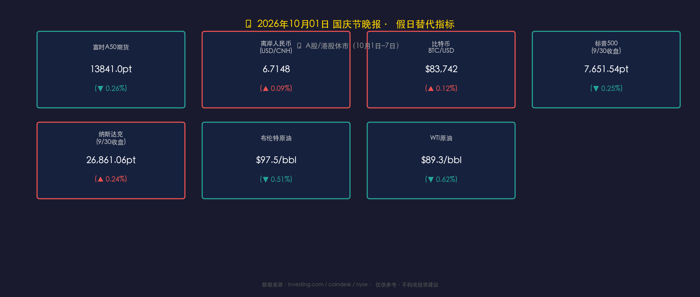

# 🎊 金龙蛰伏，静候开门红——国庆假日市场观察 | 2026年10月01日晚报

**日期：2026年10月01日 (星期四)** &nbsp; **时段：国庆节假日晚报**

> **核心摘要**：今日为中国国庆节（十一黄金周）首日，A股、港股全线休市（休市至10月7日，10月8日复市）。全国跨区域出行预计达21.3亿人次，节前政策暖风密集（PSL降息、购房贷款贴息落地），为节后行情埋下积极伏笔。假日期间仍在运作的替代指标显示：离岸人民币在6.71附近承压、富时A50期货小幅回调0.26%，BTC站稳$83,742；中东局势仍是油价高位波动的核心变量，布伦特原油$97.5/桶高位震荡。

---

## 一、假日市场状态确认

| 市场 | 状态 | 说明 |
|------|------|------|
| 🇨🇳 A股（沪深京） | **休市** | 10月1日–7日，10月8日（周四）复市 |
| 🇭🇰 港股（恒生） | **休市** | 国庆节假期休市 |
| 🇺🇸 美股（NYSE/NASDAQ） | **正常交易** | 美国非假日，正常开盘 |
| 🌐 BTC/加密货币 | **正常运行** | 全天候交易 |
| 📈 富时A50期货（新加坡） | **正常交易** | 国际市场代理中国情绪 |
| 💱 离岸人民币（CNH） | **正常波动** | 香港离岸市场依然运作 |

---

## 二、假日替代指标行情

### 📈 富时中国A50期货（新加坡）
* **今日报价**：**13,841.0 点**，跌幅 **▼ 0.26%**（节前9月30日收盘价：13,877.0 点）
* 小幅回调，幅度温和，暂未出现恐慌性抛售，显示境外资金对节后A股开门红预期相对中性。

> **核心解读**：富时A50期货是假期期间最重要的A股情绪代理指标。0.26%的微跌幅度可能反映市场对国庆期间中东油价高位、美债波动等外部风险的小幅定价，但并不构成节后暴跌信号。历史数据显示，节前A50期货微幅波动在节后首日往往会被国内主力资金"纠偏"。

### 💱 离岸人民币（USD/CNH）
* **今日区间**：**6.7086 – 6.7148**（节前9月30日参考价：6.7088）
* 相较节前尾盘基本持平，人民币在6.71一线经历温和宽幅震荡，整体汇率压力可控。

> **核心解读**：美元指数走强叠加中东地缘风险带来的通胀担忧，对人民币汇率构成一定外部压力。但PBOC在节前通过PSL降息等工具释放了充裕流动性信号，离岸市场的稳定表现与政策背书形成共振，短期大幅贬值风险有限。若节后美联储鹰鸽信号明朗化，人民币走势将面临方向性选择。

### ₿ 比特币（BTC/USD）
* **今日价格**：约 **$83,742**（24小时约 +0.12%）
* BTC在$83,000–$84,000区间窄幅震荡，流动性稳定，无明显方向性驱动。

> **核心解读**：BTC在$83,000关键支撑位附近横盘，显示多空双方分歧收敛。短期上行需要宏观面（美联储政策转向、ETF资金流入）的催化；下行风险来自中东局势若升级引发的全球风险偏好下滑。黄金周期间全球交易量下降，BTC波动率预计保持低位。

---

## 三、隔夜美股行情（9月30日收盘）

* **标普500（S&P 500）**：收报 **7,651.54 点**，跌幅 **▼ 0.25%**（下跌19.30点）
* **纳斯达克综合**：收报 **26,861.06 点**，涨幅 **▲ 0.24%**（上涨63.52点）

> **核心解读**：美股在季度末最后一个交易日（9月30日）呈现标普微跌、纳斯达克微涨的"结构分化"。这通常是季度末机构再平衡（减配大盘、加配科技）的典型信号。纳斯达克的韧性体现了市场对AI科技板块业绩预期的持续高定价；标普的小幅收跌则部分反映了能源、原材料等周期股在油价高位下的估值压力。Q4开局，美股多空博弈的核心变量将落在：**10月下旬财报季 + 美联储11月议息会议**。

---

## 四、能源市场：中东高压下的油价博弈

* **WTI原油（10/1）**：约 **$89.3/桶**，跌幅 **▼ 0.62%**
* **布伦特原油（10/1）**：约 **$97.5/桶**，跌幅 **▼ 0.51%**
* **9月月度涨幅**：布伦特约 **+14%**，WTI约 **+5%**（单月最大涨幅自7月以来）

### 关键事件
1. **美军撤离伊拉克（9月30日）**：国际联盟正式结束在伊拉克的军事任务，最后一批美军从埃尔比勒空军基地撤出，伊拉克称之为"主权日"。这一历史性时刻改变了中东地缘格局，但短期内原油流通和霍尔木兹海峡局势仍存在不确定性。
2. **沙特延布港恢复装载**：沙特修复了东西输油管道并恢复延布港操作，缓解了部分供应压力。
3. **成品油库存告急**：全球柴油、汽油库存处于极低水平，为油价提供强力底部支撑。

> **核心解读**：9月原油的暴涨（布伦特+14%）是地缘政治溢价与供应收紧的叠加效应。10月1日的小幅回调更多是技术性获利了结，而非趋势反转。高盛认为，若霍尔木兹航运持续受阻，布伦特可能挑战$105；反之，若沙特持续增产，$90以下有强力支撑。油价高位对中国进口成本构成直接压力，节后人民币汇率和通胀数据值得关注。

---

## 五、假日宏观热点

### 🏮 黄金周出行：量大价谨

| 指标 | 数据 |
|------|------|
| 预计全国跨区域出行总量 | **21.3亿人次**（日均约3亿次）|
| 较平时倍数 | **1.7倍** |
| 500公里以上长线出行增长 | **+11%**（同比）|
| 铁路预计发送旅客 | **2.84亿人次** |
| 异地租车日均活跃用户 | **+43%**（同比）|
| 发放消费券规模 | **超3.1亿元** |

> **核心解读**：出行规模创历史新高，但消费结构呈现明显"K形分化"——人次多、人均支出谨慎。游客更倾向于性价比住宿和沉浸式体验，而非高端消费。这是经济基本面压力（房产财富缩水、就业预期不稳）在假日消费端的直接映射，与高盛将2026年中国GDP下调至4.5%的逻辑一致。然而，服务消费（餐饮、异地租车、体验游）的强劲增长，反映了内需转型从"商品消费"向"服务消费"升级的结构性趋势，符合政策导向。

### 🏛️ 政策暖风：节前密集铺垫
* **国务院反周期政策**：9月末国务院会议明确"逆周期"宏观政策取向，准备出台稳楼市、促就业、提收入的额外刺激包
* **PSL降息**：人民银行下调抵押补充贷款（PSL）利率，向市场释放长期低成本流动性
* **购房贷款贴息正式落地**：财政补贴直接降低居民购房融资成本，定向刺激楼市
* **"国庆文旅消费月"**：9月22日启动，全国超2万场文旅活动配合消费券发放

> **核心解读**：节前的政策"预铺垫"力度超出市场预期。PSL降息与购房贴息的同步落地，显示决策层对楼市复苏的迫切性已从"观察等待"转入"主动出击"模式。历史规律表明，重磅政策落地后第一个交易日（即10月8日），A股存在显著"政策兑现反弹"效应，尤以地产链、建材、消费板块最为敏感。

---

## 六、机构观点

### 高盛（Goldman Sachs）
> 将2026年中国实际GDP增速预测下调至 **4.5%**（前值4.6%）。"经济数据越疲软，政策出台越积极"——若数据进一步走弱，北京大概率推出额外刺激以确保经济保持在4.5%–5.0%目标区间内。工业生产稳健与居民消费疲软的"内部失衡"是核心矛盾。

### 摩根士丹利（Morgan Stanley）
> 对中国权益资产维持相对建设性立场。9月PMI超预期扩张（制造业与服务业双双走强），是近期最积极的基本面信号之一，与政策支持形成共振。摩根士丹利强调，中国经济正从"房地产驱动"向"高技术制造+效率提升"转轨，这一结构性转变是中长期布局的核心逻辑。

### 中信证券（CITIC Securities）
> 看好国庆后A股"节后效应"。历史统计显示，节后首周A股平均上涨概率超80%，核心逻辑是：节前机构出清风险仓位 → 节后资金回流 + 政策催化剂共振 → 短期超额收益窗口。重点关注：**地产链（建材、家电）、顺周期消费（白酒、服装）、高股息红利资产**。

---

## 今日市场情绪：🐉 金龙蛰伏，静候开门红

> Prompt: A vast ancient dragon made of crimson candles and golden K-line charts sleeps peacefully over the Great Wall, while lantern-lit villages glow with festive light below, representing China's economy resting during the Golden Week holiday, a moment of deep breath before the next surge, cinematic lighting, ultra-detailed

---

## 节后前瞻：10月8日（周四）复市关注清单

| 优先级 | 关注要点 |
|--------|----------|
| ⭐⭐⭐ | A股节后首日开盘情绪（节前A50期货微跌0.26%，预计高开概率大） |
| ⭐⭐⭐ | 地产政策落地后资金对房地产链的实际响应 |
| ⭐⭐ | 假期海外美股走势（10月1日-7日期间标普、纳指表现） |
| ⭐⭐ | 9月CPI/PPI数据（本周内发布，通缩压力是否延续） |
| ⭐⭐ | 人民币CNH汇率节后走向（能否在6.70以上稳住） |
| ⭐ | BTC/加密市场在假期内是否出现大幅波动 |

---

*免责声明：内容仅供参考，不构成投资建议。市场有风险，投资须谨慎。*
